# Candidate Sourcing Pipeline Architecture

## Document Purpose

This document defines the target architecture for the WeKruit candidate sourcing pipeline described in [PRD.md](./PRD.md).

It focuses on:

- system boundaries
- data ownership
- pipeline flow
- source adapter contract
- identity resolution flow
- human review flow
- enrichment flow
- storage model
- queue/task responsibilities
- future extension points

This is intentionally not a detailed API route specification. Route shape can be decided during implementation as long as the contracts and lifecycle in this document are preserved.

## Architectural Principles

1. Scrapers produce observations, not trusted candidates.
2. Every candidate approval requires inspectable evidence and human review.
3. One real-world person maps to one global candidate entity.
4. Source records and evidence are appendable lineage, not the final profile.
5. Enrichment uses only human-approved evidence.
6. LLM output is advisory until validated and reviewed.
7. The v1 source of truth is Firebase/core-service/Firestore.
8. Python scrapers stay in `wekruit-scraping` for v1.
9. New sources should plug into a shared source adapter contract.
10. Neo4j is a future projection option, not the v1 primary store.

## Current Repository Reality

### `main`

Current `main` in `wekruit-scraping` contains the source collectors:

- GitHub scraping pipeline
- Devpost scraping pipeline
- researcher pipeline

Current `main` does not contain the full productized sourcing review workflow.

### `origin/codex/sourcing-e2e-firebase`

The branch `origin/codex/sourcing-e2e-firebase` contains the most relevant sourcing prototype:

- source-run/source-record upload bridge
- generic source-record contract
- researcher/GitHub/Devpost/manual upload adapters
- Firebase/core-service sourcing backend prototype
- review dashboard prototype
- source records, evidence, dedup candidates, review labels, approved entities

The first implementation step should be to reconcile and productize this prototype, not rebuild the pipeline from scratch.

## High-Level System

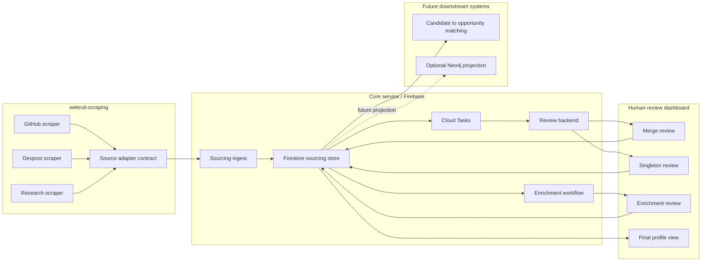

## Runtime Boundary

### `wekruit-scraping`

Owns:

- source-specific scraping logic
- source API calls
- source-specific parsing
- local replay artifacts
- conversion into generic source records
- upload client for core-service ingest

Does not own:

- product approval state
- Firestore writes
- final candidate identity truth
- enrichment approval
- final candidate profiles

### Core Service / Firebase

Owns:

- schema validation
- source-run persistence
- source-record persistence
- evidence extraction
- relevance signal extraction
- dedup candidate generation
- review labels
- approved candidate entities
- enrichment workflow
- final candidate profiles
- Cloud Tasks orchestration

### Dashboard

Owns reviewer interaction:

- inspect source/evidence
- approve/hold/reject merge proposals
- approve/reject singleton candidates
- confirm structured relevance signals
- review/edit enrichment output
- inspect final candidate profile

## Source Adapter Contract

Every v1 source adapter should map source-specific output into the shared contract.

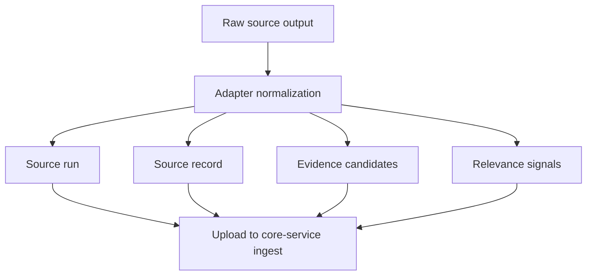

### Contract Objects

#### Source Run

Represents one execution of a source pipeline.

Expected fields:

- `runId`
- `domain`
- `source`
- `pipelineName`
- `trigger`
- `status`
- `startedAt`
- `completedAt`
- `counts`
- `metadata`

Example domains:

- `developer`
- `hackathon`
- `researcher`
- `manual`

Example sources:

- `github`
- `devpost`
- `openalex`
- `crossref`
- `orcid`
- `dblp`
- `openreview`

#### Source Record

Represents one source observation.

Expected fields:

- `sourceRecordId`
- `runId`
- `domain`
- `source`
- `entityType`
- `sourceNativeId`
- `sourceUrl`
- `displayName`
- `institution`
- `display`
- `rawSummary`
- `rawStoragePath`
- `contentHash`
- `schemaVersion`
- `observedAt`

Important: a source record is not an approved candidate.

#### Evidence

Represents inspectable proof extracted from a source record.

Expected fields:

- `evidenceId`
- `sourceRecordId`
- `sourceRunId`
- `source`
- `domain`
- `entityType`
- `evidenceType`
- `rawValue`
- `normalizedValue`
- `valueHash`
- `quality`
- `sourceUrl`
- `extractedFrom`
- `observedAt`
- `extractorVersion`

Evidence types should include at least:

- `email`
- `github`
- `homepage`
- `orcid`
- `dblp`
- `openreview`
- `google_scholar`
- `paper_doi`
- `institution`
- `name`
- `source_url`
- `source_native_id`

#### Relevance Signal

Represents why a source record may be worth approving as a candidate.

Expected fields:

- `signalId`
- `sourceRecordId`
- `signalType`
- `strength`
- `evidenceIds`
- `summary`
- `source`
- `domain`
- `generatedBy`
- `createdAt`

Starter signal types:

- `technical_project`
- `research_publication`
- `open_source_contribution`
- `professional_role`
- `education_affiliation`
- `award_or_recognition`
- `founder_or_builder_signal`
- `public_contact_or_profile`
- `insufficient_signal`

## V1 Source Mappings

### GitHub

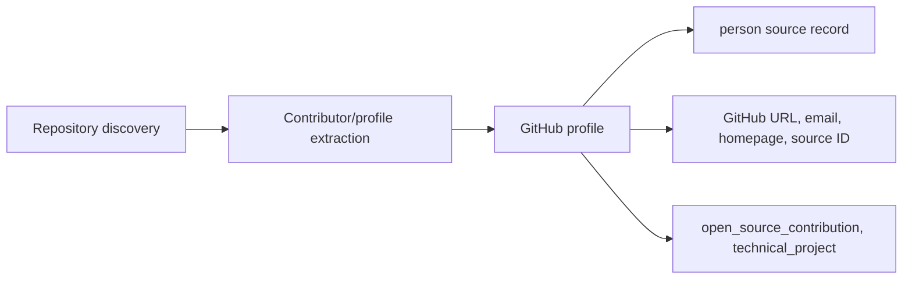

GitHub-specific fields to preserve:

- username
- profile URL
- display name
- company/institution field
- location
- public email
- blog/homepage
- followers
- public repo count
- repo languages/topics when available
- contribution/activity scores when available

### Devpost

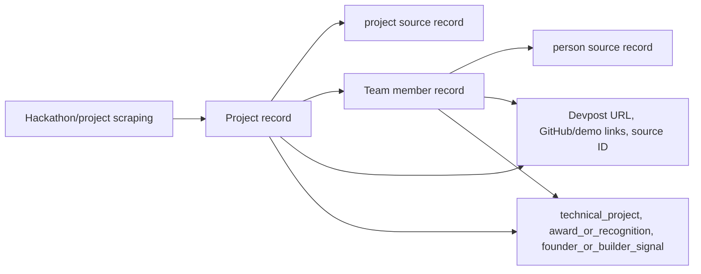

Devpost-specific fields to preserve:

- project name
- project URL
- hackathon
- team members
- member profile URLs
- GitHub links
- demo links
- tech tags
- winner/prize state
- project description

### Research

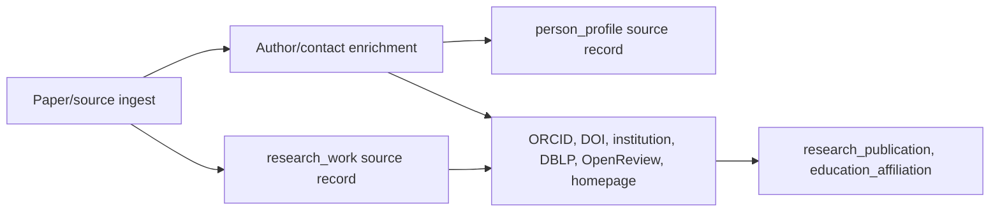

Research-specific fields to preserve:

- author name
- OpenAlex author ID
- ORCID
- institution
- institution country/ROR when available
- paper title
- DOI
- venue
- publication date/year
- DBLP profile
- OpenReview profile
- Google Scholar ID when available
- homepage/contact enrichment

## Identity Resolution Architecture

Identity resolution has two layers:

1. Deterministic evidence-based grouping.
2. Review-first global identity approval.

The system can score and propose. Humans approve.

### Blocking And Candidate Generation

To scale across sources, the system should generate candidate pairs/groups using blocking keys rather than comparing every record to every record.

Potential blocking keys:

- exact email
- exact ORCID
- exact GitHub URL/login
- exact DBLP PID
- exact OpenReview ID
- exact Google Scholar ID
- exact source-native ID within source
- normalized homepage
- normalized name plus institution
- normalized name plus GitHub/Devpost project link

### Dedup Strength

Suggested strengths:

| Strength | Typical evidence |
| --- | --- |
| Strong | same email, ORCID, GitHub, DBLP, OpenReview, Google Scholar |
| Medium | same homepage, source URL overlap, project/repo link overlap |
| Weak | same name plus institution, same name plus overlapping context |

Strength should prioritize review. It must not automatically approve a candidate.

### Identity Review Flow

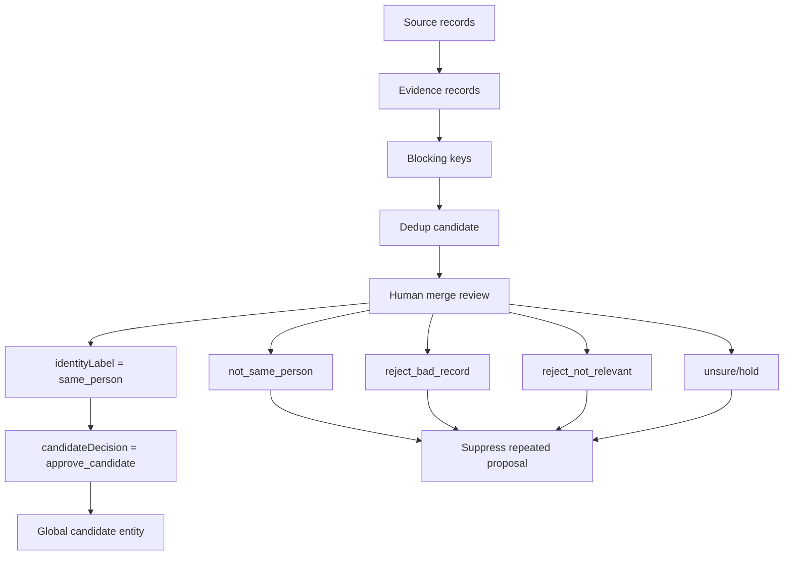

Merge review should store identity and relevance separately:

- `identityLabel`: `same_person`, `not_same_person`, or `unsure`
- `candidateDecision`: `approve_candidate`, `reject_bad_record`, `reject_not_relevant`, or `unsure`

Only `same_person` plus `approve_candidate` should materialize or update a global candidate entity.

## Singleton Review Architecture

If no duplicate proposal is found for a person-like source record, the record enters singleton review.

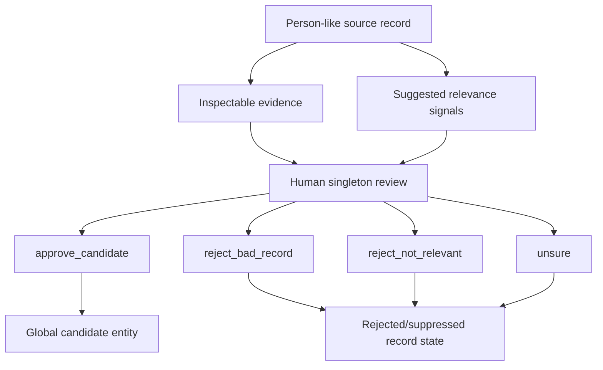

No singleton should become a global candidate without:

- inspectable evidence
- human approval
- confirmed relevance signal or explicit approval rationale

## Global Candidate Entity Model

Global candidate entities represent real-world people.

Key rules:

- Use opaque stable IDs for candidates.
- Use deterministic IDs for source records, evidence, relevance signals, and dedup candidates.
- One candidate can accumulate source records over time.
- Candidate records can be re-enriched when new approved evidence arrives.
- Architecture must support future post-approval candidate merges.

### Candidate Identity Growth

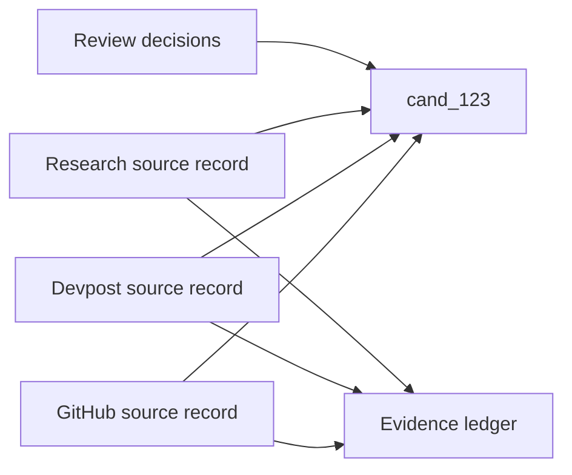

### Future Post-Approval Merge

Post-approval merge may be implemented after v1, but the data model should not block it.

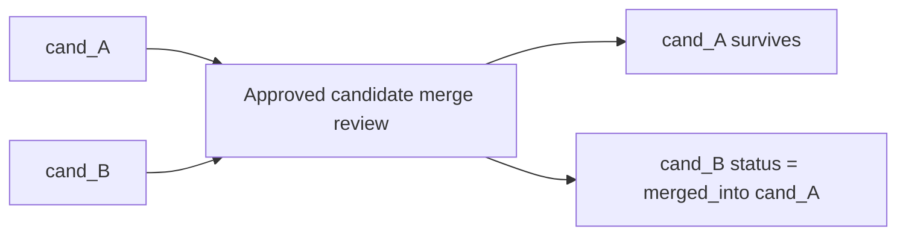

Recommended future fields:

- `status`
- `mergedIntoCandidateId`
- `mergedByReviewId`
- `mergedAt`

## Enrichment Architecture

Enrichment creates matching-ready profile fields from approved evidence.

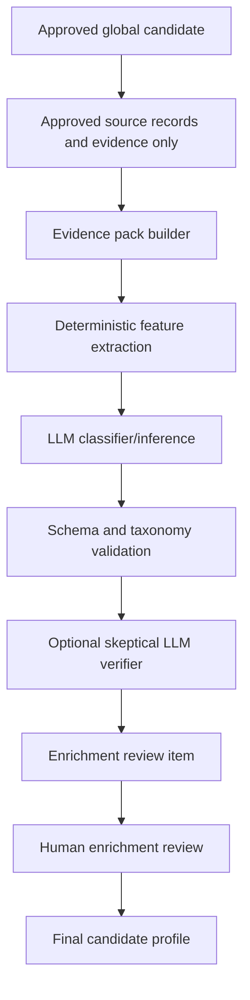

### Evidence Pack

The evidence pack is a compact, structured input to enrichment.

It should include:

- candidate ID
- approved source record IDs
- evidence records
- source URLs
- relevance signals
- GitHub facts
- Devpost facts
- research facts
- current known profile fields, if re-enrichment
- prior enrichment review decisions, if re-enrichment

It should exclude:

- rejected records
- unsure records
- pending possible matches
- raw payloads that are too large or unrelated

### Enrichment Outputs

The system-generated enrichment output should include:

- `primaryTrack`
- `tracks`
- `specializations`
- `skills`
- `domains`
- `careerStage`
- `contactability`
- `matchingSummary`
- `proposedOpenTags`
- `fieldEvidenceMap`
- `systemConfidence`
- `enrichmentVersion`

### Validation

Deterministic validation always runs.

Validation requirements:

- output conforms to schema
- controlled fields use controlled taxonomy values
- every inferred label has evidence IDs
- open-ended tags are separated from controlled fields
- confidence scores are bounded
- no rejected/pending evidence is referenced

### Skeptical Verification

Optional LLM verification should run when:

- primary track is inferred from weak/mixed evidence
- fields conflict with previous reviewed enrichment
- proposed open-ended tags are generated
- evidence chain is complex
- the classifier confidence is low or borderline

The verifier should not approve the profile. It should only flag risk, contradiction, or unsupported claims before human review.

## Re-Enrichment Architecture

Approved candidates are living profiles. New evidence can arrive after first approval.

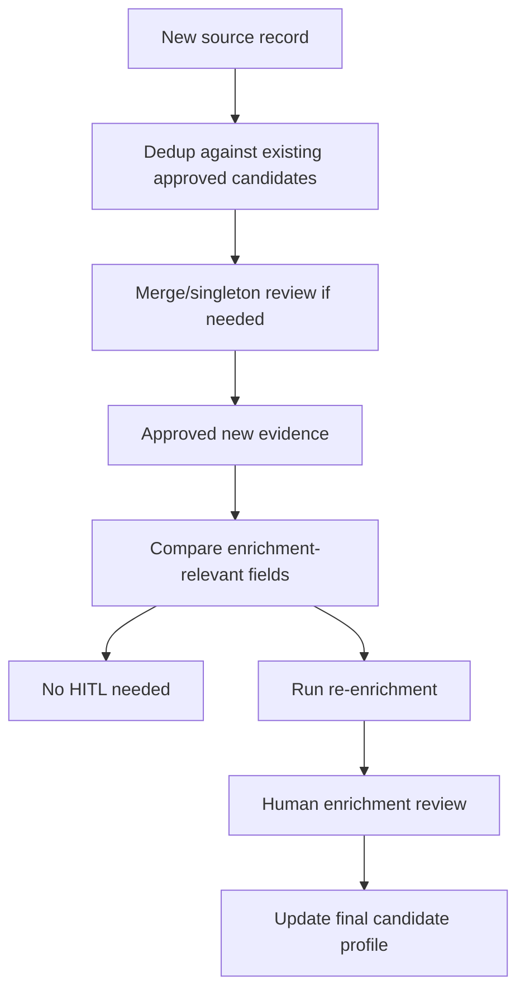

Re-enrichment should require HITL only when matching-relevant fields change.

## Storage Model

### Operational Store

V1 operational store:

- Firebase/core-service/Firestore

### Storage Collections

The existing prototype already uses these conceptual collections:

- `sourcing-source-runs`
- `sourcing-source-records`
- `sourcing-evidence`
- `sourcing-dedup-candidates`
- `sourcing-review-labels`
- `sourcing-approved-entities`

V1 should extend this model with:

- relevance signals
- enrichment runs
- enrichment review labels
- final candidate profiles
- optional profile versions

Recommended conceptual collections:

| Collection | Purpose |
| --- | --- |
| `sourcing-source-runs` | Source pipeline execution metadata |
| `sourcing-source-records` | Queryable source observations |
| `sourcing-evidence` | Extracted proof objects with provenance |
| `sourcing-relevance-signals` | System-suggested source relevance signals |
| `sourcing-dedup-candidates` | Duplicate proposals requiring review |
| `sourcing-review-labels` | Human identity/relevance decisions |
| `sourcing-approved-entities` | Approved global candidate identity records |
| `sourcing-enrichment-runs` | System enrichment outputs and versions |
| `sourcing-enrichment-reviews` | Human enrichment review decisions/edits |
| `sourcing-candidate-profiles` | Clean final candidate profiles |
| `sourcing-profile-versions` | Optional historical profile snapshots |

Collection names can be adjusted during implementation, but they should remain explicitly prefixed with `sourcing-`.

### Data Relationship Diagram

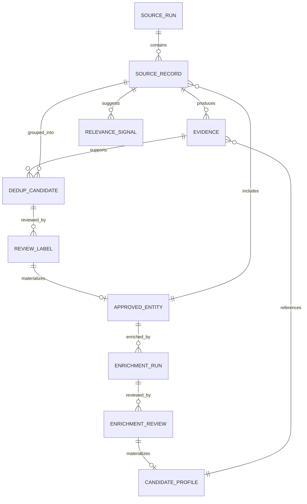

### Clean Profile Shape

Conceptual final profile:

```json
{
  "candidateId": "cand_opaque_123",
  "status": "active",
  "displayName": "Alice Chen",
  "sourceDomains": ["developer", "hackathon"],
  "sourceRecordIds": ["src_github_alice", "src_devpost_alice"],
  "evidenceIds": ["ev_github_profile", "ev_devpost_project"],
  "identityReviewIds": ["review_1"],
  "enrichmentRunId": "enrich_1",
  "enrichmentReviewId": "enrich_review_1",
  "primaryTrack": "software_engineering",
  "tracks": [
    {
      "track": "software_engineering",
      "confidence": 0.88,
      "humanConfirmed": true,
      "evidenceIds": ["ev_github_profile", "ev_devpost_project"]
    }
  ],
  "specializations": [
    {
      "value": "full_stack_engineering",
      "confidence": 0.76,
      "humanConfirmed": true,
      "evidenceIds": ["ev_devpost_project"]
    }
  ],
  "skills": [
    {
      "value": "React",
      "confidence": 0.8,
      "humanConfirmed": true,
      "evidenceIds": ["ev_devpost_project"]
    }
  ],
  "domains": ["developer_tools"],
  "careerStage": "student",
  "contactability": {
    "publicEmailFound": false,
    "hasPublicProfileOnly": true,
    "contactQuality": "profile_only"
  },
  "matchingSummary": "Student builder with GitHub and Devpost evidence around full-stack project work.",
  "createdAt": "2026-04-25T00:00:00.000Z",
  "updatedAt": "2026-04-25T00:00:00.000Z"
}
```

## Queue And Task Architecture

Firebase Cloud Tasks should orchestrate v1 background work.

```mermaid
flowchart LR
  Ingest["Source records ingested"]
  T1["Task: extract evidence"]
  T2["Task: generate dedup candidates"]
  Review["Human review boundary"]
  T3["Task: materialize approved entity"]
  T4["Task: run enrichment"]
  T5["Task: create enrichment review"]
  Human["Human enrichment review"]
  T6["Task: finalize candidate profile"]

  Ingest --> T1
  T1 --> T2
  T2 --> Review
  Review --> T3
  T3 --> T4
  T4 --> T5
  T5 --> Human
  Human --> T6
```

### Why Queue Tasks Exist

Queues are for work that is:

- slow
- retryable
- rate-limited
- dependent on a prior step
- not appropriate to block an ingest request

Examples:

- evidence extraction
- dedup candidate generation
- LLM enrichment
- final profile materialization

Queues are not the source of truth. Firestore stores state; tasks move work forward.

### V1 Queue Choice

Use Firebase Cloud Tasks because it matches the existing Firebase/core-service direction.

Use Pub/Sub later only if the system needs event fan-out, streaming, or multiple independent consumers for the same event.

## Dashboard Architecture

The dashboard should be extended into a small set of operator workspaces.

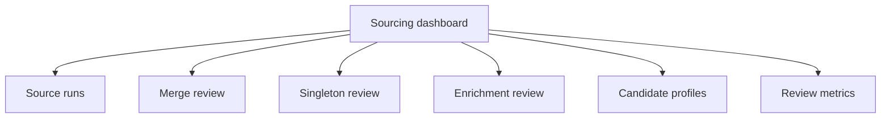

### Source Runs View

Should show:

- run ID
- source/domain
- status
- source record count
- evidence count
- dedup candidate count
- singleton candidate count
- enrichment queue count when applicable

### Merge Review View

Should show:

- candidate proposal
- source records side by side
- matched fields
- evidence links
- reason codes
- confidence/strength
- suggested relevance signals
- confirmed relevance signals
- review note
- actions

### Singleton Review View

Should show:

- source record summary
- source-specific evidence links
- system-suggested relevance signals
- raw source payload preview when needed
- reviewer-confirmed relevance signals
- decision actions
- review note

### Enrichment Review View

Should show:

- candidate profile preview
- approved evidence pack
- suggested primary track
- suggested tracks
- suggested specializations
- suggested skills/domains
- proposed open-ended tags
- confidence and evidence chain
- verifier warnings
- editable controlled fields
- review note

### Candidate Profile View

Should show:

- final clean profile
- source domains
- evidence links
- review history
- enrichment version
- current status
- lineage references

## Evidence Link Requirement

No candidate should be approvable without inspectable evidence.

Inspectable evidence can be:

- clickable public URL
- official source-native ID that links to a public page
- raw source payload rendered in dashboard when no clean public page exists

The reviewer must have enough information to decide whether the record is real and relevant.

## LLM Boundary

LLMs may be used for:

- evidence summarization
- relevance signal suggestion
- taxonomy classification
- second-order inference
- skeptical verification
- profile summary generation

LLMs must not:

- approve candidates
- approve merges
- override human review
- use rejected/pending evidence in final enrichment
- create controlled taxonomy values without validation
- produce unsupported claims without evidence IDs

## Future Neo4j Projection

Neo4j can be added later as a read projection if graph queries become valuable.

Potential graph model:

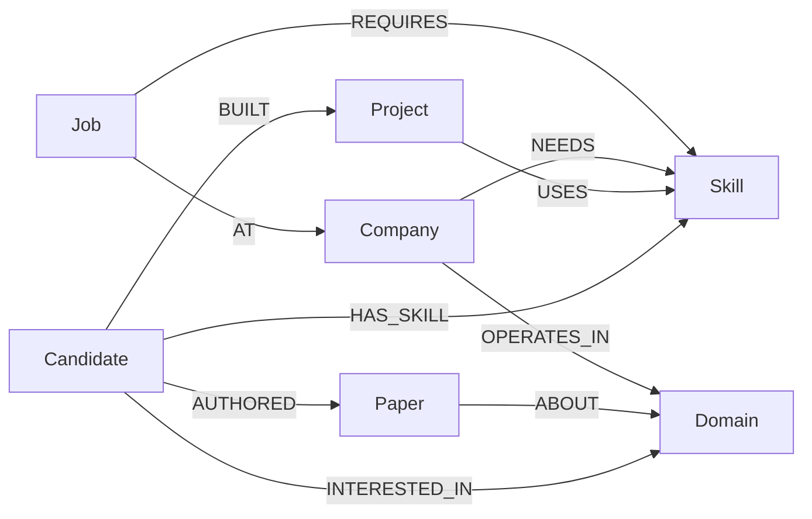

This should remain a projection from the operational source of truth, not the only place candidate truth exists.

## Extension Path For Future Sources

Future sources should not require a new pipeline.

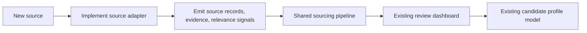

To add a new source, implement:

1. source-specific collector
2. adapter to source-record contract
3. evidence extractor rules
4. relevance signal rules
5. dashboard display mapping for source-specific evidence

The dedup, review, enrichment, and final profile flows should remain shared.

## Architecture Acceptance Criteria

The architecture is valid if:

1. GitHub, Devpost, and research can enter one shared ingest/review/enrichment pipeline.
2. Source records are never treated as trusted candidates without review.
3. Every candidate approval has inspectable evidence.
4. Singleton and merge reviews both capture relevance approval.
5. There is one global candidate identity across source domains.
6. Enrichment only uses approved evidence.
7. First-time enrichment always goes through human review.
8. Re-enrichment review is required only when important fields change.
9. Final profiles store clean fields and lineage references.
10. Python scrapers can remain unchanged except for adapter/upload integration.
11. Firebase/Firestore can serve as the v1 operational source of truth.
12. Future sources can be added by implementing the adapter contract.
