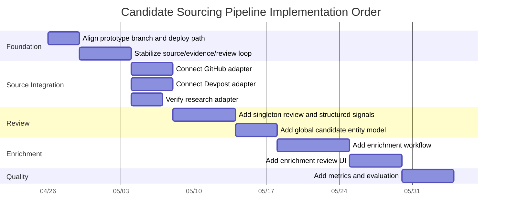

# Candidate Sourcing Pipeline Implementation Plan

## Document Purpose

This document turns the PRD and architecture into an implementation-ready plan.

Companion documents:

- [PRD.md](./PRD.md)
- [ARCHITECTURE.md](./ARCHITECTURE.md)

This plan is intentionally phased. The system touches scraping, Firebase/core-service, human review, enrichment, and future matching readiness. The safest path is to productize the existing sourcing prototype first, then add the missing review and enrichment layers.

## Implementation Strategy

Use a conservative productization path:

1. Stabilize the existing sourcing prototype.
2. Connect GitHub, Devpost, and research to the same source-record contract.
3. Expand review workflow for singleton approval and structured signals.
4. Create the global candidate entity model.
5. Add evidence-grounded enrichment and enrichment review.
6. Add metrics and evaluation loops.
7. Defer Neo4j projection until graph queries justify it.

## Guiding Constraints

- Do not migrate Python scrapers to Cloud Run in v1.
- Do not rebuild the dashboard from scratch.
- Do not use Neo4j as v1 source of truth.
- Do not add social/personal/LinkedIn crawling in v1.
- Do not automatically approve candidates.
- Do not enrich from pending, rejected, or unsure evidence.
- Do not implement full job/company matching in this phase.
- Do not create a separate top-level dedup service.

## Current Execution State

Last updated: 2026-04-27.

- [x] PRD, architecture, and implementation plan documents are drafted.
- [x] Implementation should branch from current `main` so feature work does not break the functional mainline.
- [x] Firebase/Firestore remains the v1 operational source of truth.
- [x] Existing dashboard should be extended rather than rebuilt.
- [x] GitHub, Devpost, and research remain the only v1 source families.
- [x] Enrichment should include industry/domain interests in addition to role/track, specialization, skills, and contactability.
- [x] Local `.env` files are ignored by git and must not be committed.
- [ ] Feature implementation has not started yet.
- [ ] Create implementation branch from `main` when implementation begins.
- [ ] Re-check the current state of the sourcing prototype branch before porting or productizing code.
- [ ] Verify local backend/dashboard/Firebase setup before changing workflow behavior.
- [x] Confirm available LLM provider/model environment variables from local `.env` without exposing values.
- [x] Validate whether local LLM keys are active before implementing Phase 5 behavior that depends on live model calls.
- [ ] Create or collect small GitHub, Devpost, and research sample outputs for repeatable tests.

## Phase Execution Protocol

Every phase should be executed as a self-contained loop:

1. Plan the exact code path and expected behavior for the phase.
2. Implement only the scope required for that phase.
3. Run automated tests or add focused tests when existing coverage is missing.
4. Verify behavior manually when the dashboard or review workflow is affected.
5. Debug failures before moving to the next phase.
6. Update this document with completed work, remaining blockers, and verification notes.
7. Stop and report status before starting the next phase.

The implementation agent should treat this document as durable working memory. If conversation context is compacted, resume from the latest checked items, progress notes, and blockers recorded here rather than restarting the plan from scratch.

## Setup Clarifications

These clarify the implementation questions that should be resolved before coding:

- Branching: create a new implementation branch from `main` before feature work starts. The branch should contain the pipeline implementation and can be merged back after end-to-end verification.
- Existing sourcing prototype: the preferred path is to reuse/productize the existing Firebase sourcing prototype where it is correct, not to rewrite it blindly. This does not mean Firebase itself is optional; Firebase remains the v1 data/runtime foundation.
- Local Firebase/dev dashboard setup: this means running the backend, dashboard, and Firebase emulators or configured dev Firebase project locally enough to test source ingestion, review actions, queue processing, and profile materialization without relying only on deployed behavior.
- LLM keys: local `.env` may contain provider keys, but implementation should only read expected environment variable names and must never print or commit secret values.
- LLM key validity: local keys should be treated as present-but-unverified until a safe connectivity check confirms the configured provider/model works. A dead key blocks live enrichment testing, but it should not block ingestion, evidence extraction, dedup, merge review, singleton review, or approved candidate materialization.
- Sample data: if real fixture data is missing, create small synthetic-but-realistic fixtures for GitHub, Devpost, and research so each phase can be tested repeatedly.
- Deployed dashboard verification: if allowed during implementation, browser/computer-use can open the deployed or local dashboard to verify the actual review experience visually. This is for UI verification only; source-of-truth behavior should still be tested through code and data checks.

## Environment Check Notes

Safe key connectivity check completed on 2026-04-27. Secret values were not printed, committed, or written to disk.

- `OPENAI_API_KEY`: active/auth accepted.
- `ANTHROPIC_API_KEY`: active/auth accepted.
- `GH_ANTHROPIC_API_KEY`: active/auth accepted against the Anthropic API; rejected as a GitHub token, so treat it as an Anthropic key despite the prefix.
- `GOOGLE_API_KEY`: active/auth accepted against the Gemini model-list endpoint.
- `SILLICON_FLOW_KEY`: rejected/unauthorized against the SiliconFlow model-list endpoint. Do not rely on this key unless it is replaced or revalidated.

Dashboard inspection permission: browser/computer-use may be used to inspect the deployed dashboard during implementation. Prefer local/dev environments for mutating review actions unless the team explicitly confirms deployed dev mutations are safe.

## Phase 0: Alignment And Branch/Productization Decision

### Goal

Confirm the current prototype state and decide how the team wants to bring `origin/codex/sourcing-e2e-firebase` into the active development path.

### Why This Phase Exists

The sourcing prototype exists, but it is not on current `main`. Before implementation begins, the team needs a clear answer to whether it will:

- be merged into `main`
- be rebased into a new implementation branch
- be used as reference and selectively ported

The preferred path is to productize the existing prototype rather than rebuild it.

### Tasks

- [ ] Confirm the latest state of `origin/codex/sourcing-e2e-firebase` in `wekruit-scraping`.
- [ ] Confirm the latest state of the corresponding sourcing branch in the Firebase/core-service repo.
- [ ] Identify whether the deployed dashboard is currently sourced from that branch.
- [ ] Decide the working branch strategy for implementation.
- [ ] Confirm Firebase project/environment ownership for staging.
- [ ] Confirm who owns dashboard deployment.
- [ ] Confirm who owns core-service deployment.
- [ ] Confirm reviewer access/auth expectations for v1.

### Deliverables

- [ ] Written team decision on branch strategy.
- [ ] Confirmed environment/deploy path.
- [ ] Clear owner list for scraping, core-service, dashboard, and review workflow.

### Acceptance Criteria

- [ ] Team agrees not to rebuild the sourcing prototype from scratch.
- [ ] Team knows which branch/repo contains the source of the existing dashboard/backend.
- [ ] Team knows where implementation work will begin.

## Phase 1: Stabilize Existing Sourcing Prototype

### Goal

Make the current source-run/source-record/evidence/dedup/review/approved-entity loop reliable enough to build on.

### Scope

This phase does not add enrichment. It stabilizes the review foundation.

### Tasks

- [ ] Verify source-run creation works end-to-end.
- [ ] Verify source-record batch upload works end-to-end.
- [ ] Verify evidence extraction runs for uploaded records.
- [ ] Verify dedup candidate generation runs for evidence matches.
- [ ] Verify singleton review candidates are created for person-like records with no duplicates.
- [ ] Verify review labels are persisted.
- [ ] Verify approved entities are materialized only after human approval.
- [ ] Verify negative/unsure review labels suppress repeated review spam.
- [ ] Verify the dashboard can load source runs, review candidates, and approved entities.
- [ ] Verify evidence links render and open correctly where available.
- [ ] Add or update tests around source-record validation and review materialization.
- [ ] Add or update seed/sample data for local verification.

### Data Model Checks

- [ ] Source records are deterministic/idempotent.
- [ ] Evidence records are deterministic/idempotent.
- [ ] Dedup candidate IDs are deterministic/idempotent.
- [ ] Approved candidate/global entity IDs are opaque and stable.
- [ ] Every approval stores reviewer, timestamp, decision, and note.
- [ ] Every approved entity has source record lineage.
- [ ] Every approved entity has evidence lineage.

### Acceptance Criteria

- [ ] A two-record exact match can be uploaded, reviewed as same person, and materialized as one approved entity.
- [ ] A singleton person-like source record can be uploaded and appears in review.
- [ ] A rejected/unsure review decision does not create an approved entity.
- [ ] The dashboard displays enough evidence for a reviewer to make a decision.

## Phase 2: Unify GitHub, Devpost, And Research Ingestion

### Goal

Ensure all v1 sources can produce source records, evidence, and relevance signals through the same adapter contract.

### Source Adapter Contract

Each source adapter should emit:

- source run metadata
- source records
- evidence candidates or evidence-ready fields
- relevance signal candidates
- raw payload pointer or raw summary
- content hash

### GitHub Tasks

- [ ] Map GitHub candidates to `domain=developer`.
- [ ] Map GitHub profiles to person source records.
- [ ] Preserve GitHub username and profile URL.
- [ ] Preserve public email when available.
- [ ] Preserve homepage/blog when available.
- [ ] Preserve company/institution field when available.
- [ ] Preserve location when available.
- [ ] Preserve repository/language/activity summary fields.
- [ ] Emit evidence for GitHub URL/login.
- [ ] Emit evidence for public email.
- [ ] Emit evidence for homepage.
- [ ] Emit relevance signals such as `open_source_contribution` and `technical_project`.
- [ ] Create fixture data for a GitHub singleton.
- [ ] Create fixture data for a GitHub/Devpost same-person match through shared GitHub URL.

### Devpost Tasks

- [ ] Map Devpost projects to `domain=hackathon`.
- [ ] Emit project source records.
- [ ] Emit person/team member source records.
- [ ] Preserve project URL.
- [ ] Preserve member Devpost profile URL when available.
- [ ] Preserve GitHub/demo links.
- [ ] Preserve tech tags.
- [ ] Preserve hackathon and prize/winner fields.
- [ ] Emit evidence for Devpost URLs.
- [ ] Emit evidence for GitHub links.
- [ ] Emit relevance signals such as `technical_project`, `founder_or_builder_signal`, and `award_or_recognition`.
- [ ] Create fixture data for a Devpost singleton.
- [ ] Create fixture data for a Devpost/GitHub same-person match.

### Research Tasks

- [ ] Map OpenAlex/Crossref paper outputs to research source records.
- [ ] Map author/contact enrichment outputs to person source records.
- [ ] Preserve ORCID, OpenAlex author ID, DOI, institution, venue, and publication metadata.
- [ ] Preserve DBLP/OpenReview/Google Scholar/homepage fields when available.
- [ ] Emit evidence for ORCID.
- [ ] Emit evidence for DOI/paper.
- [ ] Emit evidence for institution.
- [ ] Emit evidence for DBLP/OpenReview/Google Scholar.
- [ ] Emit relevance signals such as `research_publication` and `education_affiliation`.
- [ ] Create fixture data for a research singleton.
- [ ] Create fixture data for exact ORCID match across two research records.

### Cross-Source Tasks

- [ ] Confirm all three sources can upload through the same ingest path.
- [ ] Confirm source records preserve source-specific raw summaries without forcing every field into top-level columns.
- [ ] Confirm evidence extraction normalizes shared identifiers consistently.
- [ ] Confirm dedup can compare records across domains.
- [ ] Confirm dashboard can display source-specific details without breaking generic review UI.

### Acceptance Criteria

- [ ] GitHub source run appears in dashboard.
- [ ] Devpost source run appears in dashboard.
- [ ] Research source run appears in dashboard.
- [ ] GitHub, Devpost, and research records can all produce singleton review items.
- [ ] At least one cross-source dedup case can be reviewed and approved.
- [ ] Each source type provides at least one inspectable evidence link per approvable record.

## Phase 3: Expand Review Workflow

### Goal

Make human review support both identity merge decisions and candidate relevance decisions.

### Merge Review Tasks

- [ ] Preserve existing approve merge / keep separate / hold workflow.
- [ ] Store identity label separately from candidate relevance decision.
- [ ] Clarify that materialization requires `identityLabel=same_person` and `candidateDecision=approve_candidate`.
- [ ] Display source records side by side.
- [ ] Display matched evidence.
- [ ] Display reason codes and strength.
- [ ] Display source-specific evidence links.
- [ ] Display suggested relevance signals.
- [ ] Allow reviewer to confirm/remove/add relevance signals.
- [ ] Store confirmed relevance signals with review label.
- [ ] Support rejecting a merged proposal as bad record or not relevant without creating a candidate.
- [ ] Store review note.

### Singleton Review Tasks

- [ ] Add singleton review queue or filter.
- [ ] Display person-like records with no current duplicate proposal.
- [ ] Display inspectable evidence links.
- [ ] Display source-specific summary fields.
- [ ] Display suggested relevance signals.
- [ ] Allow reviewer to confirm/remove/add relevance signals.
- [ ] Add decisions: `approve_candidate`, `reject_bad_record`, `reject_not_relevant`, `unsure`.
- [ ] Store decision, reviewer, timestamp, confirmed signals, suggested signals, and note.
- [ ] Ensure rejected/unsure singletons do not create approved candidates.

### Review Data Tasks

- [ ] Store suggested relevance signals separately from confirmed relevance signals.
- [ ] Ensure review labels have stable lineage to source records/dedup candidates.
- [ ] Ensure `reject_bad_record` and `reject_not_relevant` are distinguishable.
- [ ] Ensure review actions are auditable.
- [ ] Ensure dashboard filters can separate pending, approved, rejected, and held records.

### Dashboard UX Tasks

- [ ] Add source filter.
- [ ] Add run filter.
- [ ] Add status filter.
- [ ] Add signal filter.
- [ ] Add evidence/strength display.
- [ ] Add final candidate profile navigation from approved items.
- [ ] Keep existing review note behavior.
- [ ] Add structured signal controls without making review too slow.

### Acceptance Criteria

- [ ] Reviewer can approve a singleton candidate with confirmed relevance signals.
- [ ] Reviewer can reject a singleton as bad record.
- [ ] Reviewer can reject a singleton as real but not relevant.
- [ ] Reviewer can hold/mark unsure without approving.
- [ ] Reviewer can approve a merge only when identity and relevance are both approved.
- [ ] Review decisions are persisted with enough structure for metrics.

## Phase 4: Global Candidate Entity Model

### Goal

Create a clean global identity layer where one real-world person becomes one global candidate entity across all source domains.

### Tasks

- [ ] Define global candidate/approved entity schema.
- [ ] Use opaque stable candidate IDs.
- [ ] Attach approved source records to candidate ID.
- [ ] Attach evidence IDs to candidate ID through lineage.
- [ ] Attach identity/relevance review labels to candidate ID.
- [ ] Store source domains present on candidate.
- [ ] Store candidate status.
- [ ] Add status support for future `merged` or `merged_into` states.
- [ ] Ensure new approved source evidence can attach to an existing candidate.
- [ ] Ensure candidate entity can be re-enrichment eligible when new evidence arrives.

### Candidate Statuses

Recommended statuses:

- `active`
- `held`
- `merged`
- `archived`

### Future Merge Readiness

Post-approval merge can be Phase 2/P1, but the schema should support:

- [ ] `mergedIntoCandidateId`
- [ ] `mergedByReviewId`
- [ ] `mergedAt`
- [ ] surviving candidate lineage
- [ ] old candidate redirect behavior in dashboard

### Acceptance Criteria

- [ ] Approving a singleton creates one global candidate entity.
- [ ] Approving a merge creates or updates one global candidate entity.
- [ ] Candidate entity stores source domains and source record IDs.
- [ ] Candidate entity stores review lineage.
- [ ] Candidate entity can later accept additional approved source records.

## Phase 5: Enrichment Workflow

### Goal

Turn approved candidate evidence into structured, matching-ready profile fields through a multi-step, evidence-grounded workflow.

### Workflow Tasks

- [ ] Build evidence pack generator.
- [ ] Include only approved source records and approved evidence.
- [ ] Include confirmed relevance signals.
- [ ] Include source-specific facts from GitHub.
- [ ] Include source-specific facts from Devpost.
- [ ] Include source-specific facts from research records.
- [ ] Exclude pending/rejected/unsure records.
- [ ] Add deterministic feature extraction before LLM call.
- [ ] Add LLM classifier/inference step.
- [ ] Add deterministic schema/taxonomy/evidence validation.
- [ ] Add optional skeptical LLM verifier for risky inference.
- [ ] Create enrichment review item.
- [ ] Materialize final candidate profile only after human enrichment review.

### Controlled Taxonomy Tasks

- [ ] Define v1 track list.
- [ ] Define v1 specialization list.
- [ ] Define v1 skill/domain normalization strategy.
- [ ] Define v1 industry/domain interest taxonomy.
- [ ] Define career stage values.
- [ ] Define contactability values.
- [ ] Enforce controlled taxonomy first.
- [ ] Separate proposed open-ended tags from controlled fields.
- [ ] Store proposed tags for human review.
- [ ] Allow approved proposed tags to be analyzed for future taxonomy promotion.
- [ ] Keep industry/domain interests separate from skills. Example: `python` is a skill, while `healthcare_ai` is an industry/domain interest.

### Draft V1 Tracks

- [ ] `software_engineering`
- [ ] `ai_research`
- [ ] `data_science`
- [ ] `product_design`
- [ ] `product_management`
- [ ] `marketing_growth`
- [ ] `business_founder`
- [ ] `hardware_mechanical`
- [ ] `academic_research`
- [ ] `unknown_other`

### Enrichment Output Tasks

- [ ] Generate primary track.
- [ ] Generate scored tracks.
- [ ] Generate specializations.
- [ ] Generate skills.
- [ ] Generate industry/domain interests.
- [ ] Generate career stage.
- [ ] Generate contactability.
- [ ] Generate matching summary.
- [ ] Generate field-to-evidence map.
- [ ] Generate proposed open-ended tags when needed.
- [ ] Store system confidence separately from human confirmation.

### Enrichment Review Tasks

- [ ] Add enrichment review queue/dashboard view.
- [ ] Show evidence pack summary.
- [ ] Show suggested primary track.
- [ ] Show suggested industry/domain interests.
- [ ] Allow reviewer to change primary track.
- [ ] Allow reviewer to add/remove tracks.
- [ ] Allow reviewer to add/remove specializations.
- [ ] Allow reviewer to add/remove skills.
- [ ] Allow reviewer to add/remove industry/domain interests.
- [ ] Allow reviewer to approve/reject proposed open-ended tags.
- [ ] Show verifier warnings.
- [ ] Store reviewer edits as structured enrichment review.
- [ ] Store review note.
- [ ] Materialize final candidate profile after approval/edit.

### Re-Enrichment Tasks

- [ ] Detect new approved evidence attached to existing candidate.
- [ ] Compare enrichment-relevant fields before and after re-enrichment.
- [ ] Define important field changes.
- [ ] Create enrichment review only when important fields change.
- [ ] Silently update lineage/evidence when no important fields change.
- [ ] Preserve enrichment version history.

### Acceptance Criteria

- [ ] First-time approved candidate triggers enrichment.
- [ ] Enrichment uses only approved evidence.
- [ ] LLM must choose controlled taxonomy values before open-ended tags.
- [ ] Every inferred label has evidence IDs.
- [ ] Invalid taxonomy values fail validation.
- [ ] Reviewer can edit main labels without editing confidence scores.
- [ ] Reviewer can correct industry/domain interests separately from skills.
- [ ] Final candidate profile is created only after enrichment review.
- [ ] Re-enrichment review is created only for important profile changes.

## Phase 6: Final Candidate Profile And Dashboard

### Goal

Expose clean, reviewed candidate profiles with lineage and matching-ready fields.

### Profile Data Tasks

- [ ] Define final candidate profile schema.
- [ ] Store clean fields only.
- [ ] Store lineage pointers to source records.
- [ ] Store lineage pointers to evidence records.
- [ ] Store lineage pointers to identity/relevance reviews.
- [ ] Store lineage pointers to enrichment run/review.
- [ ] Store current profile status.
- [ ] Store source domains.
- [ ] Store reviewed industry/domain interests.
- [ ] Store contactability fields.
- [ ] Store matching summary.
- [ ] Avoid duplicating large raw payloads.

### Dashboard Tasks

- [ ] Add final candidate profile view.
- [ ] Show clean profile fields.
- [ ] Show source domains.
- [ ] Show evidence links.
- [ ] Show confirmed tracks, specializations, skills, and industry/domain interests.
- [ ] Show contactability.
- [ ] Show review history.
- [ ] Show enrichment version.
- [ ] Show lineage references.
- [ ] Add filters/search for approved profiles.

### Acceptance Criteria

- [ ] Reviewer can inspect a final candidate profile after enrichment approval.
- [ ] Profile displays clean fields and evidence links.
- [ ] Profile lineage is traceable back to original source records.
- [ ] Profile can be used later by a matching system without reading raw source payloads.

## Phase 7: Metrics And Evaluation

### Goal

Turn review decisions into quality feedback for the pipeline.

### Identity Metrics Tasks

- [ ] Track merge approval rate.
- [ ] Track merge rejection rate.
- [ ] Track singleton approval rate by source.
- [ ] Track `reject_bad_record` rate by source.
- [ ] Track `reject_not_relevant` rate by source.
- [ ] Track unsure/hold rate.
- [ ] Track duplicate rate after approval.
- [ ] Track review time per candidate if feasible.

### Enrichment Metrics Tasks

- [ ] Track enrichment approval rate.
- [ ] Track primary track edit rate.
- [ ] Track track/specialization edit rate.
- [ ] Track skill/domain edit rate.
- [ ] Track proposed open tag approval rate.
- [ ] Track verifier warning rate.
- [ ] Track unsupported label rejection count.
- [ ] Track re-enrichment review rate.

### Evidence Metrics Tasks

- [ ] Track percent of review items with clickable evidence.
- [ ] Track evidence type coverage by source.
- [ ] Track profiles with strong evidence.
- [ ] Track profiles with only weak evidence.
- [ ] Track source-specific evidence gaps.

### Dashboard/Reporting Tasks

- [ ] Add lightweight metrics view or export.
- [ ] Add source/run breakdown.
- [ ] Add review outcome breakdown.
- [ ] Add enrichment edit breakdown.
- [ ] Use metrics to tune relevance signal rules.
- [ ] Use metrics to tune enrichment prompts/classifier.

### Acceptance Criteria

- [ ] Team can answer which sources produce the best approved candidates.
- [ ] Team can answer which source adapters produce the most bad records.
- [ ] Team can answer which enrichment fields are most often corrected.
- [ ] Team can use review decisions to improve system behavior.

## Phase 8: Optional Future Graph Projection

### Goal

Prepare for Neo4j only if future matching requires graph traversal.

### Not V1

Neo4j should not block v1.

### Future Triggers

Consider Neo4j when the team needs queries like:

- candidates with skills connected to specific company domains
- candidates who built projects using technologies a company needs
- researchers publishing on topics related to a company research area
- candidate collaborator/project networks
- multi-hop candidate-to-opportunity explanations

### Future Tasks

- [ ] Define graph projection schema.
- [ ] Define projection job from Firestore candidate profiles.
- [ ] Define sync/update behavior.
- [ ] Define graph query use cases.
- [ ] Define whether graph results feed matching, dashboard explanations, or analytics.

## Cross-Phase Data Invariants

These rules should hold through every phase:

- [ ] Source records are observations, not candidates.
- [ ] Evidence records have provenance.
- [ ] Candidate approval requires human review.
- [ ] No candidate approval without inspectable evidence.
- [ ] Merge approval includes relevance approval.
- [ ] Singleton approval includes relevance approval.
- [ ] Final enrichment uses approved evidence only.
- [ ] First-time enrichment requires human review.
- [ ] Re-enrichment review is required only for important field changes.
- [ ] One real-world person maps to one global candidate entity.
- [ ] Final candidate profiles store clean fields and lineage.
- [ ] Python scrapers do not write directly to Firestore.
- [ ] Firebase/Firestore remains v1 operational source of truth.

## Suggested Implementation Order

Dates above are placeholders. The sequencing matters more than the exact dates.

## Risk Register

| Risk | Impact | Mitigation |
| --- | --- | --- |
| Prototype branch diverges from current main | Integration slows down | Start with branch/productization decision |
| Dashboard assumes only researcher fields | GitHub/Devpost review may feel broken | Add source-specific display mapping |
| Dedup false positives | Wrong merges | Keep human approval required and show evidence |
| Dedup false negatives | Duplicate approved candidates | Track duplicate-after-approval metric and support future post-approval merge |
| LLM enrichment over-labels candidates | Bad matching data later | Controlled taxonomy first, evidence IDs required, verifier for risky fields, human review |
| Review UI becomes too slow | Reviewer fatigue | Preselect signals, keep structured controls simple |
| Source adapters produce inconsistent raw summaries | Hard to review/debug | Enforce adapter contract and fixtures |
| Neo4j debate slows v1 | Scope creep | Keep Firestore source of truth and document Neo4j as future projection |
| Scraper deployment concerns distract from pipeline | Scope creep | Keep Python scrapers local/manual for v1 |

## Launch Readiness Checklist

- [ ] All three v1 sources can upload into the shared pipeline.
- [ ] Dashboard shows source runs for GitHub, Devpost, and research.
- [ ] Dashboard shows merge review items.
- [ ] Dashboard shows singleton review items.
- [ ] Reviewers can approve/reject/hold with notes.
- [ ] Reviewers can confirm structured relevance signals.
- [ ] Approved candidates become global candidate entities.
- [ ] Enrichment runs only after candidate approval.
- [ ] Enrichment output is validated against controlled taxonomy.
- [ ] Enrichment review UI supports editing labels.
- [ ] Final candidate profiles are materialized.
- [ ] Final profiles include lineage pointers.
- [ ] Metrics exist for review outcomes and enrichment edits.
- [ ] Non-goals remain out of scope.

## Definition Of Done For V1

V1 is done when a reviewer can take real source outputs through this complete path:

```mermaid
flowchart LR
  Source["GitHub / Devpost / Research output"]
  Ingest["Source record ingest"]
  Evidence["Evidence and relevance signals"]
  Review["Merge or singleton HITL"]
  Candidate["Global approved candidate"]
  Enrich["Evidence-grounded enrichment"]
  EnrichReview["Enrichment HITL"]
  Profile["Final candidate profile"]

  Source --> Ingest
  Ingest --> Evidence
  Evidence --> Review
  Review --> Candidate
  Candidate --> Enrich
  Enrich --> EnrichReview
  EnrichReview --> Profile
```

And the final profile:

- has one global candidate ID
- uses only approved evidence
- contains reviewed matching-ready fields
- preserves lineage to source records and review decisions
- can be shared with future matching work without revisiting raw source payloads
