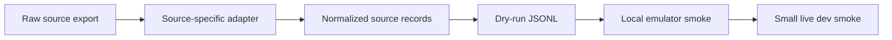
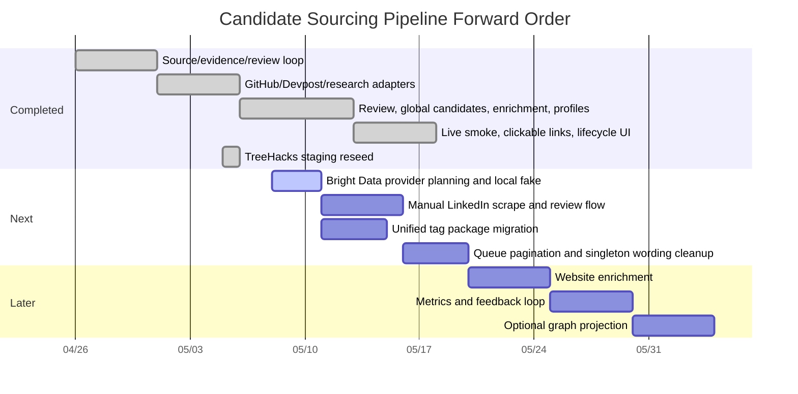

# Candidate Sourcing Pipeline Implementation Plan

## Document Purpose

This document turns the PRD and architecture into an implementation-ready plan.

Companion documents:

- [PRD.md](./PRD.md)
- [ARCHITECTURE.md](./ARCHITECTURE.md)

This plan is intentionally phased. The system touches scraping, Firebase/core-service, human review, enrichment, and future matching readiness. The safest path is to productize the existing sourcing prototype first, then add the missing review and enrichment layers.

## Implementation Strategy

Use a conservative productization path:

1. Stabilize the existing sourcing prototype.
2. Connect GitHub, Devpost, and research to the same source-record contract.
3. Expand review workflow for singleton approval and structured signals.
4. Create the global candidate entity model.
5. Add evidence-grounded enrichment and enrichment review.
6. Add final candidate profiles and reviewer-facing lineage.
7. Harden real source adapters and controlled staging imports.
8. Add vendor-approved professional enrichment, starting with Bright Data LinkedIn profile scraping for reviewer-approved LinkedIn URLs.
9. Add metrics and evaluation loops after reviewer flow and source operations are stable.
10. Defer Neo4j projection until graph queries justify it.

## Guiding Constraints

- Do not migrate Python scrapers to Cloud Run in v1.
- Do not rebuild the dashboard from scratch.
- Do not use Neo4j as v1 source of truth.
- Do not add unofficial social/LinkedIn crawling in v1.
- Do not let vendor enrichment bypass identity review, merge review, or enrichment review.
- Do not automatically approve candidates.
- Do not enrich from pending, rejected, or unsure evidence.
- Do not implement full job/company matching in this phase.
- Do not create a separate top-level dedup service.

## Current Execution State

Last updated: 2026-05-12.

- [x] PRD, architecture, and implementation plan documents are drafted.
- [x] Firebase/Firestore remains the v1 operational source of truth.
- [x] Existing dashboard should be extended rather than rebuilt.
- [x] GitHub, Devpost, and research remain the only v1 source families.
- [x] Enrichment should include industry/domain interests in addition to role/track, specialization, skills, and contactability.
- [x] Local `.env` files are ignored by git and must not be committed.
- [x] Phase 0 clarified branch/deploy strategy and confirmed the sourcing dashboard/backend path.
- [x] Phase 1 stabilized the source-run/source-record/evidence/dedup/review/approved-entity loop.
- [x] Phase 2 unified GitHub, Devpost, and research fixture ingestion through the same source-record upload path.
- [x] Phase 3 expanded review into structured identity/relevance decisions with confirmed signals.
- [x] Phase 4 created the global candidate entity model and verified approved candidate growth across GitHub/Devpost while research remains in the review queue.
- [x] Phase 5 added manual evidence-grounded enrichment generation, controlled taxonomy validation, enrichment review, and profile materialization after human approval.
- [x] Phase 6 added final candidate profiles, profile APIs, a Profiles dashboard tab, profile filters/search, and source/evidence/review/enrichment lineage display.
- [x] Post-Phase 6 hardening repaired tolerant-but-audited enrichment validation for common LLM shape mistakes.
- [x] Merge-before-enrichment guard is implemented, verified locally, committed, and pushed. Enrichment is blocked when an approved candidate overlaps a pending merge review.
- [x] Phase 3.5 real Firebase tiny-fixture smoke test passed against `wekruit-dev-env` / `wekruit-sourcing.web.app`.
- [x] Real Devpost Google Drive exports now have a source-specific adapter path to normalized person source records.
- [x] Real GitHub Google Drive repo exports now have a source-specific adapter path into the existing contributor extraction, scoring, and source-record upload flow.
- [x] Real-derived Devpost/GitHub subsets passed local emulator and tiny live verification before any broad import.
- [x] Clickable evidence/source links and derived lifecycle callouts are implemented, verified locally against the Firebase emulator, and deployed to `https://wekruit-sourcing.web.app`.
- [x] Capped review-count copy is implemented so the dashboard can distinguish loaded review rows from total pending review candidates.
- [x] Staging Firestore was reset/reseeded to a single Stanford-related Devpost competition, `TreeHacks 2026`, after explicit user/team direction.
- [x] The TreeHacks `Weak` match-strength concern was investigated and documented as expected singleton-review behavior, with a remaining UI wording cleanup recommended.
- [x] Bright Data implementation branch `codex/brightdata-integration-plan` is preserved as the perfected Bright Data baseline. New website-enrichment/shared-tags planning and future implementation work is branched from it on `codex/website-shared-tags-integration-plan` in both active implementation repos.
- [x] Coresignal integration planning is preserved in this document as a paused archive. No Coresignal implementation has started.
- [x] Bright Data is now the active vendor direction for professional LinkedIn profile enrichment planning.
- [x] Phase 6.5B added the Bright Data LinkedIn evidence/provider foundation: `linkedin` evidence normalization, vendor profile schemas/types, `ProfessionalProfileLookupPort`, deterministic fake provider fixtures, and a real Bright Data provider contract behind tests. No live Bright Data call, Firestore mutation, route wiring, UI wiring, deploy, approval, enrichment, or profile materialization was performed in Phase 6.5B.
- [x] Phase 6.5C added backend Firestore/service flow for vendor lookup runs and profile matches: collection constants, repository persistence/reservation methods, eligible LinkedIn URL derivation, pending-merge and lineage gates, deterministic duplicate-spend protection, no-match/failed retry behavior, and approve/reject/ignore service decisions. No API routes, dashboard UI, deploy, Firestore mutation outside tests, or live Bright Data call was performed in Phase 6.5C.
- [x] Phase 6.5D added normalized HTTP routes and error mapping for vendor profile match list, manual LinkedIn lookup run, async snapshot refresh, and vendor match decisions. The sourcing function now declares `BRIGHTDATA_API_KEY` as a Firebase secret for deployed lookup use. No dashboard UI, deploy, live Firestore mutation, approval/enrichment/profile materialization, or live Bright Data call was performed in Phase 6.5D.
- [x] Phase 6.5E wired approved vendor profile matches into enrichment evidence packs, enrichment draft validation, enrichment review lineage, final profile lineage, and stale review approval protection. Only approved vendor profile summaries can become enrichment context. No dashboard UI, deploy, live Firestore mutation, or live Bright Data call was performed in Phase 6.5E.
- [x] Phase 6.5F added the Approved tab Bright Data/LinkedIn lookup UI: backend-derived LinkedIn URL selection, manual fetch, duplicate-spend reuse display, no-URL gate, pending-merge disabled state, lookup run cards, async snapshot check control, normalized match cards, and approve/reject/ignore controls. Verification used only the local emulator and fake/provider-seeded fixtures. No deploy, live Firestore mutation, OpenAI enrichment, final profile materialization, or live Bright Data call was performed in Phase 6.5F.
- [x] Phase 6.5G completed local emulator end-to-end verification: API-seeded synthetic candidates, API approval, dashboard fake Bright Data lookup, dashboard vendor approval, OpenAI enrichment generation, dashboard enrichment approval, final profile materialization with vendor lineage, no-LinkedIn negative gate, and stale enrichment approval blocking after vendor evidence changed. No deploy, live Firestore mutation, or live Bright Data call was performed in Phase 6.5G.
- [x] Phase 6.5H set Firebase Secret Manager `BRIGHTDATA_API_KEY` for `wekruit-dev-env`, ran scoped build/dry-run/deploy, deployed only `functions:core-service:sourcing.api` and Hosting site `wekruit-sourcing`, and verified deployed read-only endpoints plus the Approved tab UI on `https://wekruit-sourcing.web.app`. No live Bright Data lookup was performed in Phase 6.5H.
- [x] Phase 6.5I completed the isolated live staging smoke test on `https://wekruit-sourcing.web.app`: created one synthetic Spencer source run/candidate, fixed and redeployed exact-ID review candidate resolution for live capped review queues, approved only that synthetic candidate, clicked the deployed dashboard Bright Data fetch button exactly once, approved the Bright Data match, generated and approved enrichment, and verified the final profile with Bright Data vendor evidence lineage. Broader Bright Data use remains blocked until explicit access/spend-control decisions.
- [x] Phase 6.5J implementation, local fake-provider full-chain verification, scoped staging deploy, and fresh synthetic Spencer live verification are complete. Bright Data normalization now preserves richer public professional context for enrichment when the provider returns it. The live Spencer LinkedIn profile returned only thin public data, so the synthetic live enrichment review was intentionally left pending and no final profile was materialized from that thin evidence.

## Current Open Decisions And Waiting State

Last updated: 2026-05-12.

This is the current single source of truth after the successful Phase 3.5 live smoke, real source adapters, clickable evidence/lifecycle deployment, TreeHacks staging reseed, Coresignal planning archive, and Bright Data planning pivot:

- Current active planning/implementation branch for the next workstream:
  - `wekruit-core-service-cloud-function`: `codex/website-shared-tags-integration-plan`.
  - `wekruit-scraping`: `codex/website-shared-tags-integration-plan`.
  - This branch was created from `codex/brightdata-integration-plan` specifically so the completed Bright Data baseline remains untouched.
  - `/Users/spencerwang/Documents/GitHub/wekruit-pa` remains on `main` for inspection only until the user explicitly authorizes package repo changes or package-owner publish changes.
- Not waiting on Phase 3.5 access anymore. Firebase CLI access, live sourcing API deploy, live dashboard deploy, and tiny live workflow verification all succeeded.
- Not waiting on clickable evidence/source links or lifecycle callouts. Those are implemented, verified, and deployed.
- Current active staging dataset:
  - Firebase project: `wekruit-dev-env`.
  - Hosting site: `https://wekruit-sourcing.web.app`.
  - Active staging run: `stanford-treehacks-2026-20260506T030716Z`.
  - Source: `devpost`; domain: `hackathon`; competition filter: `TreeHacks 2026`.
  - Input workbook: `devpost/treehacks-2026.xlsx` from `/Users/spencerwang/Downloads/devpost-20260501T061334Z-3-001.zip`.
  - Exact Firestore counts after Stanford upload: `1` source run, `1,029` source records, `4,878` evidence records, `1,010` dedup review candidates, and `0` review labels / approved entities / enrichment runs / enrichment review items / final profiles.
  - No candidate approvals, merge decisions, enrichment generation, enrichment review decisions, or profile materialization were performed during the Stanford upload.
- Current Bright Data waiting items:
  - Local `BRIGHTDATA_API_KEY` is present in `wekruit-core-service-cloud-function/.env` as of 2026-05-09. The value was not printed. `.env` is gitignored and untracked.
  - Firebase CLI access is expected to be sufficient to set/confirm Firebase Secret Manager `BRIGHTDATA_API_KEY` for `wekruit-dev-env` before deployed live lookup verification. If the user greenlights implementation, pipe the local `.env` value into `firebase functions:secrets:set BRIGHTDATA_API_KEY --project wekruit-dev-env --data-file -` without printing the value or placing it directly in the shell command.
  - Confirm the Bright Data account has access to the LinkedIn Scraper API / Profiles scraper.
  - Bright Data v1 data-use decision is narrowed and confirmed for implementation planning: use Bright Data only to gather professional information for enrichment evidence/context. Do not use it for broad sourcing, contact-data acquisition, automatic matching decisions, or identity/dedup approval.
  - First live Bright Data test policy is confirmed: after local fake/provider tests pass and the staging deploy is complete, create an isolated synthetic sourcing run/job for a single fake test candidate, `Spencer Wang`, with fake non-sensitive source context and LinkedIn URL `https://www.linkedin.com/in/spencerwang1` embedded in that synthetic source record/source evidence. Approve only that synthetic candidate, then run exactly one live Bright Data lookup from the active sourcing dashboard `https://wekruit-sourcing.web.app`, backed by Firebase project `wekruit-dev-env`.
  - Bright Data lookup must be hard-gated on eligible LinkedIn source/evidence lineage. If an approved candidate has no LinkedIn profile URL in its approved source/evidence records or source summaries, the dashboard must not show an active lookup button and the backend must reject lookup attempts. V1 must not provide a freeform/reviewer-supplied URL input or discover LinkedIn profiles from name/company fields.
  - Final readiness audit on 2026-05-09 added implementation guardrails for edge cases: canonical LinkedIn `/in/...` URL validation, backend-owned eligible URL derivation, exclusion of LinkedIn URLs from strong identity hashes even when they appear as `source_url` or `homepage`, deterministic duplicate-spend/concurrency protection, bounded manual async refresh if Bright Data sync returns `snapshot_id`, stale enrichment review protection after vendor evidence changes, sanitized vendor errors/logging, and an explicit access/spend-control check before a paid live route is broadly usable.
  - Live Bright Data smoke on 2026-05-10 created exactly one isolated synthetic approved Spencer candidate in staging, then materialized one final profile from that candidate. TreeHacks candidates remain unapproved/unmerged/unenriched by this work.
  - Bright Data quality issue discovered after Phase 6.5I: a user-run real LinkedIn lookup showed the deployed flow was technically wired but the normalized profile could be too thin for enrichment value. The observed card had current company and location, an `aboutSummary` that was only an 89-character public excerpt with an encoded `&amp;`, zero experience rows, zero skills, and project rows that were only names. This meant the integration could succeed while still failing the product goal of giving OpenAI materially richer professional context.
  - Phase 6.5J fixed the WeKruit normalization/display portion of that issue: richer allowed fields are now preserved when Bright Data returns them, HTML/entity cleanup is deterministic, public URLs embedded in allowed professional fields can be rendered/cited, and the dashboard linkifies richer list entries. The live Spencer verification still returned a thin Bright Data payload with no experience/project/skills rows, so the remaining limitation is provider output/public-profile availability rather than the local normalization path.
  - Bright Data's public docs for LinkedIn profile-by-URL scraping show structured profile output can include profile details, `about`, `current_company`, `experience`, `education`, `projects`, `publications`, certifications, organizations, honors/awards, activity/posts, and media/ID fields. V1 should still keep only the approved professional-context subset and exclude contact/private/sensitive/social-graph/media fields.
  - Bright Data is public-data limited. If Bright Data returns only a public excerpt or an already-truncated value for a restricted LinkedIn profile, WeKruit must not try to reconstruct hidden data through unofficial scraping. The target for Phase 6.5J is to preserve the full public professional text that Bright Data returns within bounded normalized fields, and to clearly document provider limitations when the returned payload itself is thin.
  - Manual-only v1 mode from the Approved detail panel is confirmed.
  - Raw vendor payload retention policy is confirmed for v1 and remains unchanged for Phase 6.5J: store richer normalized summaries only, with no full raw Bright Data payload in hot Firestore docs.
  - Field allowlist is confirmed for v1 and remains unchanged for Phase 6.5J: profile URL, name, headline/position, current company, location, education summary, experience summary, skills, about summary, and projects/publications if present. Contact/private/sensitive/social-graph/media fields are excluded unless explicitly approved later.
  - Rejected/ignored Bright Data matches should be remembered by selected LinkedIn URL/query hash and approved evidence lineage so unchanged lookups do not spend credits or show the same bad match again.
  - If approved Bright Data evidence is added to a candidate that already has a final enriched profile, set or preserve `needsEnrichment=true` and allow manual re-enrichment; do not implement complex diffing/versioning in v1.
  - LinkedIn URLs should become first-class evidence for display, reviewer selection, vendor lookup inputs, and lineage, but not strong dedup evidence in v1.
- Paused Coresignal waiting items:
  - Keep the Coresignal API key, field, retention, and budget decisions below for future reference only. Coresignal is not the active implementation path unless the team pivots back.
- Current tag-system integration item:
  - The teammate-owned unified tag package is now confirmed present and considered ready for integration planning in the permanent sibling clone `/Users/spencerwang/Documents/GitHub/wekruit-pa`.
  - Package location: `/Users/spencerwang/Documents/GitHub/wekruit-pa/packages/shared-tags`; package name: `@wekruit/shared-tags`; current version: `0.1.0`.
  - Dependency/distribution decision as of 2026-05-12: prefer GitHub Packages/private registry over dev-only sibling path so deploy/CI does not depend on one local checkout.
  - Deep preflight finding on 2026-05-12: the local package is still `private: true`, which is correct for workspace-only use but blocks npm publishing until a package-owner/publish step flips publishability and adds registry metadata. This does not mean GitHub Packages must be public; it means npm publish is currently disabled.
  - Deep preflight finding on 2026-05-12: the shared package registry key is `skillBucket` even though the README describes the broader axis as `skills`. Sourcing should store user-facing canonical `skills` as objects with a validated shared `bucket`, but taxonomy endpoints should expose the package registry accurately.
  - Deep preflight finding on 2026-05-12: proposed deterministic mappings for role functions, industry sectors, career stages, and planned `relevantTags` were checked against the shared package source arrays/no-abbreviation list with a read-only script and produced `failures: []`.
  - Deep preflight finding on 2026-05-12: `npm --workspace=@wekruit/shared-tags run typecheck` and `npm --workspace=@wekruit/shared-tags run test` were attempted in the fresh `wekruit-pa` clone, but dependencies are not installed there yet (`tsc` / `tsx` not found). This is not a package logic failure; implementation preflight should run `pnpm install --frozen-lockfile` or the package-owner's preferred install before treating package tests as meaningful.
  - The remaining work is not "create the package"; it is to confirm package publishing/auth, map sourcing's existing enrichment taxonomy to the shared axes, add a taxonomy API endpoint for the static dashboard, and remove the hardcoded `records.ts` / `web/app.js` duplication without breaking existing candidate profile reads.
- Current personal-website enrichment item:
  - Conceptual decisions are settled: website enrichment is a separate evidence source, mirrors the Bright Data HITL flow, excludes LinkedIn URLs, uses eligible URLs already found in approved source/evidence lineage, and should prefer Crawl4AI for the real open-source extraction engine.
  - Deep preflight finding on 2026-05-12: existing source-record link grouping already exposes `Website` and `Projects/demos` URL groups from Devpost/GitHub/generic records, and `wekruit-scraping/scripts/sourcing_upload_file.py` already preserves Devpost `member_website`, project URLs, demo links, and all-links in source records. The first website enrichment implementation should live in core-service and should not require a scraping repo source-record format change.
  - First local verification candidate for website enrichment is now fixed by user direction: create an isolated fake authentic `Sunwoo` candidate in the Firebase emulator with personal website `https://swkang73.github.io/`. Use the emulator/dashboard for verification before any staging/live dashboard work. Do not use TreeHacks data as the verification basis.
- Current reviewer workflow caution:
  - Do not approve, merge, enrich, materialize profiles, or run Bright Data lookup against the TreeHacks staging dataset unless the user/team intentionally starts a separate validation pass.
  - The Bright Data live smoke and Phase 6.5J verification should use only isolated synthetic `Spencer Wang` test run/job candidates with LinkedIn URL `https://www.linkedin.com/in/spencerwang1`. Do not use TreeHacks Devpost source data as the verification basis for the normalization patch.

## Current Remaining Work Triage

The core v1 workflow is proven locally and against the live `wekruit-dev-env` Firebase project. Completed milestones are kept below as historical verification; this triage list now contains only forward-looking work.

Current priority order:

1. **Bright Data professional LinkedIn profile enrichment integration.**
   - Status: completed baseline on `codex/brightdata-integration-plan`; Phase 6.5A preflight, Phase 6.5B domain/provider-contract work, Phase 6.5C backend service/repository flow, Phase 6.5D API routes/error contract, Phase 6.5E enrichment/profile lineage integration, Phase 6.5F Approved tab dashboard UX, Phase 6.5G local end-to-end verification, Phase 6.5H scoped deploy/read-only staging verification, Phase 6.5I isolated live staging smoke, and Phase 6.5J rich-normalization implementation/local/staging verification are complete.
   - Recommended first version: manual LinkedIn URL scrape for an approved candidate after identity review and merge-blocker checks.
   - Bright Data results should become reviewer-visible vendor evidence/context. They should not silently mutate approved entities, final profiles, or unified tags.
   - Phase 6.5J resolved the known normalization/display issue: the deployed integration now preserves richer normalized public professional context from Bright Data's allowed fields when returned. Remaining quality risk: Bright Data may still return a thin public payload for some LinkedIn profiles, as happened with the fresh synthetic Spencer live verification.
   - Implementation started with a fake/provider contract and focused tests before any live Bright Data call.
   - Remaining stance: keep Bright Data as a useful but variable LinkedIn enrichment signal. Do not reopen Bright Data richness experiments unless the team explicitly chooses that later.

2. **Personal website enrichment.**
   - Status: conceptually settled and execution-planned on `codex/website-shared-tags-integration-plan`; implementation is not greenlit yet.
   - Goal: add a separate reviewer-approved enrichment source for public personal websites/project/demo pages so OpenAI enrichment gets richer evidence than LinkedIn alone can reliably provide.
   - Recommended path: Bright Data-style HITL flow in core-service, fake provider first, local emulator/browser verification with synthetic Sunwoo candidate and `https://swkang73.github.io/`, then a real Crawl4AI Cloud Run worker after the fake workflow is proven.
   - Guardrails: no broad web search, no freeform URL input, no LinkedIn scraping on this path, no TreeHacks verification, no raw HTML in Firestore, and no approved website evidence entering enrichment until reviewer approval.

3. **Unified tag package migration.**
   - Status: package confirmed and planning resumed after 2026-05-12 inspection of teammate-owned package in `/Users/spencerwang/Documents/GitHub/wekruit-pa`.
   - Current hardcoded taxonomy source remains `wekruit-core-service-cloud-function/src/services/sourcing/domain/records.ts`.
   - The dashboard currently mirrors values in `wekruit-core-service-cloud-function/web/app.js`.
   - Migration should make the shared package the source of valid tags and keep Firestore as the source of candidate-specific tag assignments.
   - Confirmed package location: `wekruit-pa/packages/shared-tags`, package name `@wekruit/shared-tags`, version `0.1.0`, currently `private: true` / workspace-internal.
   - Confirmed browser-safe export exists at `@wekruit/shared-tags/canonical` for bundled browser consumers.
   - 2026-05-12 decision: use GitHub Packages/private registry if possible for the real integration path; do not rely on a dev-only sibling path as the production/deploy dependency model.
   - Important dashboard constraint: the current sourcing dashboard is plain static `web/app.js`, not an npm-bundled app. Decision for v1: expose canonical vocab through a backend taxonomy endpoint rather than adding a dashboard build step solely for shared labels.
   - Confirmed Python package exists at `wekruit-pa/packages/shared-tags-py`; its README describes the scraping-side tag-event/idempotency write contract. Decision for v1: do not change `wekruit-scraping` for shared labels unless source adapters start emitting canonical tags/tag events.
   - Migration must be a deliberate schema mapping, not a direct string swap: current sourcing values such as `ai_research`, `business_founder`, `academic_research`, `healthcare_ai`, and `ai_infrastructure` do not all match the shared package's `roleFunction` / `industrySector` axes one-for-one.
   - Migration should be additive first: preserve existing profile fields while adding shared canonical fields, then fully move UI/consumers to shared package labels after compatibility is proven.

4. **Large queue handling / pagination.**
   - The live Devpost import proved that the backend can ingest a broad run, but the current review UI intentionally loads a capped review set.
   - The dashboard now displays the total review-candidate count separately from the currently loaded candidates, but true cursor pagination / next-page review navigation is still future work.
   - Before another broad import, the team should decide whether reviewers need pagination, source filters, search-first review, or a smaller curated import batch.

4. **Singleton strength wording cleanup.**
   - Current issue: Devpost-only singleton review candidates correctly have `strength: weak`, but showing a `Weak` pill can make reviewers think the person is low-quality.
   - Recommended UI wording: show `Single-source` or `Needs identity review` for singleton review candidates; reserve `Weak/Medium/Strong` language for actual multi-record match strength.

5. **Website profile enrichment.**
   - Candidate personal websites remain a valuable enrichment target because they are often public, already present in Devpost/GitHub records, and can be fetched as supporting evidence.
   - A future website enrichment worker can fetch only URLs that already exist on source records or approved candidates, extract page title, description/meta tags, visible about/project text, social/profile links, and outbound project/repo links, then store the extracted facts as evidence/context.
   - This worker should respect robots/rate limits, store source URL + extraction timestamp + raw snapshot pointer, and route meaningful new profile fields through enrichment review instead of silently mutating final profiles.
   - 2026-05-07 scraper research update:
     - ScrapeGraphAI remains useful inspiration for LLM-guided structured extraction from a known page or small website, especially when the target page layout is unknown and the desired output is a typed JSON object.
     - Crawl4AI is also a strong fit for this layer because it is an open-source LLM-friendly crawler/scraper with markdown and structured JSON extraction workflows.
     - Recommended v1 website path: start with a small deterministic worker for already-known candidate URLs, use one crawler/extractor abstraction, and store extracted website facts as source/evidence context. Do not crawl broadly from the open web until reviewer value, compliance posture, and rate limits are clear.
     - Website extraction is separate from LinkedIn enrichment. Personal websites can use open-web extraction; LinkedIn should stay behind approved vendor/API policy such as Bright Data.
   - 2026-05-12 planning update:
     - Keep core-service as workflow owner because approved candidates, merge guards, HITL decisions, enrichment evidence packs, and Firestore lineage live there.
     - User decision on 2026-05-12: website scraping must be a separate enrichment source with the same HITL flow as Bright Data. Website facts are gathered after approval, reviewer-approved separately, and only then fed into final OpenAI enrichment where labeling happens.
     - User decision on 2026-05-12: the website scraper button/action must not exist when the approved candidate has no eligible personal website/project URL in approved source/evidence lineage, matching the Bright Data no-LinkedIn gate.
     - User decision on 2026-05-12: this generic scraper must never scrape LinkedIn URLs; LinkedIn remains owned by the Bright Data path.
     - User decision on 2026-05-12: prefer Crawl4AI for the real extraction engine because it is open-source and fits structured extraction best.
     - The extraction engine can still be a separate service/worker. A Python Cloud Run worker using Crawl4AI is the current recommended real implementation path because it avoids embedding a headless browser stack inside Firebase Functions. ScrapeGraphAI remains a reference/backup option only, not the preferred v1 path.
     - V1 should be URL-first/manual from the Approved detail panel, just like Bright Data: only eligible homepage/personal website/project URLs already found in approved source/evidence lineage; no broad search by name/company.
     - V1 should exclude LinkedIn and logged-in social scraping. Public GitHub/Devpost/project pages can remain separate source adapters or website-context sources depending on where the URL came from.
     - V1 should require reviewer approval of extracted website facts before they enter OpenAI enrichment context.
     - Suggested normalized fields: `profileUrl`, `pageTitle`, `siteName`, `aboutSummary`, `projectSummaries`, `experienceHighlights`, `skills`, `educationHighlights`, `contactLinks`, `sourcePages`, `extractedAt`, `contentHash`.
     - First implementation should start with fake provider fixtures and local emulator/browser verification before any live website crawl.
     - Topic status: conceptually settled; future work can move to implementation planning when greenlit, starting from the documented Crawl4AI + Bright Data-style HITL architecture.

6. **LinkedIn/social profile handling.**
   - For v1, preserve LinkedIn/Twitter/social URLs as clickable reviewer context and optional enrichment context.
   - Do not implement an unofficial LinkedIn scraper as a production path.
   - Automated LinkedIn profile fetching should use the approved Bright Data LinkedIn Scraper API path only after the team confirms account access, policy, and field retention. The first version should be URL-first, not broad LinkedIn discovery.
   - 2026-05-09 decision: LinkedIn profile URLs should be first-class evidence for display, reviewer selection, Bright Data query inputs, and downstream lineage, but they should not become strong dedup evidence or trigger automatic identity merges in v1.

7. **Bright Data / Coresignal evaluation.**
   - Current recommendation after teammate direction: implement Bright Data first for LinkedIn profile enrichment when WeKruit already has a LinkedIn URL from approved source evidence.
   - Coresignal planning is preserved as a paused alternative for future professional-profile discovery/enrichment, but it is not the active implementation path.
   - Bright Data is useful as a URL-first structured fetcher for known public profile/company/job/post URLs and niche public-web extraction, but LinkedIn and Devpost/GitHub scraping should stay behind explicit legal/product approval.
   - Neither vendor should bypass the HITL workflow: any externally enriched professional profile data should become evidence/context and route through enrichment review before profile materialization.
   - 2026-05-12 Bright Data about-limit planning:
     - The 89-character `about` values observed in the Spencer and Adam Yang diagnostics are not caused by WeKruit's normalizer cap; the deployed cap is `2500` characters and the redacted field inventory showed Bright Data itself returned `about.length = 89`.
     - Bright Data docs show the Profiles API can return `about`, `experience`, `projects`, `publications`, and related fields, but also state that LinkedIn collection is limited to publicly available data and does not access login-walled fields.
     - Current interpretation: the profile endpoint returns whatever public excerpt Bright Data can see for that profile. There is no safe code-only workaround for missing full-about text in the Profiles API response.
     - Possible next experiments, each requiring explicit data-use/spend approval: test Bright Data LinkedIn Posts by Profile URL for public posts, test Dataset Marketplace/Deep Lookup for richer public-source context, or ask Bright Data support whether account/dataset settings can return a less-truncated profile about field.
     - Product recommendation: do not treat Bright Data as the sole professional enrichment source. Pair it with personal website/GitHub/Devpost/project-page extraction for richer public context.
   - 2026-05-07 vendor decision update, superseded by 2026-05-08 Bright Data pivot:
     - Historical note: this older recommendation preferred Coresignal if the team needed broad professional-profile discovery from partial attributes.
     - Rationale: Coresignal's API surface is closer to the product problem: search/collect professional employee/profile records, return normalized professional fields, and support discovery from candidate-like attributes.
     - Bright Data is better when WeKruit already has exact LinkedIn/profile/company/job/post URLs and needs URL-first extraction, but it is less directly aligned with "given a Devpost/GitHub candidate, discover or enrich professional identity."
     - Proposed integration shape: Coresignal enrichment worker runs only after candidate identity approval or on an explicitly selected source subset; it uses approved evidence fields as query/context; returned professional data becomes enrichment evidence/context; reviewer approval remains required before final profile or unified tag assignment.
     - This was the prior recommendation. The active plan now uses Bright Data first because the teammate direction is to use the existing Bright Data LinkedIn URL scraper.
   - 2026-05-08 Coresignal integration planning update, now paused:
     - Recommendation: integrate Coresignal as a post-identity-approval professional enrichment provider, not as a raw source importer and not as a replacement for the Devpost/GitHub adapters.
     - First-principles reason: raw source adapters answer "what did we discover from GitHub/Devpost/research?"; dedup/HITL answers "is this a real candidate and which source records belong together?"; Coresignal should answer "can we find additional professional evidence for an already-approved person?" These are different jobs and should stay separated.
     - If the team pivots back, Coresignal should run after the existing merge-before-enrichment guard. If an approved entity still has unresolved pending merge candidates, block vendor lookup/enrichment until the reviewer resolves identity first.
     - Coresignal query seeds should come only from approved candidate evidence and source records: name, GitHub URL, Devpost URL, personal website, LinkedIn URL when present, email when already approved, institution, location, source domains, and reviewer-approved signals.
     - Coresignal output should be stored as vendor evidence/context and routed through enrichment review. It should not silently overwrite approved candidate fields, final profiles, or unified tags.
     - Secret handling: use local `.env` for local tests and Firebase Secret Manager for deployed functions, with a future `CORESIGNAL_API_KEY`. Do not store API keys in Firestore, source records, run metadata, review notes, or dashboard-visible payloads.
     - Current code integration point: `generateEnrichmentForApprovedEntity` in `wekruit-core-service-cloud-function/src/services/sourcing/application/service.ts` already builds the approved evidence pack and enforces pending-merge blockers before OpenAI enrichment. A future Coresignal lookup should either run as a separate manual action before OpenAI enrichment or enrich the evidence pack through an explicit provider port before the existing LLM taxonomy step.
     - Current API/UI integration point: the dashboard already exposes `Generate enrichment` from the Approved detail panel. A future first version can add a separate manual action such as "Find professional profile" or "Run Coresignal lookup" near that control, then show the returned candidate profile match as reviewer-visible evidence before allowing it into final enrichment.
     - Current Firestore state: sourcing collections currently cover source runs, source records, evidence, dedup candidates, review labels, approved entities, enrichment runs, enrichment review items, and candidate profiles. There is no vendor-enrichment collection yet.
     - Recommended future Firestore shape:
       - `sourcing-vendor-enrichment-runs`: provider, approved entity ID, query input hash, requested fields, status, error, created/updated timestamps, and cost/credit metadata when available.
       - `sourcing-vendor-profile-candidates` or `sourcing-external-profile-matches`: approved entity ID, provider, provider record ID/profile URL, normalized display fields, match rationale, confidence, evidence IDs used as query seeds, reviewer status, and raw payload storage pointer.
       - Keep large/raw vendor payloads out of hot dashboard documents where practical. Store a compact normalized summary in Firestore and use a storage pointer for full payloads if the team decides raw retention is acceptable.
     - Recommended future implementation phases:
       1. Define the provider contract and emulator-only fake Coresignal fixture. No live vendor calls.
       2. Add manual dashboard/API path for one approved candidate lookup in the local emulator.
       3. Add Coresignal live connectivity using `CORESIGNAL_API_KEY` with one known test candidate and a small field set.
       4. Add reviewer selection/approval of the matched professional profile before it becomes enrichment context.
       5. Feed approved Coresignal evidence into the existing OpenAI enrichment pack so taxonomy generation uses richer evidence while still requiring HITL enrichment approval.
       6. Only after manual flow is trusted, consider queueing/batching, rate limits, credit budgets, and retry behavior.
     - Team inputs required before implementation:
       - Confirm Coresignal account/API access and provide `CORESIGNAL_API_KEY` through local `.env` and deployed Firebase Secret Manager when needed.
       - Confirm allowed use case, data-use policy, and whether LinkedIn/profile URLs from Devpost/GitHub may be used as lookup seeds.
       - Confirm budget/credit limits and whether the first implementation should be manual-only.
       - Confirm which returned fields may be displayed/stored: current title/company, location, skills, education, experience, emails, LinkedIn URL, activity, and/or salary-like fields.
       - Confirm retention policy for raw vendor payloads versus normalized summaries only.
     - Vendor comparison:
       - Coresignal remains useful if WeKruit later needs professional profile discovery/enrichment from partial candidate attributes.
       - Bright Data is the active choice when WeKruit already has an exact LinkedIn/profile/company/job/post URL and wants URL-first structured fetch.
       - ScrapeGraphAI/Crawl4AI remain better fits for public personal websites and project pages, not for LinkedIn profile enrichment.

8. **Re-enrichment and profile versioning.**
   - Current first-time enrichment flow works.
   - Remaining behavior: when new approved evidence attaches to an existing candidate, compare enrichment-relevant fields, create a new enrichment review only for important changes, and preserve enrichment/profile version history.

9. **Feedback loop and metrics.**
   - Metrics remain valuable but lower priority than reviewer usability and source adapter hardening.
   - Keep Phase 7 in the roadmap, but do not block Coresignal planning, tag migration, queue handling, or reviewer usability on metrics work.

10. **Post-reseed dashboard walkthrough.**
   - The Stanford/TreeHacks Devpost staging source upload is complete.
   - The next live action should be a reviewer walkthrough in the staging dashboard: inspect Jobs and Review, confirm links/lifecycle callouts, then manually exercise a small number of approvals/merges/enrichments only when the user intentionally starts that validation pass.
   - Do not approve, merge, enrich, or materialize profiles as part of source upload verification.

11. **TreeHacks weak-strength investigation.**
   - 2026-05-07 live Firestore read-only check on the active TreeHacks staging dataset found:
     - `1,001` weak dedup candidates.
     - `9` strong dedup candidates.
     - `1,001` candidates have reason code `singleton_review`.
     - Strong candidates come from exact `github_exact` or `email_exact` matches across two or more source records.
   - Current conclusion: this is mostly expected for a Devpost-only run. A single-source candidate that has no duplicate partner is intentionally represented as a `singleton_review` candidate with `strength: weak`; this label means weak identity/dedup evidence, not a weak person/candidate.
   - Current code behavior:
     - `buildSingletonReviewCandidate` assigns `strength: weak` to every singleton person record.
     - Exact email/GitHub/ORCID/etc. evidence can produce `strong` multi-record dedup candidates.
     - Homepage matches can produce `medium` multi-record dedup candidates.
   - UX risk: showing a `Weak` pill on singleton candidates can make reviewers think the candidate is low quality. Recommended future UI wording: for singleton review candidates, show `Single-source` or `Needs identity review` instead of emphasizing `Weak`; reserve `Weak/Medium/Strong` language for actual multi-record match strength.

### Clickable Evidence/Lifecycle Local Verification

Status: passed locally on `codex/clickable-evidence-lifecycle`.

Verification path:

1. Started the full local Firebase emulator/dashboard from `wekruit-core-service-cloud-function`.
2. Uploaded tiny GitHub, Devpost, and research fixtures from `wekruit-scraping`.
3. Verified the Review tab rendered clickable evidence/source links for candidate homepages, GitHub URLs, Devpost URLs, and project/source URLs.
4. Approved the Alex Rivera GitHub/Devpost merge candidate and verified the Approved tab rendered clickable source/profile/project links.
5. Generated and approved Alex Rivera enrichment, then verified the Enrichment and Profiles tabs preserved clickable evidence/source lineage.
6. Verified lifecycle callouts appeared in Review, Approved/Profile, and Enrichment states.
7. Confirmed no staging/live Firebase mutation was needed for this feature verification.

Automated verification:

- `node --check web/app.js` passed.
- `npm run build` passed.
- `node --test lib/services/sourcing/**/*.test.js` passed.
- Full `npm test` still has the pre-existing matching API recency-score failures unrelated to sourcing; sourcing tests pass.

### Clickable Evidence/Lifecycle Staging Verification

Status: deployed and browser-verified on `https://wekruit-sourcing.web.app`.

Deployment path:

1. Built the sourcing function bundle from `wekruit-core-service-cloud-function`.
2. Ran focused sourcing tests before deployment.
3. Deployed `firebase.sourcing.json` to Firebase project `wekruit-dev-env`, including the `sourcing-api` Cloud Function and `wekruit-sourcing` Hosting site.
4. Opened `https://wekruit-sourcing.web.app/#review` and confirmed the staging dashboard loaded the updated UI.
5. At deployment time, confirmed the Review tab showed capped queue copy against the then-current broad import: `Showing 200 of 10,860 review candidates`.
6. Confirmed the selected candidate detail shows the lifecycle callout for pending identity review.
7. Confirmed source/evidence URLs render as clickable links, including GitHub, Devpost, LinkedIn, website, and project/demo/video links when present.

No Firestore data was reset or reseeded as part of this deployment. The later bounded staging reset/reseed replaced that broad import; see the current live import status above for the active staging counts.

### Clickable Evidence/Source Links Plan

Goal: make every reviewer-facing source/evidence URL directly inspectable from the dashboard without changing the backend data contract.

Implementation shape:

1. Reuse the existing dashboard URL renderer where possible.
2. Apply link rendering consistently to:
   - matched signal values in the Review detail panel;
   - the extracted evidence list in the Review detail panel;
   - source record comparison cards in the Review detail panel;
   - Approved entity fields and any available source-record/source-URL lineage;
   - Profile field evidence and source lineage;
   - enrichment evidence/context panels if URL values appear there.
3. Expand dashboard source-record extraction to surface URL fields already preserved by adapters:
   - `sourceUrl`;
   - `display.homepage`, `display.github`, `display.linkedin`, `display.twitter`, `display.devpost`;
   - `rawSummary.homepage`, `rawSummary.github`, `rawSummary.linkedin`, `rawSummary.twitter`, `rawSummary.devpost`, `rawSummary.projectUrl`, `rawSummary.demo`, `rawSummary.video`, `rawSummary.allLinks`;
   - Devpost project context links under `raw.projects`, including `projectUrl`, `videoUrl`, `projectGithubRepos`, `demoLinks`, and `allLinks`.
4. Keep rendering safe:
   - escape visible text;
   - only link `http://` and `https://` URLs;
   - open links in a new tab with `rel="noreferrer"`;
   - do not turn non-URL IDs or hashes into links.
5. Preserve current backend behavior. This is a dashboard visibility improvement, not a dedup/enrichment logic change.

Emulator-first verification:

1. Start the local full dashboard/API emulator from `wekruit-core-service-cloud-function`.
2. Upload tiny local GitHub, Devpost, and research fixtures from `wekruit-scraping`.
3. Confirm the Review tab shows clickable GitHub/profile/homepage/project links before approval.
4. Approve a GitHub singleton, then upload a Devpost record for the same candidate and verify the merge-review evidence links are clickable.
5. Approve the merge and confirm the Approved tab shows clickable source/profile links.
6. Generate and approve enrichment, then confirm the Profiles tab preserves clickable source/evidence lineage.
7. Only after the browser walkthrough passes locally should the dashboard be deployed for live Firebase verification.

### Candidate Lifecycle Cleanup Plan

Goal: make state transitions explicit enough that reviewers and future engineers understand where each candidate is in the pipeline.

Recommended lifecycle model:

1. `source_record_ingested`: raw source record is normalized and stored.
2. `identity_review_pending`: dedup candidate needs human review.
3. `identity_approved`: reviewer approved a candidate/entity as real and relevant.
4. `identity_rejected_bad_record`: reviewer rejected because the source record is broken/spam/not a person.
5. `identity_rejected_not_relevant`: reviewer rejected because the person exists but is not useful for sourcing.
6. `identity_hold`: reviewer deferred the decision.
7. `merge_pending`: new evidence appears to match an existing approved candidate and needs merge review.
8. `enrichment_blocked_by_merge`: approved candidate has unresolved pending merge evidence and should not generate enrichment yet.
9. `enrichment_ready`: approved candidate has no merge blockers and can generate an enrichment draft.
10. `enrichment_review_pending`: enrichment draft needs human approval/editing.
11. `profile_materialized`: enrichment was approved and final profile exists.

Implementation should avoid a broad rewrite. The likely shortest correct path is to keep the existing stored statuses, add clearer derived UI labels, and keep the backend guard that blocks enrichment generation when unresolved merge candidates still point at the approved entity.

### LinkedIn And Social Profile Investigation Plan

Current recommendation:

- Keep LinkedIn/Twitter/social links clickable and visible for reviewers now.
- Do not build an automated LinkedIn scraper into the production pipeline.
- Treat automated LinkedIn profile fetching as a separate product/compliance decision.

Why:

- LinkedIn profile API access is not equivalent to fetching arbitrary public candidate profiles. The common self-serve LinkedIn OpenID Connect path is for the authenticated member's own profile/email.
- Talent/recruiting integrations are partner/API programs that require explicit approval and should be planned separately from the current source adapter work.

Practical near-term approach:

1. Preserve any LinkedIn/social URLs from Devpost/GitHub/source exports as source context.
2. Render them as clickable links in review/profiles.
3. Let reviewers use those links manually as supporting evidence.
4. Add structured review notes or confirmed signals if LinkedIn/social evidence materially changes the candidate profile.
5. Revisit automated LinkedIn ingestion only after the team confirms approved API access and acceptable data-use policy.

## Phase Execution Protocol

Every phase should be executed as a self-contained loop:

1. Plan the exact code path and expected behavior for the phase.
2. Implement only the scope required for that phase.
3. Run automated tests or add focused tests when existing coverage is missing.
4. Verify behavior manually when the dashboard or review workflow is affected.
5. Debug failures before moving to the next phase.
6. Update this document with completed work, remaining blockers, and verification notes.
7. Stop and report status before starting the next phase.

The implementation agent should treat this document as durable working memory. If conversation context is compacted, resume from the latest checked items, progress notes, and blockers recorded here rather than restarting the plan from scratch.

## Setup Clarifications

These clarify the implementation questions that should be resolved before coding:

- Branching: create a new implementation branch from `main` before feature work starts. The branch should contain the pipeline implementation and can be merged back after end-to-end verification.
- Existing sourcing prototype: the preferred path is to reuse/productize the existing Firebase sourcing prototype where it is correct, not to rewrite it blindly. This does not mean Firebase itself is optional; Firebase remains the v1 data/runtime foundation.
- Local Firebase/dev dashboard setup: this means running the backend, dashboard, and Firebase emulators or configured dev Firebase project locally enough to test source ingestion, review actions, queue processing, and profile materialization without relying only on deployed behavior.
- LLM keys: local `.env` may contain provider keys, but implementation should only read expected environment variable names and must never print or commit secret values.
- LLM key validity: local keys should be treated as present-but-unverified until a safe connectivity check confirms the configured provider/model works. A dead key blocks live enrichment testing, but it should not block ingestion, evidence extraction, dedup, merge review, singleton review, or approved candidate materialization.
- Sample data: if real fixture data is missing, create small synthetic-but-realistic fixtures for GitHub, Devpost, and research so each phase can be tested repeatedly.
- Deployed dashboard verification: if allowed during implementation, browser/computer-use can open the deployed or local dashboard to verify the actual review experience visually. This is for UI verification only; source-of-truth behavior should still be tested through code and data checks.

## Environment Check Notes

Safe key connectivity check completed on 2026-04-27. Secret values were not printed, committed, or written to disk.

- `OPENAI_API_KEY`: active/auth accepted.
- `ANTHROPIC_API_KEY`: active/auth accepted.
- `GH_ANTHROPIC_API_KEY`: active/auth accepted against the Anthropic API; rejected as a GitHub token, so treat it as an Anthropic key despite the prefix.
- `GOOGLE_API_KEY`: active/auth accepted against the Gemini model-list endpoint.
- `SILLICON_FLOW_KEY`: rejected/unauthorized against the SiliconFlow model-list endpoint. Do not rely on this key unless it is replaced or revalidated.

Dashboard inspection permission: browser/computer-use may be used to inspect the deployed dashboard during implementation. Prefer local/dev environments for mutating review actions unless the team explicitly confirms deployed dev mutations are safe.

## Phase 0: Alignment And Branch/Productization Decision

### Goal

Confirm the current prototype state and decide how the team wants to bring `origin/codex/sourcing-e2e-firebase` into the active development path.

### Why This Phase Exists

The sourcing prototype exists, but it is not on current `main`. Before implementation begins, the team needs a clear answer to whether it will:

- be merged into `main`
- be rebased into a new implementation branch
- be used as reference and selectively ported

The preferred path is to productize the existing prototype rather than rebuild it.

### Tasks

- [x] Confirm the latest state of `origin/codex/sourcing-e2e-firebase` in `wekruit-scraping`.
- [x] Confirm the latest state of the corresponding sourcing branch in the Firebase/core-service repo.
- [x] Identify whether the deployed dashboard is currently sourced from that branch.
- [x] Decide the working branch strategy for implementation.
- [ ] Confirm Firebase project/environment ownership for staging.
- [ ] Confirm who owns dashboard deployment.
- [ ] Confirm who owns core-service deployment.
- [ ] Confirm reviewer access/auth expectations for v1.

### Phase 0 Findings

Last updated: 2026-04-28.

- Initial working branch was created from current `main` and later renamed for the full effort: `codex/candidate-sourcing-pipeline`. Later implementation branches continued from that line of work; the current active branch is recorded in Current Execution State.
- `wekruit-scraping` `origin/codex/sourcing-e2e-firebase` is still present and diverges from current `main`.
- The scraping prototype branch adds a useful source-record contract, deterministic IDs, dry-run upload output, a core-service ingest client, a generic JSON/JSONL/CSV uploader, and focused tests.
- The scraping prototype branch should be selectively ported/productized into the new implementation branch rather than used as the working branch directly, because current `main` contains newer planning docs and secret-safety work.
- `wekruit-core-service-cloud-function` `origin/codex/sourcing-e2e-firebase` is still present and diverges from current `main`.
- The core-service prototype branch adds the sourcing backend, Firestore collection names, task queue names, `/api/sourcing` routes, static dashboard, and Firebase hosting/emulator config.
- The core-service prototype branch should be selectively ported or rebased onto current `main`; do not switch wholesale because current `main` contains newer matching-service code not present in the sourcing branch.
- The deployed dashboard at `https://wekruit-dev-env.web.app/#review` responds with the sourcing review UI and the deployed `/api/sourcing/health` endpoint returns healthy.
- Deployed dashboard data currently appears researcher-only: four source runs, all with `sourceDomain=researcher`; no GitHub or Devpost source runs are present yet.
- Deployed dashboard/API currently has 23 dedup candidates and 3 approved entities.
- The deployed dashboard currently supports Jobs, Review, and Approved views, with review actions mapped to `same_person`, `not_same_person`, and `unsure`.
- The deployed dashboard does not yet implement the desired expanded relevance decisions, structured signal confirmation, GitHub/Devpost review coverage, enrichment workflow, enrichment review, or final enriched profiles.
- Browser automation initially failed because the local `agent-browser` helper command was missing, even though Codex app config already had `sandbox_mode = "danger-full-access"` and both `computer-use` and `browser-use` plugins enabled.
- Browser automation was restored by installing the expected `agent-browser` CLI globally through npm.
- Browser probe passes: `browser_open`, `browser_eval`, `browser_get_url`, and `browser_screenshot` all work against `https://wekruit-dev-env.web.app/#review`.
- Core-service dependencies installed locally with `npm ci`.
- Local Node is `v22.22.1`, while the core-service package declares Node `20`; `npm ci` warns about the engine mismatch.
- Core-service `npm run build` passes on current `main`.
- Core-service `npm test` currently fails 2 of 30 tests due to existing date-sensitive matching recency expectations, not sourcing changes.
- Firebase CLI is available through `npx firebase-tools` at version `15.15.0`.
- Java 21 is installed through Homebrew `openjdk@21`, with `JAVA_HOME`/`PATH` configured in `.zprofile` and `.zshrc`.
- Firestore emulator smoke test passes with `npx firebase-tools emulators:exec --only firestore 'echo firestore-emulator-started'`.
- Full functions/dashboard emulator verification should be run after the sourcing backend/dashboard code is ported onto current `main`.
- The core-service repo has `.firebaserc.example` for staging/production project aliases but no checked-in `.firebaserc`; actual dev/staging project ownership still needs confirmation.
- The scraping repo currently cannot run pytest with the system Python because `pytest` is not installed.

### Phase 0 Decision

Implementation should proceed from a new branch created off current `main`. Reuse the existing sourcing prototype as the main source of implementation material, but port it carefully into the current mainline rather than replacing the mainline with the old prototype branch.

Before mutating deployed review data, prefer local Firebase emulators. Java is now available for Firestore emulator startup; remaining local verification depends on porting the sourcing backend/dashboard code onto current `main`.

### Deliverables

- [x] Written team decision on branch strategy.
- [ ] Confirmed environment/deploy path.
- [ ] Clear owner list for scraping, core-service, dashboard, and review workflow.

### Acceptance Criteria

- [x] Team agrees not to rebuild the sourcing prototype from scratch.
- [x] Team knows which branch/repo contains the source of the existing dashboard/backend.
- [x] Team knows where implementation work will begin.

## Phase 1: Stabilize Existing Sourcing Prototype

### Goal

Make the current source-run/source-record/evidence/dedup/review/approved-entity loop reliable enough to build on.

### Scope

This phase does not add enrichment. It stabilizes the review foundation.

### Tasks

- [x] Verify source-run creation works end-to-end.
- [x] Verify source-record batch upload works end-to-end.
- [x] Verify evidence extraction runs for uploaded records.
- [x] Verify dedup candidate generation runs for evidence matches.
- [x] Verify singleton review candidates are created for person-like records with no duplicates.
- [x] Verify review labels are persisted.
- [x] Verify approved entities are materialized only after human approval.
- [x] Verify negative/unsure review labels suppress repeated review spam.
- [x] Verify the dashboard can load source runs, review candidates, and approved entities.
- [x] Verify evidence links render and open correctly where available.
- [x] Add or update tests around source-record validation and review materialization.
- [x] Add or update seed/sample data for local verification.

### Data Model Checks

- [x] Source records are deterministic/idempotent.
- [x] Evidence records are deterministic/idempotent.
- [x] Dedup candidate IDs are deterministic/idempotent.
- [x] Approved candidate/global entity IDs are opaque and stable.
- [x] Every approval stores reviewer, timestamp, decision, and note.
- [x] Every approved entity has source record lineage.
- [x] Every approved entity has evidence lineage.

### Phase 1 Findings

Last updated: 2026-04-28.

- Initial working branch in `wekruit-core-service-cloud-function`: `codex/candidate-sourcing-pipeline`, created from current `main`. Later phase branches continued from this line of work; the current active branch is recorded in Current Execution State.
- Initial working branch in `wekruit-scraping`: `codex/candidate-sourcing-pipeline`, created from current `main`, continuing to hold the scraping-side source-record upload bridge and durable plan docs. Later phase branches continued from this line of work; the current active branch is recorded in Current Execution State.
- Core-service sourcing backend, static dashboard, sourcing Firestore collection names, sourcing queue names, and sourcing-only Firebase config were selectively ported from the previous sourcing prototype branch onto current `main`.
- Scraping-side source-record contract, deterministic source-record conversion, generic file uploader, researcher upload bridge, and tests were selectively ported from the previous sourcing prototype branch onto current `main`.
- `firebase.sourcing.json` now runs the sourcing-only functions bundle with hosting, functions, and Firestore emulators, avoiding unrelated outbound/matching environment prompts during local sourcing verification.
- Local sourcing stack verified through Firebase emulators:
  - Hosting: `http://127.0.0.1:5100`
  - Functions: `http://127.0.0.1:5101`
  - Firestore: `http://127.0.0.1:8180`
- Source upload verified through the hosting rewrite at `http://127.0.0.1:5100/api/sourcing`.
- Repeatable local smoke fixtures were created outside the repo under `/tmp` for:
  - GitHub: Alex Rivera duplicate candidate plus Mira Patel singleton.
  - Devpost: Vision Assist project plus Alex Rivera member with shared GitHub/homepage evidence.
  - Research/OpenAlex-style generic record: Taylor Chen singleton with ORCID, homepage, DOI, institution, and name evidence.
- End-to-end smoke verification produced:
  - 3 completed source runs.
  - 5 source records.
  - 38 evidence records.
  - 1 strong GitHub/Devpost duplicate candidate for Alex Rivera.
  - 2 singleton candidates for Taylor Chen and Mira Patel, which were initially pending review and later verified with `unsure` and `not_same_person` labels.
  - 1 suppressed stale singleton for Alex Rivera after the duplicate was detected.
  - 1 approved entity after manual `same_person` review of the Alex Rivera GitHub/Devpost duplicate.
- Negative and unsure review verification passed:
  - `not_same_person` persisted for Mira Patel and did not create an approved entity.
  - `unsure` persisted for Taylor Chen and did not create an approved entity.
  - Approved entity count remained `1`, only Alex Rivera.
- Dashboard browser verification passed locally:
  - Review view showed `Jobs 3`, `Review 2`, `Approved 1`.
  - Taylor Chen singleton review showed ORCID, homepage, source ID, institution, name, source URL, and DOI evidence.
  - Approved view showed Alex Rivera as one approved entity with two surviving source records, one email, one GitHub URL, and source/evidence lineage.
- Dashboard screenshot captured at `/tmp/wekruit-phase1-local-dashboard.png`.
- A payload contract issue was found and fixed in the generic uploader: optional empty fields must be omitted, not sent as `null`, because the core-service schema treats them as optional but non-nullable.
- A dedup logic issue was found and fixed in core-service: project records can contain member GitHub/homepage URLs, but person dedup candidates must only include person-like source records. Project records remain source context and are no longer grouped into person review candidates.

### Phase 1 Verification

- `wekruit-core-service-cloud-function`: `npm run build` passes.
- `wekruit-core-service-cloud-function`: `node --test lib/services/sourcing/**/*.test.js` passes, 7 tests.
- `wekruit-scraping`: `/tmp/wekruit-scraping-phase1-venv/bin/python -m pytest researcher/tests/test_generic_sourcing_file_upload.py researcher/tests/test_sourcing_upload_bridge.py` passes, 7 tests.
- `wekruit-scraping`: `/tmp/wekruit-scraping-phase1-venv/bin/python -m pytest researcher/tests` passes, 38 tests.
- Known unrelated baseline remains: full `npm test` in core-service still has the pre-existing date-sensitive matching recency failures from Phase 0; sourcing build and sourcing tests pass.

### Acceptance Criteria

- [x] A two-record exact match can be uploaded, reviewed as same person, and materialized as one approved entity.
- [x] A singleton person-like source record can be uploaded and appears in review.
- [x] A rejected/unsure review decision does not create an approved entity.
- [x] The dashboard displays enough evidence for a reviewer to make a decision.

## Phase 2: Unify GitHub, Devpost, And Research Ingestion

### Goal

Ensure all v1 sources can produce source records, evidence, and relevance signals through the same adapter contract.

### Source Adapter Contract

Each source adapter should emit:

- source run metadata
- source records
- evidence candidates or evidence-ready fields
- relevance signal candidates
- raw payload pointer or raw summary
- content hash

### GitHub Tasks

- [x] Map GitHub candidates to `domain=developer`.
- [x] Map GitHub profiles to person source records.
- [x] Preserve GitHub username and profile URL.
- [x] Preserve public email when available.
- [x] Preserve homepage/blog when available.
- [x] Preserve company/institution field when available.
- [x] Preserve location when available.
- [x] Preserve repository/activity summary fields.
- [x] Emit evidence for GitHub URL/login.
- [x] Emit evidence for public email.
- [x] Emit evidence for homepage.
- [x] Emit relevance signals such as `open_source_contribution` and `technical_project`.
- [x] Create fixture data for a GitHub singleton.
- [x] Create fixture data for a GitHub/Devpost same-person match through shared GitHub URL.

### Devpost Tasks

- [x] Map Devpost projects to `domain=hackathon`.
- [x] Emit project source records.
- [x] Emit person/team member source records.
- [x] Preserve project URL.
- [x] Preserve member Devpost profile URL when available.
- [x] Preserve GitHub/demo links.
- [x] Preserve tech tags.
- [x] Preserve hackathon and prize/winner fields.
- [x] Emit evidence for Devpost URLs.
- [x] Emit evidence for GitHub links.
- [x] Emit relevance signals such as `technical_project`, `founder_or_builder_signal`, and `award_or_recognition`.
- [x] Create fixture data for a Devpost singleton.
- [x] Create fixture data for a Devpost/GitHub same-person match.

### Research Tasks

- [x] Map OpenAlex and generic DOI-based paper outputs to research source records.
- [x] Map author/contact enrichment outputs to person source records.
- [x] Preserve ORCID, OpenAlex author ID, DOI, institution, venue, and publication metadata.
- [x] Preserve DBLP/OpenReview/homepage fields when available through contact enrichment.
- [ ] Add a dedicated real Crossref output fixture if the team depends on Crossref-specific ingestion shape.
- [ ] Preserve Google Scholar profile fields once they are emitted by research enrichment.
- [x] Emit evidence for ORCID.
- [x] Emit evidence for DOI/paper.
- [x] Emit evidence for institution.
- [x] Emit evidence for DBLP/OpenReview/homepage where present.
- [x] Emit relevance signals such as `research_publication` and `education_affiliation`.
- [x] Create fixture data for a research singleton.
- [x] Create fixture data for exact ORCID match across two research records.

### Cross-Source Tasks

- [x] Confirm all three sources can upload through the same ingest path.
- [x] Confirm source records preserve source-specific raw summaries without forcing every field into top-level columns.
- [x] Confirm evidence extraction normalizes shared identifiers consistently.
- [x] Confirm dedup can compare records across domains.
- [x] Confirm dashboard can display source-specific details without breaking generic review UI.

### Acceptance Criteria

- [x] GitHub source run appears in dashboard.
- [x] Devpost source run appears in dashboard.
- [x] Research source run appears in dashboard.
- [x] GitHub, Devpost, and research records can all produce singleton review items.
- [x] At least one cross-source dedup case can be reviewed and approved.
- [x] Each source type provides at least one inspectable evidence link per approvable record.

### Phase 2 Findings

Last updated: 2026-04-28.

- The generic file upload adapter now preserves meaningful source-specific summaries for GitHub, Devpost, and research records while still sending the same source-record contract to core-service.
- GitHub fixture ingestion covers one GitHub/Devpost duplicate candidate and one GitHub singleton. GitHub summaries preserve username/profile URL, public email, homepage/blog, company/institution, location, commit/PR/repo activity, project stars, source repos, score, and suggested relevance signals.
- Devpost fixture ingestion covers one project/team member that matches GitHub and one Devpost singleton. Devpost summaries preserve project URL, member profile URL, GitHub/demo/all links, tech tags, hackathon, prize/winner fields, and suggested relevance signals.
- Research fixture ingestion covers one exact ORCID/homepage match across two research records and one research singleton. Research summaries preserve ORCID, DOI, venue, institution, homepage/source URL, and suggested relevance signals.
- Existing researcher source-record bridge coverage still verifies staged OpenAlex work/author records and contact enrichment records, including OpenReview and DBLP fields.
- Crossref-specific and Google Scholar-specific fixture hardening remains deferred until those exact output shapes are required in v1 ingestion. The current generic research adapter covers normalized DOI/paper fields but should not be treated as proof that every raw Crossref payload shape is production-ready.
- A `suggestedSignals` adapter bug was found and fixed: generated signal lists must be flattened/deduplicated as strings, not accidentally nested as a tuple/list payload.
- A Devpost identity-evidence bug was found and fixed: project context now uses `projectName`/`projectUrl` in member raw payloads so project names do not pollute person-name evidence.

### Phase 2 Verification

- `wekruit-scraping`: `/tmp/wekruit-scraping-phase1-venv/bin/python -m pytest researcher/tests/test_generic_sourcing_file_upload.py researcher/tests/test_sourcing_upload_bridge.py` passes, 8 tests.
- `wekruit-scraping`: `/tmp/wekruit-scraping-phase1-venv/bin/python -m pytest researcher/tests` passes, 39 tests.
- `wekruit-core-service-cloud-function`: `npm run build` passes.
- `wekruit-core-service-cloud-function`: `node --test lib/services/sourcing/**/*.test.js` passes, 7 tests.
- Local sourcing emulator E2E upload through `http://127.0.0.1:5100/api/sourcing` produced 3 completed source runs, 9 source records, 64 evidence records, 4 pending review candidates, 1 approved entity, and 1 stale singleton suppressed after duplicate detection.
- Local dashboard browser verification showed `Jobs 3`, `Review 4`, and `Approved 1` after uploading GitHub, Devpost, and research fixtures.
- Local dashboard browser verification showed Alex Rivera approved as one entity from GitHub and Devpost source records, with email, GitHub URL, homepage/source URLs, source lineage, and evidence lineage visible.
- Local dashboard browser verification showed Nora Kim as a Devpost singleton with person-name evidence correctly showing `nora kim`, not the project name.
- No deployed dashboard data was mutated during Phase 2; manual browser verification was performed against the local emulator dashboard.

### Phase 2 Local Demo

Use this when the team wants to see the Phase 2 progress in the dashboard.

From `wekruit-core-service-cloud-function`, start the local sourcing dashboard/API/emulator stack:

```bash
npm run serve:web:full
```

Then open the local dashboard:

```text
http://127.0.0.1:5100/#review
```

From `wekruit-scraping`, upload the sample fixtures to the local dashboard API:

```bash
/tmp/wekruit-scraping-phase1-venv/bin/python scripts/sourcing_upload_file.py --input researcher/tests/fixtures/sourcing/github_candidates.json --run-id demo-github --domain developer --source github --api-base-url http://127.0.0.1:5100/api/sourcing
```

```bash
/tmp/wekruit-scraping-phase1-venv/bin/python scripts/sourcing_upload_file.py --input researcher/tests/fixtures/sourcing/devpost_projects.json --run-id demo-devpost --domain hackathon --source devpost --api-base-url http://127.0.0.1:5100/api/sourcing
```

```bash
/tmp/wekruit-scraping-phase1-venv/bin/python scripts/sourcing_upload_file.py --input researcher/tests/fixtures/sourcing/research_records.json --run-id demo-research --domain researcher --source openalex --api-base-url http://127.0.0.1:5100/api/sourcing
```

Expected visible result:

- GitHub, Devpost, and research source runs appear in the dashboard.
- Alex Rivera appears as a GitHub/Devpost duplicate candidate through shared GitHub/homepage evidence.
- Nora Kim, Mira Patel, Priya Natarajan, and Taylor Chen appear as singleton or research review cases.
- Evidence includes source-specific links/fields such as GitHub URL, Devpost URL, homepage, ORCID, DOI, institution, and source URL.
- Approving the Alex Rivera merge creates one approved entity with GitHub and Devpost source-record lineage.

## Phase 3: Expand Review Workflow

### Goal

Make human review support both identity merge decisions and candidate relevance decisions.

### Merge Review Tasks

- [x] Preserve existing approve merge / keep separate / hold workflow.
- [x] Store identity label separately from candidate relevance decision.
- [x] Clarify that materialization requires `identityLabel=same_person` and `candidateDecision=approve_candidate`.
- [x] Display source records side by side.
- [x] Display matched evidence.
- [x] Display reason codes and strength.
- [x] Display source-specific evidence links.
- [x] Display suggested relevance signals.
- [x] Allow reviewer to confirm/remove/add relevance signals.
- [x] Store confirmed relevance signals with review label.
- [x] Support rejecting a merged proposal as bad record or not relevant without creating a candidate.
- [x] Store review note.

### Singleton Review Tasks

- [x] Add singleton review queue or filter.
- [x] Display person-like records with no current duplicate proposal.
- [x] Display inspectable evidence links.
- [x] Display source-specific summary fields.
- [x] Display suggested relevance signals.
- [x] Allow reviewer to confirm/remove/add relevance signals.
- [x] Add decisions: `approve_candidate`, `reject_bad_record`, `reject_not_relevant`, `unsure`.
- [x] Store decision, reviewer, timestamp, confirmed signals, suggested signals, and note.
- [x] Ensure rejected/unsure singletons do not create approved candidates.

### Review Data Tasks

- [x] Store suggested relevance signals separately from confirmed relevance signals.
- [x] Ensure review labels have stable lineage to source records/dedup candidates.
- [x] Ensure `reject_bad_record` and `reject_not_relevant` are distinguishable.
- [x] Ensure review actions are auditable.
- [x] Ensure dashboard filters can separate pending, approved, rejected, and held records.

### Dashboard UX Tasks

- [x] Add source filter.
- [x] Add run filter.
- [x] Add status filter.
- [x] Add signal filter.
- [x] Add evidence/strength display.
- [x] Add final candidate profile navigation from approved items.
- [x] Keep existing review note behavior.
- [x] Add structured signal controls without making review too slow.

### Acceptance Criteria

- [x] Reviewer can approve a singleton candidate with confirmed relevance signals.
- [x] Reviewer can reject a singleton as bad record.
- [x] Reviewer can reject a singleton as real but not relevant.
- [x] Reviewer can hold/mark unsure without approving.
- [x] Reviewer can approve a merge only when identity and relevance are both approved.
- [x] Review decisions are persisted with enough structure for metrics.

### Phase 3 Findings

Last updated: 2026-04-28.

- Review labels now store `identityLabel`, `candidateDecision`, `suggestedSignals`, `confirmedSignals`, `sourceRecordIds`, and `evidenceIds`.
- The old `label` field remains accepted as an API alias so the existing review endpoint contract does not break, but new stored records preserve the Phase 3 identity/relevance split.
- Merge candidates only materialize approved entities when `identityLabel=same_person` and `candidateDecision=approve_candidate`.
- Singleton candidates only materialize approved entities when `candidateDecision=approve_candidate`.
- Rejected and held decisions are now distinguishable through candidate statuses: `not_same_person`, `rejected_bad_record`, `rejected_not_relevant`, and `unsure`.
- Approved entities now carry `suggestedSignals` and `confirmedSignals` so later enrichment and matching can use human-confirmed review data.
- Dashboard review controls now support fast v1 actions: approve candidate, keep separate, bad record, not relevant, and hold.
- Dashboard relevance signal controls now allow reviewers to confirm, remove, and add normalized review signals before saving a decision.
- Dashboard filters now include run, status, source, signal, and search.
- Reviewed rows can be inspected through the All statuses filter, but their action buttons are disabled so they cannot be accidentally reviewed again.
- Browser verification caught and fixed two UI bugs:
  - Approved detail originally displayed suggested plus confirmed signals; it now displays confirmed signals when present.
  - Run selection originally auto-jumped away from a run with zero pending items even when viewing All statuses; it now only auto-falls back in the pending queue.

### Phase 3 Verification

- `wekruit-core-service-cloud-function`: `node --check web/app.js` passes.
- `wekruit-core-service-cloud-function`: `npm run build` passes.
- `wekruit-core-service-cloud-function`: `node --test lib/services/sourcing/**/*.test.js` passes, 10 tests.
- Local emulator E2E uploaded GitHub, Devpost, and research fixtures through `http://127.0.0.1:5100/api/sourcing`, producing 3 source runs, 9 source records, 64 evidence records, and 5 review candidates.
- API smoke verification covered:
  - GitHub/Devpost merge approved with `same_person + approve_candidate`, creating one approved entity.
  - GitHub singleton approved with `approve_candidate`, creating one approved entity.
  - Devpost singleton rejected as `reject_bad_record`, creating no approved entity.
  - Research singleton rejected as `reject_not_relevant`, creating no approved entity.
  - Research merge held with `unsure`, creating no approved entity.
- Browser verification against `http://127.0.0.1:5100/#review` covered:
  - Review page loads the new status/source/signal filters.
  - Merge review shows suggested relevance signals as editable checked controls.
  - Reviewer can remove a suggested signal, add `assistive_ai`, write a note, and approve a GitHub/Devpost merge.
  - Approved tab shows the approved Alex Rivera entity with confirmed signals and source-record lineage.
  - Reviewer can reject a singleton as bad record from the dashboard.
  - All statuses view can inspect reviewed rows and keeps action buttons disabled for non-pending records.

## Phase 3.5: Firebase Staging Smoke Test

### Goal

Validate that the completed local sourcing workflow works against a real Firebase environment before shared deployed testing and before Phase 5 enrichment depends on deployed candidate data.

This phase should use a staging/dev Firebase project, not production. The purpose is to prove deployed Firebase Hosting, Firebase Functions, Firestore config, indexes, CORS, rewrites, and dashboard behavior outside the local emulator.

### Why This Phase Exists

Local emulator testing has proven the vertical slice:

- GitHub, Devpost, and research fixture uploads reach the sourcing API.
- Source records produce evidence and review candidates.
- Duplicate and singleton candidates appear in the dashboard.
- Human review actions persist structured identity/relevance decisions.
- Approved candidates materialize only from approved review decisions.
- Approved GitHub/Devpost evidence can grow one active global candidate instead of creating duplicate approved candidates.
- The dashboard supports run/status/source/signal/search filtering and full-row selection.

However, the team has not yet proven that the same workflow is correct in a deployed Firebase project. The latest team clarification says `wekruit-dev-env` can be used for testing, but the first real Firebase run still needs to be narrow and observable:

- `wekruit-core-service-cloud-function` has `.firebaserc.example` with `staging=wekruit-core-service-staging` and `production=wekruit-core-service-production`.
- No checked-in `.firebaserc` was found in the core-service repo during Phase 3.5 planning.
- `firebase.sourcing.json` defines the sourcing-only hosting/functions/firestore config and hosting site `wekruit-sourcing`.
- The previously inspected deployed dashboard at `https://wekruit-dev-env.web.app/#review` exists, but Phase 3.5 should prefer updating the dedicated `wekruit-sourcing` site first.

### Required Team Confirmation

Before running this phase, confirm:

- [x] Which Firebase project is the safe staging/dev target.
- [ ] Whether `wekruit-core-service-staging` exists and is accessible to the implementation owner.
- [x] Whether `wekruit-dev-env` is a disposable dev environment, a shared team environment, or something closer to production.
- [ ] Whether the staging Firestore data can be deleted/reset if a test upload pollutes review data.
- [x] Who owns Firebase Hosting deployment for the sourcing dashboard.
- [x] Who owns Firebase Functions deployment for the sourcing API.
- [ ] Whether staging dashboard access/auth is acceptable for the current v1 review workflow.
- [ ] Whether the staging project has required Firestore indexes/rules deployed or should receive them as part of this smoke test.

Current decisions:

- Use `wekruit-dev-env` for Phase 3.5 real Firebase testing.
- Prefer the dedicated `wekruit-sourcing` Hosting site for the updated sourcing dashboard so the default `wekruit-dev-env.web.app` site is not overwritten unless explicitly needed.
- The teammate confirmed dev dashboard data can be mutated for testing because no one is actively using it.
- The implementation owner now has Firebase project access and Cloud Functions admin was reportedly granted.

Still treat all real Firebase actions as deliberate. Use small prefixed fixture runs first, and do not upload the full Google Drive exports during Phase 3.5.

### Safety Rules

- [ ] Do not point fixture upload scripts at production.
- [ ] Do not run large real scrapes in staging before fixture smoke tests pass.
- [ ] Use clearly prefixed run IDs for every staging test.
- [ ] Keep test data small and reversible.
- [ ] Record exact project ID, deployed URL, run IDs, and cleanup steps in this document.
- [ ] If staging ownership is unclear, stop and ask the team before deploying or uploading.

Recommended run ID prefix:

```text
smoke-YYYY-MM-DD-source
```

Example:

```text
smoke-2026-04-28-github
smoke-2026-04-28-devpost
smoke-2026-04-28-research
```

### Planned Test Path

1. Verify local build/test health before touching real Firebase.
2. Verify deploy permissions with the narrowest safe pre-flight/dry-run available.
3. Confirm or set the `OPENAI_API_KEY` Firebase secret for `wekruit-dev-env` without exposing its value.
4. Deploy only the sourcing API function: `sourcing-api`.
5. Deploy only the sourcing dashboard to `wekruit-sourcing`, not the default `wekruit-dev-env` site unless explicitly needed later.
6. Open the deployed `wekruit-sourcing` dashboard and verify health plus the new Enrichment/Profile endpoints.
7. Upload the small GitHub fixture first.
8. Have the reviewer approve Alex Rivera as a GitHub singleton.
9. Upload the small Devpost fixture second.
10. Have the reviewer resolve the Alex Rivera Devpost/GitHub merge and confirm it updates the existing approved candidate instead of creating a duplicate.
11. Upload the small research fixture third.
12. Have the reviewer approve a research candidate.
13. Generate enrichment from the Approved tab.
14. Review/approve enrichment from the Enrichment tab.
15. Confirm the Profiles tab shows final matching-ready profiles with lineage.
16. Record deployed project, URL, run IDs, and any cleanup steps in this document.
17. Only after fixture smoke passes, plan the real Google Drive export adapter path.

### Expected Fixture Result

- [x] Three source runs exist: GitHub, Devpost, and research.
- [x] Nine fixture source records upload successfully.
- [x] Evidence records are created with source-specific provenance.
- [x] Alex Rivera can be approved first as a GitHub singleton.
- [x] Alex Rivera later appears as a GitHub/Devpost duplicate review candidate after Devpost upload.
- [x] Nora Kim, Mira Patel, Priya Natarajan, and Taylor Chen appear as singleton or research review cases.
- [x] Approving the later Devpost/GitHub merge updates the existing Alex Rivera approved entity instead of creating a second approved entity.
- [ ] Rejecting bad/not-relevant/held candidates creates no approved entity.
- [ ] Merge-before-enrichment guard blocks enrichment if overlapping pending merge review still exists.
- [x] Enrichment generation works against deployed Functions and uses the deployed `OPENAI_API_KEY` secret.
- [x] Enrichment review items appear in the Enrichment tab.
- [x] Approved enrichment creates final candidate profiles in the Profiles tab.
- [x] Dashboard filters work on deployed staging data.
- [x] Firestore documents are queryable by run ID/status/source enough for review/debug workflows.

Not re-tested live in Phase 3.5 because they were already covered locally and were not part of the happy-path smoke walkthrough:

- Rejecting bad/not-relevant/held candidates.
- Merge-before-enrichment guard blocking an approved candidate with an unresolved pending merge.

### Exit Criteria

- [x] The team has identified the correct staging/dev Firebase project.
- [x] The staging dashboard loads the Phase 6 UI with Jobs, Review, Approved, Enrichment, and Profiles.
- [x] The staging sourcing API accepts fixture uploads.
- [x] The staging review workflow behaves the same as local emulator verification.
- [x] The staging enrichment workflow behaves the same as local emulator verification.
- [x] The staging final-profile workflow behaves the same as local emulator verification.
- [x] The team understands how to clean up staging smoke-test data.
- [x] Any staging-only deployment/config/index/auth issues are documented before real Google Drive source adapters depend on deployed data.

### Phase 3.5 Current Status

Last updated: 2026-05-08.

- Phase 3.5 execution resumed on 2026-05-02 after Secret Manager Admin permission was granted.
- Firebase CLI auth works locally as `spencerycwang@gmail.com`.
- `firebase projects:list` now shows both `wekruit-core-service` and `wekruit-dev-env`.
- `wekruit-dev-env` has default Firestore database `projects/wekruit-dev-env/databases/(default)`.
- `wekruit-dev-env` has Hosting sites:
  - `wekruit-dev-env`: `https://wekruit-dev-env.web.app`
  - `wekruit-sourcing`: `https://wekruit-sourcing.web.app`
- Phase 3.5 is no longer blocked. The live tiny-fixture workflow succeeded, and `wekruit-sourcing.web.app` is the active staging dashboard for sourcing work.
- Later live staging work also reset/reseeded Firestore with the TreeHacks-only Devpost run recorded in Current Open Decisions And Waiting State.
  - `wekruit-outbound-staging`: currently not the sourcing dashboard target
- `wekruit-dev-env` has deployed Cloud Function `sourcing-api` in `us-central1`, runtime `nodejs20`, codebase `core-service`, entry point `sourcing.api`.
- `wekruit-dev-env` also has many unrelated default-codebase functions, so Phase 3.5 deploys must target only sourcing resources.
- Public read-only checks of both `https://wekruit-dev-env.web.app/api/sourcing/health` and `https://wekruit-sourcing.web.app/api/sourcing/health` returned a healthy sourcing API.
- Public read-only checks of both public sourcing sites returned the same existing researcher source runs: `poc-openalex-ai-2026-04-19-replay`, `real-openalex-ai-2026-04-16-table`, `real-crossref-ai-2024-04-16`, and `real-openalex-ai-2024-04-16`.
- Public read-only checks of the live dashboard/API found 23 dedup candidates and 3 approved entities.
- The live dashboard currently appears researcher-only: source runs and review records are from OpenAlex, contact enrichment, and Crossref/researcher flows. No GitHub or Devpost source runs were found in the live dashboard data.
- The previous live dashboard was older than the current implementation branch. After the 2026-05-02 deploy, `https://wekruit-sourcing.web.app` serves the Phase 6 dashboard with Jobs, Review, Approved, Enrichment, and Profiles.
- The currently visible live approved entities appear to use an older schema. They do not yet prove that the new fields for `sourceNames`, `sourceDomains`, `reviewLabelIds`, `identityEvidenceHashes`, `confirmedSignals`, `needsEnrichment`, and `enrichmentStatus` are present on older data.
- `firebase.sourcing.json` points to Hosting site `wekruit-sourcing`, which does exist in `wekruit-dev-env`. This makes it the preferred Phase 3.5 dashboard target.
- The current local sourcing function declares Firebase secret `OPENAI_API_KEY` for enrichment. Phase 3.5 must confirm/set this secret before live enrichment generation.
- Phase 3.5 step 1 completed:
  - `wekruit-core-service-cloud-function`: `npm run build` passed.
  - `wekruit-core-service-cloud-function`: `node --test lib/services/sourcing/**/*.test.js` passed, 17 tests.
  - `wekruit-scraping`: focused sourcing uploader tests passed, 8 tests.
- Phase 3.5 step 2 completed:
  - Scoped Firebase dry run passed with `firebase.sourcing.json`, project `wekruit-dev-env`, and only `functions:core-service:sourcing.api`.
- Phase 3.5 step 3 completed:
  - Firebase secret `OPENAI_API_KEY` was created in `wekruit-dev-env` without printing its value.
- Phase 3.5 step 4 completed:
  - Deployed only `functions:core-service:sourcing.api` to `wekruit-dev-env`.
  - Firebase granted `roles/secretmanager.secretAccessor` on `OPENAI_API_KEY` to runtime service account `526256649094-compute@developer.gserviceaccount.com`.
- Phase 3.5 step 5 completed:
  - Deployed only Hosting site `wekruit-sourcing` in `wekruit-dev-env`.
  - Did not deploy the default `wekruit-dev-env` Hosting site.
- Phase 3.5 step 6 completed:
  - `https://wekruit-sourcing.web.app/app.js` now includes the Phase 6 page set: Jobs, Review, Approved, Enrichment, and Profiles.
  - `GET /api/sourcing/health` returned 200.
  - `GET /api/sourcing/source-runs` returned 200.
  - `GET /api/sourcing/dedup-candidates?include=details` returned 200.
  - `GET /api/sourcing/approved-entities` returned 200.
  - `GET /api/sourcing/enrichment-review-items` returned 200 with zero items.
  - `GET /api/sourcing/candidate-profiles` returned 200 with zero profiles.
- Phase 3.5 step 7 started:
  - Uploaded the GitHub fixture only with run ID `phase35-20260502-github`.
  - The live run has 2 source records and 2 pending GitHub singleton review candidates: Alex Rivera and Mira Patel.
- Phase 3.5 live walkthrough completed:
  - Human reviewer approved Alex Rivera as a GitHub singleton.
  - Uploaded Devpost fixture with run ID `phase35-20260502-devpost`.
  - Devpost created a strong Alex Rivera `devpost + github` merge candidate.
  - Human reviewer approved the Alex Rivera merge.
  - Live verification confirmed there was still exactly one Alex Rivera global candidate: `cand_a9870200e5d76e6eb15fa2f4`.
  - Alex Rivera accumulated `devpost + github`, 2 source records, and 2 review decisions.
  - Uploaded research fixture with run ID `phase35-20260502-research`.
  - Human reviewer approved Taylor Chen from the grouped research candidate.
  - Human reviewer generated and approved enrichment for Alex Rivera and Taylor Chen.
  - Live verification confirmed Alex Rivera and Taylor Chen have final profiles.
- Phase 3.5 final live verification:
  - Approved entities total: 6.
  - Enrichment review items total: 3.
  - Final candidate profiles total: 3.
  - Alex Rivera approved entity: `needsEnrichment=false`, `enrichmentStatus=enriched`, sources `devpost + github`.
  - Alex Rivera final profile: `profile_cand_a9870200e5d76e6eb15fa2f4`, primary track `software_engineering`.
  - Taylor Chen approved entity: `needsEnrichment=false`, `enrichmentStatus=enriched`, source `openalex`.
  - Taylor Chen final profile: `profile_cand_9297e18151c003f75dd5d1bf`, primary track `academic_research`.
  - Existing live researcher candidate Jakob Uszkoreit also has an approved enrichment/profile with primary track `ai_research`.
- Phase 3.5 conclusion:
  - The core workflow is now proven against the actual Firebase dev environment.
  - The remaining blocker to real data is not the Firebase pipeline; it is adapting the Google Drive GitHub/Devpost exports into the normalized source-record contract.

### Phase 3.5 Data-Flow Clarification

The source exports provided on 2026-05-01 are raw scraper/discovery outputs. They should not be uploaded to Firestore directly.

- Devpost export: `devpost-20260501T061334Z-3-001.zip` contains 53 `.xlsx` files and about 23,653 flat project/member rows. Each row has project fields plus member fields such as `member_devpost`, `member_github`, `member_linkedin`, `member_twitter`, and `member_website`. This is close to ingestion-ready, but the current upload bridge only accepts CSV/JSON/JSONL and the current `--source devpost` adapter expects nested `members`. A flat Devpost XLSX/CSV adapter is required before using this data.
- GitHub export: `github-20260501T061335Z-3-001.zip` contains `github/repos.xlsx` with about 23,290 repository discovery rows. These rows describe repositories (`full_name`, `stars`, `language`, `topics`, `html_url`) and are upstream of candidate extraction. They are not person/candidate rows. The GitHub contributor extraction/scoring output should be generated first, or a deliberate repo-owner/contributor adapter must be designed.
- LinkedIn/social fields: Devpost exports include LinkedIn/Twitter/member website URLs, but current core-service evidence extraction only treats GitHub/homepage/source URLs as first-class URL evidence. LinkedIn/Twitter are preserved in raw summaries if mapped, but they are not yet dedicated identity evidence types.
- Confirmed adapter decisions as of 2026-05-02:
  - GitHub should use contributor extraction and scoring as the official v1 path. Do not upload repository rows directly as people.
  - A `GITHUB_TOKEN` should be used for the GitHub contributor extraction path. It is used only to call GitHub public-data APIs with a practical authenticated rate limit; it should stay in local environment/Firebase secrets as needed and must not be stored in Firestore source records.
  - LinkedIn/Twitter/social URLs remain supporting context in v1. They can be shown to reviewers and included in enrichment packs, but they should not drive strong identity merges until the team explicitly decides the compliance/product policy.
  - Devpost project entities are not candidate entities in v1. The adapter should aggregate Devpost member rows into person records and include project participation, tech stack, prizes, project URLs, demo links, and related GitHub repos as source context.

Recommended Phase 3.5 execution sequence after user greenlight:

1. Run local build/tests one more time in `wekruit-core-service-cloud-function` and the focused uploader tests in `wekruit-scraping`.
2. Run a non-mutating deploy dry-run/pre-flight for `sourcing-api` against Firebase project `wekruit-dev-env`.
3. If the deploy pre-flight shows `OPENAI_API_KEY` is missing, set only that Firebase secret for `wekruit-dev-env` without printing the value.
4. Deploy only `functions:sourcing-api` to `wekruit-dev-env`. Avoid broad deploys because this project has many unrelated default-codebase functions.
5. Deploy the current sourcing dashboard to the dedicated `wekruit-sourcing` Hosting site, preferably via `firebase.sourcing.json`. Use a preview channel first if the CLI flow makes that practical; otherwise deploy the live `wekruit-sourcing` site, not the default `wekruit-dev-env` site.
6. Verify live health and endpoint shape:
   - `/api/sourcing/health`
   - `/api/sourcing/source-runs`
   - `/api/sourcing/dedup-candidates?include=details`
   - `/api/sourcing/approved-entities`
   - `/api/sourcing/enrichment-review-items`
   - `/api/sourcing/candidate-profiles`
7. Upload only tiny fixture data with clear run IDs such as `phase35-github-*`, `phase35-devpost-*`, and `phase35-research-*`. Do not upload full Google Drive exports.
8. Pause and walk through the live dashboard with the user:
   - approve GitHub singleton first
   - upload/resolve Devpost merge second
   - upload/approve research third
   - generate enrichment
   - approve enrichment
   - inspect final Profiles tab
9. Only after the live tiny-fixture smoke passes, plan and build the real adapter path:
   - Devpost flat XLSX/CSV rows to normalized source records
   - GitHub repo discovery to candidate/person output through contributor extraction/scoring
   - optional first-class LinkedIn/Twitter evidence if the team wants those links used for identity or enrichment

Execution ownership:

- The implementation agent can perform steps 1-7 after explicit user greenlight.
- Step 8 should be interactive with the user in the browser so the reviewer workflow is validated by the person who will demo/share it.
- Step 9 is not part of Phase 3.5 execution; it begins only after the live tiny-fixture workflow is accepted.

### Real Source Adapter Implementation Plan

Purpose: convert real Google Drive source exports into the normalized sourcing source-record contract already proven locally and against `wekruit-dev-env`.

The implementation should copy the researcher pipeline invariant:



Do not write scraper output directly to Firestore. Every source should pass through the same normalized source-record shape first.

#### Adapter Phase 1: Devpost Flat Export Adapter

Goal: convert the real Devpost `.xlsx` zip/folder export into one `person` source record per unique Devpost member.

Input:

- `devpost-20260501T061334Z-3-001.zip`
- Folder of `.xlsx` files
- Single `.xlsx` file
- Optional later support for `.csv` with the same columns

Observed real export shape:

- 53 workbook files.
- 23,653 flat rows.
- 23,525 rows contain member-like data.
- 9,176 unique project keys.
- 21,441 unique member identity keys.
- 1,688 member identities appear in multiple project rows.
- Columns are consistent across files: `hackathon`, `project_name`, `tagline`, `description`, `project_url`, `video_url`, `winner`, `likes`, `github_repos`, `demo_links`, `all_links`, `member_name`, `member_username`, `member_devpost`, `member_github`, `member_linkedin`, `member_twitter`, `member_website`, `tech_stack`, `prizes`, `image_count`.

Adapter behavior:

- Read all rows from the zip/folder/workbook.
- Skip rows with no member identity fields.
- Group rows by stable member identity:
  - prefer `member_devpost`
  - then `member_github`
  - then `member_linkedin`
  - then `member_username`
  - then a content hash fallback only for non-empty rows
- Emit one `person` source record per grouped member.
- Do not emit separate `project` source records for v1.
- Use `displayName` from `member_name` when present; otherwise derive from `member_username` or the Devpost/GitHub URL segment.
- Use `sourceNativeId` from the stable member identity.
- Use `sourceUrl` from `member_devpost` when present.
- Preserve `member_github`, `member_linkedin`, `member_twitter`, and `member_website` in `display`, `rawSummary`, and `raw`.
- Preserve project participation as an aggregated list in `raw`.
- Keep `rawSummary` compact and reviewer-friendly:
  - project count
  - representative project names/URLs
  - hackathons
  - tech stack
  - prizes/winner flags
  - project GitHub repos
  - demo/all links
  - suggested review signals

Suggested Devpost signals:

- `hackathon_participation`
- `technical_project`
- `award_or_recognition` when winner/prizes are present
- `open_source_contribution` when member or project GitHub links exist
- `founder_or_builder_signal` for project-building participation

Expected dedup behavior:

- Shared GitHub profile URLs should create strong GitHub exact-match candidates with GitHub source records.
- Shared homepage/member website URLs may create medium homepage matches.
- LinkedIn/Twitter URLs are preserved for reviewer context but do not create dedicated strong evidence in v1.

Tests:

- Tiny workbook fixture parses correctly.
- Zip with multiple workbooks parses correctly.
- Duplicate member rows across multiple projects aggregate into one person source record.
- Empty member rows are skipped.
- List-like cells such as `github_repos`, `demo_links`, `all_links`, `tech_stack`, and `prizes` are split/deduped consistently.
- Generated source record IDs are stable across repeated runs.
- Dry-run writes `source_records.jsonl` without network calls.

Phase 1 implementation status as of 2026-05-02:

- [x] Flat Devpost `.xlsx` and zipped workbook inputs are supported by the generic sourcing upload helper.
- [x] Real Devpost zip dry-run produced 21,441 normalized `person` source records.
- [x] Devpost project rows are embedded as context on person records instead of being uploaded as separate candidate records.
- [x] Shared Devpost project/demo/repository links are treated as context, not person identity evidence, so teammates should not be grouped just because they worked on the same project.
- [x] Focused Devpost adapter tests pass locally.

#### Adapter Phase 2: GitHub Repo Export To Candidate Path

Goal: convert the real GitHub `repos.xlsx` discovery output into person candidates by reusing the existing contributor extraction and scoring code.

Input:

- `github-20260501T061335Z-3-001.zip`
- Specifically `github/repos.xlsx`

Observed real export shape:

- 23,290 repository rows.
- 20,329 unique repository owners.
- 1,655 owners appear in multiple repository rows.
- Columns: `full_name`, `stars`, `language`, `description`, `topics`, `sources`, `created_at`, `pushed_at`, `html_url`, `discovered_at`.
- These rows describe repositories, not candidates.

Adapter behavior:

- Convert `repos.xlsx` into the JSON shape expected by the existing GitHub pipeline.
- Reuse the existing contributor extraction path:
  - `github/github_contributors.py`
  - `github/github_scorer.py`
  - `github/github_pipeline.py`
- Run contributor extraction on a small bounded subset first.
- Score candidates before upload.
- Upload only scored person candidates through the existing `--source github --domain developer` source-record adapter.

`GITHUB_TOKEN` purpose:

- Needed for practical GitHub API limits while extracting public contributor/profile information.
- Used for read-only GitHub API calls such as:
  - repository contributors
  - user profile metadata
  - public user events for public commit emails when available
  - merged PR count search
- It should not be written to source records, raw summaries, Firestore documents, logs, screenshots, or committed files.
- Without a token, GitHub API rate limits will make anything beyond a tiny smoke test unreliable.

Scale guardrails:

- Do not run the full 23,290-repository export as the first real pass.
- Start with 10-50 repositories.
- Then try 100-500 repositories if quality and rate limits look acceptable.
- Prefer high-signal subsets before broad ingestion:
  - Devpost-discovered repositories
  - repositories above a star threshold
  - recent repositories
  - repositories in target AI/application topics
- Keep score thresholding before source-record upload so low-signal contributors do not flood human review.

Tests:

- `repos.xlsx` conversion preserves `full_name`, `stars`, `language`, `description`, `topics`, `sources`, `html_url`, and timestamps.
- Converted repo JSON can be consumed by `github_contributors.py`.
- Existing `github_candidates.json` fixture still uploads correctly.
- Candidate records preserve profile URL, username, email when available, company/institution, source repos, commit/PR activity, followers, public repos, score, and suggested signals.
- Dry-run writes source records without network calls.

Phase 2 implementation status as of 2026-05-02:

- [x] Added `github/github_import_repos_export.py` to convert the Drive `github/repos.xlsx` export into the existing `github/output/repos.json` repository contract.
- [x] The helper supports `.zip`, `.xlsx`, `.csv`, `.json`, and directory inputs by reusing the generic sourcing file loader.
- [x] The helper preserves repo name, URL, stars, language, description, topics, source tags, and date fields.
- [x] The helper supports bounded runs through exact `--repo`, `--limit`, `--min-stars`, `--language`, and `--source-contains` filters.
- [x] Real GitHub zip dry-run loaded 23,290 rows, normalized 23,290 repository records, and preserved star counts correctly.
- [x] Controlled real API smoke converted `n8n-io/n8n`, extracted 20 enriched contributor candidates with `GITHUB_TOKEN`, scored them with threshold `0`, and dry-ran 20 GitHub person source records.
- [x] GitHub source-record dry-run preserved person display names, GitHub profile URLs, emails when public/available, repo contribution context, scores, and suggested signals.
- [x] `github/github_scorer.py --output-dir` now creates the requested output directory, so verification artifacts can stay under `/tmp` instead of writing only to the default output path.
- [x] Focused tests cover repo export conversion, exact repo selection from `html_url`, custom scorer output directories, and the existing GitHub candidate upload bridge.

#### Adapter Phase 3: End-To-End Adapter Verification

Goal: prove that real-derived Devpost and GitHub records work through the same flow that already passed for fixtures.

Verification order:

1. Run focused adapter unit tests.
2. Run Devpost dry-run against a tiny workbook fixture.
3. Run Devpost dry-run against a small slice of the real zip.
4. Convert a small GitHub repo subset and run contributor extraction/scoring with `GITHUB_TOKEN`.
5. Dry-run GitHub scored candidates.
6. Upload tiny real-derived Devpost/GitHub subsets to the local Firebase emulator.
7. Browser-verify local dashboard behavior:
   - source runs appear
   - singleton candidates appear
   - GitHub/Devpost merge candidates appear when evidence overlaps
   - approved entities accumulate source records correctly
   - merge-before-enrichment guard still blocks enrichment while related merge review is pending
8. Upload only tiny real-derived subsets to `wekruit-dev-env` after local verification.
9. Walk through the live dashboard with the reviewer before any broad import.

Acceptance criteria:

- Real Devpost exports can produce normalized person source records.
- Real GitHub repo exports can produce scored person candidates through contributor extraction.
- No raw Drive spreadsheet is uploaded directly to Firestore.
- No full export is uploaded before dry-run/local/live tiny-smoke validation.
- Review dashboard remains candidate-focused, not project/repository-focused.
- GitHub/Devpost identity merging works from real-derived evidence.
- Social/profile links are visible as context but not treated as unreviewed strong identity evidence.

Phase 3 local implementation status as of 2026-05-02:

- [x] Local emulator dashboard was restarted from the rebuilt `codex/real-source-adapters` core-service branch.
- [x] Uploaded a real-derived GitHub subset from `n8n-io/n8n`: 20 scored contributor candidates, 128 evidence records, and 20 pending singleton review candidates.
- [x] Uploaded a real-derived Devpost subset from the real Amazon Nova workbook rows: 3 Devpost member records.
- [x] The first real-derived Devpost run exposed a false strong merge between two teammates because the original flat row field `raw.sourceRows[].github_repos` was still being treated as person GitHub identity evidence.
- [x] Core-service evidence extraction was tightened so `github_repos` / `githubrepos` paths are treated as shared project context, matching `projectGithubRepos`, `demoLinks`, and `allLinks`.
- [x] Regression test added to ensure shared project GitHub repos from both normalized project context and original flat source rows are ignored as person identity evidence.
- [x] After rebuilding and re-running the same local subset, the Devpost run produced 3 singleton review candidates, 14 evidence records, and 0 multi-record/strong false matches.
- [x] Browser verification at `http://127.0.0.1:5100/#review` showed `Jobs 2`, `Review 23`, `Approved 0`, with `real-devpost-local-smoke · 3 pending` and `real-github-local-smoke · 20 pending` available in the run selector.

Phase 3 tiny live implementation status as of 2026-05-02 local / 2026-05-03 UTC:

- [x] Deployed only the sourcing backend function to `wekruit-dev-env` with `--config firebase.sourcing.json --only functions:core-service:sourcing.api`.
- [x] The deployed health endpoint at `https://wekruit-sourcing.web.app/api/sourcing/health` returned healthy after deploy.
- [x] Uploaded tiny real-derived GitHub run `real-github-live-smoke-20260503T041219Z` to the live sourcing API:
  - Source: `github`
  - Domain: `developer`
  - Source records: `20`
  - Evidence records: `128`
  - Dedup review candidates: `20`
  - Pending candidate shape: all singleton review candidates; `0` multi-record candidates.
- [x] Uploaded tiny real-derived Devpost run `real-devpost-live-smoke-20260503T041219Z` to the live sourcing API:
  - Source: `devpost`
  - Domain: `hackathon`
  - Source records: `3`
  - Evidence records: `14`
  - Dedup review candidates: `3`
  - Pending candidate shape: all singleton review candidates; `0` multi-record candidates.
- [x] Live API verification confirmed the Devpost false-merge guard is active in the deployed backend: the real Amazon Nova member subset stayed separated as `Shubham140401`, `Sudeepjarvis`, and `tchimhande` instead of merging teammates through shared project GitHub repositories.
- [x] Live dashboard verification at `https://wekruit-sourcing.web.app/#review` showed the new run selector entries:
  - `real-devpost-live-smoke-20260503T041219Z · 3 pending`
  - `real-github-live-smoke-20260503T041219Z · 20 pending`
- [x] Screenshot captured for reference at `/tmp/wekruit-real-source-live-smoke-review.png`.

## Phase 4: Global Candidate Entity Model

### Goal

Create a clean global identity layer where one real-world person becomes one global candidate entity across all source domains.

### Tasks

- [x] Define global candidate/approved entity schema.
- [x] Use opaque stable candidate IDs.
- [x] Attach approved source records to candidate ID.
- [x] Attach evidence IDs to candidate ID through lineage.
- [x] Attach identity/relevance review labels to candidate ID.
- [x] Store source domains present on candidate.
- [x] Store candidate status.
- [x] Add status support for future `merged` or `merged_into` states.
- [x] Ensure new approved source evidence can attach to an existing candidate.
- [x] Ensure candidate entity can be re-enrichment eligible when new evidence arrives.

### Candidate Statuses

Recommended statuses:

- `active`
- `held`
- `merged`
- `archived`

### Future Merge Readiness

Post-approval merge can be Phase 2/P1, but the schema should support:

- [x] `mergedIntoCandidateId`
- [x] `mergedByReviewId`
- [x] `mergedAt`
- [x] surviving candidate lineage
- [ ] old candidate redirect behavior in dashboard

### Acceptance Criteria

- [x] Approving a singleton creates one global candidate entity.
- [x] Approving a merge creates or updates one global candidate entity.
- [x] Candidate entity stores source domains and source record IDs.
- [x] Candidate entity stores review lineage.
- [x] Candidate entity can later accept additional approved source records.

### Phase 4 Findings

Last updated: 2026-04-29.

- The existing `sourcing-approved-entities` collection now acts as the v1 global candidate collection, avoiding a second candidate store while preserving dashboard/API compatibility.
- New global candidate records use opaque IDs prefixed with `cand_`.
- New global candidate records use `status=active`; legacy `status=approved` remains readable for compatibility.
- Global candidate records now store `schemaVersion`, `sourceNames`, `sourceDomains`, `reviewLabelIds`, `identityEvidenceHashes`, `needsEnrichment`, `enrichmentStatus`, and future merge fields.
- Candidate materialization now resolves an existing active candidate by overlapping approved source record IDs or strong identity evidence hashes before creating a new candidate.
- Strong identity evidence hashes are built from high-confidence identity evidence such as email, ORCID, homepage, GitHub, DBLP, OpenReview, Google Scholar, source URL, and source-native ID. Name/institution alone is not used to resolve a global candidate.
- If multiple active global candidates match the same approved evidence, materialization fails before marking the review candidate approved. This avoids silently merging post-approval candidates before a dedicated merge-review workflow exists.
- Approved dashboard rows now show global candidate status, sources, review count, confirmed signals, updated time, enrichment state, review lineage, source-record lineage, and identity evidence hashes.
- Post-approval redirect behavior for old merged candidates remains future work because Phase 4 added merge-readiness fields but did not implement the full post-approval merge workflow.

### Phase 4 Verification

- `wekruit-core-service-cloud-function`: `node --check web/app.js` passes.
- `wekruit-core-service-cloud-function`: `npm run build` passes.
- `wekruit-core-service-cloud-function`: `node --test lib/services/sourcing/**/*.test.js` passes, 11 tests.
- Local emulator E2E used GitHub, Devpost, and research fixtures through `http://127.0.0.1:5100/api/sourcing`.
- Local API smoke approved Alex Rivera as a GitHub singleton first, creating one active global candidate.
- Local API smoke then uploaded Devpost and approved the GitHub/Devpost merge. The approved candidate count stayed at 1, the candidate ID stayed the same, and the candidate accumulated GitHub plus Devpost source records, source names, source domains, review labels, confirmed signals, and identity evidence hashes.
- Local API smoke uploaded research fixtures afterward and confirmed the research queue still appears alongside the existing approved global candidate.
- Browser verification against `http://127.0.0.1:5100/#approved` confirmed the Approved tab shows Alex Rivera as one active global candidate with `devpost + github`, 2 review decisions, confirmed signals, source lineage, review lineage, identity evidence hashes, and `needsEnrichment=yes`.
- Browser verification against `http://127.0.0.1:5100/#review` confirmed the pending review queue still loads for the research run after Phase 4 changes.

## Phase 5: Enrichment Workflow

### Goal

Turn approved candidate evidence into structured, matching-ready profile fields through a multi-step, evidence-grounded workflow.

### Phase Boundary

Phase 5 owns enrichment generation, validation, enrichment HITL, and persistence of the reviewed enriched profile data. Phase 6 owns the fuller final-candidate product surface: polished profile view, search/filtering, lineage browsing, and matching-system readiness UX.

In v1, enrichment is manually triggered from the Approved detail panel with a `Generate enrichment` action. Approved candidates should still be marked as needing enrichment automatically, but the LLM call should not run silently until the team intentionally adds queue-backed automation later.

### Workflow Tasks

- [x] Build evidence pack generator.
- [x] Include only approved source records and approved evidence.
- [x] Include confirmed relevance signals.
- [x] Include source-specific facts from GitHub.
- [x] Include source-specific facts from Devpost.
- [x] Include source-specific facts from research records.
- [x] Exclude pending/rejected/unsure records.
- [x] Add deterministic feature extraction before LLM call.
- [x] Add LLM classifier/inference step.
- [x] Add deterministic schema/taxonomy/evidence validation.
- [ ] Add optional skeptical LLM verifier for risky inference.
- [x] Add manual `Generate enrichment` action from the Approved detail panel.
- [x] Create enrichment review item after generation.
- [x] Persist reviewed enriched profile data only after human enrichment review.
- [x] Block enrichment when the approved candidate still has overlapping pending merge review candidates.

### Controlled Taxonomy Tasks

- [x] Define v1 track list.
- [x] Define v1 specialization list.
- [x] Define v1 skill/domain normalization strategy.
- [x] Define v1 industry/domain interest taxonomy.
- [x] Define career stage values.
- [x] Define contactability values.
- [x] Enforce controlled taxonomy first.
- [x] Separate proposed open-ended tags from controlled fields.
- [x] Store proposed tags for human review.
- [ ] Allow approved proposed tags to be analyzed for future taxonomy promotion.
- [x] Keep industry/domain interests separate from skills. Example: `python` is a skill, while `healthcare_ai` is an industry/domain interest.

### Draft V1 Tracks

- [x] `software_engineering`
- [x] `ai_research`
- [x] `data_science`
- [x] `product_design`
- [x] `product_management`
- [x] `marketing_growth`
- [x] `business_founder`
- [x] `hardware_mechanical`
- [x] `academic_research`
- [x] `unknown_other`

### Current V1 Taxonomy Snapshot

Last updated from `wekruit-core-service-cloud-function/src/services/sourcing/domain/records.ts` on 2026-05-01.

These values are intentionally small and controlled for v1. The LLM must choose from these values before proposing open-ended tags, and reviewers can edit the selected values during enrichment review.

Tracks:

- `software_engineering`
- `ai_research`
- `data_science`
- `product_design`
- `product_management`
- `marketing_growth`
- `business_founder`
- `hardware_mechanical`
- `academic_research`
- `unknown_other`

Specializations:

- `frontend_engineering`
- `backend_engineering`
- `full_stack_engineering`
- `mobile_engineering`
- `machine_learning`
- `natural_language_processing`
- `computer_vision`
- `data_engineering`
- `data_analysis`
- `academic_publishing`
- `developer_experience`
- `product_strategy`
- `growth_marketing`
- `mechanical_design`
- `embedded_systems`
- `robotics`
- `ux_ui_design`
- `unknown_other`

Industry/domain interests:

- `artificial_intelligence`
- `ai_infrastructure`
- `developer_tools`
- `healthcare_ai`
- `robotics`
- `education_technology`
- `climate_energy`
- `finance_fintech`
- `biotech_life_sciences`
- `enterprise_saas`
- `cybersecurity`
- `gaming_media`
- `accessibility_assistive_technology`
- `research_tools`
- `open_source`
- `unknown_other`

Career stages:

- `student`
- `early_career`
- `mid_career`
- `senior`
- `founder`
- `academic_researcher`
- `unknown`

Contactability:

- `high`
- `medium`
- `low`
- `unknown`

Current source/review relevance signal examples:

- `open_source_contribution`
- `technical_project`
- `hackathon_participation`
- `award_or_recognition`
- `founder_or_builder_signal`
- `research_publication`
- `education_affiliation`

Relevance signals are normalized string tokens rather than a fully closed taxonomy. The reviewer confirms/edit/removes them during identity/relevance review, and the enrichment flow treats confirmed signals as approved evidence context.

### Enrichment Output Tasks

- [x] Generate primary track.
- [x] Generate scored tracks.
- [x] Generate specializations.
- [x] Generate skills.
- [x] Generate industry/domain interests.
- [x] Generate career stage.
- [x] Generate contactability.
- [x] Generate matching summary.
- [x] Generate field-to-evidence map.
- [x] Generate proposed open-ended tags when needed.
- [x] Store system confidence separately from human confirmation.

### Enrichment Review Tasks

- [x] Add enrichment review queue/dashboard view.
- [x] Show evidence pack summary.
- [x] Show suggested primary track.
- [x] Show suggested industry/domain interests.
- [x] Allow reviewer to change primary track.
- [x] Allow reviewer to add/remove tracks.
- [x] Allow reviewer to add/remove specializations.
- [x] Allow reviewer to add/remove skills.
- [x] Allow reviewer to add/remove industry/domain interests.
- [x] Allow reviewer to approve/reject proposed open-ended tags.
- [x] Show verifier warnings.
- [x] Store reviewer edits as structured enrichment review.
- [x] Store review note.
- [x] Materialize final candidate profile after approval/edit.

### Re-Enrichment Tasks

- [x] Detect new approved evidence attached to existing candidate.
- [ ] Compare enrichment-relevant fields before and after re-enrichment.
- [ ] Define important field changes.
- [ ] Create enrichment review only when important fields change.
- [ ] Silently update lineage/evidence when no important fields change.
- [ ] Preserve enrichment version history.

### Acceptance Criteria

- [x] First-time approved candidate becomes eligible for manual enrichment generation.
- [x] Manual enrichment generation creates an enrichment review item.
- [x] Enrichment uses only approved evidence.
- [x] Enrichment cannot be generated while a pending merge review overlaps the approved candidate by source record or identity evidence.
- [x] LLM must choose controlled taxonomy values before open-ended tags.
- [x] Every inferred label has evidence IDs.
- [x] Invalid taxonomy values fail validation.
- [x] Reviewer can edit main labels without editing confidence scores.
- [x] Reviewer can correct industry/domain interests separately from skills.
- [x] Reviewed enriched profile data is persisted only after enrichment review.
- [ ] Re-enrichment review is created only for important profile changes.

### Phase 5 Findings

Last updated: 2026-04-29.

- OpenAI connectivity check passed locally with `OPENAI_API_KEY` and `gpt-4o-mini`.
- Core-service now stores enrichment runs, enrichment review items, and reviewed candidate profiles.
- Enrichment generation is manual from the Approved detail panel; no queue-backed automatic LLM call is used in v1.
- The LLM output schema is constrained by the controlled taxonomy and by the approved candidate's exact evidence IDs.
- Field-to-evidence maps are derived deterministically from each label's evidence IDs before validation, rather than trusting the LLM to assemble that map.
- Local API smoke uploaded GitHub, Devpost, and research fixtures, approved Alex Rivera, generated a live OpenAI enrichment draft, approved the enrichment review, and confirmed the approved entity moved to `enriched`.
- Browser verification against `http://127.0.0.1:5100/#enrichment` showed the new Enrichment tab, the reviewed Alex Rivera enrichment item, suggested labels, editable enrichment form, and approved/enriched status.
- Remaining Phase 5-adjacent hardening: optional skeptical verifier, proposed-tag taxonomy promotion analytics, and important-change-only re-enrichment gating.

### Merge-Before-Enrichment Guard

Added after Phase 6 demo feedback. Implemented and locally verified on 2026-05-01.

Purpose: the approved candidate profile should not be enriched while identity review is still unstable. If a reviewer has approved a GitHub singleton first and a later Devpost/research/GitHub evidence bundle creates a pending merge candidate for the same person, the system should require the reviewer to resolve that merge before generating or regenerating enrichment.

Required behavior:

- Backend must be the source of truth. `Generate enrichment` must refuse to run if the approved entity overlaps a pending multi-record dedup candidate by approved source record ID or strong identity evidence hash.
- UI should surface the block in the Approved detail panel with a visible pending-merge signal.
- UI should disable the `Generate enrichment` button while blocked.
- Once the pending merge review is approved, kept separate, rejected, or otherwise resolved, enrichment can be generated again.
- The guard should not block enrichment for unrelated pending review items.
- The guard should not replace human identity review; it only enforces ordering so enrichment uses the most complete approved identity/evidence set.

Implementation summary:

- Approved entities now include computed pending-merge blocker metadata: blocker count, blocker IDs, and blocker summaries.
- The enrichment generation endpoint rejects blocked requests before building the enrichment evidence pack or calling the LLM.
- Blocked requests return HTTP 409 with code `PENDING_MERGE_REVIEW` and the overlapping pending merge candidates.
- The Approved detail panel shows a `pending merge` pill, a short explanation, the blocking candidate names, and a disabled `Generate enrichment` button.

Local verification:

- Loaded GitHub first, approved Alex Rivera as a singleton candidate, then loaded Devpost second.
- The later Devpost/GitHub duplicate created a pending merge review for the same Alex Rivera candidate.
- The Approved detail panel showed `1 pending merge` and disabled enrichment generation for Alex.
- Direct API call to generate enrichment returned HTTP 409 with `PENDING_MERGE_REVIEW`, proving the backend is the source of truth.
- Focused sourcing test suite passed after adding guard coverage.

## Phase 6: Final Candidate Profile And Dashboard

### Goal

Expose clean, reviewed candidate profiles with lineage and matching-ready fields.

### Profile Data Tasks

- [x] Define final candidate profile schema.
- [x] Store clean fields only.
- [x] Store lineage pointers to source records.
- [x] Store lineage pointers to evidence records.
- [x] Store lineage pointers to identity/relevance reviews.
- [x] Store lineage pointers to enrichment run/review.
- [x] Store current profile status.
- [x] Store source domains.
- [x] Store reviewed industry/domain interests.
- [x] Store contactability fields.
- [x] Store matching summary.
- [x] Avoid duplicating large raw payloads.

### Dashboard Tasks

- [x] Add final candidate profile view.
- [x] Show clean profile fields.
- [x] Show source domains.
- [x] Show evidence links.
- [x] Show confirmed tracks, specializations, skills, and industry/domain interests.
- [x] Show contactability.
- [x] Show review history.
- [x] Show enrichment version.
- [x] Show lineage references.
- [x] Add filters/search for approved profiles.

### Acceptance Criteria

- [x] Reviewer can inspect a final candidate profile after enrichment approval.
- [x] Profile displays clean fields and evidence links.
- [x] Profile lineage is traceable back to original source records.
- [x] Profile can be used later by a matching system without reading raw source payloads.

### Phase 6 Findings

Last updated: 2026-04-29.

- Core-service now exposes read APIs for final candidate profiles:
  - `GET /api/sourcing/candidate-profiles`
  - `GET /api/sourcing/candidate-profiles/:profileId`
- The profile list supports matching-oriented filters for track, industry/domain interest, source, contactability, and search text.
- The profile detail API returns the clean `candidate-profile-v1` document plus resolved evidence, source summaries, identity/relevance review summaries, enrichment review summary, and lineage IDs.
- Source records in the profile detail response are intentionally summarized and do not include large raw scraped payloads.
- The dashboard now has a dedicated `Profiles` tab for final matching-ready profiles, separate from the operational `Approved` entity view and the `Enrichment` review queue.
- The Profiles tab shows clean summary, primary track, scored tracks, specializations, skills, industry/domain interests, contactability, career stage, evidence by field, source lineage, review lineage, and lineage IDs.
- Local browser verification confirmed the Profiles tab renders Alex Rivera, profile search and filters work, evidence/source/review lineage sections appear, and no browser console errors were reported.
- Local API verification confirmed profile detail source summaries omit raw payloads while preserving source/evidence/review/enrichment lineage.
- Phase 6 was originally verified against the local Firebase emulator. Later Phase 3.5 live smoke and staging dashboard deployment verified the Phase 6 API/UI path against `wekruit-dev-env` and `wekruit-sourcing.web.app`.
- Post-Phase 6 hardening made enrichment validation tolerant of repairable LLM shape mistakes while keeping the important evidence rules strict:
  - optional skills, specializations, domains, scored tracks, and proposed tags without approved evidence are dropped with validation warnings
  - career stage/contactability suggestions without evidence are downgraded to `unknown`
  - when the model selects a valid primary track but omits the matching `scoredTracks` entry, the service adds the primary track entry with approved evidence and records a validation warning
- Local live OpenAI verification after that hardening generated a pending enrichment review for Priya Natarajan, repaired the missing `academic_research` scored-track entry, surfaced the warning in the Enrichment tab, and preserved the local row-click behavior in both Approved and Enrichment views.

### Local Walkthrough Example For Team Demo

Last verified: 2026-04-29 against the local Firebase emulator.

This is the concrete end-to-end walkthrough that demonstrates the intended v1 pipeline behavior without touching real Firebase data.

1. Start the local full web emulator from `wekruit-core-service-cloud-function`:

```bash
npm run serve:web:full
```

Then open:

```text
http://127.0.0.1:5100/#review
```

2. Upload GitHub first from `wekruit-scraping`:

```bash
/tmp/wekruit-scraping-phase1-venv/bin/python scripts/sourcing_upload_file.py --input researcher/tests/fixtures/sourcing/github_candidates.json --run-id walkthrough-github-001 --domain developer --source github --api-base-url http://127.0.0.1:5100/api/sourcing
```

Expected dashboard state:

- Jobs: `1`
- Review: `2`
- Approved: `0`
- Enrichment: `0`
- Profiles: `0`
- Review queue shows Alex Rivera and Mira Patel as GitHub singleton review candidates.

Reviewer action: approve Alex Rivera. This creates one approved global candidate from GitHub only.

3. Upload Devpost second:

```bash
/tmp/wekruit-scraping-phase1-venv/bin/python scripts/sourcing_upload_file.py --input researcher/tests/fixtures/sourcing/devpost_projects.json --run-id walkthrough-devpost-001 --domain hackathon --source devpost --api-base-url http://127.0.0.1:5100/api/sourcing
```

Expected dashboard state:

- Jobs: `2`
- Review: `3`
- Approved: `1`
- Enrichment: `0`
- Profiles: `0`
- Devpost run shows Nora Kim as a Devpost singleton.
- Devpost run shows Alex Rivera as a strong `Devpost + Github` review candidate because the new Devpost evidence matches the already approved GitHub identity.

Reviewer action: approve the Alex Rivera Devpost/GitHub merge. This should not create a duplicate global candidate. It updates the existing Alex candidate to `devpost + github`, with 2 source records and 2 review decisions.

4. Upload research/OpenAlex third:

```bash
/tmp/wekruit-scraping-phase1-venv/bin/python scripts/sourcing_upload_file.py --input researcher/tests/fixtures/sourcing/research_records.json --run-id walkthrough-research-001 --domain researcher --source openalex --api-base-url http://127.0.0.1:5100/api/sourcing
```

Expected dashboard state:

- Jobs: `3`
- Review: `4`
- Approved: `1`
- Enrichment: `0`
- Profiles: `0`
- Research run shows Taylor Chen as a strong grouped research candidate.
- Research run shows Priya Natarajan as a research singleton/manual review case.

Reviewer action: approve Taylor Chen. The button may use merge wording because Taylor is represented by two research records (`openalex:A1` and `contact:A1`) that share ORCID/homepage/name/institution evidence. This is expected: "merge" means multiple records are being grouped into one global candidate, not only cross-source merging.

Expected approved state after this step:

- Approved: `2`
- Alex Rivera: `devpost + github`, 2 source records, 2 review decisions, `needsEnrichment=yes`
- Taylor Chen: `openalex`, 2 source records, 1 review decision, `needsEnrichment=yes`

5. Generate enrichment from the Approved tab for Taylor Chen and Alex Rivera.

Expected enrichment behavior:

- Enrichment generation uses `gpt-4o-mini` with the local `OPENAI_API_KEY`.
- Each generated draft must use controlled taxonomy values and approved evidence IDs.
- If the LLM makes repairable shape mistakes, such as omitting the primary track from `scoredTracks`, the service repairs the draft and surfaces validation warnings for human review.
- Taylor's draft should be academic/research oriented.
- Alex's draft should be software/building oriented.

6. Approve the enrichment review items from the Enrichment tab.

Expected final state:

- Approved: `2`
- Enrichment: `2`
- Profiles: `2`
- Alex Rivera approved entity is `enriched`, `needsEnrichment=false`, and has a final profile with primary track `software_engineering`.
- Taylor Chen approved entity is `enriched`, `needsEnrichment=false`, and has a final profile with primary track `academic_research`.
- Profiles tab shows both final matching-ready profiles with clean fields, source/evidence/review/enrichment lineage, and no raw payload dependency.

Final local API verification from this walkthrough:

- Approved entities:
  - Taylor Chen: `openalex`, 2 source records, 1 review decision, `enriched`, `needsEnrichment=false`
  - Alex Rivera: `devpost+github`, 2 source records, 2 review decisions, `enriched`, `needsEnrichment=false`
- Enrichment review items:
  - Taylor Chen: `approved`, primary track `academic_research`
  - Alex Rivera: `approved`, primary track `software_engineering`
- Final profiles:
  - Taylor Chen: `academic_research`, source `openalex`
  - Alex Rivera: `software_engineering`, sources `devpost+github`

## Phase 6.5: Bright Data Professional LinkedIn Enrichment

### Goal

Use Bright Data's LinkedIn Scraper API to add professional-profile evidence for candidates that have already passed identity/relevance review and already have reviewer-visible LinkedIn URLs from approved source evidence, without weakening the existing HITL boundaries.

### Why This Phase Exists

The current pipeline can ingest source records, dedup candidates, approve global candidates, generate enrichment drafts, review enrichment, and materialize final profiles. The remaining gap is that a GitHub/Devpost/research source record can be thin: it may show a project, paper, or public repository but not enough professional context to understand the person's current role, career stage, company, or broader domain interests.

Bright Data should fill that professional-context gap only when WeKruit already has an explicit LinkedIn profile URL from source data or approved source/evidence lineage. The teammate-provided Bright Data docs confirm the key fit: the LinkedIn Scraper API supports sending a LinkedIn URL and receiving structured JSON back, and the LinkedIn Profiles dataset ID is `gd_l1viktl72bvl7bjuj0`.

This is a vendor evidence layer, not a new raw source importer and not a replacement for dedup/review/enrichment. Bright Data output should help reviewers and enrichment understand an approved candidate, but it must not silently overwrite candidate identity, final profile labels, or future unified tags.

### Bright Data Findings

- Reference docs:
  - `https://docs.brightdata.com/datasets/scrapers/scrapers-library/overview`
  - `https://docs.brightdata.com/datasets/scrapers/linkedin/introduction`
  - `https://docs.brightdata.com/datasets/scrapers/linkedin/send-first-request`
  - `https://docs.brightdata.com/datasets/scrapers/linkedin/async-requests`
- Bright Data's Scrapers Library provides pre-built structured scrapers that can be called synchronously or asynchronously.
- The LinkedIn Scraper API accepts one or more LinkedIn URLs and returns clean structured JSON. The docs explicitly describe this as "send a LinkedIn URL, get structured JSON back."
- For LinkedIn Profiles, Bright Data documents dataset ID `gd_l1viktl72bvl7bjuj0` and input URL pattern `linkedin.com/in/{username}`.
- Synchronous `/datasets/v3/scrape` is the shortest v1 path for a manual single-candidate lookup. It supports up to 20 URLs and returns data in the same request, though it may switch to an async snapshot if it exceeds the timeout.
- Asynchronous `/datasets/v3/trigger` is better for batch jobs, 20+ URLs, discovery tasks, webhooks, and production bulk pipelines. It returns a `snapshot_id`, which must be polled with the progress endpoint and downloaded from the snapshot endpoint.

### Non-Goals

- Do not use Bright Data to import raw candidate pools before identity review.
- Do not use Bright Data as the source of truth for candidate identity.
- Do not use Bright Data as a blind LinkedIn discovery/search step in v1. The first implementation should require a known LinkedIn URL.
- Do not show or enable a Bright Data lookup action for approved candidates that have no eligible LinkedIn profile URL in their approved source/evidence lineage.
- Do not write Bright Data output directly into final candidate profiles without reviewer approval.
- Do not store Bright Data API keys in Firestore or dashboard-visible documents.
- Do not store the full raw vendor payload in hot dashboard documents by default.
- Do not implement broad batch lookup until the manual single-candidate path is proven.

### Recommended Workflow Placement

```mermaid
flowchart LR
  Source["GitHub / Devpost / Research source records"]
  Dedup["Dedup candidates"]
  IdentityHITL["Identity / relevance HITL"]
  Approved["Approved global candidate"]
  MergeGuard["Pending-merge guard"]
  UrlCheck["Known LinkedIn URL check"]
  BrightData["Bright Data LinkedIn profile scrape"]
  VendorReview["Professional evidence review"]
  Enrichment["OpenAI taxonomy enrichment"]
  EnrichmentHITL["Enrichment HITL"]
  Profile["Final candidate profile"]

  Source --> Dedup
  Dedup --> IdentityHITL
  IdentityHITL --> Approved
  Approved --> MergeGuard
  MergeGuard --> UrlCheck
  UrlCheck --> BrightData
  BrightData --> VendorReview
  VendorReview --> Enrichment
  Enrichment --> EnrichmentHITL
  EnrichmentHITL --> Profile
```



### Future Implementation Tasks

- [x] Add a provider interface such as `ProfessionalProfileLookupPort` in core-service.
- [x] Add a Bright Data provider implementation behind that interface, with `BRIGHTDATA_API_KEY` read only by core-service.
- [x] Add an emulator-only fake Bright Data provider with deterministic LinkedIn profile fixture responses. No live vendor calls in the first local tests.
- [x] Add Firestore storage for vendor lookup runs and candidate professional-profile matches.
- [x] Add a manual dashboard action from the Approved detail panel after merge blockers are clear.
- [x] Show all known LinkedIn URLs found on the approved candidate's source/evidence records and require the reviewer to choose exactly one eligible LinkedIn profile URL per lookup.
- [x] Hide or disable any Bright Data fetch action when the approved candidate has no eligible LinkedIn URL in its source/evidence lineage.
- [x] Treat LinkedIn profile URLs as first-class evidence for display, reviewer selection, Bright Data query seeds, and lineage, but not as strong dedup evidence in v1.
- [x] Use synchronous Bright Data `/scrape` for the first manual single-candidate path. Support the returned `snapshot_id` case if Bright Data automatically switches to async.
- [x] Normalize the returned LinkedIn profile into a compact professional summary using only the approved v1 field allowlist: profile URL, name, headline/position, current company, location, education summary, experience summary, skills, about summary, projects/publications if present, and source lineage.
- [x] Let the reviewer approve, reject, or ignore a Bright Data profile summary before it becomes enrichment context.
- [x] Feed approved Bright Data evidence into the existing enrichment evidence pack.
- [x] If approved Bright Data evidence is added after a final profile already exists, set or preserve `needsEnrichment=true` and allow manual re-enrichment without complex diffing/versioning in v1.
- [x] Keep OpenAI taxonomy generation and enrichment HITL unchanged: Bright Data adds evidence; it does not assign final labels by itself.
- [x] Add focused tests for merge-blocked candidates, missing API key behavior, no-match results, rejected vendor matches, approved vendor matches, and enrichment evidence-pack inclusion.
- [ ] Run the full local emulator workflow before any live Bright Data call.
- [x] After local fake verification, run exactly one live staging lookup from `https://wekruit-sourcing.web.app` / Firebase project `wekruit-dev-env` against the isolated synthetic approved candidate with a clear eligible LinkedIn profile URL from source/evidence lineage.

### Proposed Firestore Shape

- `sourcing-vendor-enrichment-runs`
  - provider (`brightdata`), lookup type (`linkedin_profile_by_url`), approved entity ID, input URL hash, selected canonical LinkedIn URL, URL lineage metadata, requested dataset ID, status, snapshot ID when async, error, created/updated timestamps, and cost/credit metadata when available.
- `sourcing-vendor-profile-matches`
  - approved entity ID, provider, provider record ID/profile URL, input URL/query hash, normalized display fields, match rationale, confidence, evidence IDs that supplied the LinkedIn URL, reviewer status, reviewer decision metadata, and no full raw vendor payload in v1.

Keep raw/large vendor payloads out of hot dashboard documents. Store compact normalized summaries in Firestore for v1. If debugging later requires raw payload inspection, add short-lived raw snapshots or storage pointers only after a separate explicit retention decision.
Rejected or ignored matches should remain tied to the selected LinkedIn URL/query hash and approved evidence lineage so repeated manual attempts against unchanged evidence can surface the prior decision instead of spending another vendor call or redisplaying the same bad match as new.

### Required Team Decisions

- [x] Provide `BRIGHTDATA_API_KEY` through `wekruit-core-service-cloud-function/.env` for local testing. Local presence was confirmed on 2026-05-09 without printing the value.
- [ ] Set or confirm Firebase Secret Manager `BRIGHTDATA_API_KEY` for deployed testing in `wekruit-dev-env` through Firebase CLI. Use `--data-file -` / stdin from the local `.env` value so the key is not printed or placed directly in shell history.
- [ ] Confirm Bright Data account access to the LinkedIn Scraper API and Profiles dataset.
- [x] Confirm allowed v1 Bright Data use case: enrichment-only professional information gathering from selected LinkedIn profile URLs. Do not use Bright Data for broad sourcing, contact-data acquisition, identity approval, dedup approval, or automatic matching decisions.
- [x] Confirm which fields may be stored/displayed: v1 allows profile URL, name, headline/position, current company, location, education summary, experience summary, skills, about summary, and projects/publications if present. Contact/private/sensitive fields are excluded unless explicitly approved later.
- [x] Confirm first implementation mode: manual-only from the Approved detail panel.
- [ ] Confirm credit/budget expectations.
- [x] Confirm first live test policy: after local fake/provider tests pass and staging deploy is complete, create an isolated synthetic source run/job for a single fake test candidate, `Spencer Wang`, with LinkedIn URL `https://www.linkedin.com/in/spencerwang1` embedded in the synthetic source record/source evidence; approve only that synthetic candidate; then run exactly one live lookup through the active staging dashboard `https://wekruit-sourcing.web.app` / Firebase project `wekruit-dev-env`.
- [x] Confirm raw payload retention policy: v1 stores normalized summaries only and does not store the full raw Bright Data payload in hot Firestore docs.

### Bright Data Decision Log

This section should be updated after each planning discussion so implementation can proceed without relying on chat memory.

1. **Which repo owns the Bright Data API key and live provider call?**
   - Current recommendation: `wekruit-core-service-cloud-function`.
   - Reason: core-service owns approved candidates, merge guards, enrichment, Firestore writes, and deployed function secrets. `wekruit-scraping` should continue producing source records and should not call Bright Data directly.

2. **Which Bright Data mode should v1 support first?**
   - Answer recorded 2026-05-09: v1 Bright Data lookup should be manual-only from the Approved detail panel.
   - Reason: this matches the existing HITL workflow, keeps reviewer control over every vendor call, avoids unexpected Bright Data spend, and is easy to verify in the emulator before touching live staging.
   - Deferred: automatic lookup on candidate approval, batch lookup, scheduled lookup, and source-run-wide lookup are out of scope until the manual flow is proven.

3. **What should be used as the Bright Data input?**
   - Answer recorded 2026-05-09 and tightened 2026-05-09 after final planning check: v1 Bright Data lookup is LinkedIn-URL-only and source/evidence-lineage-only.
   - Allowed inputs: LinkedIn profile URLs that already exist in the approved candidate's source/evidence lineage, including approved source records, extracted evidence, and source-record summaries tied to that approved entity.
   - Disallowed inputs: arbitrary/freeform LinkedIn URLs supplied in the dashboard, reviewer-entered URLs that are not already present in approved source/evidence lineage, and any name/company/school/GitHub/Devpost-derived discovery query.
   - URL scope: v1 accepts canonical LinkedIn profile URLs matching the public profile path shape `linkedin.com/in/<slug>`. Reject LinkedIn company, school, jobs, posts, feed, search, or other non-profile URLs.
   - UI gate: if an approved candidate has no eligible LinkedIn profile URL in its evidence/source lineage, the Approved detail panel must not show an active Bright Data fetch button. It may show a neutral empty state explaining that no LinkedIn URL is available.
   - Backend gate: the lookup API must reject missing URLs, non-LinkedIn-profile URLs, and LinkedIn URLs that are not present in the approved entity's source/evidence lineage.
   - Boundary: name/company/GitHub/Devpost fields can help a reviewer decide whether the returned profile belongs to the candidate, but v1 must not use Bright Data for broad LinkedIn discovery from name, company, school, GitHub, Devpost, or other partial attributes.

4. **Should Bright Data lookup be blocked by unresolved pending merge candidates?**
   - Answer recorded 2026-05-09: yes. Bright Data lookup must use the same pending-merge guard principle as OpenAI enrichment.
   - Required behavior: if an approved candidate has unresolved pending merge review candidates, the backend must block Bright Data lookup and the Approved detail panel should disable or explain the action until the merge review is resolved.
   - Reason: vendor professional context should not be attached before identity is clean enough to know which real person the returned LinkedIn profile belongs to.

5. **How does Bright Data output affect enrichment?**
   - Answer recorded 2026-05-09: Bright Data output requires its own lightweight HITL approval before it can affect OpenAI enrichment.
   - Reviewer decisions: the Approved detail panel should let the reviewer approve, reject, or ignore a returned Bright Data professional profile match.
   - Enrichment boundary: only approved Bright Data summaries may be included in the existing OpenAI enrichment evidence pack.
   - Boundary: Bright Data does not directly approve candidates, merge candidates, assign final labels, or materialize profiles.
   - Reason: Bright Data can return the wrong LinkedIn profile or professional context for common names, stale URLs, shared/team pages, or thin source evidence. A separate vendor-match review prevents confidently wrong downstream enrichment.

6. **Which Bright Data fields may be stored and displayed in v1?**
   - Answer recorded 2026-05-09: store and display only the approved v1 safe professional-context fields.
   - Allowed fields: profile URL, name, headline/position, current company, location, education summary, experience summary, skills, about summary, and projects/publications if present.
   - Excluded unless explicitly approved later: emails, phone numbers, contact-data fields, private fields, sensitive demographic fields, salary-like fields, and any full raw vendor payload.
   - Reason: the v1 product need is professional context for reviewer judgment and enrichment, not contact-data acquisition or broad profile warehousing.

7. **Should Bright Data raw payloads be stored, or should v1 store normalized summaries only?**
   - Answer recorded 2026-05-09: store normalized summaries only for v1.
   - Required behavior: Firestore vendor match documents should contain only the approved normalized field allowlist, provider metadata, query/input lineage, reviewer decision state, and operational lookup status. Do not store the full raw Bright Data JSON payload in hot dashboard documents.
   - Deferred: if debugging later requires raw payload inspection, add short-lived raw snapshots or storage pointers only after a separate explicit retention policy decision.
   - Reason: normalized summaries keep the first implementation focused, prevent accidental retention/display of fields outside the v1 allowlist, and reduce noisy vendor payload storage.

8. **Should rejected or ignored Bright Data matches be remembered?**
   - Answer recorded 2026-05-09: yes. Rejected and ignored Bright Data matches should be remembered by selected LinkedIn URL/query hash and approved evidence lineage.
   - Required behavior: if the reviewer manually tries the same unchanged lookup again, the system should surface the prior rejected/ignored decision instead of spending another Bright Data call or showing the same bad match as if it were new.
   - Re-run boundary: a fresh lookup is allowed when the selected LinkedIn URL changes or when approved candidate evidence materially changes enough to produce a different query/input hash.
   - Reason: this prevents duplicate credit spend, avoids reviewer fatigue, and preserves the reviewer’s prior judgment without blocking legitimately new evidence.

9. **How should approved Bright Data evidence affect candidates that already have final profiles?**
   - Answer recorded 2026-05-09: keep v1 simple. Approved Bright Data evidence should set or preserve `needsEnrichment=true` and allow a reviewer to manually generate a re-enrichment draft.
   - Required behavior: do not silently mutate the existing final candidate profile when Bright Data evidence is approved. The new professional context becomes approved enrichment evidence and waits for manual re-enrichment plus the existing enrichment HITL path.
   - Deferred: do not implement complex important-field diffing, automatic profile version comparison, or full profile version history as part of the first Bright Data implementation.
   - Reason: this ensures newly approved professional context can improve future matching-ready profiles without silently changing finalized data or expanding v1 scope.

10. **Should LinkedIn become a first-class evidence type for display/query seeds but not strong dedup evidence?**
   - Answer recorded 2026-05-09: yes. LinkedIn profile URLs should be first-class evidence for display, reviewer selection, Bright Data lookup inputs, and downstream lineage.
   - Dedup boundary: LinkedIn profile URLs must not count as strong dedup evidence or trigger automatic strong identity merges in v1 unless the team explicitly approves that policy later.
   - Required behavior: reviewers should be able to inspect and choose eligible LinkedIn URLs that already came from approved source/evidence lineage as Bright Data inputs, and any approved vendor evidence should preserve LinkedIn/source lineage. V1 must not let reviewers paste arbitrary LinkedIn URLs into the lookup flow.
   - Identity-hash boundary: LinkedIn URLs must also stay out of approved-entity strong identity hashes. This includes LinkedIn URLs that arrive as `source_url` or `homepage` evidence because the source record URL itself points to LinkedIn. The implementation should extract/display `linkedin` evidence but avoid letting LinkedIn-shaped `source_url`/`homepage` values drive automatic approved-entity materialization/merge.
   - Reason: LinkedIn URLs are useful context and vendor lookup inputs, but treating them as strong identity evidence would change merge semantics and compliance/product policy beyond the current Bright Data enrichment scope.

11. **What should the first live Bright Data test candidate/environment be?**
   - Answer recorded 2026-05-09 and refined after user clarification: after local fake/provider tests pass and the staging deploy is complete, run exactly one live staging lookup through the active sourcing dashboard `https://wekruit-sourcing.web.app`, backed by Firebase project `wekruit-dev-env`.
   - Candidate policy: create an isolated synthetic source run/job containing one fake test candidate, `Spencer Wang`, with fake non-sensitive source context and LinkedIn URL `https://www.linkedin.com/in/spencerwang1` embedded in the synthetic source record/source evidence. Approve only this synthetic singleton candidate, then manually select that eligible LinkedIn URL in the Approved detail panel for the one live Bright Data lookup.
   - Verification policy refined after user clarification: approving the synthetic Spencer singleton through the review-label API is acceptable because candidate approval is already proven. The new Bright Data lookup button must be clicked through the deployed dashboard, and the live smoke should continue through Bright Data match approval, enrichment generation, enrichment approval, and final profile verification.
   - Isolation boundary: do not approve, merge, enrich, or run Bright Data lookup against the existing TreeHacks staging dataset as part of the Bright Data smoke test.
   - Boundary: do not run live Bright Data calls during planning or before local fake/provider verification passes.
   - Reason: this validates the real integration in the environment the team is currently using while keeping vendor spend, data mutation, and reviewer workflow risk tightly bounded.

12. **What is the v1 Bright Data data-use boundary?**
   - Answer recorded 2026-05-09 after user clarification: Bright Data v1 is for enrichment-only professional information gathering.
   - Allowed use: fetch structured professional context from a selected LinkedIn profile URL, route the normalized summary through reviewer approval, and include only approved summaries in OpenAI enrichment evidence/context.
   - Disallowed use in v1: broad sourcing/discovery, contact-data acquisition, automatic identity approval, automatic dedup approval, automatic matching decisions, final profile mutation without enrichment HITL, or use of contact/private/sensitive fields.
   - Reason: this keeps Bright Data scoped to the current product goal of improving enrichment quality without expanding business logic or data-use policy beyond what has been approved.

### Bright Data Final Readiness Audit

Final pre-implementation audit recorded 2026-05-09. These guardrails tighten the plan without changing the active architecture.

1. **Eligible LinkedIn URLs must be derived by the backend, not only by dashboard string parsing.**
   - Add a backend helper such as `collectEligibleLinkedInProfileUrlsForApprovedEntity`.
   - The helper should inspect the approved entity's source records, source-record link groups/raw fields, and extracted evidence records.
   - It should return canonical profile URLs plus lineage metadata: source record IDs, source paths, source URLs, and any evidence IDs that supplied the URL.
   - This keeps pre-existing Devpost source records eligible even if they were ingested before first-class `linkedin` evidence extraction existed, while still enforcing that the URL came from source/evidence lineage.
   - The Approved API response should expose these eligible URL rows, or the vendor lookup list endpoint should return them, so the UI does not reinvent the source-of-truth rule.

2. **V1 lookup is one selected LinkedIn profile URL per vendor call.**
   - If a candidate has multiple eligible LinkedIn URLs, the reviewer chooses one.
   - Additional URLs require separate manual lookups.
   - Reason: this keeps spend, reviewer comparison, duplicate guards, and live smoke verification simple.

3. **LinkedIn extraction must not weaken identity boundaries.**
   - Add `linkedin` as a display/vendor-lookup evidence type.
   - Normalize LinkedIn profile URLs consistently by removing query/hash/trailing slash and accepting only profile URLs under `/in/...`.
   - Keep `linkedin` out of `strongExactEvidenceTypes` in `dedup.ts`.
   - Also update approved-entity identity hash derivation so LinkedIn-shaped URLs do not become strong identity hashes via existing `source_url` or `homepage` evidence.
   - Add tests for each of these cases.

4. **Duplicate-spend and concurrency protection must be server-side.**
   - The UI should disable the button while a lookup is in progress, but the backend must still be authoritative.
   - The service should compute a deterministic query/input hash from provider, dataset ID, canonical LinkedIn URL, approved entity ID, and URL lineage.
   - Before calling Bright Data, reserve or find the existing lookup document for that hash. Existing `running`, `async_snapshot_pending`, `completed`, `pending_review`, `approved`, `rejected`, `ignored`, or `no_match` outcomes should be returned without a new vendor call.
   - Only clearly transient `failed` states should be manually retryable, and auth/missing-key/account-access failures should stop and surface a sanitized error.

5. **Bright Data sync-to-async fallback needs a bounded manual path.**
   - The primary path remains synchronous `/datasets/v3/scrape` for one selected URL.
   - If Bright Data returns data synchronously, create a pending vendor match card.
   - If Bright Data returns `snapshot_id` instead of data, store the run as `async_snapshot_pending` and show a reviewer-safe pending card.
   - Add a manual refresh/check action for that run, such as `POST /api/sourcing/vendor-enrichment-runs/:runId/refresh`, that checks the Bright Data snapshot once and either creates normalized matches, keeps the run pending, records `no_match`, or records a sanitized failure.
   - Do not add background polling, scheduled polling, or batch async orchestration in v1.

6. **Approving vendor evidence must protect against stale enrichment drafts.**
   - Once a Bright Data match is approved, the candidate's current evidence pack hash changes.
   - If a source-only enrichment review item was already pending before vendor evidence approval, approving that stale item should not materialize a final profile without the new vendor evidence.
   - Add a service check when approving enrichment: rebuild or compare the current evidence pack hash for the approved entity. If the review item's hash is stale, return a clear conflict and require manual regeneration.
   - Add UI copy that tells the reviewer to regenerate enrichment when a draft is stale.

7. **Vendor evidence must be resolved everywhere reviewer evidence is shown.**
   - Enrichment review items and final profile details currently resolve source evidence IDs from `sourcing-evidence`.
   - After Bright Data, evidence rendering needs to resolve vendor evidence IDs such as `vendor_profile_match:<matchId>` from `sourcing-vendor-profile-matches`.
   - The Enrichment tab supporting evidence list and the Profiles tab field-evidence lineage both need to show reviewer-readable vendor rows.

8. **Data minimization must include logs, errors, and truncation.**
   - Store only the approved normalized field allowlist in Firestore.
   - Do not log raw Bright Data payloads or secret values.
   - Sanitize provider errors before returning them to the dashboard.
   - Truncate long text and large arrays in normalized summaries before storage/enrichment-pack inclusion so Firestore docs and prompts stay bounded.

9. **Paid-route access/spend posture must be explicit before broad live use.**
   - The current sourcing API is publicly invokable through the staging dashboard route. That was tolerable for internal staging workflow tests, but a paid Bright Data lookup route materially increases the risk.
   - Before broad live use, decide whether to add dashboard/auth protection, a reviewer token/session mechanism, an allowlisted operator route, or another access control path.
   - For the first live smoke, the spend blast radius is additionally limited by one synthetic approved candidate, one selected eligible URL, duplicate/concurrency guards, no batch endpoint, and manual dashboard click verification.
   - This access/spend decision should be treated as a real pre-broad-use blocker even if the one-candidate staging smoke proceeds.

10. **Synthetic live smoke approval must identify records by IDs, not name alone.**
    - The synthetic Spencer run should record source run ID and source record ID immediately after ingestion.
    - The approval step should find the pending review candidate whose sourceRecordIds include that synthetic source record, rather than approving by display name alone.
    - This avoids accidentally touching TreeHacks candidates or any future real Spencer-like records.

### Bright Data Implementation Readiness Deep Dive

Last updated: 2026-05-09. Planning only; no implementation started.

This section is the greenlight-ready execution plan. If context compacts during implementation, resume from the latest phase status and verification notes here.

#### Current Code Map

- `src/services/sourcing/functions/http/api.ts`
  - Current state: Express routes cover source runs, source records, review labels, approved entities, candidate profiles, enrichment generation, and enrichment review decisions.
  - Bright Data work: add route schemas and routes for listing vendor matches, running a manual approved-entity LinkedIn lookup, and deciding a vendor match.
  - Secret work: add `defineSecret('BRIGHTDATA_API_KEY')` and include it in the `sourcingApi` secret list alongside `OPENAI_API_KEY`.

- `src/services/sourcing/application/service.ts`
  - Current state: owns approved entities, pending-merge blocker logic, enrichment generation, enrichment review, profile materialization, and Approved tab review-state summaries.
  - Bright Data work: add service methods for `listVendorProfileMatchesForApprovedEntity`, `runProfessionalProfileLookupForApprovedEntity`, and `decideVendorProfileMatch`.
  - Guard work: reuse `findPendingMergeBlockersForEntity` before vendor lookup, not only before OpenAI enrichment.
  - Eligibility work: add one backend source of truth for eligible LinkedIn profile URLs derived from the approved entity's source/evidence lineage, and reuse it for list/detail UI and lookup validation.
  - Re-enrichment work: when a Bright Data match is approved, update the approved entity with `needsEnrichment=true`; if already enriched, preserve the existing final profile until manual re-enrichment plus enrichment HITL completes.
  - Stale draft work: enrichment approval should reject stale review items whose evidence pack hash no longer matches the current approved evidence pack after vendor evidence changes.

- `src/services/sourcing/application/extraction.ts`
  - Current state: extracts typed evidence for email, ORCID, homepage, GitHub, DBLP, OpenReview, Google Scholar, source URL/native ID, institution, DOI, and name.
  - Bright Data work: add `linkedin` as a first-class evidence type for display, reviewer selection, vendor lookup seeds, and lineage.
  - Dedup boundary: do not add LinkedIn to `strongExactEvidenceTypes` in `dedup.ts`; it must not create strong automatic merge candidates in v1.
  - Identity boundary: do not let LinkedIn-shaped URLs become strong approved-entity identity hashes through `source_url` or `homepage` evidence.

- `src/services/sourcing/application/enrichment.ts`
  - Current state: builds an evidence pack from approved source records, source evidence, and review labels; validation allows only approved evidence IDs.
  - Bright Data work: include only reviewer-approved vendor profile summaries as evidence-like context in the evidence pack.
  - Lineage rule: approved Bright Data summaries need stable vendor evidence IDs, for example `vendor_profile_match:<matchId>`, so enrichment validation, review field evidence, and final profile lineage can reference them without storing raw vendor payloads.
  - UI/API rule: enrichment review and profile detail responses must resolve those vendor evidence IDs into reviewer-readable evidence rows, not just raw ID pills.

- `src/services/sourcing/domain/records.ts`
  - Current state: stores source/evidence/review/approved/enrichment/profile schemas and taxonomy enums.
  - Bright Data work: add schemas and types for vendor lookup runs, vendor profile matches, vendor reviewer decisions, normalized professional summaries, and `linkedin` evidence.
  - Storage boundary: normalized summaries only; no full raw Bright Data payload in hot Firestore docs.

- `src/shared/firestore/collections.ts` and `src/services/sourcing/repositories/sourcingRepository.ts`
  - Current state: collection constants and repository methods cover source runs, source records, evidence, dedup candidates, review labels, approved entities, enrichment runs/items, and candidate profiles.
  - Bright Data work: add `sourcing-vendor-enrichment-runs` and `sourcing-vendor-profile-matches`, plus list/get/upsert/update methods needed by the service.
  - Query-hash rule: rejected and ignored matches are remembered by selected LinkedIn URL/query hash and approved evidence lineage to avoid repeated spend and repeated bad-match display.

- `web/app.js`
  - Current state: dashboard has Jobs, Review, Approved, Enrichment, and Profiles tabs. Approved detail already has a manual `Generate enrichment` action and pending-merge disabled state.
  - Bright Data work: add an Approved-detail professional profile section showing known LinkedIn URLs, manual fetch action, vendor result cards, and approve/reject/ignore controls.
  - UI boundary: disable lookup when pending merge blockers exist, when no LinkedIn URL is available/selected, while lookup is in progress, or when a selected URL is not an eligible backend-provided LinkedIn profile URL.
  - Async fallback work: if a lookup run is `async_snapshot_pending`, show a manual refresh/check action rather than silently polling.

- `firebase.sourcing.json` and `scripts/build-sourcing-functions-bundle.mjs`
  - Current state: deployment targets the dedicated `wekruit-sourcing` Hosting site and sourcing-only function bundle.
  - Bright Data work: no new deploy target should be added. Continue deploying only `functions:core-service:sourcing.api` and Hosting site `wekruit-sourcing`.

#### Bright Data API Assumptions Rechecked

- Official docs still identify LinkedIn Profiles dataset ID `gd_l1viktl72bvl7bjuj0`.
- Official docs still recommend synchronous `/datasets/v3/scrape` for real-time single/manual lookups and asynchronous `/datasets/v3/trigger` for batch, 20+ URL, discovery, webhook, or large production flows.
- Synchronous requests use bearer authentication and JSON input containing LinkedIn profile URLs. The docs show both a direct array body and an API-reference `input` wrapper. Phase 6.5B rechecked this before implementation and pinned the provider to the LinkedIn-specific direct-array shape because the LinkedIn scraper guide and Scrapers overview both show `[{ "url": "https://www.linkedin.com/in/..." }]` for `/datasets/v3/scrape`. This is isolated in `BrightDataLinkedInProvider` and covered by a request-shape unit test before any live call.
- Sync calls can return a `snapshot_id` if the request exceeds the sync timeout. V1 should store that run as `async_snapshot_pending` and support a bounded manual refresh/check action for that run rather than silently polling indefinitely.

#### Evidence And Lineage Design

Bright Data output must not be stored as a raw source record. It should be stored as a vendor profile match and projected into enrichment as approved evidence-like context only after reviewer approval.

Implementation rule:

1. Store the normalized vendor match in `sourcing-vendor-profile-matches`.
2. When the reviewer approves a match, create or expose a stable vendor evidence ID derived from the match ID, for example `vendor_profile_match:<matchId>`.
3. Extend the enrichment evidence pack so `evidence` contains both approved source evidence and approved vendor evidence-like entries.
4. Validate LLM/reviewer field evidence against the full evidence-pack ID set, not only `approvedEntity.evidenceIds`.
5. Extend profile-detail lineage so field evidence can resolve both source evidence records and vendor profile-match evidence entries.
6. Reject stale enrichment review approvals if the review item's evidence pack hash no longer matches the current evidence pack after a vendor match is approved.
7. Keep OpenAI enrichment HITL unchanged: Bright Data adds evidence; it does not assign final labels, materialize profiles, or bypass review.

This design is necessary because current enrichment validation rejects field evidence IDs that are not in the approved evidence pack, and current profile details resolve field evidence IDs for display.

#### Greenlight Implementation Phases

Each phase must end by updating this plan document with:

- code paths changed;
- tests run and exact result;
- any browser/Ruflo screenshots or deployed URLs checked;
- remaining blockers before the next phase.

Do not continue to the next phase if a phase verification fails.

##### Phase 6.5A: Preflight And Safety Check

Scope:

- Re-check `git status --short --branch` in both repos.
- Confirm both plan docs match.
- Confirm local `BRIGHTDATA_API_KEY` presence without printing the value.
- Confirm `.env` is ignored and untracked.
- Confirm the active dashboard/API remains `https://wekruit-sourcing.web.app` / Firebase project `wekruit-dev-env`.
- Read-only check current live queue state before any mutation.

Verification:

- `diff -q` between both plan docs returns clean.
- `git status --short --branch` shows only expected work before edits.
- `BRIGHTDATA_API_KEY present` check prints only presence, not value.
- `git check-ignore -v .env` confirms ignore rule.
- Read-only `GET /api/sourcing/health` returns healthy.
- Browser/Ruflo opens `https://wekruit-sourcing.web.app/#approved` and confirms the dashboard loads.

Current preflight findings from 2026-05-09:

- Local `BRIGHTDATA_API_KEY` is present.
- `.env` is ignored and untracked.
- Firebase CLI version `15.17.0` is available.
- `firebase functions:secrets:set` supports `--data-file -`, so the implementation can set `BRIGHTDATA_API_KEY` from stdin without printing the secret or putting it directly in the command.
- Live health endpoint is healthy.
- Live Approved tab is reachable with Ruflo.
- Live approved entities currently total `0`; the Bright Data live smoke will create its own isolated synthetic `Spencer Wang` candidate instead of touching TreeHacks data.

Phase 6.5A execution findings from 2026-05-09 23:38 PDT:

- Phase status: completed after user greenlight. No code implementation, Firestore mutation, deployment, or Bright Data call was performed.
- Repo safety:
  - `wekruit-core-service-cloud-function`: `git status --short --branch` returned `## codex/brightdata-integration-plan...origin/codex/brightdata-integration-plan` before plan update.
  - `wekruit-scraping`: `git status --short --branch` returned `## codex/brightdata-integration-plan...origin/codex/brightdata-integration-plan` before plan update.
  - `diff -q` between both plan documents returned clean before plan update.
- Secret safety:
  - Local check printed only `BRIGHTDATA_API_KEY present`; the key value was not printed.
  - `git check-ignore -v .env` returned `.gitignore:11:.env .env`.
  - `git ls-files .env` returned no tracked file.
- Firebase/deploy safety:
  - Bare `firebase` is not on PATH in this shell; use `npx -y firebase-tools ...` for future Firebase commands.
  - `npx -y firebase-tools --version` returned `15.17.0`.
  - `npx -y firebase-tools use --json` returned `No active project`; future deploy/secret commands must pass explicit `--project wekruit-dev-env`.
  - Follow-up read-only check confirmed Firebase account access through `npx -y firebase-tools projects:list --json`; visible projects included `wekruit-dev-env`.
  - Follow-up read-only `npx -y firebase-tools functions:list --project wekruit-dev-env --json` confirmed project/function access, but the raw command output can include deployed environment variable values. Do not run or log this command unfiltered again; use scoped commands or filtered/summarized output that cannot print secrets.
  - `firebase.sourcing.json` still targets Hosting site `wekruit-sourcing` and rewrites `/api/sourcing/**` to function `sourcing-api` in `us-central1`.
- Read-only live API evidence from `https://wekruit-sourcing.web.app/api/sourcing`:
  - `/health`: HTTP 200, `ok: true`, service `sourcing`.
  - `/source-runs?limit=10`: HTTP 200, `total: 1`, sample run `stanford-treehacks-2026-20260506T030716Z`, status `completed`, source `devpost`.
  - `/dedup-candidates?status=pending_review`: HTTP 200, `total: 200` visible from the capped endpoint, sample status `pending_review`.
  - `/approved-entities`: HTTP 200, `total: 0`.
  - `/enrichment-review-items`: HTTP 200, `total: 0`.
  - `/candidate-profiles?status=active&limit=200`: HTTP 200, `total: 0`.
- Browser/Ruflo deployed dashboard evidence:
  - Opened `https://wekruit-sourcing.web.app/#approved`; page title was `WeKruit Sourcing Review`.
  - Screenshot path: `/tmp/wekruit-brightdata-phase0-approved.png`.
  - Visual check showed status `Ready`, nav counts Jobs `1`, Review `1,010`, Approved `0`, Enrichment `0`, Profiles `0`, and the Approved tab empty state `No approved entities found`.
- Phase 6.5A conclusion:
  - Preconditions are good for Phase 6.5B.
  - Keep using explicit `--project wekruit-dev-env` because no default Firebase project is active in this repo.
  - The earlier broad-use access/spend-control concern remains a blocker for broad Bright Data usage, but not for local fake-provider implementation or the later one-candidate synthetic smoke under documented limits.

##### Phase 6.5B: Domain, Provider Contract, And Fake Provider

Scope:

- Add `linkedin` to sourcing evidence types and extraction normalization.
- Keep LinkedIn out of strong dedup evidence.
- Keep LinkedIn-shaped `source_url` and `homepage` evidence out of approved-entity identity evidence hashes.
- Add vendor run/match/decision schemas and TypeScript types.
- Add `ProfessionalProfileLookupPort`.
- Add deterministic fake provider fixtures for local tests.
- Add Bright Data provider implementation behind the port, but do not wire live calls into UI until fake-provider tests pass.

Verification:

- Unit tests prove LinkedIn URLs are extracted as `linkedin` evidence.
- Unit tests prove LinkedIn evidence does not create strong dedup candidates.
- Unit tests prove LinkedIn-shaped source/homepage URLs do not create approved-entity identity hashes.
- Unit tests prove LinkedIn profile URL canonicalization accepts `/in/...` profile URLs and rejects company/jobs/posts/search/feed URLs.
- Unit tests prove fake provider returns only normalized allowed fields.
- Unit tests prove Bright Data provider builds the expected endpoint, auth header, dataset ID, and request body without printing the API key.
- Unit tests prove provider normalization drops disallowed/contact/private fields and truncates long strings/arrays.
- `npm run build` passes.

Plan update required before Phase 6.5C:

- Record exact files changed.
- Record focused test command and result.
- Record whether provider request-body shape followed direct-array or `input` wrapper after test implementation.

Phase 6.5B execution findings from 2026-05-09 23:54 PDT:

- Phase status: completed after user greenlight. This phase implemented only the domain/provider contract foundation; it did not add API routes, Firestore repository methods, dashboard UI, deployed Firebase changes, Firestore data mutations, or live Bright Data calls.
- Files changed in `wekruit-core-service-cloud-function`:
  - `src/services/sourcing/domain/records.ts`
    - Added `linkedin` to `sourcingEvidenceTypeSchema`.
    - Added vendor provider/lookup/run/match/review status schemas and TypeScript types.
    - Added `normalizedProfessionalProfileSummarySchema` with the v1 safe field allowlist only: profile URL, name, headline, current company, location, education summary, experience summary, skills, about summary, and projects/publications.
    - Added `vendorEnrichmentRunSchema` and `vendorProfileMatchSchema` for the later Firestore/repository phase.
  - `src/services/sourcing/application/linkedin.ts`
    - Added LinkedIn profile URL canonicalization and extraction helpers.
    - Accepts only `linkedin.com/in/{slug}` profile URLs and rejects company, jobs, posts, search, feed, and non-LinkedIn URLs.
  - `src/services/sourcing/application/extraction.ts`
    - Extracts canonical LinkedIn profile URLs as first-class `linkedin` evidence.
    - Skips LinkedIn profile URLs as `homepage` evidence.
    - Skips shared project-context LinkedIn URLs so project/team links do not become person evidence.
  - `src/services/sourcing/application/service.ts`
    - Keeps LinkedIn-shaped `source_url` and `homepage` evidence out of approved-entity `identityEvidenceHashes`.
    - Does not add `linkedin` to strong identity evidence.
  - `src/services/sourcing/integrations/brightdata.ts`
    - Added `ProfessionalProfileLookupPort`.
    - Added deterministic `FakeProfessionalProfileLookupProvider`.
    - Added `BrightDataLinkedInProvider` behind the port.
    - Added normalized field allowlist parsing that drops contact/private/disallowed fields and bounds long strings/arrays.
    - Added safe local/env config lookup for `BRIGHTDATA_API_KEY` without logging the value.
  - Tests changed/added:
    - `src/services/sourcing/application/extraction.test.ts`
    - `src/services/sourcing/application/dedup.test.ts`
    - `src/services/sourcing/application/service.test.ts`
    - `src/services/sourcing/integrations/brightdata.test.ts`
- Provider request-body decision:
  - Phase 6.5B uses the Bright Data LinkedIn-specific direct-array sync request body: `[{ "url": canonicalLinkedInProfileUrl }]`.
  - Reason: the current LinkedIn scraper guide and Scrapers overview show direct arrays for the Profiles scraper. The generic API reference also shows an `input` wrapper, but the implementation is isolated behind `BrightDataLinkedInProvider`, and the exact request shape is pinned by unit test before any live call.
- Verification evidence:
  - `npm run build` passed.
  - `node --test lib/services/sourcing/application/extraction.test.js lib/services/sourcing/application/dedup.test.js lib/services/sourcing/application/service.test.js lib/services/sourcing/application/enrichment.test.js lib/services/sourcing/integrations/brightdata.test.js` passed: `26` tests, `26` pass, `0` fail.
  - `git diff --check` passed.
- Behavior verified by tests:
  - LinkedIn profile URL canonicalization accepts `/in/...` profile URLs and rejects company/jobs/posts/search/feed/non-LinkedIn URLs.
  - Source records with LinkedIn profile URLs emit one canonical `linkedin` evidence record and do not also emit a `homepage` record for the same URL.
  - Matching `linkedin` evidence on two records does not create a dedup candidate.
  - LinkedIn-shaped `source_url`, `homepage`, and `linkedin` evidence do not create approved-entity identity hashes.
  - Fake provider returns only normalized allowlisted fields, truncates/bounds long values and arrays, and drops contact/private fields such as email/phone.
  - Bright Data provider builds the expected sync endpoint, dataset ID `gd_l1viktl72bvl7bjuj0`, bearer auth header, content type, direct-array request body, and does not return the API key in result objects.
  - Bright Data provider preserves `snapshot_id` as `async_snapshot_pending` and returns `no_match` for an empty JSON array.
- Phase 6.5B conclusion:
  - Preconditions are good for Phase 6.5C.
  - Phase 6.5C should add Firestore collection names/repository methods and service methods for eligible LinkedIn URL derivation, duplicate-spend protection, pending-merge gating, vendor run/match persistence, and vendor decision persistence using these already-tested schemas/provider contracts.

##### Phase 6.5C: Firestore Repository And Backend Service Flow

Scope:

- Add collection constants for `sourcing-vendor-enrichment-runs` and `sourcing-vendor-profile-matches`.
- Add repository methods for vendor runs and matches.
- Add service method to list vendor matches for an approved entity.
- Add service/helper method to list eligible LinkedIn profile URLs for an approved entity with source/evidence lineage metadata.
- Add service method to run a manual lookup for an approved entity and selected LinkedIn URL.
- Enforce pending-merge guard before lookup.
- Enforce LinkedIn-URL-only input.
- Enforce that the selected LinkedIn URL belongs to the approved entity's eligible source/evidence lineage.
- Enforce deterministic query hash duplicate-spend and concurrent-call guard before the provider is called.
- Store lookup runs and normalized matches only.
- Add service method to approve, reject, or ignore a vendor match.
- On approval, set or preserve `needsEnrichment=true`.

Verification:

- Unit tests cover missing approved entity.
- Unit tests cover inactive/merged approved entity.
- Unit tests cover missing LinkedIn URL.
- Unit tests cover selected LinkedIn URL not present in approved source/evidence lineage.
- Unit tests cover approved candidates with no eligible LinkedIn URL cannot start lookup.
- Unit tests cover pending merge blocker.
- Unit tests cover double-submit/concurrent lookup returns the existing run/match without a second provider call.
- Unit tests cover fake lookup success.
- Unit tests cover duplicate rejected/ignored query hash behavior.
- Unit tests cover existing pending/completed/approved/no-match query hash behavior.
- Unit tests cover transient failed lookup manual retry behavior.
- Unit tests cover approve/reject/ignore decisions.
- Unit tests cover approved match sets/preserves `needsEnrichment=true`.
- `node --test lib/services/sourcing/**/*.test.js` passes after build.

Plan update required before Phase 6.5D:

- Record run/match document shapes actually implemented.
- Record duplicate-spend behavior and status names.
- Record exact test command and result.

Phase 6.5C execution findings from 2026-05-10 00:11 PDT:

- Phase status: completed after full-plan greenlight. This phase implemented backend-only service and repository behavior. It did not add HTTP routes, dashboard UI, deployed Firebase changes, live Firestore mutations, approvals/enrichments/profiles in staging, or live Bright Data calls.
- Files changed in `wekruit-core-service-cloud-function`:
  - `src/shared/firestore/collections.ts`
    - Added collection constants `sourcing-vendor-enrichment-runs` and `sourcing-vendor-profile-matches`.
  - `src/services/sourcing/domain/records.ts`
    - Added `createVendorProfileMatchDecisionSchema` / `CreateVendorProfileMatchDecisionInput` for approve/reject/ignore decisions.
  - `src/services/sourcing/repositories/sourcingRepository.ts`
    - Added repository methods for vendor run reservation, get/list/update, and vendor match upsert/get/list/update.
    - Added transactional `startVendorEnrichmentRun` behavior: create a running run if absent, return existing non-failed runs without provider call, and allow failed runs to be retried by resetting the same deterministic run document to `running`.
  - `src/services/sourcing/application/service.ts`
    - Added `listVendorProfileMatchesForApprovedEntity`.
    - Added `runProfessionalProfileLookupForApprovedEntity`.
    - Added `decideVendorProfileMatch`.
    - Added eligible LinkedIn profile URL derivation from approved evidence/source lineage, including `linkedin`, LinkedIn-shaped `source_url`/`homepage`, and approved source-record LinkedIn fields.
    - Added `VendorProfileLookupValidationError` and `VendorProfileLookupProviderError`.
    - Added emulator/fake-provider default for local Functions emulator unless `SOURCING_PROFESSIONAL_PROFILE_PROVIDER=brightdata` is explicitly set.
  - `src/services/sourcing/application/service.test.ts`
    - Added backend service tests for Phase 6.5C gates and decision behavior.
- Vendor run document shape implemented:
  - Collection: `sourcing-vendor-enrichment-runs`.
  - Stable ID shape: `vendor_run_<24-char hash>`, derived from approved entity ID and deterministic selected-URL lineage hash.
  - Fields: `approvedEntityId`, `provider`, `lookupType`, `inputUrlHash`, `selectedLinkedInUrl`, `selectedLinkedInUrlLineage`, `datasetId`, `status`, `snapshotId`, `matchIds`, `error`, `createdAt`, `updatedAt`.
  - Status names: `running`, `completed`, `no_match`, `failed`, `async_snapshot_pending`.
- Vendor match document shape implemented:
  - Collection: `sourcing-vendor-profile-matches`.
  - Stable ID shape: `vendor_match_<24-char hash>`, derived from run ID, provider record/profile URL, and result index.
  - Fields: `approvedEntityId`, `vendorRunId`, `provider`, `lookupType`, `inputUrlHash`, `selectedLinkedInUrl`, `selectedLinkedInUrlLineage`, `providerRecordId`, `providerProfileUrl`, `normalizedProfile`, `reviewStatus`, `reviewerId`, `reviewNote`, `reviewedAt`, `approvedEvidenceId`, `createdAt`, `updatedAt`.
  - Review status names: `pending_review`, `approved`, `rejected`, `ignored`.
  - Approved vendor evidence ID shape: `vendor_profile_match:<matchId>`.
- Duplicate-spend behavior implemented:
  - The selected lookup key is deterministic from approved entity ID, canonical LinkedIn URL, approved evidence IDs, approved source record IDs, and source paths.
  - Existing non-failed runs for the same key return existing run/matches without provider call.
  - Existing pending/completed/approved/rejected/ignored/no-match states are surfaced without another provider call.
  - Existing `failed` runs are retryable manually; retry reuses the deterministic run ID and calls the provider again.
  - Repository reservation is transactional in Firestore so a concurrent second request sees the existing `running` run instead of spending another provider call.
- Decision behavior implemented:
  - `approve` sets match `reviewStatus=approved`, writes `approvedEvidenceId=vendor_profile_match:<matchId>`, and sets/preserves approved entity `needsEnrichment=true`.
  - If the approved entity was already `enriched`, approval changes `enrichmentStatus` to `needs_enrichment` without mutating the existing final profile.
  - `reject` and `ignore` persist reviewer decision metadata and do not update the approved entity.
- Verification evidence:
  - `npm run build` passed.
  - Focused command passed: `node --test lib/services/sourcing/application/extraction.test.js lib/services/sourcing/application/dedup.test.js lib/services/sourcing/application/service.test.js lib/services/sourcing/application/enrichment.test.js lib/services/sourcing/integrations/brightdata.test.js` -> `32` tests, `32` pass, `0` fail.
  - Plan-required broad sourcing command passed: `find lib/services/sourcing -name '*.test.js' -print0 | xargs -0 node --test` -> `32` tests, `32` pass, `0` fail.
  - `git diff --check` passed.
- Behavior verified by tests:
  - Missing approved entity is rejected.
  - Inactive/merged approved entity is rejected.
  - Approved entity with no eligible LinkedIn URL is rejected before provider call.
  - Selected LinkedIn URL outside approved source/evidence lineage is rejected.
  - Pending merge blocker raises the existing pending-merge error before provider call.
  - Fake lookup success creates one vendor run and one pending vendor match.
  - Re-running unchanged input returns the existing run/match without a second provider call.
  - Rejected/ignored existing matches are remembered by unchanged query hash and do not spend another provider call.
  - `no_match` results are remembered and reused without provider call.
  - `failed` lookup can be retried manually and calls provider again.
  - Approve/reject/ignore decisions persist expected status and review metadata.
  - Approved vendor match sets/preserves `needsEnrichment=true` and changes an already-enriched approved entity to `needs_enrichment`.
- Phase 6.5C conclusion:
  - Preconditions are good for Phase 6.5D.
  - Phase 6.5D should expose these service methods through small normalized HTTP routes and map `PendingMergeReviewBlockError` to `409`, validation errors to `422`, and provider errors to sanitized provider-status responses.

##### Phase 6.5D: API Routes And Error Contract

Scope:

- Add GET route for vendor matches by approved entity.
- Add POST route to run Bright Data lookup for an approved entity with selected LinkedIn URL.
- Add POST route to manually refresh/check a Bright Data run if sync lookup returned `snapshot_id`.
- Add POST route to decide a vendor profile match.
- Return `409` with the existing pending-merge error shape when lookup is blocked by merge review.
- Return `422` for validation errors such as missing URL, invalid non-LinkedIn profile URL, or LinkedIn URL not present in the approved entity's source/evidence lineage.
- Return sanitized `503`/`502` style errors for missing API key, provider auth/account access failure, and provider transport failure without leaking secrets or raw payloads.
- Keep route payloads small and normalized.

Recommended route shape:

- `GET /api/sourcing/approved-entities/:approvedEntityId/vendor-profile-matches`
- `POST /api/sourcing/approved-entities/:approvedEntityId/vendor-profile-lookup:run`
- `POST /api/sourcing/vendor-enrichment-runs/:runId/refresh`
- `POST /api/sourcing/vendor-profile-matches/:matchId/decision`

Verification:

- Route schema tests or service-backed API tests cover happy path and error shape.
- `npm run build` passes.
- Focused sourcing tests pass.

Plan update required before Phase 6.5E:

- Record final route names and request/response shapes.
- Record exact test command and result.

Phase 6.5D execution findings from 2026-05-10 00:15 PDT:

- Phase status: completed after full-plan greenlight. This phase implemented HTTP/API surfaces and provider snapshot refresh plumbing only. It did not add dashboard UI, deploy Firebase, mutate live Firestore, approve/enrich/materialize profiles, or call live Bright Data.
- Files changed in `wekruit-core-service-cloud-function`:
  - `src/services/sourcing/functions/http/api.ts`
    - Added `createSourcingApiApp` factory so routes can be service-backed tested without Firebase deployment.
    - Added vendor lookup/list/refresh/decision routes.
    - Added route error mapping for pending merge, validation, and provider failures.
    - Added `BRIGHTDATA_API_KEY` to the sourcing function declared secrets, alongside `OPENAI_API_KEY`.
  - `src/services/sourcing/functions/http/api.test.ts`
    - Added service-backed HTTP tests using a local Express server and fake route service methods.
  - `src/services/sourcing/application/service.ts`
    - Added `refreshProfessionalProfileLookupRun` for `async_snapshot_pending` vendor runs.
  - `src/services/sourcing/integrations/brightdata.ts`
    - Added optional `refreshLinkedInProfileSnapshot` provider method.
    - Implemented Bright Data snapshot progress check and ready snapshot download.
  - `src/services/sourcing/integrations/brightdata.test.ts`
    - Added provider snapshot refresh tests for pending and ready snapshots.
  - `src/services/sourcing/application/service.test.ts`
    - Added repository harness support for fetching a vendor enrichment run by ID.
- Final route names and shapes:
  - `GET /api/sourcing/approved-entities/:approvedEntityId/vendor-profile-matches`
    - Response: `{ data: VendorProfileLookupState }`.
    - `data.eligibleLinkedInUrls` contains backend-derived canonical LinkedIn URLs and lineage.
    - `data.runs` contains vendor run documents.
    - `data.matches` contains normalized vendor profile match documents.
  - `POST /api/sourcing/approved-entities/:approvedEntityId/vendor-profile-lookup:run`
    - Request: `{ "selectedLinkedInUrl": "<canonical or canonicalizable linkedin.com/in/... URL>" }`.
    - Response: `{ data: VendorProfileLookupRunResult }`.
    - Returns `201` when a new provider run is reserved/called.
    - Returns `200` when an existing non-failed run/match/no-match decision is reused.
  - `POST /api/sourcing/vendor-enrichment-runs/:runId/refresh`
    - Request: empty JSON body is accepted.
    - Response: `{ data: VendorProfileLookupRunResult }`.
    - Only `async_snapshot_pending` runs call provider snapshot refresh; non-pending runs return current state.
  - `POST /api/sourcing/vendor-profile-matches/:matchId/decision`
    - Request: `{ "action": "approve" | "reject" | "ignore", "reviewerId": "...", "notes": "..." }`.
    - Response: `{ data: { match, approvedEntity } }`.
- Error contract implemented:
  - Pending merge guard returns `409` with `{ error: { message, code: "PENDING_MERGE_REVIEW", approvedEntityId, blockers } }`.
  - Validation errors return `422`; vendor lookup validation includes code `VENDOR_PROFILE_LOOKUP_VALIDATION`, and Zod parse errors use code `VALIDATION_ERROR`.
  - Provider lookup/refresh errors return `503` with code `VENDOR_PROFILE_LOOKUP_PROVIDER` and sanitized message.
  - No route returns raw provider payloads or secret values.
- Snapshot refresh behavior implemented:
  - Bright Data progress endpoint: `GET /datasets/v3/progress/:snapshotId`.
  - If progress is `running`, `collecting`, or `digesting`, the run remains `async_snapshot_pending`.
  - If progress is `ready`, the provider downloads `GET /datasets/v3/snapshot/:snapshotId?format=json`, normalizes results, and creates pending match cards.
  - If progress is `failed` or transport/download fails, the run is marked `failed` with sanitized error and is retryable through the existing failed-run retry path.
- Verification evidence:
  - `npm run build` passed.
  - Focused route/provider command passed: `node --test lib/services/sourcing/functions/http/api.test.js lib/services/sourcing/application/service.test.js lib/services/sourcing/integrations/brightdata.test.js` -> `24` tests, `24` pass, `0` fail.
  - Broad sourcing command passed: `find lib/services/sourcing -name '*.test.js' -print0 | xargs -0 node --test` -> `37` tests, `37` pass, `0` fail.
  - `git diff --check` passed.
- Behavior verified by tests:
  - Vendor match list route returns normalized lookup state.
  - Lookup run route returns `201` for new run and `200` for reused run.
  - Lookup run route maps pending merge to `409`, lineage/validation to `422`, and provider errors to `503`.
  - Refresh and decision routes call the expected service methods and return normalized payloads.
  - Bright Data provider preserves pending snapshots and downloads ready snapshots using the documented progress/snapshot endpoints.
- Phase 6.5D conclusion:
  - Preconditions are good for Phase 6.5E.
  - Phase 6.5E should wire approved vendor profile matches into the enrichment evidence pack, validation allowlist, enrichment review/profile lineage, and stale review protection.

##### Phase 6.5E: Enrichment Pack And Profile Lineage Integration

Scope:

- Extend enrichment pack builder to include only approved Bright Data vendor evidence.
- Allow enrichment draft validation to reference both source evidence IDs and approved vendor evidence IDs.
- Keep unapproved/rejected/ignored vendor matches out of enrichment evidence packs.
- Ensure generated enrichment review items and final profiles preserve vendor evidence IDs where used.
- Extend profile detail lineage so vendor evidence IDs resolve to reviewer-readable vendor evidence rows.
- Extend enrichment review item detail/list responses so vendor evidence rows display in the Enrichment tab supporting evidence section.
- Reject stale enrichment approval when the review item evidence pack hash no longer matches the current approved entity evidence pack.

Verification:

- Unit tests prove pending/rejected/ignored vendor matches are excluded from evidence packs.
- Unit tests prove approved vendor summaries are included in evidence packs.
- Unit tests prove validation accepts approved vendor evidence IDs.
- Unit tests prove stale source-only enrichment review items cannot be approved after vendor evidence is approved.
- Unit tests prove enrichment review detail/list responses resolve vendor evidence rows for display.
- Unit tests prove profile details can display vendor evidence lineage after profile materialization.
- Existing OpenAI enrichment HITL tests still pass with source-only evidence.

Plan update required before Phase 6.5F:

- Record exact evidence-pack schema extension.
- Record profile lineage behavior.
- Record exact test command and result.

Phase 6.5E execution findings from 2026-05-10 00:36 PDT:

- Phase status: completed after full-plan greenlight. This phase implemented backend enrichment/profile lineage integration only. It did not add dashboard UI, deploy Firebase, mutate live Firestore, approve/enrich/materialize live profiles, or call live Bright Data.
- Files changed in `wekruit-core-service-cloud-function`:
  - `src/services/sourcing/application/enrichment.ts`
    - Extended `EnrichmentEvidencePack` with `professionalProfileFacts`.
    - Added stable vendor evidence IDs shaped as `vendor_profile_match:<matchId>`.
    - Converts approved vendor profile matches into evidence rows with `sourceDomain=professional_profile_vendor` and `evidenceType=vendor_professional_profile`.
    - Filters vendor evidence strictly to matches where `reviewStatus=approved` and `approvedEntityId` matches the approved entity.
    - Sorts approved vendor evidence by evidence ID before hashing so stale-review checks are deterministic.
  - `src/services/sourcing/application/service.ts`
    - Generates enrichment from a current evidence pack that includes source evidence plus approved vendor profile matches.
    - Validates LLM draft evidence references against the actual evidence-pack evidence IDs, not only `approvedEntity.evidenceIds`.
    - Stores review item `evidenceIds` from the full evidence pack so approved vendor evidence can survive into final candidate profile lineage.
    - Resolves vendor evidence IDs into reviewer-readable evidence summaries for enrichment review list/detail responses and candidate profile details.
    - Rejects approving stale enrichment review items when the current approved entity evidence pack hash differs from the review item's original hash. This catches the case where Bright Data evidence is approved after an older source-only enrichment draft was generated.
  - `src/services/sourcing/repositories/sourcingRepository.ts`
    - Added `getVendorProfileMatchesByIds` so review/profile lineage can resolve virtual vendor evidence IDs back to normalized vendor match summaries.
  - `src/services/sourcing/application/enrichment.test.ts`
    - Added evidence-pack and validation tests for approved vendor evidence.
  - `src/services/sourcing/application/service.test.ts`
    - Added service tests for vendor evidence reaching enrichment reviews and final profile lineage, stale review approval protection, enrichment review evidence resolution, and profile detail evidence resolution.
- Evidence-pack schema extension:
  - `professionalProfileFacts[]` contains only the v1 allowed normalized fields: `evidenceId`, `matchId`, `provider`, `profileUrl`, `name`, `headline`, `currentCompany`, `location`, `educationSummary`, `experienceSummary`, `skills`, `aboutSummary`, and `projectsPublications`.
  - The normal `evidence[]` list now includes vendor evidence rows for approved vendor matches. Each vendor row uses:
    - `id`: `vendor_profile_match:<matchId>` unless a stored `approvedEvidenceId` is present.
    - `sourceRecordId`: `vendor:<matchId>`.
    - `sourceName`: vendor provider, currently `fake` or `brightdata`.
    - `sourceDomain`: `professional_profile_vendor`.
    - `evidenceType`: `vendor_professional_profile`.
    - `normalizedValue` / `rawValue`: compact normalized professional summary only, not raw vendor JSON.
    - `sourcePath`: `vendorProfileMatches.<matchId>.normalizedProfile`.
    - `sourceUrl`: provider profile URL / normalized LinkedIn URL.
- Profile and enrichment lineage behavior:
  - Generated enrichment review items store full evidence-pack evidence IDs, including approved vendor evidence IDs.
  - Final candidate profiles materialized from those review items preserve the same evidence IDs and field-evidence IDs.
  - Candidate profile details and enrichment review item responses resolve both source evidence and vendor evidence into a single `CandidateEvidenceSummary` shape for dashboard display.
  - Vendor evidence IDs are virtual lineage rows; they do not create source evidence records and do not become strong dedup evidence.
- Stale review protection:
  - Approval of an enrichment review item now recomputes the current evidence pack from approved source evidence, review labels, and approved vendor matches.
  - If the recomputed hash differs from the review item's stored `evidencePackHash`, approval is rejected with a stale-draft error and the reviewer must generate a fresh enrichment draft.
  - This prevents approving an old source-only enrichment draft after Bright Data evidence was approved.
- Verification evidence:
  - `npm run build` passed.
  - Focused command passed: `node --test lib/services/sourcing/application/enrichment.test.js lib/services/sourcing/application/service.test.js` -> `22` tests, `22` pass, `0` fail.
  - Broad sourcing command passed: `find lib/services/sourcing -name '*.test.js' -print0 | xargs -0 node --test` -> `42` tests, `42` pass, `0` fail.
  - `git diff --check` passed.
- Behavior verified by tests:
  - Pending/rejected/ignored vendor matches are excluded from enrichment evidence packs.
  - Approved vendor matches are included in both `evidence[]` and `professionalProfileFacts[]`.
  - Enrichment draft validation accepts approved vendor evidence IDs.
  - Generated enrichment review items can cite approved vendor evidence.
  - Final profiles preserve vendor evidence and field-evidence lineage after enrichment approval.
  - Old enrichment review items cannot be approved after new vendor evidence changes the evidence pack.
  - Enrichment review list responses and profile detail responses resolve vendor evidence rows for reviewer display.
- Phase 6.5E conclusion:
  - Preconditions are good for Phase 6.5F.
  - Phase 6.5F should add the Approved tab dashboard UX against the already-tested API/service surfaces, using only backend-derived eligible LinkedIn URLs and normalized vendor match/run state.

##### Phase 6.5F: Approved Tab Dashboard UX

Scope:

- Load vendor matches for approved entities.
- Show known eligible LinkedIn URLs from approved entity evidence/source summaries.
- Add a single manual fetch action in the Approved detail panel.
- Disable fetch when pending merge blockers exist.
- Disable fetch when no LinkedIn URL is selected.
- Do not render an active Bright Data fetch button for candidates with no eligible LinkedIn URL in approved source/evidence lineage.
- Do not provide a freeform LinkedIn URL entry field in v1.
- Show existing run/match/no-match/rejected/ignored states for the selected URL instead of making duplicate calls.
- Show a manual refresh/check control when a run is `async_snapshot_pending`.
- Show lookup run/match states: not checked, blocked, pending review, approved, rejected, ignored, failed/no match.
- Show normalized allowed fields only.
- Add approve/reject/ignore controls for pending vendor matches.
- Preserve existing enrichment controls and OpenAI enrichment HITL unchanged.

Verification:

- `node --check web/app.js` passes.
- `npm run build` passes.
- Local emulator full dashboard starts.
- Browser/Ruflo verifies Approved tab:
  - LinkedIn URLs render and are clickable/selectable.
  - Fetch button is disabled with pending merge blockers.
  - Candidate without a LinkedIn URL shows no usable Bright Data lookup action.
  - Re-clicking an existing selected URL shows/surfaces the existing result without a second provider call.
  - `async_snapshot_pending` run shows a manual refresh/check action.
  - Fake lookup creates a pending vendor match card.
  - Approve/reject/ignore controls update card state.
  - Approved vendor match makes the candidate need enrichment without silently changing final profile data.

Plan update required before Phase 6.5G:

- Record browser/Ruflo URL used.
- Record screenshot path(s) if captured.
- Record exact local verification steps and result.

Phase 6.5F execution findings from 2026-05-10 00:45 PDT:

- Phase status: completed after full-plan greenlight. This phase implemented the Approved tab dashboard UX for the already-tested vendor lookup backend. It did not deploy Firebase, mutate live Firestore, generate OpenAI enrichment, materialize final profiles, approve/enrich any live TreeHacks candidate, or call live Bright Data.
- Files changed in `wekruit-core-service-cloud-function`:
  - `web/app.js`
    - Added vendor lookup UI state for loaded vendor profile states, selected backend-derived LinkedIn URLs, lookup/refresh/decision submission flags, and reviewer messages.
    - Added evidence labels for `linkedin` and `vendor_professional_profile`.
    - Loads `/approved-entities/:approvedEntityId/vendor-profile-matches` when the Approved tab/detail selection changes.
    - Renders only eligible LinkedIn profile URLs returned by the backend, with a select control and lineage pills for source/evidence IDs.
    - Renders no active lookup button for approved candidates with no eligible LinkedIn URL.
    - Disables the fetch action when pending merge blockers exist, when no URL is selected, while loading/submitting, or when a reusable non-failed run/no-match/match already exists for the selected URL.
    - Shows lookup run cards with URL, dataset ID, snapshot ID, status, sanitized errors, and a `Check snapshot` action for `async_snapshot_pending` runs.
    - Shows normalized profile match review cards with only the v1 allowed fields: profile URL, name, headline, current company, location, education, experience, skills, about, and projects/publications.
    - Adds pending-match controls for `Approve profile`, `Reject`, and `Ignore`; saved decisions reload the Approved list so `needsEnrichment` and enrichment status are refreshed.
  - `web/styles.css`
    - Added small scoped styles for vendor URL controls, lookup cards, lookup card headers, and URL metadata, following the existing dashboard visual pattern.
  - `src/services/sourcing/application/service.ts`
    - Tightened the pending-merge error copy for the Bright Data lookup path so lookup attempts now say `before running LinkedIn profile lookup` instead of enrichment-specific copy.
  - `src/services/sourcing/application/service.test.ts`
    - Added a focused assertion that the vendor lookup pending-merge guard uses the lookup-specific message and still avoids provider calls.
- Local emulator/browser setup:
  - Local command: `SOURCING_PROFESSIONAL_PROFILE_PROVIDER=fake npm run serve:web:full`.
  - Local dashboard URL verified with Browser/Ruflo: `http://127.0.0.1:5100/#approved`.
  - Local emulator ports: Hosting `5100`, Functions `5101`, Firestore `8180`.
  - The emulator printed local secret-access warnings for declared Firebase secrets, but the fake provider flow did not require live `OPENAI_API_KEY` or `BRIGHTDATA_API_KEY` and completed normally.
- Local fixture IDs used for UI verification:
  - UI smoke source run: `phase65f-ui-smoke-20260510T072728`.
  - Approved LinkedIn fixture: `cand_3d868a65c213747af6b24a54`, display name `Spencer Wang BrightData UI Smoke`, LinkedIn URL `https://www.linkedin.com/in/spencerwang1`.
  - Approved no-LinkedIn fixture: `cand_cbd4a261f8dbdd70facd4193`, display name `No LinkedIn UI Smoke`.
  - Merge-blocked fixture approved entity: `cand_1b7f393ca6e7459af68972e5`, display name `Merge Blocked LinkedIn UI Smoke`, `pendingMergeReviewCount=1`, blocker `bd1cadc3747ae2126659feea9f7317b0`.
  - Fake pending async run seeded locally for UI-only refresh-control verification: `vendor_run_phase65f_async_ui`, status `async_snapshot_pending`, snapshot ID `phase65f_pending_snapshot`.
- Browser/Ruflo verification evidence:
  - No-LinkedIn approved candidate showed `No LinkedIn profile URL is available from this candidate's approved source/evidence lineage.` and had no active Bright Data fetch button.
  - LinkedIn approved candidate showed the backend-derived LinkedIn URL selector, lineage pills, and an active `Fetch LinkedIn profile` button before lookup.
  - Clicking the dashboard fetch button created one fake completed vendor run and one pending match card. The UI then showed `Lookup already fetched`, preventing a duplicate provider call for the same selected URL.
  - Approving the pending vendor match from the dashboard changed the match card to `Approved`; API verification showed `runCount=1`, `matchCount=1`, `matchStatuses=["approved"]`, and approved evidence ID `vendor_profile_match:vendor_match_70b111803bd18afd0e87ab7d`.
  - Merge-blocked approved candidate showed the LinkedIn URL but the lookup button was disabled, with helper text `Resolve pending merge reviews before lookup.`
  - Direct backend check against the merge-blocked lookup route returned `409` with code `PENDING_MERGE_REVIEW`, and the follow-up vendor match list still showed `runs=0` and `matches=0`.
  - The seeded `async_snapshot_pending` run rendered a visible `Check snapshot` button in the lookup run card.
- Screenshot evidence:
  - `/tmp/wekruit-phase65f-approved-initial-full.png`: no-LinkedIn candidate negative gate.
  - `/tmp/wekruit-phase65f-approved-spencer-before-fetch.png`: eligible LinkedIn URL select and active fetch button before lookup.
  - `/tmp/wekruit-phase65f-approved-spencer-after-fetch.png`: fake completed lookup, pending vendor match card, and duplicate-spend reuse state.
  - `/tmp/wekruit-phase65f-approved-spencer-after-vendor-approve.png`: approved vendor match card.
  - `/tmp/wekruit-phase65f-approved-merge-blocked.png`: pending-merge disabled lookup state.
  - `/tmp/wekruit-phase65f-approved-async-pending.png`: async snapshot pending run card with `Check snapshot`.
- Verification commands:
  - `node --check web/app.js` passed.
  - `npm run build` passed.
  - `find lib/services/sourcing -name '*.test.js' -print0 | xargs -0 node --test` passed with `42` tests, `42` pass, `0` fail.
  - `git diff --check` passed.
- Phase 6.5F conclusion:
  - Preconditions are good for Phase 6.5G local end-to-end verification.
  - Phase 6.5G should reuse the local fake/provider path to walk from source record and approved entity through vendor approval, enrichment generation, enrichment approval, and final profile lineage before any deploy or live Bright Data call.

##### Phase 6.5G: Local End-To-End Verification

Scope:

- Use local emulator only.
- Create or upload a tiny controlled candidate with a LinkedIn URL.
- Create or seed a second tiny controlled candidate without a LinkedIn URL for the negative UI/backend gate check.
- Approve identity/relevance locally.
- Run fake Bright Data lookup locally.
- Approve vendor match locally.
- Generate enrichment locally.
- Approve enrichment locally.
- Verify final profile includes correct source and vendor lineage.

Verification:

- Focused sourcing tests pass.
- `npm run build` passes.
- Local browser/Ruflo walk-through passes from Approved to Enrichment to Profiles.
- Local browser/Ruflo verifies the no-LinkedIn candidate has no active Bright Data lookup action, and backend tests verify lookup is rejected.
- Local browser/Ruflo verifies stale enrichment draft approval is blocked after vendor evidence approval and regeneration is required.
- No live Bright Data call has happened.

Plan update required before Phase 6.5H:

- Record local run IDs or fixture IDs.
- Record evidence counts and match IDs if useful.
- Record browser/Ruflo screenshot paths.

Phase 6.5G execution findings from 2026-05-10 01:02 PDT:

- Phase status: completed after Phase 6.5F was committed and pushed. This phase used a fresh local Firebase emulator state and current compiled code. It did not deploy Firebase, mutate live Firestore, approve/enrich any live TreeHacks candidate, or call live Bright Data.
- Local emulator/browser setup:
  - Restarted local command after Phase 6.5F commit: `SOURCING_PROFESSIONAL_PROFILE_PROVIDER=fake npm run serve:web:full`.
  - Local dashboard URL verified with Browser/Ruflo: `http://127.0.0.1:5100/#approved`, then `#enrichment` and `#profiles`.
  - Local emulator ports: Hosting `5100`, Functions `5101`, Firestore `8180`.
  - `OPENAI_API_KEY` was present in local `.env` by non-secret existence/length check, so local enrichment generation exercised the existing OpenAI enrichment integration. The key value was not printed.
  - Vendor profile provider was forced to `fake`; all local vendor runs/matches verified with provider `fake`.
- Local synthetic source run and approval fixtures:
  - Source run: `phase65g-e2e-20260510T074056`.
  - Source run counts: `3` source records, `17` evidence records, `3` dedup candidates.
  - Main LinkedIn candidate:
    - Source record: `phase65g-e2e-20260510T074056-main-linkedin`.
    - Dedup candidate: `076be2a2444c222184d7fa4e17d81887`.
    - Approved entity: `cand_621f749cca399671f0f69157`.
    - LinkedIn URL: `https://www.linkedin.com/in/spencerwang1`.
  - No-LinkedIn negative control:
    - Source record: `phase65g-e2e-20260510T074056-no-linkedin`.
    - Dedup candidate: `310a983291d2eb5a8ff3f436022e2203`.
    - Approved entity: `cand_6afd5924f4cd393ec9dc8c25`.
  - Stale-guard LinkedIn candidate:
    - Source record: `phase65g-e2e-20260510T074056-stale-linkedin`.
    - Dedup candidate: `a4a549c89f9b5713585be0f277a76311`.
    - Approved entity: `cand_b89304a297e39f7c7dea7ecf`.
    - LinkedIn URL: `https://www.linkedin.com/in/spencerwang1`.
- Local no-LinkedIn gate verification:
  - Browser/Ruflo selected `cand_6afd5924f4cd393ec9dc8c25` in the Approved tab.
  - Dashboard showed `No LinkedIn profile URL is available from this candidate's approved source/evidence lineage.`
  - Browser DOM check verified `fetchButtonCount=0`.
  - Direct forged lookup API call returned `422` with code `VENDOR_PROFILE_LOOKUP_VALIDATION` and message `Approved entity "cand_6afd5924f4cd393ec9dc8c25" has no eligible LinkedIn profile URL in approved source/evidence lineage.`
- Main local end-to-end verification:
  - Browser/Ruflo selected `cand_621f749cca399671f0f69157` in the Approved tab and verified the eligible LinkedIn URL select plus an enabled fetch button.
  - Browser/Ruflo clicked the dashboard fetch button. The fake provider created completed run `vendor_run_f82514503de7f66309406705` and pending match `vendor_match_6e7d298055261aaadc283515`.
  - Browser/Ruflo approved the vendor match from the dashboard. API verification showed provider `fake`, run status `completed`, match status `approved`, and approved vendor evidence ID `vendor_profile_match:vendor_match_6e7d298055261aaadc283515`.
  - Browser/Ruflo clicked `Generate enrichment` from the Approved detail after vendor approval. OpenAI enrichment created review item `enrich_review_b589a2561e54bfde94e47289`.
  - Enrichment review item `enrich_review_b589a2561e54bfde94e47289` had `7` evidence IDs and included vendor evidence ID `vendor_profile_match:vendor_match_6e7d298055261aaadc283515`.
  - Browser/Ruflo selected that item in the Enrichment tab and approved enrichment from the dashboard.
  - Final profile materialized as `profile_cand_621f749cca399671f0f69157`, status `active`, `7` evidence IDs, and `hasVendorEvidence=true`.
  - Candidate profile detail API resolved the vendor evidence row with `evidenceType=vendor_professional_profile`, `sourceName=fake`, and ID `vendor_profile_match:vendor_match_6e7d298055261aaadc283515`.
- Stale enrichment review protection verification:
  - Before vendor evidence was added, API generated source-only enrichment review item `enrich_review_2a1ccc13532801f87d435560` for stale-guard entity `cand_b89304a297e39f7c7dea7ecf`.
  - The source-only stale item had `6` evidence IDs and no vendor evidence.
  - Browser/Ruflo then selected `cand_b89304a297e39f7c7dea7ecf` in the Approved tab, ran fake vendor lookup, and approved vendor match `vendor_match_8951882bed10c25182ee3c87`.
  - API verification showed stale-guard provider `fake`, run status `completed`, match status `approved`, and approved vendor evidence ID `vendor_profile_match:vendor_match_8951882bed10c25182ee3c87`.
  - Browser/Ruflo selected old review item `enrich_review_2a1ccc13532801f87d435560` in the Enrichment tab and attempted to approve it.
  - Dashboard displayed the stale approval error: `Enrichment review item "enrich_review_2a1ccc13532801f87d435560" is stale because approved evidence changed. Generate a fresh enrichment draft.`
  - Browser DOM check verified `staleError=true`, `generateFreshText=true`, and the old item remained pending. This confirms stale source-only drafts cannot be approved after approved vendor evidence changes the evidence pack.
- Browser/Ruflo screenshot evidence:
  - `/tmp/wekruit-phase65g-no-linkedin.png`: no-LinkedIn approved candidate gate.
  - `/tmp/wekruit-phase65g-main-before-fetch.png`: main candidate eligible LinkedIn URL and enabled fetch button.
  - `/tmp/wekruit-phase65g-main-after-fetch.png`: main candidate fake lookup result and pending vendor match card.
  - `/tmp/wekruit-phase65g-main-after-vendor-approve.png`: main candidate approved vendor match.
  - `/tmp/wekruit-phase65g-main-enrichment-review.png`: main candidate enrichment review item before approval.
  - `/tmp/wekruit-phase65g-main-profile.png`: main final profile in Profiles tab.
  - `/tmp/wekruit-phase65g-stale-after-vendor-approve.png`: stale-guard candidate after vendor evidence approval.
  - `/tmp/wekruit-phase65g-stale-approval-blocked.png`: stale source-only enrichment approval blocked in Enrichment tab.
- Verification commands:
  - `npm run build` passed.
  - `find lib/services/sourcing -name '*.test.js' -print0 | xargs -0 node --test` passed with `42` tests, `42` pass, `0` fail.
- Final local state summary:
  - Approved entity `cand_621f749cca399671f0f69157` is `enriched` with `needsEnrichment=false`.
  - Approved entity `cand_6afd5924f4cd393ec9dc8c25` remains `not_started` / `needsEnrichment=true` and has no eligible vendor lookup action.
  - Approved entity `cand_b89304a297e39f7c7dea7ecf` remains `in_review` / `needsEnrichment=true` with a deliberately pending stale source-only enrichment item after the stale approval block.
  - Active profiles: one, `profile_cand_621f749cca399671f0f69157`, with source and fake vendor evidence lineage.
- Phase 6.5G conclusion:
  - Preconditions are good for Phase 6.5H.
  - Phase 6.5H should set/confirm Firebase Secret Manager `BRIGHTDATA_API_KEY` without printing it, run the scoped sourcing bundle build/deploy, deploy only the sourcing API and `wekruit-sourcing` Hosting site, and verify deployed read-only endpoints/UI before any live Bright Data lookup.

##### Phase 6.5H: Live Bright Data Provider And Staging Deploy

Scope:

- Confirm or set Firebase Secret Manager `BRIGHTDATA_API_KEY` for `wekruit-dev-env` without printing the value.
  - Preferred secret command pattern after greenlight: read `BRIGHTDATA_API_KEY` from `.env` locally and pipe only the value to `npx -y firebase-tools functions:secrets:set BRIGHTDATA_API_KEY --project wekruit-dev-env --data-file -`.
  - Do not use `functions:secrets:access` in a way that prints the secret value. If confirmation is needed, confirm only the existence/non-empty byte count or rely on successful deploy/runtime access.
- Deploy only the sourcing API function and `wekruit-sourcing` Hosting site using `firebase.sourcing.json`.
- Do not deploy unrelated functions or the default `wekruit-dev-env` Hosting site.
- Verify deployed health and read-only endpoints.
- Re-check the paid-route access/spend posture before broad live use. If full dashboard/auth protection is not implemented yet, keep the first live run scoped to the isolated synthetic smoke candidate and document that broader Bright Data use remains blocked.
- Do not run a live Bright Data lookup until the dashboard and backend are deployed and the isolated synthetic test candidate is created and approved.

Verification:

- `npm run build:sourcing-bundle` passes.
- Scoped Firebase deploy succeeds for `functions:core-service:sourcing.api`.
- Scoped Firebase deploy succeeds for Hosting site `wekruit-sourcing`.
- Read-only checks pass:
  - `/api/sourcing/health`
  - `/api/sourcing/approved-entities`
  - vendor match list endpoint for a known or empty approved entity state
- Browser/Ruflo verifies `https://wekruit-sourcing.web.app` loads the new Approved tab UI.

Plan update required before Phase 6.5I:

- Record deployed project, function, hosting site, and timestamp.
- Record whether deployed `BRIGHTDATA_API_KEY` was set or already present without exposing value.
- Record read-only endpoint checks.

Phase 6.5H execution findings from 2026-05-10 01:20 PDT:

- Phase status: completed after Phase 6.5G was committed and pushed. This phase deployed the implementation to the staging sourcing dashboard/API only. It did not create the live synthetic Spencer candidate, approve live candidates, generate live enrichment, materialize live profiles, or call live Bright Data.
- Secret handling:
  - Local `.env` was read only by a one-way stdin pipe into Firebase CLI. The `BRIGHTDATA_API_KEY` value was not printed or placed directly in the shell command.
  - Command shape used: local `.env` parser streamed the value to `npx -y firebase-tools functions:secrets:set BRIGHTDATA_API_KEY --project wekruit-dev-env --data-file - --force`.
  - Firebase CLI reported: `Created a new secret version projects/526256649094/secrets/BRIGHTDATA_API_KEY/versions/1`.
  - Metadata-only confirmation via `functions:secrets:get BRIGHTDATA_API_KEY --project wekruit-dev-env` showed version `1` state `ENABLED`. No secret value was accessed or printed.
- Build and deploy:
  - `npm run build:sourcing-bundle` passed.
  - Scoped dry run passed with `--config firebase.sourcing.json --project wekruit-dev-env --only functions:core-service:sourcing.api,hosting:wekruit-sourcing --dry-run`.
  - Scoped deploy command succeeded with `--config firebase.sourcing.json --project wekruit-dev-env --only functions:core-service:sourcing.api,hosting:wekruit-sourcing`.
  - Firebase project: `wekruit-dev-env`.
  - Function deployed: `core-service:sourcing-api(us-central1)`, entry point `sourcing.api`, function URL `https://sourcing-api-s4zwoc37yq-uc.a.run.app`.
  - Hosting site deployed: `wekruit-sourcing`, URL `https://wekruit-sourcing.web.app`.
  - Deploy output confirmed `roles/secretmanager.secretAccessor` was granted on `projects/wekruit-dev-env/secrets/BRIGHTDATA_API_KEY` to service account `526256649094-compute@developer.gserviceaccount.com`.
  - Deploy warnings noted existing platform maintenance items: Node.js 20 runtime deprecation/decommission timing and an outdated `firebase-functions` package. These are not Bright Data blockers for the current smoke test but should be handled in future platform maintenance.
- Live read-only endpoint verification:
  - `GET https://wekruit-sourcing.web.app/api/sourcing/health` returned `200` with `{ ok: true, service: "sourcing", runtime: "firebase-functions" }`.
  - `GET https://wekruit-sourcing.web.app/api/sourcing/approved-entities` returned `200`, `total=0`, `data.length=0`.
  - This matches the expected live staging state before the synthetic Spencer test: TreeHacks review data exists, but there are still no approved live entities.
  - `GET https://wekruit-sourcing.web.app/api/sourcing/approved-entities/phase65h-readonly-probe/vendor-profile-matches` returned expected validation status `422` with message `Approved entity "phase65h-readonly-probe" was not found.` This verified the deployed vendor route is present without creating or mutating a live approved entity.
  - `GET https://wekruit-sourcing.web.app/app.js` returned `200`, `131602` bytes, and contained the deployed Bright Data UI strings/routes: `LinkedIn profile enrichment`, `vendor-profile-lookup:run`, and `No LinkedIn profile URL is available`.
- Browser/Ruflo deployment verification:
  - Browser/Ruflo opened `https://wekruit-sourcing.web.app/#approved`.
  - Page title was `WeKruit Sourcing Review`.
  - Dashboard showed `Jobs 1`, `Review 1,010`, `Approved 0`, `Enrichment 0`, `Profiles 0`, `Ready`.
  - Approved tab empty state showed `No approved entities found`, which is expected before Phase 6.5I creates the isolated live synthetic candidate.
  - Screenshot: `/tmp/wekruit-phase65h-approved-deployed.png`.
- Phase 6.5H conclusion:
  - Preconditions are good for Phase 6.5I.
  - Phase 6.5I should now create only the isolated live synthetic `Spencer Wang` source run/candidate in `wekruit-dev-env`, approve only that synthetic candidate by source-record ID through the API, then perform the first and only live Bright Data lookup from the deployed dashboard UI.
  - Broader Bright Data usage remains blocked until after the isolated live smoke test and an explicit team decision on access/spend controls.

##### Phase 6.5I: One Live Staging Lookup

Scope:

- Create an isolated synthetic sourcing run/job in `wekruit-dev-env` for one fake test candidate only.
  - Suggested run ID: `brightdata-live-smoke-spencer-<timestamp>`.
  - Suggested source/domain: source `manual_test`, domain `vendor_smoke_test`.
  - Candidate display name: `Spencer Wang`.
  - Candidate LinkedIn URL: `https://www.linkedin.com/in/spencerwang1`, intentionally embedded in the synthetic source record/source evidence so it is eligible for Bright Data lookup.
  - Use fake non-sensitive supporting info only, such as test institution/company/project labels. Do not add real private/contact data.
- Prefer the existing sourcing API/source-record ingestion path to create the synthetic run and source record, so the test follows the same `source record -> dedup candidate -> review -> approved entity` lifecycle as real data.
- Approve only the synthetic Spencer singleton candidate through the review-label API by matching the dedup candidate's `sourceRecordIds` to the synthetic source record ID, not by display name alone. This is acceptable because the core candidate approval mechanism is already proven and is not the new surface under test.
- Verify the new Bright Data flow through the deployed dashboard, not by directly calling the Bright Data API route:
  - Open `https://wekruit-sourcing.web.app/#approved` with Browser/Ruflo.
  - Select the approved synthetic Spencer candidate.
  - Manually select the Spencer LinkedIn URL that is visible from the candidate's source/evidence lineage in the Approved detail panel.
  - Click the Bright Data lookup/fetch button in the dashboard exactly once.
  - Review the normalized Bright Data result card in the dashboard.
  - Approve the Bright Data match from the dashboard so the UI decision flow is verified.
- Continue through the full live chain after the Bright Data match is approved:
  - Generate enrichment for the synthetic Spencer candidate.
  - Review and approve the enrichment.
  - Open the final Profiles tab/detail view and verify the final profile is materialized with proper source/vendor lineage.
- Do not approve, merge, enrich, or run Bright Data lookup against TreeHacks candidates as part of this smoke test.

Planned synthetic run lifecycle:

1. Create source run through the sourcing API:
   - `POST /api/sourcing/source-runs`
   - `id`: `brightdata-live-smoke-spencer-<timestamp>`
   - `sourceName`: `manual_test`
   - `sourceDomain`: `vendor_smoke_test`
   - `pipelineName`: `brightdata-live-smoke`
   - `trigger`: `manual`
   - `metadata.purpose`: `brightdata_live_smoke_test`
2. Upsert exactly one source record through the sourcing API:
   - `POST /api/sourcing/source-records:batchUpsert`
   - `entityType`: `person`
   - `displayName`: `Spencer Wang`
   - `sourceNativeId`: `spencer-wang-brightdata-live-smoke`
   - `sourceUrl`: `https://www.linkedin.com/in/spencerwang1`
   - `display.linkedin`: `https://www.linkedin.com/in/spencerwang1`
   - `rawSummary.linkedin`: `https://www.linkedin.com/in/spencerwang1`
   - Fake non-sensitive fields may include `rawSummary.testRole`, `rawSummary.testProject`, and `rawSummary.suggestedSignals`.
3. Complete the source run through the sourcing API.
4. Confirm exactly one singleton review candidate was created for the synthetic run.
5. Approve only the singleton whose `sourceRecordIds` include the synthetic Spencer source record ID as a real candidate through the review-label API.
6. Use Browser/Ruflo on the deployed dashboard to run the new Bright Data lookup from the approved synthetic candidate's Approved detail panel.
7. Use Browser/Ruflo on the deployed dashboard to approve the Bright Data match, generate enrichment, approve enrichment, and inspect the final profile.

This lifecycle intentionally uses the existing pipeline instead of direct Firestore insertion so review, evidence extraction, approved-entity materialization, and lineage are all exercised.

Verification:

- Lookup run and vendor match documents are created in Firestore.
- No raw vendor payload is stored in hot Firestore docs.
- Bright Data lookup was triggered by clicking the deployed dashboard button, not by direct API call.
- The deployed dashboard only exposed the Bright Data lookup action because the Spencer LinkedIn URL was present in source/evidence lineage.
- Re-click/double-click does not create a second paid Bright Data call for the same Spencer query hash.
- Bright Data reviewer decision is persisted after dashboard approval.
- Re-running unchanged rejected/ignored input does not spend another lookup.
- Approved vendor evidence appears in the next enrichment evidence pack.
- If the provider returned `snapshot_id`, the manual refresh/check path is used and recorded before continuing.
- Enrichment generation and enrichment approval complete for the synthetic Spencer candidate.
- Final profile is materialized and visible in the deployed Profiles tab.
- Browser/Ruflo verifies the deployed UI state after Bright Data lookup, Bright Data approval, enrichment approval, and final profile materialization.

Plan update required after Phase 6.5I:

- Record exact synthetic source run ID, source record ID, dedup candidate ID, approved entity ID, selected LinkedIn URL, vendor run ID, vendor match ID, Bright Data reviewer decision, enrichment run ID, enrichment review item ID, final profile ID, and screenshot paths from Browser/Ruflo verification.
- Record any Bright Data account/API errors.
- Record whether implementation is ready to hand off.

Phase 6.5I in-progress finding from 2026-05-10 00:55 PDT:

- Created the live isolated synthetic source run and source record in `wekruit-dev-env`; no live Bright Data lookup has happened yet.
  - Source run: `brightdata-live-smoke-spencer-20260510T075145`.
  - Source record: `brightdata-live-smoke-spencer-20260510T075145-spencer`.
  - Source: `manual_test`; domain: `vendor_smoke_test`.
  - Display name: `Spencer Wang`.
  - LinkedIn URL: `https://www.linkedin.com/in/spencerwang1`.
  - Live source run counts after completion: `1` source record.
- API approval initially failed before any vendor lookup:
  - The review-label request used dedup candidate ID `47bf2a30b8f8ddeb70839fb38f1be1ea` returned from the ingestion payload.
  - The deployed service returned `422`: `Dedup candidate "47bf2a30b8f8ddeb70839fb38f1be1ea" was not found.`
  - Root cause identified in code: `createReviewLabel` resolved the dedup candidate through `resolveDedupCandidateGroup`, which first used capped `listDedupCandidates()`. On live TreeHacks staging data, that capped list is not guaranteed to include the newly created synthetic candidate even though the exact candidate ID exists. This is a live-scale correctness bug in candidate review resolution, not a Bright Data provider issue.
- Hotfix implemented locally before continuing:
  - `resolveDedupCandidateGroup` now fetches `repository.getDedupCandidate(candidateId)` directly before falling back to capped list/group aggregation.
  - Regression test added: `createReviewLabel resolves a candidate by ID even when it is outside the listed review page`.
  - Verification passed:
    - `npm run build`
    - `node --test lib/services/sourcing/application/service.test.js` -> `19` tests, `19` pass.
    - `find lib/services/sourcing -name '*.test.js' -print0 | xargs -0 node --test` -> `43` tests, `43` pass.
- Next step after committing/pushing and redeploying this scoped hotfix:
  - Resume the same live source run/source record.
  - Approve only the synthetic Spencer candidate by exact candidate/source-record lineage.
  - Then proceed to the first live Bright Data dashboard click.

Phase 6.5I execution findings from 2026-05-10 01:10 PDT:

- Phase status: completed after the exact-ID review candidate hotfix was committed, pushed, and redeployed to `functions:core-service:sourcing.api`. The live smoke remained isolated to the single synthetic Spencer candidate. No TreeHacks candidate was approved, merged, enriched, or looked up through Bright Data.
- Hotfix redeploy:
  - Core commit: `6d3df18 fix: resolve review candidates by exact id`.
  - Scraping docs commit: `721724d docs: record Bright Data live smoke approval blocker`.
  - Scoped function-only deploy succeeded with `--config firebase.sourcing.json --project wekruit-dev-env --only functions:core-service:sourcing.api`.
- Live synthetic candidate lifecycle:
  - Source run: `brightdata-live-smoke-spencer-20260510T075145`.
  - Source record: `brightdata-live-smoke-spencer-20260510T075145-spencer`.
  - Dedup candidate: `47bf2a30b8f8ddeb70839fb38f1be1ea`.
  - Review label: `7e44663a-2946-44e2-9ce7-2547671d905f`.
  - Approved entity: `cand_e04cb48aee4092f25cf714b8`.
  - Approved display name: `Spencer Wang`.
  - Approved source record IDs: only `brightdata-live-smoke-spencer-20260510T075145-spencer`.
  - Selected LinkedIn URL: `https://www.linkedin.com/in/spencerwang1`.
  - Live approved entity count after approval: `1`.
  - Vendor lookup state before dashboard click: `eligibleLinkedInUrls=["https://www.linkedin.com/in/spencerwang1"]`, `initialVendorRuns=0`, `initialVendorMatches=0`.
- Live Bright Data lookup:
  - Browser/Ruflo opened `https://wekruit-sourcing.web.app/#approved`.
  - Dashboard showed the isolated Spencer approved entity and the eligible LinkedIn URL from source/evidence lineage.
  - Browser/Ruflo clicked the deployed `Fetch LinkedIn profile` button exactly once.
  - Bright Data run: `vendor_run_3c7d583ba2c6344ebebc58c8`.
  - Provider: `brightdata`.
  - Dataset ID: `gd_l1viktl72bvl7bjuj0`.
  - Run status: `completed`.
  - Snapshot ID: `null`; the sync path completed without async snapshot refresh.
  - Vendor match: `vendor_match_25d5a3d115ee208db9a48c8e`.
  - Provider profile URL: `https://www.linkedin.com/in/spencerwang1`.
  - Normalized profile name: `Spencer Wang`.
  - Match status after dashboard approval: `approved`.
  - Approved vendor evidence ID: `vendor_profile_match:vendor_match_25d5a3d115ee208db9a48c8e`.
- Duplicate-spend protection verification:
  - After the dashboard-created live run completed, a repeat API call with the unchanged selected LinkedIn URL returned `200` with `reusedExisting=true` and returned the same run ID `vendor_run_3c7d583ba2c6344ebebc58c8`.
  - Vendor state after the repeat check still had `runCount=1` and `matchCount=1`.
  - The deployed dashboard also disabled the fetch button after the result existed.
- Vendor data retention/display verification:
  - Vendor run document keys were limited to run metadata such as approved entity ID, provider, lookup type, input URL hash, selected LinkedIn URL lineage, dataset ID, status, snapshot ID, match IDs, error, and timestamps.
  - Vendor match document keys were limited to normalized match metadata and `normalizedProfile`.
  - `normalizedProfile` keys were exactly the v1 allowed professional summary fields: `profileUrl`, `name`, `headline`, `currentCompany`, `location`, `educationSummary`, `experienceSummary`, `skills`, `aboutSummary`, and `projectsPublications`.
  - API verification found `hasRawPayloadKey=false` and `hasContactFieldsInNormalizedProfile=false`.
- Live enrichment/profile lifecycle:
  - Browser/Ruflo clicked `Generate enrichment` from the deployed Approved detail after vendor approval.
  - Enrichment run: `enrich_run_466b972a-33c3-45e7-a2d4-7d56d3a42a84`.
  - Enrichment review item: `enrich_review_58956469a972e27111a36c90`.
  - Enrichment review status before approval: `pending_review`.
  - Enrichment evidence count: `7`.
  - Enrichment vendor evidence ID: `vendor_profile_match:vendor_match_25d5a3d115ee208db9a48c8e`.
  - Browser/Ruflo selected the enrichment item in the Enrichment tab and approved it from the deployed dashboard.
  - Final profile: `profile_cand_e04cb48aee4092f25cf714b8`.
  - Final profile status: `active`.
  - Final profile primary track: `software_engineering`.
  - Final profile evidence count: `7`.
  - Final profile vendor evidence ID: `vendor_profile_match:vendor_match_25d5a3d115ee208db9a48c8e`.
  - Candidate profile detail API resolved the vendor evidence row with `evidenceType=vendor_professional_profile` and `sourceName=brightdata`.
- Browser/Ruflo screenshot evidence:
  - `/tmp/wekruit-phase65i-live-before-brightdata.png`: approved synthetic Spencer candidate before live Bright Data lookup, with eligible LinkedIn URL and no lookup runs/matches.
  - `/tmp/wekruit-phase65i-live-after-brightdata-fetch.png`: completed Bright Data lookup and pending vendor match card.
  - `/tmp/wekruit-phase65i-live-after-brightdata-approve.png`: approved Bright Data match card.
  - `/tmp/wekruit-phase65i-live-enrichment-review.png`: enrichment review item with `7` evidence records before approval.
  - `/tmp/wekruit-phase65i-live-profile.png`: final Spencer profile in the deployed Profiles tab.
- Phase 6.5I conclusion:
  - The Bright Data LinkedIn URL-only integration is fully implemented, deployed to `https://wekruit-sourcing.web.app`, and verified end to end on one isolated live synthetic candidate.
  - Ready to hand off for limited manual use on approved candidates that already have source/evidence LinkedIn URLs, subject to the existing merge guard, vendor review, enrichment review, and duplicate-spend protection.
  - Broader use remains intentionally blocked by policy until the team explicitly approves access/spend controls for public dashboard/API exposure.

##### Phase 6.5J: Rich Bright Data Normalization Patch

Status as of 2026-05-10 after staging verification: implementation, automated code-level verification, local emulator/browser full-chain verification, scoped staging deploy, and fresh synthetic Spencer live Bright Data verification are complete. The live enrichment review for the synthetic Spencer run is intentionally still `pending_review` because Bright Data returned thin public data for `https://www.linkedin.com/in/spencerwang1`.

Problem statement:

- The purpose of Bright Data in WeKruit is to add professional context that improves downstream enrichment. A lookup that only stores a name, current company, location, and project names does not materially improve enrichment.
- A user-run live lookup on 2026-05-10 proved that the current deployed flow can be technically successful while still too lossy:
  - Lookup ran from the deployed Approved detail panel and returned a pending Bright Data profile match.
  - The dashboard showed current company and location.
  - `aboutSummary` was only an 89-character public excerpt and still contained encoded HTML entity text (`&amp;`).
  - `experienceSummary` and `skills` were empty.
  - `projectsPublications` contained only project names, without project descriptions, URLs, or context.
- This is a normalization/product-value issue. The provider lookup, storage collections, reviewer approval workflow, enrichment evidence-pack inclusion, and final profile lineage are already wired.

Root-cause analysis in current code:

- `src/services/sourcing/integrations/brightdata.ts`
  - `normalizeBrightDataLinkedInProfile` parses the right high-level allowed fields, but it intentionally compresses them too aggressively for the enrichment goal.
  - `summarizeExperienceItem` keeps only a compact title/company/date shape. It does not preserve `description`, `description_html`, `subtitle`, company profile link, location, or richer nested position fields when Bright Data returns them.
  - `summarizeProjectItem` returns the first one of `title`, `name`, `publication_title`, or `description`. If a project has a `name`, its description and URL are dropped.
  - `aboutSummary` uses a plain first-string lookup over `about`, `summary`, and `description`, with no HTML/entity decoding and a relatively small cap for a field expected to feed enrichment.
  - The current allowed normalized schema is safe, but the field bounds are too small for rich descriptions in experience/project summaries.
- `src/services/sourcing/application/enrichment.ts`
  - Approved vendor facts already flow into both `evidence[]` and `professionalProfileFacts[]`.
  - This path does not need a new vendor review model; it needs richer normalized facts upstream.
- `src/services/sourcing/application/service.ts`
  - Vendor evidence summaries are resolved for enrichment/profile display from the normalized match. This will improve automatically if `normalizedProfile` becomes richer.
- `web/app.js`
  - The match card already displays about, education, experience, skills, and projects.
  - List entries are escaped as plain text, so project/experience URLs embedded in richer list summaries would not currently be clickable. Phase 6.5J should render list values with linkification while preserving HTML escaping.

Bright Data research findings relevant to this patch:

- The active LinkedIn Profiles dataset ID remains `gd_l1viktl72bvl7bjuj0`.
- The sync `/datasets/v3/scrape` URL-first endpoint remains the correct v1 mechanism for manual single-candidate lookups.
- Bright Data's LinkedIn profile-by-URL documentation shows profile responses can include structured public fields such as `about`, `current_company`, `experience`, `education`, `projects`, `publications`, certifications, organizations, honors/awards, profile URL, and ID/media fields.
- Bright Data's LinkedIn collection docs also state data access is limited to publicly available LinkedIn data. If a public/restricted profile only returns an excerpt, WeKruit must record that limitation rather than attempting unofficial LinkedIn scraping or broad discovery.

Recommended data policy for the patch:

- Preserve the existing v1 policy: no raw Bright Data payload in hot Firestore docs.
- Preserve the existing allowlist: profile URL, name, headline/position, current company, location, education summary, experience summary, skills, about summary, and projects/publications.
- Enrich the allowed normalized summaries rather than adding sensitive fields:
  - Do not store emails, phone numbers, contact info, private fields, people-also-viewed/social graph details, avatar/banner/media URLs, follower/connection counts, or raw activity/post payloads unless explicitly approved later.
  - Public professional links inside allowed fields are acceptable when they clarify experience/project/company context, for example a public LinkedIn company link or public project/publication URL returned by Bright Data.
- "Full about page" means the full public `about`/summary text returned by Bright Data within a bounded normalized field. If Bright Data returns an already-truncated public excerpt, Phase 6.5J should preserve it cleanly and document that the provider did not return more text.

Recommended implementation shape once greenlit:

1. Extend normalization helpers in `src/services/sourcing/integrations/brightdata.ts`.
   - Add central helpers for:
     - HTML fragment to text conversion for fields like `description_html`.
     - HTML entity decoding for values like `&amp;`.
     - Whitespace normalization.
     - Bounded labeled summaries such as `Title: ... | Company: ... | Dates: ... | Description: ...`.
   - Keep implementation small and deterministic. Do not add a generic scraping/parser subsystem.
2. Make current-company normalization richer but still compact.
   - Extract from `current_company`, `current_company_name`, `company`, and `company_name`.
   - Include public company profile link/location/title if Bright Data returns them and if doing so fits within the field bound.
3. Make experience normalization materially useful for enrichment.
   - Support likely Bright Data shapes such as `experience[]` entries with `title`, `position`, `role`, `company`, `company_name`, `subtitle`, `start_date`, `end_date`, `duration`, `location`, `description`, `description_html`, and company link fields.
   - Support nested grouped-position shapes if present by flattening them into bounded experience rows.
   - Include description/subtitle text when available, not only employer labels.
4. Make projects/publications normalization materially useful for enrichment.
   - For each project/publication/patent/honor-like allowed item, preserve title/name plus description/summary, date range, role/association, and public URL/link when present.
   - Do not stop at the project name when description or link fields exist.
5. Make education normalization moderately richer.
   - Include school, degree, field, dates, activities/description when returned.
6. Revisit normalized bounds without storing raw payloads.
   - Proposed safe v1 bounds:
     - `aboutSummary`: increase from 900 to around 2,500 characters.
     - `experienceSummary`: keep a bounded list, increase item cap from 280 to around 700-900 characters and item count from 8 to 10.
     - `projectsPublications`: increase item cap from 240 to around 600-800 characters and item count from 8 to 12.
     - `educationSummary`: increase item cap from 240 to around 400 characters and item count from 8 to 10.
     - `skills`: keep bounded and normalized; optionally increase to 30-40 if Bright Data returns useful public skill labels.
   - Confirm total evidence-pack size remains reasonable before deployment.
7. Keep the evidence-pack contract stable if possible.
   - Prefer richer strings in the existing `professionalProfileFacts` fields over adding new top-level objects in v1.
   - Only add schema fields if tests prove the current field names cannot preserve needed context clearly.
8. Improve dashboard rendering for richer normalized values.
   - Continue escaping user/vendor text.
   - Render list entries through linkification so public URLs inside experience/project summaries are clickable.
   - Keep the Approved tab card readable with multiline summaries.
9. Update tests.
   - Add Bright Data fixture tests containing `description_html`, entity-encoded text, project descriptions/links, publication fields, company links, dates, and disallowed contact/social/media fields.
   - Assert rich allowed details survive normalization.
   - Assert contact/private/media/social-graph fields remain excluded.
   - Assert caps prevent oversized Firestore docs/evidence packs.
   - Update enrichment evidence-pack tests to prove approved vendor facts include the richer normalized strings.

Verification plan once greenlit:

1. Local code verification:
   - `npm run build`
   - `node --test lib/services/sourcing/integrations/brightdata.test.js`
   - `node --test lib/services/sourcing/application/enrichment.test.js lib/services/sourcing/application/service.test.js`
   - `find lib/services/sourcing -name '*.test.js' -print0 | xargs -0 node --test`
   - `node --check web/app.js`
   - `git diff --check`
2. Local emulator/browser verification with the fake provider:
   - Run `SOURCING_PROFESSIONAL_PROFILE_PROVIDER=fake npm run serve:web:full`.
   - Seed a synthetic approved candidate with LinkedIn URL `https://www.linkedin.com/in/spencerwang1`.
   - Use a fake Bright Data fixture that includes rich about, experience descriptions, project descriptions, project URLs, education details, skills, and excluded contact/media/social fields.
   - Click lookup through the local dashboard.
   - Verify the Approved tab card shows rich multiline about/experience/project information and does not show excluded fields.
   - Approve the vendor match, generate enrichment, and verify the enrichment evidence pack contains the richer vendor facts before enrichment approval.
3. Staging/live verification after deploy:
   - Do not use TreeHacks Devpost source data as the test basis.
   - Create a fresh isolated synthetic source run/job for `Spencer Wang Rich BrightData Smoke` using source `manual_test`, domain `vendor_smoke_test`, fake non-sensitive context, and LinkedIn URL `https://www.linkedin.com/in/spencerwang1`.
   - Approve only that synthetic candidate through the API by exact dedup/source-record lineage.
   - Run the actual Bright Data lookup by clicking the deployed dashboard button on `https://wekruit-sourcing.web.app/#approved`, not by direct API call.
   - Verify via dashboard and read-only API that the normalized profile has richer allowed fields where Bright Data returned them.
   - If Bright Data only returns a truncated public about/excerpt for Spencer, record that as provider-output limitation, not a normalization failure, and rely on local fixture tests for the rich-field code paths.
   - Approve the Bright Data match, generate enrichment, inspect the enrichment review evidence, approve enrichment only if the rich vendor facts are present, and verify final profile lineage.
4. Plan updates during execution:
   - After each implementation/verification slice, update this plan with exact commands, IDs, screenshots, and whether Bright Data returned rich public fields for the synthetic Spencer live run.
   - Commit and push incrementally after each verified phase slice.

Open questions / human input before implementation:

- Recommendation is to proceed without expanding the field allowlist: richer normalized summaries should still use only the existing approved professional fields. If the team wants company links/project links treated as outside the current allowlist, clarify before implementation; otherwise treat public links embedded in allowed company/project/experience fields as allowed professional context.
- Recommendation is to keep raw payload retention unchanged. If the team wants a temporary raw-payload capture for debugging, that needs explicit approval and a storage/retention policy. The default Phase 6.5J plan does not store raw payloads.

Phase 6.5J automated implementation slice from 2026-05-10 12:05 PDT:

- User explicitly greenlit the Phase 6.5J recommendation, including treating public company/project links embedded in allowed professional fields as allowed context. Raw payload retention remains unchanged.
- Files changed so far in `wekruit-core-service-cloud-function`:
  - `src/services/sourcing/domain/records.ts`
    - Increased bounds for the existing normalized professional profile fields without adding new stored raw fields: headline `280`, current company `260`, education summaries `10 x 420`, experience summaries `10 x 900`, skills `40 x 100`, about summary `2500`, projects/publications `12 x 800`.
  - `src/services/sourcing/integrations/brightdata.ts`
    - Added deterministic HTML/entity cleanup for vendor text such as `description_html` and `&amp;`.
    - Made current-company normalization preserve name, location, and public company URL when returned.
    - Made experience normalization preserve title, company, dates, location, subtitle/summary, description text, and public company URL when returned.
    - Made education normalization preserve school, degree, field, dates, and details.
    - Made project/publication/patent normalization preserve title, description, dates, source/publisher, and public URL instead of stopping at the first name/title field.
    - Kept the normalized output limited to the existing allowlisted `normalizedProfile` keys. No raw Bright Data payload is stored.
    - Expanded the fake Spencer provider fixture so local emulator verification can prove the UI/enrichment path receives richer professional context.
  - `src/services/sourcing/integrations/brightdata.test.ts`
    - Added a rich Bright Data fixture test with HTML descriptions, encoded entities, company/project/publication/patent URLs, nested date objects, and excluded contact/social/media fields.
    - Asserted rich allowed context survives normalization and excluded fields remain absent.
  - `web/app.js`
    - Updated vendor profile list-field rendering so URLs inside richer experience/project summaries are linkified while still escaped through `renderTextWithLinks`.
- Automated verification completed:
  - `npm run build` passed.
  - `node --test lib/services/sourcing/integrations/brightdata.test.js` passed: `6` tests, `6` pass.
  - `node --test lib/services/sourcing/application/enrichment.test.js lib/services/sourcing/application/service.test.js` passed: `23` tests, `23` pass.
  - `find lib/services/sourcing -name '*.test.js' -print0 | xargs -0 node --test` passed: `44` tests, `44` pass.
  - `node --check web/app.js` passed.
  - `git diff --check` passed.
- Phase 6.5J local emulator/browser verification slice from 2026-05-10:
  - Local emulator command: `SOURCING_PROFESSIONAL_PROFILE_PROVIDER=fake npm run serve:web:full`.
  - Local dashboard URL: `http://127.0.0.1:5100`.
  - Verification used only a fresh local synthetic fake Spencer candidate with LinkedIn URL `https://www.linkedin.com/in/spencerwang1`; no TreeHacks source data or live Firestore data was used.
  - Synthetic source run ID: `phase65j-rich-local-spencer-20260510T184443Z`.
  - Synthetic source record ID: `phase65j-rich-local-spencer-20260510T184443Z-spencer`.
  - Dedup candidate ID: `b9a149a9594365abf8e0fe99cd2e4ae7`.
  - Review label ID: `783cc036-1c61-4dc5-baa1-14c84a53f8c6`.
  - Approved entity ID: `cand_a99f92fc705c92320cf5615e`.
  - Browser/Ruflo verified the Approved tab showed exactly one eligible LinkedIn URL for the synthetic candidate: `https://www.linkedin.com/in/spencerwang1`.
  - Browser/Ruflo clicked the local dashboard lookup action and created fake provider run `vendor_run_dd4416771852f01abfc9154e` and match `vendor_match_554a633834d7325bbc117a0d`.
  - Browser/Ruflo approved the vendor match from the dashboard.
  - Read-only API verification after approval:
    - Run status: `completed`.
    - Provider: `fake`.
    - Match review status: `approved`.
    - Approved vendor evidence ID: `vendor_profile_match:vendor_match_554a633834d7325bbc117a0d`.
    - Normalized profile URL: `https://www.linkedin.com/in/spencerwang1`.
    - `aboutSummary` length: `297`.
    - `experienceSummary` count: `1`.
    - `projectsPublications` count: `1`.
    - Rich experience/context present: description plus `https://www.linkedin.com/company/synthetic-labs`.
    - Rich project/context present: description plus `https://example.test/synthetic-sourcing-pipeline`.
    - Encoded `&amp;` was not present in normalized output.
    - Excluded fake email/phone/contact-like fields were not present.
  - Browser/Ruflo screenshot evidence:
    - `/tmp/wekruit-phase65j-local-before-fetch.png`
    - `/tmp/wekruit-phase65j-local-scrolled-fetch.png`
    - `/tmp/wekruit-phase65j-local-after-fetch-rich.png`
    - `/tmp/wekruit-phase65j-local-rich-card.png`
    - `/tmp/wekruit-phase65j-local-rich-card-projects.png`
    - `/tmp/wekruit-phase65j-local-vendor-buttons.png`
    - `/tmp/wekruit-phase65j-local-generate-visible.png`
    - `/tmp/wekruit-phase65j-local-enrichment-review-rich.png`
    - `/tmp/wekruit-phase65j-local-enrichment-approve-visible.png`
    - `/tmp/wekruit-phase65j-local-profile-rich-lineage.png`
  - Local `.env` was checked only for boolean presence of `OPENAI_API_KEY` and `BRIGHTDATA_API_KEY`; secret values were not printed.
  - Browser/Ruflo clicked `Generate enrichment` from the local Approved detail.
  - Enrichment run ID: `enrich_run_fb5004f5-4116-4242-8c31-67b8ee895b00`.
  - Enrichment review item ID: `enrich_review_0184e5099c007ba8cea23ff7`.
  - Enrichment review API verification before approval:
    - Status: `pending_review`.
    - Evidence count: `7`.
    - Vendor evidence ID included: `vendor_profile_match:vendor_match_554a633834d7325bbc117a0d`.
    - Vendor evidence type: `vendor_professional_profile`.
    - Vendor evidence quality: `medium`.
    - Vendor evidence contained rich experience, rich project, and rich about text.
    - Draft fields cited the vendor evidence ID.
    - Excluded fake email/phone/contact-like fields were not present.
  - Browser/Ruflo selected the Enrichment tab item and clicked `Approve enrichment` from the dashboard.
  - Final local profile ID: `profile_cand_a99f92fc705c92320cf5615e`.
  - Final profile API verification:
    - Approved entity became `enriched` with `needsEnrichment=false`.
    - Enrichment review item became `approved`.
    - Final profile status is `active`.
    - Final profile evidence count is `7`.
    - Final profile evidence IDs include `vendor_profile_match:vendor_match_554a633834d7325bbc117a0d`.
    - Resolved profile lineage includes the rich vendor experience/project/about text.
    - Excluded fake email/phone/contact-like fields were not present.
- Phase 6.5J staging deploy and live verification slice from 2026-05-10:
  - Re-ran pre-deploy verification from the current tree:
    - `npm run build` passed.
    - `node --test lib/services/sourcing/integrations/brightdata.test.js` passed: `6` tests, `6` pass.
    - `node --test lib/services/sourcing/application/enrichment.test.js lib/services/sourcing/application/service.test.js` passed: `23` tests, `23` pass.
    - `find lib/services/sourcing -name '*.test.js' -print0 | xargs -0 node --test` passed: `44` tests, `44` pass.
    - `node --check web/app.js && git diff --check` passed.
    - `npm run build:sourcing-bundle` passed.
  - Scoped Firebase dry run passed:
    - `npx -y firebase-tools deploy --config firebase.sourcing.json --project wekruit-dev-env --only functions:core-service:sourcing.api,hosting:wekruit-sourcing --dry-run`
  - Scoped Firebase deploy passed:
    - `npx -y firebase-tools deploy --config firebase.sourcing.json --project wekruit-dev-env --only functions:core-service:sourcing.api,hosting:wekruit-sourcing`
    - Function URL reported by Firebase: `https://sourcing-api-s4zwoc37yq-uc.a.run.app`.
    - Hosting URL: `https://wekruit-sourcing.web.app`.
  - Post-deploy read-only checks:
    - `GET https://wekruit-sourcing.web.app/api/sourcing/health` returned `{"ok":true,"service":"sourcing","runtime":"firebase-functions"}`.
    - `GET https://wekruit-sourcing.web.app/app.js` returned `200`, `131611` bytes, and contained `renderTextWithLinks(entry)`, `vendor-profile-lookup:run`, `projectsPublications`, and `experienceSummary`.
    - `GET https://wekruit-sourcing.web.app/api/sourcing/approved-entities` returned `200` with `4` approved entities before the new synthetic run.
  - Fresh isolated synthetic live source run:
    - Source run ID: `phase65j-rich-live-spencer-20260510T185913150Z`.
    - Source record ID: `phase65j-rich-live-spencer-20260510T185913150Z-spencer`.
    - Source native ID: `spencer-wang-phase65j-rich-live-20260510T185913150Z`.
    - Source URL: `https://example.test/phase65j-rich-live/spencer-20260510T185913150Z`.
    - Display name: `Spencer Wang Rich BrightData Smoke`.
    - LinkedIn URL: `https://www.linkedin.com/in/spencerwang1`.
    - Source run status after completion: `completed`.
    - Source run counts: `1` source record, `6` evidence records, `1` dedup candidate.
    - Dedup candidate ID: `d08d20a3b7a40fb60c2eed9fc0a8332d`.
    - Review label ID shown in dashboard lineage: `f93d7e17-952b-4688-b103-6d7d5fbc88a0`.
    - Approved entity ID: `cand_2eef60785b010df078cb8cec`.
    - The vendor-match endpoint confirmed one eligible LinkedIn URL for this exact synthetic approved entity, with evidence ID `aadc7aeb74ba731663f6c10072d9fae0` and source record lineage `phase65j-rich-live-spencer-20260510T185913150Z-spencer`.
  - Browser/Ruflo live dashboard verification:
    - Opened `https://wekruit-sourcing.web.app/#approved`.
    - Verified the Approved tab selected `Spencer Wang Rich BrightData Smoke` and showed the eligible LinkedIn URL from the synthetic source record.
    - Clicked the deployed `Fetch LinkedIn profile` button from the Approved detail. The Bright Data lookup was not run by direct API call.
    - Lookup run ID: `vendor_run_5f426bd0c5192424aed9d46c`.
    - Lookup run status: `completed`.
    - Dataset ID: `gd_l1viktl72bvl7bjuj0`.
    - Match ID: `vendor_match_2ec44fc517ca281fdd854def`.
    - Provider: `brightdata`.
    - Provider record ID: `spencerwang1`.
    - Browser/Ruflo verified the Approved detail card showed the Bright Data result and then clicked `Approve profile` from the dashboard.
    - Approved vendor evidence ID: `vendor_profile_match:vendor_match_2ec44fc517ca281fdd854def`.
  - Live Bright Data returned fields for `https://www.linkedin.com/in/spencerwang1`:
    - Name: `Spencer Wang`.
    - Profile URL: `https://www.linkedin.com/in/spencerwang1`.
    - Current company: `Name: WeKruit | URL: https://www.linkedin.com/company/wekruit?trk=public_profile_topcard-current-company`.
    - Location: `Los Angeles`.
    - Education: `School: UCLA Henry Samueli School of Engineering and Applied Science`.
    - About summary length: `89`.
    - About summary: `I am a dedicated Computer Science student at UCLA's Samueli School of Engineering with a…`.
    - Experience count: `0`.
    - Skills count: `0`.
    - Projects/publications count: `0`.
    - Encoded `&amp;` was not present. This verifies the decode/cleanup path for the returned about text.
    - Conclusion: the deployed normalizer preserved the public company URL and cleaned returned text, but Bright Data did not return rich experience/project/skills data for this LinkedIn profile. This is a provider-output/public-profile limitation for the live Spencer test, not a failure of the richer normalization code paths, which were proven by local fixtures and tests.
  - Browser/Ruflo clicked `Generate enrichment` from the deployed Approved detail after approving the vendor match.
  - Enrichment run ID: `enrich_run_97d3fc14-1fc8-4ada-afaa-19348f3c8714`.
  - Enrichment review item ID: `enrich_review_9ca5900c7c417018b9aa5bf3`.
  - Enrichment review status: `pending_review`.
  - Evidence count: `7`.
  - Vendor evidence ID included: `vendor_profile_match:vendor_match_2ec44fc517ca281fdd854def`.
  - Vendor evidence type: `vendor_professional_profile`.
  - Vendor evidence quality: `medium`.
  - Vendor evidence text contained the public WeKruit company URL and decoded UCLA about excerpt, but did not contain rich experience/project descriptions.
  - Draft cited the vendor evidence ID and produced summary: `Spencer Wang is a founder with a project signal and a current affiliation with WeKruit.`
  - Browser/Ruflo verified the Enrichment tab item is visible and still pending.
  - Because the live provider output was thin and did not contain rich experience/project facts, enrichment approval was intentionally not clicked and no final profile was materialized for `cand_2eef60785b010df078cb8cec`.
  - Read-only profile verification: `GET /api/sourcing/candidate-profiles/profile_cand_2eef60785b010df078cb8cec` returned `404`.
  - Approved entity after generation: `enrichmentStatus=in_review`, `needsEnrichment=true`.
  - Browser/Ruflo screenshot evidence:
    - `/tmp/wekruit-phase65j-live-rich-before-fetch.png`
    - `/tmp/wekruit-phase65j-live-rich-fetch-visible.png`
    - `/tmp/wekruit-phase65j-live-rich-after-brightdata.png`
    - `/tmp/wekruit-phase65j-live-rich-approve-button-visible.png`
    - `/tmp/wekruit-phase65j-live-rich-match-buttons.png`
    - `/tmp/wekruit-phase65j-live-rich-generate-visible-after-approve.png`
    - `/tmp/wekruit-phase65j-live-rich-generate-visible-final.png`
    - `/tmp/wekruit-phase65j-live-rich-enrichment-pending.png`
- Phase 6.5J final state:
  - Code, docs, local verification, deploy, and live synthetic Spencer smoke are complete.
  - The production/staging dashboard at `https://wekruit-sourcing.web.app` is running the richer normalization/rendering patch.
  - TreeHacks source data was not used for Phase 6.5J verification.
  - The latest live synthetic Spencer enrichment review remains pending by design because the Bright Data payload itself was thin.
  - If the team needs a live proof of rich experience/project extraction, use another explicitly approved synthetic test candidate whose public LinkedIn profile is known to return experience/project descriptions through Bright Data, or ask Bright Data support whether the LinkedIn Profiles scraper can return a less-truncated public profile payload for the current account/dataset.

##### Phase 6.5K: Bright Data Richness Diagnostic

Status as of 2026-05-10 12:30 PDT: investigation/planning only. No code change, deploy, live Bright Data call, candidate approval, enrichment approval, or profile materialization was performed in this diagnostic slice.

User concern:

- The deployed Bright Data integration still does not feel rich enough for the actual enrichment goal. In particular, the synthetic Spencer LinkedIn lookup at `https://www.linkedin.com/in/spencerwang1/` should ideally provide experience descriptions, project descriptions, and fuller company/context text rather than only names/titles.
- This concern is valid. Bright Data is only valuable to WeKruit if it adds professional context that the OpenAI enrichment step could not infer from existing Devpost/GitHub/source evidence.

Verified facts from current implementation and staging state:

- Read-only staging API check for approved entity `cand_2eef60785b010df078cb8cec` and match `vendor_match_2ec44fc517ca281fdd854def` still shows exactly one Bright Data match from dataset `gd_l1viktl72bvl7bjuj0`.
- The normalized staging match for `https://www.linkedin.com/in/spencerwang1` contains name, profile URL, current company with company URL, location, one education item, and an 89-character about excerpt.
- The normalized staging match contains `experienceSummary: []`, `skills: []`, and `projectsPublications: []`.
- The lookup was run from the deployed dashboard button during Phase 6.5J; this diagnostic did not trigger another paid provider call.
- Direct unauthenticated fetch of `https://www.linkedin.com/in/spencerwang1/` from the local environment returned LinkedIn status `999` and a small block page with no `WeKruit`, `UCLA`, known about text, or experience text. This is not a Bright Data proof by itself, but it supports the public-visibility risk: LinkedIn can hide the richer page content from anonymous/public fetchers.
- Current code stores only `normalizedProfile` in Firestore, by design. Because raw Bright Data payload retention is disabled for v1, the already-completed live Spencer run cannot conclusively answer whether Bright Data returned additional raw fields under unexpected aliases that WeKruit dropped, or whether Bright Data itself returned only the thin public payload.

Bright Data docs/research findings from this diagnostic:

- Bright Data's LinkedIn Scraper API overview says the profile scraper is URL-first, real-time, and can return structured JSON for known LinkedIn profile URLs using `/datasets/v3/scrape` with dataset `gd_l1viktl72bvl7bjuj0`.
- Bright Data's collection-options docs state all LinkedIn options collect publicly available data only and do not access data behind LinkedIn's login wall. If a LinkedIn profile is private or restricted, the Scraper API returns only publicly visible fields.
- Bright Data's profile API reference shows fields that can exist in profile responses, including `about`, `current_company`, `experience`, `education`, `educations_details`, `certifications`, `languages`, `volunteer_experience`, `publications`, `patents`, `projects`, `organizations`, `honors_and_awards`, social/activity fields, media fields, IDs, and counts.
- The docs contain two request-shape examples:
  - Product/overview docs show the raw array body currently used by WeKruit: `[{"url": "..."}]`.
  - The API reference page shows a canonical body wrapper: `{ "input": [{ "url": "..." }] }`.
  - Since WeKruit's live call succeeded and returned a profile, the raw-array request body is accepted. However, the request-shape mismatch should still be eliminated in a controlled diagnostic or patch because the API reference treats `input` as the required body property.

Code-path findings:

- The Phase 6.5J normalizer now preserves rich allowed details when they are present under the main Bright Data shapes:
  - `about`, `summary`, `description`
  - `experience[]` entries with `title`, `position`, `role`, `company`, `company_name`, `subtitle`, `start_date`, `end_date`, `duration`, `location`, `description`, `description_html`, and company URL fields
  - nested `positions`, `position_groups`, `roles`, and `jobs`
  - `education[]`
  - `skills[]`
  - `projects[]`, `publications[]`, and `patents[]`
  - `current_company` object fields, including public company URL
- Local fake-provider tests prove rich allowed fields survive normalization, dashboard display, vendor approval, enrichment pack construction, enrichment generation, enrichment approval, and final profile lineage.
- Current normalizer still has some non-critical alias gaps relative to the docs:
  - It does not read `educations_details` if `education` is absent.
  - It does not fold `certifications`, `courses`, `volunteer_experience`, `organizations`, or `honors_and_awards` into any approved v1 field.
  - It does not use top-level `current_company_name` / `current_company_company_id` if `current_company` is absent.
  - It does not read a hypothetical top-level `experiences` alias if Bright Data ever returns that instead of `experience`.
- These alias gaps are worth patching carefully, but they do not fully explain the synthetic Spencer result. If Bright Data had returned an `experience` array shaped like its API reference example, the current normalizer would have produced at least title/company entries. The empty live `experienceSummary` strongly suggests no usable `experience` rows were present under the main documented `experience` key.

Current best explanation:

- The deployed WeKruit flow is technically wired, and the Phase 6.5J normalizer can preserve rich profile content when returned.
- The live Spencer lookup did not provide rich enough provider data for the product goal. This is most likely because Bright Data only received publicly visible/restricted LinkedIn fields for that profile, but because raw payloads are intentionally not stored, WeKruit cannot prove that conclusion retroactively for the already-run live lookup.
- The integration should therefore not be considered product-complete for "rich LinkedIn enrichment" until a controlled diagnostic proves one of two outcomes:
  1. Bright Data can return rich experience/project/about fields for selected LinkedIn URLs and WeKruit preserves them in staging.
  2. Bright Data cannot reliably return richer public data for the target profiles, in which case the team should treat LinkedIn scraper output as a sometimes-thin supplemental signal and consider another approved enrichment source.

Recommended next diagnostic plan before another implementation/deploy:

1. Do not use TreeHacks candidates or existing real user-run candidates for diagnostics.
2. Keep using isolated synthetic Spencer candidates with `https://www.linkedin.com/in/spencerwang1` unless the user explicitly approves another test URL.
3. Add a debug-only provider inspection path that does not store raw payloads in hot Firestore docs:
   - preferred: a local/admin script that makes exactly one Bright Data call and prints a redacted field inventory only;
   - acceptable alternative: a temporary admin-only route behind explicit local/dev gating that records only top-level keys, array counts, string lengths, and allowlisted field previews.
4. The field inventory should answer these specific questions without retaining the raw response:
   - Did Bright Data return `experience`, `projects`, `publications`, `skills`, or `about` for Spencer at all?
   - Were experience/project descriptions present but hidden under aliases WeKruit does not currently parse?
   - Is the canonical `{ "input": [...] }` request body any richer than the currently accepted raw-array body?
   - Are fields null because LinkedIn public visibility is restricted, or because WeKruit is asking the API incorrectly?
5. If the field inventory shows rich raw data exists under missed aliases, patch the normalizer and tests, deploy, then verify through a fresh synthetic Spencer dashboard workflow.
6. If the field inventory confirms Bright Data only returns thin public data for Spencer, document Bright Data's practical limitation and decide whether to:
   - keep Bright Data as a thin supplemental LinkedIn signal;
   - test a different explicitly approved LinkedIn URL known to expose public experience details;
   - add a separate personal-website/GitHub/project-page enrichment worker for richer public context;
   - evaluate another approved professional-data provider for richer profile detail.
7. Any live Bright Data diagnostic call should require explicit user approval because it may spend credits. Do not run it silently.

Phase 6.5K implementation/diagnostic slice from 2026-05-10:

- User greenlit careful investigation and improvement work for Bright Data profile richness.
- Clarification on "LinkedIn block page":
  - The earlier block-page result was from an anonymous server-side fetch of `https://www.linkedin.com/in/spencerwang1/`, not from the user's normal logged-in browser.
  - LinkedIn can show a public-looking profile to a normal browser while returning reduced or blocked HTML to anonymous/scripted/data-center requests. This is why Bright Data itself must be tested directly before drawing conclusions.
- Added local diagnostic script `scripts/brightdata-linkedin-field-inventory.mjs`.
  - The script requires `CONFIRM_BRIGHTDATA_LIVE_DIAGNOSTIC=1` before making a live provider call.
  - It reads `BRIGHTDATA_API_KEY` from environment/local `.env` without printing it.
  - It does not write raw Bright Data payloads to Firestore or repo files.
  - It prints a redacted field inventory: response status, record count, top-level keys, selected string lengths/previews for allowlisted fields, array counts/sample keys for professional lists, and the normalized profile that WeKruit would store.
- Ran one controlled live Bright Data diagnostic call for the approved synthetic test URL `https://www.linkedin.com/in/spencerwang1/` using the API-reference canonical body shape `{ "input": [{ "url": "..." }] }`.
  - Output was written to `/tmp/wekruit-brightdata-spencer-input-inventory.json` for local inspection only.
  - Response status: `200 OK`.
  - Record count: `1`.
  - Dataset ID: `gd_l1viktl72bvl7bjuj0`.
  - Normalized profile remained thin:
    - name `Spencer Wang`;
    - current company `WeKruit` with public LinkedIn company URL;
    - location `Los Angeles`;
    - one normalized education summary;
    - about length `89`, text `I am a dedicated Computer Science student at UCLA's Samueli School of Engineering with a…`;
    - `experienceSummary: []`;
    - `skills: []`;
    - `projectsPublications: []`.
  - Redacted field inventory confirmed:
    - top-level `experience` existed but was `null`;
    - `projects`, `publications`, `patents`, `skills`, `certifications`, `courses`, `organizations`, and `volunteer_experience` were absent;
    - `honors_and_awards` was `null`;
    - `education` was an array with `2` items, but descriptions were `null`;
    - `educations_details` was a short string;
    - `activity` was an array with `9` items, but public activity/post payloads remain outside the current v1 allowlist and should not be silently used as experience enrichment context without a product/data-use decision.
- Conclusion from the live diagnostic:
  - The canonical Bright Data request shape works, but it does not make the Spencer profile richer.
  - For this URL/provider/account/dataset, Bright Data is not returning experience/project/skill/publication detail that WeKruit can preserve in the approved v1 fields.
  - The Spencer thinness is therefore not caused by the dashboard hiding details, nor by the current normalizer dropping documented `experience` rows. Bright Data returned `experience: null` for the canonical diagnostic call.
- Code improvement patch added after the diagnostic:
  - `BrightDataLinkedInProvider.lookupLinkedInProfile` now sends the API-reference canonical body `{ input: [{ url }] }`.
  - `normalizeBrightDataLinkedInProfile` now reads extra documented/safe aliases:
    - `current_company_name` when `current_company` is absent;
    - `occupation` / `sub_title` as headline fallbacks;
    - `educations_details` as an education-summary source;
    - `experiences` and `volunteer_experience` as experience-summary sources;
    - `skill` as a skills fallback;
    - `about_html`, `summary_html`, and `description_html` as about-summary fallbacks.
  - The patch does not store raw payloads and does not start using `activity`, `posts`, people-also-viewed, contact fields, follower/connection counts, media, or social graph data.
- Automated verification completed after the patch:
  - `node --check scripts/brightdata-linkedin-field-inventory.mjs` passed.
  - `npm run build` passed.
  - `node --test lib/services/sourcing/integrations/brightdata.test.js` passed: `7` tests, `7` pass.
  - `node --test lib/services/sourcing/application/enrichment.test.js lib/services/sourcing/application/service.test.js` passed: `23` tests, `23` pass.
  - `node --test lib/services/sourcing/**/*.test.js` passed: `45` tests, `45` pass.
  - `npm run build:sourcing-bundle` passed.
  - `git diff --check` passed.
- Scoped staging deploy completed:
  - Command: `npx -y firebase-tools deploy --config firebase.sourcing.json --project wekruit-dev-env --only functions:core-service:sourcing.api`.
  - Deploy result: `functions[core-service:sourcing-api(us-central1)] Successful update operation`.
  - Hosting was not redeployed because Phase 6.5K did not change `web/app.js` or `web/index.html`.
  - Firebase warnings observed but not blocking: Node.js 20 runtime deprecation/decommission timing and outdated `firebase-functions` package.
- Read-only post-deploy verification completed:
  - `GET https://wekruit-sourcing.web.app/api/sourcing/health` returned `200` with `{ "ok": true, "service": "sourcing", "runtime": "firebase-functions" }`.
  - Existing synthetic Spencer vendor-match endpoint for `cand_2eef60785b010df078cb8cec` returned `200`, with `1` eligible LinkedIn URL, `1` lookup run, `1` match, match ID `vendor_match_2ec44fc517ca281fdd854def`, review status `approved`, `experienceSummary.length = 0`, `projectsPublications.length = 0`, and `aboutSummary.length = 89`.
- Final Phase 6.5K state:
  - The deployed backend now uses the canonical Bright Data request body and broader safe alias normalization.
  - The diagnostic established that Bright Data's current response for `https://www.linkedin.com/in/spencerwang1/` does not include experience/project/skill/publication data in the profile endpoint response, so no code-only patch can manufacture that missing professional context without violating the evidence-grounded design.
  - The next product decision is whether to keep LinkedIn profile scraping as a sometimes-thin supplemental source, explicitly allow public LinkedIn activity/post summaries into the field policy, test another approved LinkedIn URL known to expose public work-history details, add website/GitHub/project-page enrichment, or evaluate another professional-data provider.

Additional Phase 6.5K live diagnostic on 2026-05-10:

- User requested a controlled test with `https://www.linkedin.com/in/shixiang-yang-60b46a219/` to determine whether the thin Spencer result was profile-specific.
- Ran exactly one local Bright Data field-inventory diagnostic call with canonical body shape `{ "input": [{ "url": "..." }] }`.
  - Output was written to `/tmp/wekruit-brightdata-shixiang-yang-input-inventory.json` for local inspection only.
  - No Firestore writes, dashboard actions, source-record uploads, candidate approvals, enrichment runs, profile materialization, raw payload commits, or deploys were performed.
  - Response status: `200 OK`.
  - Record count: `1`.
  - Dataset ID: `gd_l1viktl72bvl7bjuj0`.
- Redacted normalized result:
  - normalized name returned as `Adam Yang`;
  - profile URL normalized to `https://www.linkedin.com/in/shixiang-yang-60b46a219`;
  - current company returned as `Tesla` with public LinkedIn company URL;
  - location returned as `Los Angeles`;
  - about length was `89`;
  - `experienceSummary.length = 0`;
  - `skills.length = 0`;
  - `educationSummary.length = 2`;
  - `projectsPublications.length = 3`.
- Redacted field inventory:
  - top-level `experience` existed but was `null`, same as the Spencer diagnostic;
  - `projects` was an array with `2` items and included `title`, `description`, and `start_date` fields;
  - `publications` was an array with `1` item and included `title`, `subtitle`, `description`, and `date` fields;
  - `certifications` was an array with `1` item, but certifications remain outside the current v1 normalized allowlist unless explicitly folded into an approved summary bucket later;
  - no `skills`, `patents`, `volunteer_experience`, `courses`, or `organizations` fields were returned.
- Conclusion:
  - The thin Spencer result is profile/provider-output specific, not a universal failure of Bright Data or the WeKruit normalizer.
  - Bright Data can return materially richer professional/project context for some LinkedIn URLs through the same profile endpoint, and the current normalizer preserves that project/publication context into `projectsPublications`.
  - However, this second test still did not return work-history `experience` rows. For the profiles tested so far, Bright Data's profile endpoint is better at returning public project/publication context than full experience descriptions.
  - Recommended next product stance: keep Bright Data LinkedIn profile scraping as useful but variable enrichment evidence. For consistent richness, prioritize additional approved public sources such as personal websites, GitHub repos, Devpost project pages, and possibly a future explicit policy decision for LinkedIn public activity/posts or another professional data provider.

#### 2026-05-12 Forward Planning: Website Enrichment, Shared Tags, Bright Data Richness

Status: discussion/planning only. No code change, deploy, live provider call, Firestore write, candidate approval, enrichment approval, or profile materialization is authorized by this section.

User prompts for this planning slice:

- Discuss a generic personal-website scraper/enrichment path for candidate homepages and project pages, separate from LinkedIn.
- Inspect the teammate-owned shared labeling/tag package in `https://github.com/WeKruit/wekruit-pa`, now cloned permanently at `/Users/spencerwang/Documents/GitHub/wekruit-pa`.
- Revisit whether WeKruit can get around the observed Bright Data `about` excerpt length of 89 characters.
- User decisions added on 2026-05-12:
  - Personal website scraping is approved as a separate future enrichment source conceptually, but implementation is not greenlit yet.
  - Website enrichment should follow the same reviewer-approved evidence flow as Bright Data.
  - Website lookup should be hidden/disabled when no eligible personal website/project URL exists in approved evidence lineage.
  - Website lookup must exclude LinkedIn URLs and leave LinkedIn to Bright Data.
  - Crawl4AI is the preferred real extraction engine for the website path.
  - Topic 1 conceptual decision is settled: future planning can proceed from the WebsiteProfileLookupPort + Crawl4AI worker + Bright Data-style HITL architecture below.
  - Bright Data should remain as currently implemented for now; do not expand to LinkedIn posts/activity or further Bright Data richness experiments unless explicitly reopened later.
  - Shared tag migration needs further architecture discussion before implementation, but user accepts the current recommendations: core-service first, no initial scraping changes, taxonomy API endpoint over dashboard build step for v1, additive migration before full label cutover, and GitHub Packages/private registry rather than a dev-only sibling-path dependency.

Personal website enrichment recommendation:

- Root requirement: get richer, evidence-grounded professional context into the OpenAI enrichment step than LinkedIn alone can reliably provide.
- Keep `wekruit-core-service-cloud-function` as workflow owner because approved candidates, merge blockers, HITL decisions, enrichment evidence packs, final profile materialization, and deployed secrets already live there.
- Add a provider abstraction later, e.g. `WebsiteProfileLookupPort`, parallel to `ProfessionalProfileLookupPort`, so the workflow can start with a fake provider and then use one real extraction engine without changing reviewer semantics.
- V1 should be URL-first and manual from the Approved detail panel:
  - derive eligible URLs only from approved source/evidence lineage;
  - include personal homepages, portfolio sites, GitHub Pages, project/demo pages, and source-linked project pages;
  - exclude LinkedIn and logged-in social sites from this generic scraper path;
  - do not search the open web by candidate name/company in v1.
- V1 should preserve the same evidence discipline as Bright Data:
  - extracted website facts become vendor/source context, not automatic entity mutations;
  - reviewer must approve/reject/ignore website extraction results before they enter OpenAI enrichment context;
  - approved website evidence should set or preserve `needsEnrichment=true` for already-materialized profiles, without complex profile diffing/versioning yet.
- Suggested normalized website fields:
  - `profileUrl`, `siteName`, `pageTitle`, `aboutSummary`, `projectSummaries`, `experienceHighlights`, `skills`, `educationHighlights`, `contactLinks`, `sourcePages`, `extractedAt`, `contentHash`.
- Storage policy recommendation:
  - keep hot Firestore docs normalized and bounded;
  - store `sourcePages` and content hashes for auditability;
  - do not store broad raw HTML in Firestore;
  - if raw snapshots become necessary, use an explicit GCS retention policy rather than silently expanding Firestore docs.
- Execution-engine options:
  - Shortest deterministic path: a backend worker that fetches static HTML plus metadata and uses a constrained extractor. Lower infrastructure cost, but weaker on JavaScript-heavy websites.
  - Stronger open-source path: a Python Cloud Run worker using Crawl4AI, because Crawl4AI is designed to return clean markdown and structured extraction inputs for LLM workflows and can use browser crawling when needed.
  - Shortest vendor-assisted path: ScrapeGraphAI API, because it exposes hosted scrape/extract/crawl endpoints that return JSON from a URL/prompt. This adds another paid external API and secret-management/compliance decision.
- Current recommendation:
  - Start with the `WebsiteProfileLookupPort` and fake fixtures first.
  - For the first real implementation, prefer a separate Python Cloud Run extraction worker using Crawl4AI over embedding browser automation in Firebase Functions.
  - Treat the simpler static-only fetcher as a possible fallback only if Cloud Run/Crawl4AI proves too heavy during implementation planning.
  - Treat ScrapeGraphAI as a backup/vendor option only; it is not the current preferred v1 because the user wants the open-source Crawl4AI path.
  - Reuse the existing Bright Data HITL pattern where possible: Approved detail trigger, lookup run card, pending/approved/rejected/ignored match card, enrichment evidence-pack inclusion only after approval.
- Verification plan for future implementation:
  - local fake-provider unit tests for normalized rich website facts;
  - local emulator/browser flow using a synthetic approved candidate with a local/static test website URL;
  - one explicit user-approved public website smoke after fake-provider verification;
  - no TreeHacks candidate approvals or broad crawls during the first website test.
- Topic status:
  - Conceptually settled as of 2026-05-12.
  - Not greenlit for implementation yet.
  - Remaining work before implementation is execution planning: Cloud Run worker packaging, Crawl4AI extraction contract, provider/run/match schema reuse or extension, URL eligibility extraction rules, and exact verification phases.

Shared tag package findings:

- Permanent clone inspected: `/Users/spencerwang/Documents/GitHub/wekruit-pa`.
- `packages/shared-tags/package.json` declares package `@wekruit/shared-tags`, version `0.1.0`, `private: true`, `type: module`, dependency `zod`, and optional peer dependency `firebase-admin`.
- The TypeScript package exports:
  - `.` for server/node consumers;
  - `./canonical` for browser-safe canonical vocab consumers.
- The package README defines two active systems:
  - tag-event/idempotency Firestore write contract for `pa-canonical-tags`, `pa-tag-events`, and `pa-entity-tags`;
  - v1.6 per-axis canonical vocabs.
- The canonical vocab axes are:
  - `roleFunction`;
  - `industrySector`;
  - `major`;
  - `visa`;
  - `jobType`;
  - `careerStage`;
  - `location`;
  - `relevantTags`;
  - `skills`.
- `wekruit-pa` already consumes `@wekruit/shared-tags` from multiple TypeScript workspaces, including dashboard/functions/job-rec/parser packages.
- `packages/shared-tags-py` exists and is useful for Python tag-event writes. Its README currently emphasizes idempotent tag-event parity, not the same per-axis canonical vocab export used by the TypeScript package. Treat Python canonical-vocab support as a verification item before changing `wekruit-scraping`.
- Teammate signal: the package is finished and ready from the package-owner side. WeKruit sourcing should now plan integration, not wait for package creation.
- User preference as of 2026-05-12:
  - Do not use a dev-only sibling path as the real integration path. Prefer private registry/GitHub Packages, likely GitHub Packages, so deploy/CI does not depend on one developer's local sibling checkout.
  - User concern clarified on 2026-05-12: the package must remain private to WeKruit, not public to everyone. GitHub Packages remains acceptable only if package visibility/access is private/internal to the WeKruit org/team and verified after first publish.
  - User asked whether a PAT should go in `.env`. Recommendation: do not use app runtime `.env` as the default npm registry auth mechanism. Prefer user-level `~/.npmrc` for local installs, GitHub Actions `GITHUB_TOKEN` where package access permits, or a secret-backed `NODE_AUTH_TOKEN` / PAT for CI/deploy. If a local deploy helper later reads an ignored env file, treat that as package-manager auth only and never as a committed/runtime secret.
  - User accepts `canonicalTags` as the field name.
  - Fully move sourcing labels toward shared package labels eventually, but discuss the migration carefully before implementation because this is a larger architecture change.
  - Accept recommendation that `wekruit-scraping` should not change in the first shared-tag migration unless source adapters start emitting final canonical tags/tag events.
  - Accept recommendation that the static sourcing dashboard should use a backend taxonomy API endpoint for v1 rather than introducing a JS build step just to share arrays.
  - Accept recommendation that migration should be additive first, preserving current profile fields until shared canonical fields, UI reads, and downstream consumers are proven.
  - Accept recommendation for new shared-label field shape in principle: add a dedicated `canonicalTags` or `sharedTags` object to enrichment drafts and final profiles with evidence/confidence preserved, rather than replacing existing fields immediately.
  - Accept recommendation to represent unknown/uncertain shared classifications as empty/null canonical fields plus UI/reviewer state, not fake `unknown` shared-package tokens.
  - Accept recommendation to start with old labels plus deterministic mapping first, then move OpenAI to direct canonical output after the bridge is proven.
  - User decision on 2026-05-12: accept the remaining shared-tag recommendations unless explicitly overridden later, including the proposed `canonicalTags` shape, deterministic mapping policy, and transition UI strategy.

Shared tag migration analysis:

- Current sourcing enrichment schema is not isomorphic with the shared package:
  - `primaryTrack` / `scoredTracks` roughly overlap with `roleFunction`, but values such as `ai_research`, `business_founder`, and `academic_research` need mapping decisions.
  - `industryDomainInterests` roughly overlap with `industrySector`, but values such as `ai_infrastructure`, `developer_tools`, `healthcare_ai`, `research_tools`, and `open_source` may belong in `relevantTags` or multiple fields rather than a single closed industry sector.
  - `specializations` likely belong in `relevantTags` or `skills`, not a direct shared closed enum.
  - `careerStage` overlaps with shared `careerStage`, but current values `early_career`, `academic_researcher`, and `unknown` need explicit handling because the shared axis has `entry_level`, `junior`, `mid_level`, `founder`, etc.
  - `contactability` has no shared axis and should remain a sourcing-specific field unless the package owner adds a contactability axis later.
- Migration should be an adapter/schema migration, not a blind enum replacement.
- Recommended migration shape:
  1. Use a private package distribution path, likely GitHub Packages, for `@wekruit/shared-tags` before core-service depends on it.
     - The package currently declares `private: true`, so package-owner/publish setup is a prerequisite before production dependency wiring.
     - Core-service will need npm auth configuration for local install, CI/deploy, and Firebase function bundling without committing secrets.
     - Avoid long-term hand-copying of vocab arrays unless it is explicitly a generated artifact with a drift check.
  2. Add a sourcing-owned mapping layer that converts current enrichment outputs into shared canonical axes and validates them against the package.
  3. Preserve existing candidate profile fields during migration so already-materialized profiles and dashboard filters do not break.
  4. Add new canonical/shared tag fields alongside existing fields first, then migrate reads/UI filters after data compatibility is proven.
  5. Update the OpenAI enrichment schema/prompt only after the adapter and tests prove the shared axes can represent current sourcing use cases.
  6. Replace hardcoded dashboard arrays through a backend taxonomy endpoint for v1, because the dashboard is currently static and unbundled.
  7. Keep `wekruit-scraping` unchanged for the first shared-tag migration unless a separate decision is made to emit adapter-side canonical tags/tag events.
- Current architecture discussion notes:
  - GitHub Packages privacy clarification from 2026-05-12: publishing `@wekruit/shared-tags` to GitHub Packages should not make it public by default. GitHub Packages defaults first-published packages to private and supports package/repository access control. The team should still verify package visibility after first publish and avoid making it public because GitHub warns public package visibility cannot be reversed.
  - Auth clarification from 2026-05-12: "decide how deploys authenticate" means `wekruit-core-service-cloud-function` must be able to run `npm install`/`npm ci` against the private GitHub Packages registry without committing a real token. A committed `.npmrc` may contain only the safe scope mapping, e.g. `@wekruit:registry=https://npm.pkg.github.com`; the auth token itself must come from a developer's user-level `~/.npmrc`, an environment variable, GitHub Actions `GITHUB_TOKEN` if repository package access is granted, or a secret-backed PAT with `read:packages`.
  - Package-owner prerequisite: `@wekruit/shared-tags` likely needs `private: false`, `publishConfig.registry = "https://npm.pkg.github.com"`, and a correct `repository` field before publishing. The package can still be private in GitHub Packages; `private: false` only permits npm publish.
  - Core-service prerequisite: add the GitHub Packages scope mapping and lock the package version only after the package is actually published and package access for the core-service repo/local deploy environment is confirmed.
  - `wekruit-scraping` may not need changes for the first shared-tag migration if it continues to produce source records only and does not assign final candidate labels. The labeling/final taxonomy currently happens in core-service during enrichment, so core-service is the natural first consumer.
  - `wekruit-scraping` would need changes only if source adapters begin emitting canonical tags/tag events directly, or if the team wants adapter-side validation against shared vocab before upload.
  - A taxonomy API endpoint is likely the smallest dashboard change because `web/app.js` is currently static and unbundled. The backend can expose the canonical vocab/options, and the dashboard can fetch them at startup.
  - A JS build step is cleaner if the dashboard is going to grow into a real frontend app, but it introduces bundling/deployment complexity just to share arrays.
  - Decision for first implementation: backend taxonomy endpoint for the static dashboard; revisit a build step only if broader dashboard modernization starts.
  - Decision for first implementation: core-service is the first shared-tags consumer because it owns enrichment and final profile labeling.
  - Decision for first implementation: migration is additive first, with eventual full move to shared package labels after compatibility is proven.
- Proposed `canonicalTags` / `sharedTags` v1 field shape:
  - Field name decision: `canonicalTags`.
  - `schemaVersion`: string, initially something like `shared-tags-v1`.
  - `roleFunctions`: array of shared `roleFunction` values with confidence and evidence IDs.
  - `industrySectors`: array of shared `industrySector` values with confidence and evidence IDs.
  - `careerStage`: nullable shared `careerStage` value with confidence and evidence IDs.
  - `relevantTags`: array of shared-package-valid relevant tags with confidence and evidence IDs.
  - `skills`: array of shared `SkillSchema`-compatible objects, wrapped or extended with evidence IDs where possible.
  - Canonical tag entries should preserve `value`, `confidence`, `evidenceIds`, and, during migration, `mappedFrom` / `mappingSource` so reviewers and tests can trace how a legacy label became a shared label.
  - `unmappedLegacyLabels`: optional diagnostics-only object during migration that records current sourcing values that could not be mapped cleanly, so reviewers/developers can see coverage gaps without polluting canonical labels.
- Proposed deterministic legacy-to-canonical mapping policy:
  - User decision: accept this recommendation as the v1 migration policy unless package validation reveals a concrete incompatibility.
  - Do not force inaccurate hard-filter `roleFunction` values just because the legacy schema required a `primaryTrack`.
  - Preserve every canonical value's evidence lineage and confidence from the legacy source field when mapping.
  - Map `unknown_other` / `unknown` to no canonical value and record it only in `unmappedLegacyLabels` or UI status.
  - Keep `contactability` outside `canonicalTags`; it remains a sourcing-specific operational field.
  - Treat research-oriented labels as sector/tag signals unless there is evidence for a concrete job function.
  - Treat specific technologies/domains as `relevantTags` and/or `skills`, not as `roleFunction`, unless the shared `roleFunction` axis has a clean match.
- Proposed `primaryTrack` mapping:
  - `software_engineering` -> `roleFunctions: ["software_engineering"]`.
  - `data_science` -> `roleFunctions: ["data_analysis"]` plus `relevantTags: ["data_science"]`.
  - `product_design` -> `roleFunctions: ["creatives_and_design"]` plus `relevantTags: ["product_design"]`.
  - `product_management` -> `roleFunctions: ["product_management"]`.
  - `marketing_growth` -> `roleFunctions: ["marketing"]` plus `relevantTags: ["growth_marketing"]`.
  - `hardware_mechanical` -> `roleFunctions: ["engineering_and_development"]` plus `industrySectors: ["hardware_and_semiconductors"]`.
  - `business_founder` -> `careerStage: "founder"` plus `roleFunctions: ["management_and_executive"]` only when founder/operator evidence supports it; otherwise use `relevantTags: ["startup_founder"]`.
  - `academic_research` -> `industrySectors: ["research_and_academia"]` plus `relevantTags: ["academic_research"]`; do not force `roleFunction`.
  - `ai_research` -> `industrySectors: ["artificial_intelligence_and_machine_learning"]` plus `relevantTags: ["artificial_intelligence_research"]`; do not force `roleFunction` unless evidence supports software/data work.
  - `unknown_other` -> no canonical value.
- Proposed `industryDomainInterests` mapping:
  - `artificial_intelligence` -> `industrySectors: ["artificial_intelligence_and_machine_learning"]`.
  - `ai_infrastructure` -> `industrySectors: ["artificial_intelligence_and_machine_learning"]` plus `relevantTags: ["artificial_intelligence_infrastructure"]`.
  - `developer_tools` -> `relevantTags: ["developer_tools"]` and optionally `industrySectors: ["software_and_saas"]` only when the evidence is company/product-domain, not just a tooling skill.
  - `healthcare_ai` -> `industrySectors: ["healthcare_and_life_sciences", "artificial_intelligence_and_machine_learning"]` plus `relevantTags: ["healthcare_artificial_intelligence"]`.
  - `robotics` -> `industrySectors: ["robotics_and_automation"]`.
  - `education_technology` -> `industrySectors: ["education_technology"]`.
  - `climate_energy` -> `industrySectors: ["clean_energy_and_climate_tech"]`.
  - `finance_fintech` -> `industrySectors: ["financial_technology"]`.
  - `biotech_life_sciences` -> `industrySectors: ["biotechnology_and_pharmaceuticals", "healthcare_and_life_sciences"]`.
  - `enterprise_saas` -> `industrySectors: ["software_and_saas"]` plus `relevantTags: ["enterprise_software"]`.
  - `cybersecurity` -> `industrySectors: ["cybersecurity"]`.
  - `gaming_media` -> `industrySectors: ["gaming_and_esports", "media_and_entertainment"]`.
  - `accessibility_assistive_technology` -> `industrySectors: ["accessibility_and_assistive_technology"]`.
  - `research_tools` -> `industrySectors: ["research_and_academia"]` plus `relevantTags: ["research_tools"]`.
  - `open_source` -> `relevantTags: ["open_source"]`, not an industry sector.
  - `unknown_other` -> no canonical value.
- Proposed `careerStage` mapping:
  - `student` -> `student`.
  - `early_career` -> `entry_level`.
  - `mid_career` -> `mid_level`.
  - `senior` -> `senior`.
  - `founder` -> `founder`.
  - `academic_researcher` -> no canonical career stage; use `relevantTags: ["academic_researcher"]` if needed.
  - `unknown` -> `null`.
- Reviewer UI transition decision:
  - Recommendation accepted on 2026-05-12: during the additive migration, keep existing labels as the primary reviewer-facing labels and show `canonicalTags` in a secondary/diagnostic detail area such as "Canonical tags preview".
  - Reason: this lets reviewers and developers compare old labels to mapped shared labels without disrupting the existing enrichment review workflow or making reviewers trust a new mapping before it has production evidence.
  - Promotion path: after tests and reviewer checks show the mapping is reliable, canonical labels can move into primary pills/filters and old labels can be retired.
- Shared tag architecture status:
  - Conceptual decisions are settled enough to start detailed implementation planning when greenlit.
  - Implementation itself is not greenlit yet.
  - The first implementation plan should include package publishing/auth preflight, schema/mapping validation, additive `canonicalTags` persistence, taxonomy API endpoint, secondary UI display, and verification before any old fields are removed.
- Remaining preflight checks before implementation planning can be considered fully executable:
  - Confirm `@wekruit/shared-tags` GitHub Packages publication path, package visibility, package access, and local/CI/deploy auth mechanics.
  - Validate the proposed `canonicalTags` field shape against the actual `@wekruit/shared-tags` TypeScript exports and local zod schemas.
  - Validate the proposed deterministic mapping table against the shared package's validators, especially `relevantTags` no-abbreviation rules.
- Historical mapping questions, now answered by the accepted recommendation unless validation fails:
  - Should `ai_research` become `roleFunction=data_analysis` plus `industrySector=artificial_intelligence_and_machine_learning` plus `relevantTags=["artificial_intelligence_research"]`, or should research remain only a tag/sector signal?
  - Should `business_founder` be represented by `careerStage=founder` and `roleFunction=management_and_executive`, or by a relevant tag plus founder stage only?
  - Should `academic_research` map to `industrySector=research_and_academia` with no forced role function?
  - Should `healthcare_ai` map to both `healthcare_and_life_sciences` and `artificial_intelligence_and_machine_learning`, or one sector plus a relevant tag?
  - Should current `unknown_other` / `unknown` values remain as sourcing-local fallback values, since the shared package intentionally rejects weak/ambiguous canonical tokens?

Bright Data `about` length / richness analysis:

- The observed 89-character `aboutSummary` is not caused by WeKruit's v1 normalizer cap. The current allowed normalized field cap is much larger than 89 characters, and controlled diagnostics showed Bright Data itself returned `about.length = 89` for the Spencer and Shixiang/Adam test URLs.
- Bright Data's public docs show the LinkedIn Profiles endpoint can return richer profile fields such as `about`, `experience`, `education`, `projects`, `publications`, certifications, organizations, honors/awards, and activity/post fields. WeKruit's current v1 field allowlist intentionally uses only the professional subset and excludes contact/private/sensitive/social-graph/media fields.
- Bright Data's own LinkedIn collection-options docs say the LinkedIn options collect publicly available data only and do not access data behind LinkedIn's login wall. If the returned public profile payload is already truncated, WeKruit should not try to reconstruct hidden profile text through unofficial scraping.
- The canonical Bright Data request shape is now used by WeKruit, and a diagnostic confirmed it did not make Spencer's profile richer.
- Current conclusion:
  - There is no safe code-only patch that can turn a provider-returned 89-character public excerpt into a fuller LinkedIn about section.
  - Bright Data remains useful but variable: it can return richer project/publication context for some profiles, but so far it has not reliably returned full work-history descriptions for tested profiles.
  - User decision on 2026-05-12: keep Bright Data as currently implemented and do not spend more discussion/implementation time on this issue for now.
- Possible future experiments, each requiring explicit approval because they may spend credits or alter policy:
  1. Ask Bright Data support whether another Profiles dataset option, account entitlement, async mode, Marketplace purchase, or Deep Lookup path returns less-truncated about/experience descriptions for known profile URLs.
  2. Test Bright Data LinkedIn Posts by profile URL as a separate evidence type only if the team approves public activity/post content as enrichment context.
  3. Test one more explicitly approved LinkedIn URL known to have public projects/experience, using the existing redacted field-inventory script and no Firestore writes.
  4. Prioritize personal-website/project-page extraction for consistent richness instead of expecting LinkedIn to carry the full enrichment burden.

#### 2026-05-12 Execution Planning: Website Enrichment And Shared Tags

Status: planning/deep-dive only. Branching and plan-document updates are authorized; product implementation, package publishing, live provider calls, Firestore writes, staging deploys, candidate approval, enrichment approval, and final profile materialization are not authorized by this section until the user gives an implementation greenlight.

Branching state:

- Created new workstream branch `codex/website-shared-tags-integration-plan` from the completed Bright Data branch `codex/brightdata-integration-plan`.
- Verified `wekruit-core-service-cloud-function` and `wekruit-scraping` are on `codex/website-shared-tags-integration-plan`.
- Verified `wekruit-pa` is on `main`; no branch or file change was made there during this planning pass.
- Keep the two implementation-plan copies byte-identical after every planning or architectural update.

External documentation findings used for this execution plan:

- Crawl4AI's quick start documents `AsyncWebCrawler`, `BrowserConfig`, `CrawlerRunConfig`, markdown generation, CSS/XPath JSON extraction, and LLM structured extraction. This confirms it can support both low-cost markdown extraction and structured profile summaries for candidate personal websites.
- Crawl4AI's deep-crawling docs expose bounded crawl controls such as `max_depth`, `include_external`, and `max_pages`. V1 should use those controls to crawl only a small same-site set rather than wandering the open web.
- Google Cloud Run functions install declared production dependencies from `package.json` / lockfiles during deploy, do not upload `node_modules` by default, and can use private npm modules through a `.npmrc` in the function directory. Artifact Registry has automatic Cloud Build credentials, while private modules from other registries require careful read-only token handling.
- GitHub Packages npm docs say GitHub Packages requires a personal access token (classic) with appropriate scopes for publishing/installing private packages via npm, and first-published npm packages default to private visibility with package/repository access controls. GitHub Actions can use `GITHUB_TOKEN` to pull packages only when the package grants that repository workflow access.
- Firebase Hosting can route HTTPS requests to Cloud Run services, but the website crawler worker does not need to be public through Hosting in v1. Core-service can call a private/internal Cloud Run worker directly later; if a Hosting rewrite is ever used, account for Hosting's request timeout and exposed surface.

Website enrichment implementation plan:

1. Phase W0 - Preflight and fixtures.
   - Keep the branch clean before code edits.
   - Define the synthetic local emulator candidate fixture: display name `Sunwoo Kang`, fake non-sensitive candidate/source context, and one eligible personal website URL `https://swkang73.github.io/`.
   - Use API/script setup only to create the isolated source run/candidate and perform already-proven identity approval. The new website scrape trigger and website match decision must be verified through the dashboard.
   - Do not seed, approve, merge, enrich, or crawl any TreeHacks candidate during website verification.

2. Phase W1 - Website domain model, storage, and fake provider.
   - Add a separate `WebsiteProfileLookupPort` rather than overloading the LinkedIn-specific `ProfessionalProfileLookupPort`.
   - Add normalized bounded website summary schema with fields such as `profileUrl`, `siteName`, `pageTitle`, `aboutSummary`, `projectSummaries`, `experienceHighlights`, `skills`, `educationHighlights`, `contactLinks`, `sourcePages`, `extractedAt`, and `contentHash`.
   - Use new website-specific Firestore collections for the shortest non-breaking path, tentatively `sourcing-website-enrichment-runs` and `sourcing-website-profile-matches`, instead of reshaping the existing LinkedIn-specific vendor run/match schemas in place.
   - Add fake website provider fixtures that contain rich about/project/experience text for Sunwoo so local tests prove the enrichment path handles rich website evidence before any real crawl.

3. Phase W2 - Eligible website URL derivation and guards.
   - Derive eligible URLs in the backend from approved source/evidence lineage only. Inputs include approved entity `homepages`, `homepage` evidence, and approved source-record link groups/paths currently labeled `Website` or `Projects/demos`.
   - Include personal homepages, portfolio sites, `*.github.io` pages, Vercel/Netlify/Pages-style personal sites, and external project/demo pages already present in source records.
   - Exclude LinkedIn with the existing LinkedIn normalizer and reject any backend request for LinkedIn URLs on the website path.
   - Exclude obvious logged-in/social/source-aggregator domains in v1, such as `linkedin.com`, `github.com` profiles/repos, `devpost.com` source/project pages, X/Twitter, Instagram, Facebook, Discord, and video-only pages, unless a later product decision explicitly expands the website scraper scope.
   - Mirror Bright Data gates: no active button if no eligible URL exists, backend rejects unlineaged URLs, pending merge blockers prevent lookup, duplicate URL/lineage hashes reuse existing non-failed results, rejected/ignored results are remembered, and approved website evidence sets or preserves `needsEnrichment=true`.

4. Phase W3 - Backend API and dashboard UI.
   - Add API routes parallel to Bright Data, with website-specific names:
     - `GET /api/sourcing/approved-entities/:approvedEntityId/website-profile-matches`;
     - `POST /api/sourcing/approved-entities/:approvedEntityId/website-profile-lookup:run`;
     - `POST /api/sourcing/website-profile-matches/:matchId/decision`.
   - Add an Approved-detail "Website enrichment" section next to the existing "LinkedIn profile enrichment" section.
   - Show the backend-derived eligible website URL select only when at least one eligible URL exists. Do not provide a freeform URL input in v1.
   - The website section should display lookup runs, normalized result cards, and approve/reject/ignore controls. It should show clear empty/no-URL/no-match/blocked states without affecting the working Bright Data UI.

5. Phase W4 - Enrichment evidence integration.
   - Add approved website matches to the enrichment evidence pack only after reviewer approval.
   - Use a new evidence-like ID prefix such as `website_profile_match:<id>` so source evidence, Bright Data evidence, and website evidence can be resolved independently.
   - Add website facts to the OpenAI evidence pack and prompt as approved public website/project context.
   - Preserve existing OpenAI enrichment HITL semantics, stale evidence-pack hash protection, and final profile materialization rules.

6. Phase W5 - Real Crawl4AI worker.
   - Add a small Python worker under core-service, tentatively `workers/website-crawler/`, packaged as a Cloud Run container.
   - Keep Firebase Functions as workflow/API owner; the worker should do only URL fetch/crawl/extract and return normalized bounded JSON.
   - Real worker policy: same-origin crawl, low `max_pages` and `max_depth`, timeout and byte caps, no raw HTML in Firestore, no cookies/login, no LinkedIn, no private IP/localhost URLs, and no broad search.
   - Local implementation should run the worker locally first and point the core-service provider to it from the emulator. Cloud Run deployment comes only after local Browser/Ruflo verification.
   - Use Crawl4AI markdown and structured extraction first. If LLM extraction is needed for summarization, reuse existing OpenAI secret handling deliberately and keep raw page text bounded.

7. Phase W6 - Local verification, no guessing.
   - Run unit tests for URL eligibility, no-URL/no-LinkedIn gates, pending merge guard, duplicate/rejected/ignored reuse, decision transitions, enrichment evidence inclusion, stale-review blocking, and evidence summary resolution.
   - Run `npm run build`, targeted tests, `npm run build:sourcing-bundle`, and `git diff --check`.
   - Start Firebase emulators with the sourcing hosting/functions/firestore config.
   - Seed only the synthetic Sunwoo source run/candidate in the emulator with `https://swkang73.github.io/`.
   - Approve the synthetic Sunwoo candidate via the already-proven approval API/script, then use the dashboard to click the new website scrape button, approve the website result, generate enrichment, approve enrichment only after confirming the approved website facts are in the review evidence, and verify the final profile lineage.
   - Browser/Ruflo must also verify negative cases: a candidate with no website has no active website scrape action, a LinkedIn-only URL is excluded from website scraping, and pending merge blockers disable website lookup.

8. Phase W7 - Staging verification only after local proof.
   - Deploy only after local tests and emulator/browser verification pass.
   - Create one isolated synthetic Sunwoo staging source run/candidate with `https://swkang73.github.io/`.
   - Do not touch TreeHacks candidates.
   - Use the deployed dashboard for the website scrape trigger and website approval. API-only setup is acceptable only for isolated seeding/identity approval that is already proven.
   - Verify deployed API/dashboard/profile evidence lineage and record exact IDs/results in this plan before broad use.

Shared-tags implementation plan:

1. Phase T0 - Package publishing/auth preflight.
   - Confirm whether the package owner wants Codex to modify `wekruit-pa` or whether the teammate will publish `@wekruit/shared-tags` from their own branch.
   - Required package metadata before GitHub Packages publish likely includes changing package publishability from `private: true`, adding `publishConfig.registry = "https://npm.pkg.github.com"`, and ensuring the `repository` field associates the package with the WeKruit repo/org.
   - Publishing to GitHub Packages should keep the package private/internal to WeKruit, but visibility and repository access must be verified immediately after first publish.
   - Core-service local install needs a safe npm auth path. Do not commit real tokens and do not treat app runtime `.env` as the normal npm auth mechanism.
   - Important deploy risk: the current Firebase bundle copies `package.json` and `package-lock.json` into `deploy/sourcing-functions`, ignores `node_modules`, and has no deploy-source `.npmrc`. A private GitHub package dependency will not deploy unless build/install auth is solved.
   - Candidate deploy-auth solutions, to be tested rather than guessed:
     - grant the core-service repository/package workflow access and use `GITHUB_TOKEN` for GitHub Actions installs where relevant;
     - use a read-only `read:packages` PAT / `NODE_AUTH_TOKEN` for local deploy packaging without committing it;
     - generate a safe `.npmrc` in the deploy bundle containing only registry mapping plus token environment substitution if Firebase/Cloud Build honors it;
     - or, if GitHub Packages deploy auth proves brittle, revisit a Google Artifact Registry mirror because Google Cloud build has automatic Artifact Registry credentials.
   - Do not add `@wekruit/shared-tags` as a production dependency in core-service until package publish/access/deploy auth has been verified.

2. Phase T1 - Add dependency and canonical adapter in core-service.
   - Add the package dependency only after T0 passes.
   - Add a sourcing-owned adapter/mapping module, e.g. `src/services/sourcing/domain/canonicalTags.ts`, that imports and validates against `@wekruit/shared-tags/canonical`.
   - Keep current hardcoded sourcing labels as legacy input/output during the additive migration.
   - Add `canonicalTags` to enrichment drafts, enrichment review items, and candidate profiles without removing `primaryTrack`, `scoredTracks`, `specializations`, `industryDomainInterests`, `careerStage`, `skills`, `contactability`, or existing filters.
   - `canonicalTags` v1 shape:
     - `schemaVersion: "shared-tags-v1"`;
     - `roleFunctions`: entries with `value`, `confidence`, `evidenceIds`, `mappedFrom`, `mappingSource`;
     - `industrySectors`: same entry shape;
     - `careerStage`: nullable same entry shape;
     - `relevantTags`: same entry shape, capped by shared package rules;
     - `skills`: objects with shared-package-valid `name`, shared `bucket`, `proficiency`, `confidence`, `evidenceIds`, `mappedFrom`, `mappingSource`;
     - `unmappedLegacyLabels`: diagnostics-only migration object for legacy values that were intentionally not forced into canonical tokens.
   - Unknown/uncertain legacy values map to null/empty canonical output plus diagnostics, not fake shared-package tokens.

3. Phase T2 - Deterministic legacy mapping and validation.
   - Compute `canonicalTags` deterministically from the already-approved enrichment draft at first. Do not ask OpenAI to output canonical tags directly until the bridge is proven.
   - Preserve evidence IDs/confidence from legacy fields.
   - Keep `contactability` outside `canonicalTags`; it remains sourcing-specific operational metadata.
   - The current proposed mapping table was read-only validated against package source arrays/no-abbreviation rules with zero failures, but implementation must add tests that import the real package and assert every mapping stays valid.
   - Add fixture tests for tricky values: `ai_research`, `academic_research`, `business_founder`, `healthcare_ai`, `ai_infrastructure`, `open_source`, `early_career`, `academic_researcher`, and `unknown_other`.

4. Phase T3 - Taxonomy API for the static dashboard.
   - Add `GET /api/sourcing/taxonomy` or equivalent to return legacy sourcing taxonomy plus shared canonical taxonomy/options from the backend.
   - The static `web/app.js` should fetch the taxonomy from the backend rather than importing npm package code or duplicating canonical arrays.
   - Do not add a dashboard JS build step solely for shared tags in v1.
   - UI should fail visibly if backend taxonomy is unavailable; do not add a second divergent canonical source in the browser.

5. Phase T4 - Reviewer/profile UI migration.
   - Keep legacy labels as primary reviewer-facing labels during additive migration.
   - Add a secondary "Canonical tags preview" area in enrichment review/profile details so reviewers can compare old labels to shared canonical output.
   - Do not change profile filters/search to canonical fields until data compatibility is proven.
   - After the additive phase is proven, a separate future cutover can promote canonical labels to primary pills/filters and retire old hardcoded arrays.

6. Phase T5 - Verification.
   - Install `wekruit-pa` dependencies using the package-owner's expected package manager and run `@wekruit/shared-tags` typecheck/tests before relying on it.
   - Run core-service build/tests and a focused mapping validation test that imports the package.
   - Run local Firebase emulator full-chain verification using a synthetic candidate. If website enrichment has landed first, use the same Sunwoo candidate so approved website facts feed enrichment, then verify `canonicalTags` on the enrichment review and final profile.
   - Browser/Ruflo must verify the secondary canonical preview appears and that existing labels/filters remain intact.
   - Deploy only after private package install/auth works in the same shape the Firebase deploy will use.

Combined execution order recommendation:

1. Keep this planning branch and commit/push plan-doc updates before implementation.
2. When implementation is greenlit, run Phase T0 first because private package/deploy auth can block the shared-tags work independently of code quality.
3. Implement website enrichment fake/backend/API/UI/evidence path next, because it is independent of package publishing and directly addresses the richness gap Bright Data cannot reliably solve.
4. Add the real Crawl4AI worker after the fake HITL path is verified locally, so crawler complexity cannot obscure workflow bugs.
5. Implement shared-tags additive core-service mapping once package publish/access/deploy auth is proven.
6. Run a combined emulator/dashboard verification with the synthetic Sunwoo candidate: website scrape approved, enrichment generated from approved website evidence, canonical preview present, enrichment approved, final profile contains both legacy labels and `canonicalTags`.
7. Only after local proof, do one isolated staging synthetic Sunwoo validation on `https://wekruit-sourcing.web.app`; never use TreeHacks candidates for this verification.

Open blockers / human-input points before implementation can be fully complete:

- Package ownership/publishing: decide whether Codex should branch and update `wekruit-pa` package publish metadata, or whether the teammate/package owner will publish `@wekruit/shared-tags` privately to GitHub Packages.
- Private package deploy auth: if GitHub Packages is used, Codex may need a safe `read:packages` token or package/repo access configuration for local/Firebase deploy. This token must not be committed and should not be a runtime app secret.
- Crawl4AI deployment: local worker development is self-contained, but deploying a real Cloud Run worker may require confirming the target Google Cloud project/service name/region and whether the service should be private to the core-service function.
- Data scope: current website v1 excludes LinkedIn, social/logged-in domains, GitHub.com, and Devpost.com source pages. If the team wants Devpost project-page crawling or GitHub repo-page crawling as a website evidence source later, that should be an explicit separate decision.

#### Immediate Blockers Before Full Live Completion

- Deployed Firebase Secret Manager `BRIGHTDATA_API_KEY` for `wekruit-dev-env` is now set and metadata-confirmed as version `1` / `ENABLED`; the value was not exposed.
- Bright Data account access to the LinkedIn Profiles scraper was proven by the successful live Spencer lookup in Phase 6.5I.
- Paid-route access/spend posture is not yet confirmed for broad use. The current sourcing API is publicly invokable; the one-candidate staging smoke may proceed with the documented blast-radius limits, but broader Bright Data use should wait for an explicit dashboard/auth/spend-control decision.
- The live Bright Data smoke created, approved, enriched, and materialized exactly one isolated synthetic Spencer candidate. This is complete.
- V1 data-use policy is narrowed and confirmed for implementation: enrichment-only professional information gathering from selected LinkedIn URLs. Any broader sourcing/discovery/contact use remains out of scope.

#### Verification Tooling

- Use automated tests for backend correctness and evidence invariants.
- Use local emulator plus Browser/Ruflo for UI behavior before deployment.
- Use Ruflo browser open/screenshot for deployed `https://wekruit-sourcing.web.app` verification when possible.
- Use read-only `curl` checks for health and endpoint payloads.
- Do not use live Bright Data for local fake/provider tests.

### Coresignal Planning Archive (Paused)

Coresignal planning below is preserved because it may be useful if the team pivots back later. It is not the active implementation plan as of the Bright Data pivot.

### Coresignal Decision Log

This section should be updated after each planning discussion so implementation can proceed without relying on chat memory.

1. **Where should `CORESIGNAL_API_KEY` live?**
   - Answer: put `CORESIGNAL_API_KEY` in `wekruit-core-service-cloud-function/.env` for local development, then later in Firebase Secret Manager for deployed `sourcing-api`.
   - Reason: core-service owns approved candidates, merge guards, enrichment, Firestore writes, and deployed function secrets. `wekruit-scraping` should continue producing source records and should not call Coresignal directly.

2. **Which Coresignal use mode should v1 support first?**
   - Answer: v1 should support manual single-candidate lookup from the Approved detail panel.
   - Workflow: reviewer approves candidate identity/relevance first; backend confirms there are no pending merge blockers; reviewer manually triggers Coresignal lookup; returned professional profile match is shown to the reviewer; reviewer approves, rejects, or ignores the match; only approved Coresignal evidence becomes enrichment context.
   - Reason: this avoids burning credits on every approval, keeps the first integration easy to inspect/debug, and preserves the HITL boundary before any professional profile data affects enrichment.
   - Deferred: automatic lookup after every approval and batch lookup for selected approved candidates/source runs can be revisited after the manual flow is trusted.

3. **Which approved candidate fields may be used as Coresignal query seeds?**
   - Answer: use only fields that already exist on approved source records/evidence for that candidate.
   - Allowed query seeds include candidate name, GitHub URL/username, Devpost URL/username, personal website/homepage, LinkedIn URL when it already came from source data, email when already approved, institution/company/location when present, source domains, and reviewer-approved signals.
   - GitHub, Devpost, and LinkedIn URLs may be used as Coresignal query seeds if they already came from source data.
   - Boundary: LinkedIn URLs are allowed as lookup seeds/context, but LinkedIn is not promoted to strong dedup evidence and the system should not scrape LinkedIn directly.

4. **Which Coresignal output fields may be stored and displayed?**
   - Answer: store/display professional context fields that help reviewer judgment, enrichment, and future matching.
   - Allowed v1 fields include professional profile URL, current title/headline, current company, location, education, work experience summary, skills, industry/domain hints, and public profile links.
   - Professional email/contact fields should be treated conservatively and only used if the team explicitly approves contact-data usage.
   - Excluded for v1: salary-like fields, sensitive demographic fields if present, and large raw payloads directly in hot Firestore dashboard documents.
   - Reason: Coresignal should strengthen professional understanding and matching context, not turn the sourcing flow into a contact-data dump.

5. **Should raw Coresignal payloads be retained or should WeKruit store normalized summaries only?**
   - Answer: store normalized summaries only for v1.
   - Firestore should store compact fields such as provider, provider profile URL/ID, current title/company/location, education summary, experience summary, skills/domains, match confidence/rationale, query seeds used, evidence lineage, and reviewer decision.
   - Do not store the entire raw Coresignal JSON payload by default.
   - If debugging later requires raw payload inspection, add short-lived raw snapshots or storage pointers with an explicit retention policy.
   - Reason: raw vendor payloads can be large, noisy, expensive to review, and may include fields the product does not need or should not expose.

6. **Does Coresignal output need its own human review before enrichment uses it?**
   - Answer: yes. Coresignal lookup is manually triggered and its returned professional match needs lightweight reviewer confirmation before enrichment can use it.
   - Workflow: reviewer approves candidate identity; reviewer manually triggers Coresignal; system shows the matched professional profile summary; reviewer chooses `approve professional match`, `reject match`, or `ignore / not enough evidence`; only approved Coresignal summaries are added to the enrichment evidence pack.
   - Reason: Coresignal can return the wrong person for common names or thin source records. Reviewing the professional match before enrichment prevents confidently wrong labels downstream.

7. **How should multiple Coresignal matches or no-match results be handled?**
   - Answer: handle one strong match, multiple plausible matches, and no-match results explicitly.
   - One strong match: show it to the reviewer; reviewer approves, rejects, or ignores it.
   - Multiple plausible matches: show a small ranked list, ideally top 3; reviewer must pick one or reject all. Do not auto-choose unless there is an extremely strong exact URL/profile match.
   - No match: store a `no_match` vendor lookup result with the query seed hash; do not re-run the same lookup unless candidate evidence changes.
   - Candidates with no Coresignal match can still proceed through normal OpenAI enrichment using existing approved evidence.
   - Reason: this avoids wasted credits, avoids repeatedly querying unchanged evidence, and avoids forcing every candidate to have a professional profile match.

8. **What budget, rate-limit, and retry guardrails should v1 enforce?**
   - Answer: because v1 is manual-only, do not build a complex queue/rate-limit system yet.
   - Guardrails: no automatic retries; store query seed hash to avoid repeated credit spend for the same unchanged candidate evidence; show temporary API failures to the reviewer and let the reviewer retry manually; log each lookup run with status such as `completed`, `no_match`, `failed`, `rejected`, or `approved`.
   - No concrete staging cap is required for v1.
   - Reason: manual-only triggering already limits spend; duplicate-spend prevention gives enough safety without adding unnecessary infrastructure.

9. **How should approved Coresignal evidence affect enrichment and re-enrichment?**
   - Answer: approved Coresignal evidence should feed first-time enrichment and should make already-profiled candidates eligible for manual re-enrichment.
   - If the candidate has not been enriched yet, approved Coresignal evidence should be included in the evidence pack when enrichment is generated.
   - If the candidate already has a final profile, approved Coresignal evidence should set or preserve `needsEnrichment=true` and allow a manual re-enrichment draft.
   - Do not build smart important-field diffing as part of the first Coresignal implementation. That remains a later re-enrichment/versioning task.
   - Reason: this keeps v1 straightforward and ensures newly approved professional context can improve the matching-ready profile without silently mutating it.

10. **Where should the Coresignal UI appear?**
   - Answer: primary Coresignal controls belong in the Approved tab detail panel.
   - Approved tab should show Coresignal status such as `not_checked`, `lookup_available`, `no_match`, `match_pending_review`, `professional_match_approved`, and `match_rejected`.
   - Approved tab should expose a manual action such as `Find professional profile`.
   - If Coresignal results exist, the Approved detail panel should show ranked match cards with approve/reject/ignore controls.
   - Enrichment tab should show Coresignal evidence only after it has been approved and included in an enrichment evidence pack.
   - Profiles tab should show Coresignal lineage/source only if it contributed to the final profile.
   - Reason: Coresignal is an approved-candidate enrichment step. Later tabs should show downstream evidence/lineage, not become the primary action surface.

11. **Should Coresignal data use new collections or be folded into existing enrichment runs?**
   - Answer: use separate vendor lookup and vendor match collections.
   - Recommended collections: `sourcing-vendor-enrichment-runs` for lookup attempts and `sourcing-vendor-profile-matches` for returned professional profile match candidates.
   - Reason: Coresignal lookup happens before OpenAI enrichment; professional match review is a different human decision than enrichment review; no-match/failed/rejected lookup history should exist without creating an OpenAI enrichment run; and one approved Coresignal match may be reused across future enrichment versions.
   - Boundary: existing OpenAI enrichment runs should remain focused on taxonomy/profile draft generation, not vendor lookup activity.

12. **What should the Coresignal reviewer decision store?**
   - Answer: store a structured professional-match decision with optional reviewer note.
   - Fields should include decision (`approve_match`, `reject_match`, or `ignore_match`), reviewer ID, reviewed timestamp, optional review note, approved match ID if approved, rejected match IDs if relevant, approved entity ID, vendor run ID, query seed hash, query seed evidence IDs, match rationale shown to reviewer, and normalized summary snapshot at review time.
   - Review note should be optional. The structured decision is the important required signal.
   - Reason: this preserves enough lineage to improve vendor matching later without overburdening the reviewer.

13. **What happens after a rejected or ignored Coresignal match?**
   - Answer: remember rejected/ignored matches for the same query seed hash, avoid showing them again for unchanged evidence, and allow a new lookup when approved candidate evidence changes.
   - If reviewer rejects or ignores a match, store the decision and do not automatically retry or redisplay the same match for the same query seed hash.
   - If new GitHub/Devpost/research evidence is approved later and the query seed hash changes, the reviewer may manually run Coresignal again.
   - Previously rejected matches should remain hidden unless they are returned with materially different supporting evidence.
   - Reason: this avoids annoying reviewers with the same wrong match while still allowing better future lookup when the candidate evidence becomes clearer.

14. **Pending: What should the first live Coresignal test environment and candidate be?**
   - Current recommendation before user decision: implement and verify against the local emulator first, then run one live lookup in `wekruit-dev-env` / `wekruit-sourcing.web.app` using a deliberately chosen test candidate with clear source evidence.

### Acceptance Criteria

- [ ] A reviewer can run a professional-profile lookup for one approved candidate in the local emulator.
- [ ] Lookup is blocked when the approved candidate has unresolved pending merge candidates.
- [ ] Lookup output is reviewable and does not directly mutate final profiles.
- [ ] Approved Bright Data evidence appears in the enrichment evidence pack.
- [ ] Enrichment still requires human approval before profile materialization.
- [ ] Local tests and browser verification pass before any live deployment.

## Phase 7: Metrics And Evaluation

### Goal

Turn review decisions into quality feedback for the pipeline.

### Identity Metrics Tasks

- [ ] Track merge approval rate.
- [ ] Track merge rejection rate.
- [ ] Track singleton approval rate by source.
- [ ] Track `reject_bad_record` rate by source.
- [ ] Track `reject_not_relevant` rate by source.
- [ ] Track unsure/hold rate.
- [ ] Track duplicate rate after approval.
- [ ] Track review time per candidate if feasible.

### Enrichment Metrics Tasks

- [ ] Track enrichment approval rate.
- [ ] Track primary track edit rate.
- [ ] Track track/specialization edit rate.
- [ ] Track skill/domain edit rate.
- [ ] Track proposed open tag approval rate.
- [ ] Track verifier warning rate.
- [ ] Track unsupported label rejection count.
- [ ] Track re-enrichment review rate.

### Evidence Metrics Tasks

- [ ] Track percent of review items with clickable evidence.
- [ ] Track evidence type coverage by source.
- [ ] Track profiles with strong evidence.
- [ ] Track profiles with only weak evidence.
- [ ] Track source-specific evidence gaps.

### Dashboard/Reporting Tasks

- [ ] Add lightweight metrics view or export.
- [ ] Add source/run breakdown.
- [ ] Add review outcome breakdown.
- [ ] Add enrichment edit breakdown.
- [ ] Use metrics to tune relevance signal rules.
- [ ] Use metrics to tune enrichment prompts/classifier.

### Acceptance Criteria

- [ ] Team can answer which sources produce the best approved candidates.
- [ ] Team can answer which source adapters produce the most bad records.
- [ ] Team can answer which enrichment fields are most often corrected.
- [ ] Team can use review decisions to improve system behavior.

## Phase 8: Optional Future Graph Projection

### Goal

Prepare for Neo4j only if future matching requires graph traversal.

### Not V1

Neo4j should not block v1.

### Future Triggers

Consider Neo4j when the team needs queries like:

- candidates with skills connected to specific company domains
- candidates who built projects using technologies a company needs
- researchers publishing on topics related to a company research area
- candidate collaborator/project networks
- multi-hop candidate-to-opportunity explanations

### Future Tasks

- [ ] Define graph projection schema.
- [ ] Define projection job from Firestore candidate profiles.
- [ ] Define sync/update behavior.
- [ ] Define graph query use cases.
- [ ] Define whether graph results feed matching, dashboard explanations, or analytics.

## Cross-Phase Data Invariants

These rules should hold through every phase:

- [ ] Source records are observations, not candidates.
- [ ] Evidence records have provenance.
- [ ] Candidate approval requires human review.
- [ ] No candidate approval without inspectable evidence.
- [ ] Merge approval includes relevance approval.
- [ ] Singleton approval includes relevance approval.
- [ ] Final enrichment uses approved evidence only.
- [ ] First-time enrichment requires human review.
- [ ] Re-enrichment review is required only for important field changes.
- [ ] One real-world person maps to one global candidate entity.
- [ ] Final candidate profiles store clean fields and lineage.
- [ ] Python scrapers do not write directly to Firestore.
- [ ] Firebase/Firestore remains v1 operational source of truth.

## Suggested Implementation Order



Dates above are placeholders. The sequencing matters more than the exact dates.

## Risk Register

| Risk | Impact | Mitigation |
| --- | --- | --- |
| Prototype branch diverges from current main | Integration slows down | Start with branch/productization decision |
| Dashboard assumes only researcher fields | GitHub/Devpost review may feel broken | Add source-specific display mapping |
| Dedup false positives | Wrong merges | Keep human approval required and show evidence |
| Dedup false negatives | Duplicate approved candidates | Track duplicate-after-approval metric and support future post-approval merge |
| LLM enrichment over-labels candidates | Bad matching data later | Controlled taxonomy first, evidence IDs required, verifier for risky fields, human review |
| Review UI becomes too slow | Reviewer fatigue | Preselect signals, keep structured controls simple |
| Source adapters produce inconsistent raw summaries | Hard to review/debug | Enforce adapter contract and fixtures |
| Neo4j debate slows v1 | Scope creep | Keep Firestore source of truth and document Neo4j as future projection |
| Scraper deployment concerns distract from pipeline | Scope creep | Keep Python scrapers local/manual for v1 |

## Launch Readiness Checklist

- [x] All three v1 sources can upload into the shared pipeline.
- [x] Dashboard shows source runs for GitHub, Devpost, and research.
- [x] Dashboard shows merge review items.
- [x] Dashboard shows singleton review items.
- [x] Reviewers can approve/reject/hold with notes.
- [x] Reviewers can confirm structured relevance signals.
- [x] Approved candidates become global candidate entities.
- [x] Enrichment runs only after candidate approval.
- [x] Enrichment is blocked when unresolved pending merge candidates overlap an approved entity.
- [x] Enrichment output is validated against controlled taxonomy.
- [x] Enrichment review UI supports editing labels.
- [x] Final candidate profiles are materialized.
- [x] Final profiles include lineage pointers.
- [x] Real Devpost and GitHub source adapters have local and controlled live verification.
- [x] Staging dashboard has clickable evidence/source links and lifecycle callouts.
- [ ] Bright Data professional LinkedIn enrichment is integrated only after policy/key/field decisions are confirmed.
- [ ] Unified tag package is integrated after dependency distribution, sourcing-to-shared-axis mapping, and dashboard taxonomy delivery are decided.
- [ ] Review queue pagination or an equivalent large-queue strategy exists for broad imports.
- [ ] Singleton review wording avoids implying low candidate quality.
- [ ] Metrics exist for review outcomes and enrichment edits.
- [ ] Non-goals remain out of scope.

## Definition Of Done For V1

V1 is done when a reviewer can take real source outputs through this complete path:

```mermaid
flowchart LR
  Source["GitHub / Devpost / Research output"]
  Ingest["Source record ingest"]
  Evidence["Evidence and relevance signals"]
  Review["Merge or singleton HITL"]
  Candidate["Global approved candidate"]
  Enrich["Evidence-grounded enrichment"]
  EnrichReview["Enrichment HITL"]
  Profile["Final candidate profile"]

  Source --> Ingest
  Ingest --> Evidence
  Evidence --> Review
  Review --> Candidate
  Candidate --> Enrich
  Enrich --> EnrichReview
  EnrichReview --> Profile
```



And the final profile:

- has one global candidate ID
- uses only approved evidence
- contains reviewed matching-ready fields
- preserves lineage to source records and review decisions
- can be shared with future matching work without revisiting raw source payloads
