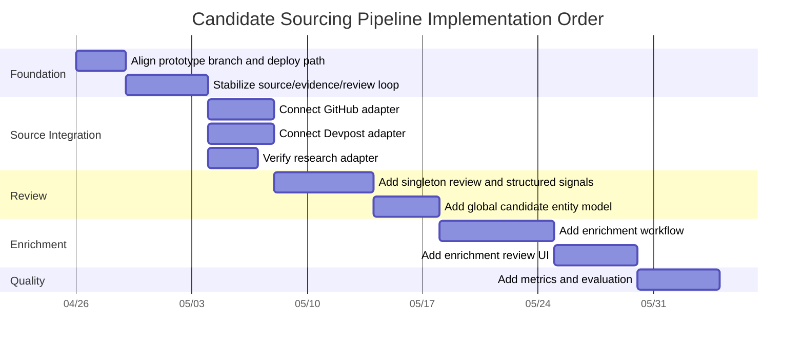

# Candidate Sourcing Pipeline Implementation Plan

## Document Purpose

This document turns the PRD and architecture into an implementation-ready plan.

Companion documents:

- [PRD.md](./PRD.md)
- [ARCHITECTURE.md](./ARCHITECTURE.md)

This plan is intentionally phased. The system touches scraping, Firebase/core-service, human review, enrichment, and future matching readiness. The safest path is to productize the existing sourcing prototype first, then add the missing review and enrichment layers.

## Implementation Strategy

Use a conservative productization path:

1. Stabilize the existing sourcing prototype.
2. Connect GitHub, Devpost, and research to the same source-record contract.
3. Expand review workflow for singleton approval and structured signals.
4. Create the global candidate entity model.
5. Add evidence-grounded enrichment and enrichment review.
6. Add metrics and evaluation loops.
7. Defer Neo4j projection until graph queries justify it.

## Guiding Constraints

- Do not migrate Python scrapers to Cloud Run in v1.
- Do not rebuild the dashboard from scratch.
- Do not use Neo4j as v1 source of truth.
- Do not add social/personal/LinkedIn crawling in v1.
- Do not automatically approve candidates.
- Do not enrich from pending, rejected, or unsure evidence.
- Do not implement full job/company matching in this phase.
- Do not create a separate top-level dedup service.

## Current Execution State

Last updated: 2026-05-01.

- [x] PRD, architecture, and implementation plan documents are drafted.
- [x] Implementation should branch from current `main` so feature work does not break the functional mainline.
- [x] Firebase/Firestore remains the v1 operational source of truth.
- [x] Existing dashboard should be extended rather than rebuilt.
- [x] GitHub, Devpost, and research remain the only v1 source families.
- [x] Enrichment should include industry/domain interests in addition to role/track, specialization, skills, and contactability.
- [x] Local `.env` files are ignored by git and must not be committed.
- [x] Phase 1 stabilized the source-run/source-record/evidence/dedup/review/approved-entity loop.
- [x] Phase 2 unified GitHub, Devpost, and research fixture ingestion through the same source-record upload path.
- [x] Phase 3 expanded review into structured identity/relevance decisions with confirmed signals.
- [x] Phase 4 created the global candidate entity model and verified approved candidate growth across GitHub/Devpost while research remains in the review queue.
- [x] Phase 5 added manual evidence-grounded enrichment generation, controlled taxonomy validation, enrichment review, and profile materialization after human approval.
- [x] Phase 6 added final candidate profiles, profile APIs, a Profiles dashboard tab, profile filters/search, and source/evidence/review/enrichment lineage display.
- [x] Post-Phase 6 hardening repaired tolerant-but-audited enrichment validation for common LLM shape mistakes.
- [x] Merge-before-enrichment guard is implemented, verified locally, committed, and pushed. Enrichment is blocked when an approved candidate overlaps a pending merge review.
- [ ] Phase 3.5 remains paused/read-only until the team confirms the correct Firebase target and access for safe real-DB smoke testing.
- [ ] Real GitHub/Devpost Google Drive exports require source-specific adapter work before they should be uploaded to the sourcing API.
- [x] Current active implementation branch is `codex/phase-6-final-profiles` in both active implementation repos and has been pushed to origin.
- [x] Create implementation branch from `main` when implementation begins.
- [x] Re-check the current state of the sourcing prototype branch before porting or productizing code.
- [x] Verify local backend/dashboard/Firebase setup before changing workflow behavior.
- [x] Confirm available LLM provider/model environment variables from local `.env` without exposing values.
- [x] Validate whether local LLM keys are active before implementing Phase 5 behavior that depends on live model calls.
- [x] Create or collect small GitHub, Devpost, and research sample outputs for repeatable tests.

## Current Waiting State

Last updated: 2026-05-01.

This is the current single source of truth before more real Firebase work:

- Local emulator implementation is working through the full intended v1 flow: GitHub source upload, singleton approval, later Devpost merge, research approval, enrichment generation, enrichment HITL, and final Profiles tab.
- Firebase CLI access to `wekruit-dev-env` is now confirmed for `spencerycwang@gmail.com`.
- `wekruit-dev-env` owns the live sourcing Firebase resources: default Firestore DB, `sourcing-api` Cloud Function, and Hosting sites `wekruit-dev-env` and `wekruit-sourcing`.
- The current live dashboards at `https://wekruit-dev-env.web.app` and `https://wekruit-sourcing.web.app` are older than the local branch. They expose Jobs, Review, and Approved only; they do not expose the new Enrichment or Profiles tabs/endpoints yet.
- The current live dashboard data appears researcher-only. Public read-only API/dashboard checks found OpenAlex, contact enrichment, and Crossref researcher source runs; no GitHub or Devpost source runs were found there.
- Team confirmation from 2026-05-01 says the dev dashboard data can be changed for testing and no one is actively using it. Still, Phase 3.5 should use clearly prefixed tiny fixture runs first.
- No real Firebase data has been mutated by the new local pipeline work. All full workflow verification so far used the local Firebase emulator.
- Phase 3.5 should deploy/update only the sourcing surface:
  - target Firebase project: `wekruit-dev-env`
  - preferred staging dashboard site: `wekruit-sourcing.web.app`
  - function scope: `functions:sourcing-api` only
  - avoid broad deploys that could affect unrelated default-codebase functions
- The Google Drive GitHub/Devpost exports are not DB-ready as-is and should wait until after the tiny-fixture real Firebase smoke test. They need adapter work.
- Awaiting user greenlight before executing Phase 3.5.

## Phase Execution Protocol

Every phase should be executed as a self-contained loop:

1. Plan the exact code path and expected behavior for the phase.
2. Implement only the scope required for that phase.
3. Run automated tests or add focused tests when existing coverage is missing.
4. Verify behavior manually when the dashboard or review workflow is affected.
5. Debug failures before moving to the next phase.
6. Update this document with completed work, remaining blockers, and verification notes.
7. Stop and report status before starting the next phase.

The implementation agent should treat this document as durable working memory. If conversation context is compacted, resume from the latest checked items, progress notes, and blockers recorded here rather than restarting the plan from scratch.

## Setup Clarifications

These clarify the implementation questions that should be resolved before coding:

- Branching: create a new implementation branch from `main` before feature work starts. The branch should contain the pipeline implementation and can be merged back after end-to-end verification.
- Existing sourcing prototype: the preferred path is to reuse/productize the existing Firebase sourcing prototype where it is correct, not to rewrite it blindly. This does not mean Firebase itself is optional; Firebase remains the v1 data/runtime foundation.
- Local Firebase/dev dashboard setup: this means running the backend, dashboard, and Firebase emulators or configured dev Firebase project locally enough to test source ingestion, review actions, queue processing, and profile materialization without relying only on deployed behavior.
- LLM keys: local `.env` may contain provider keys, but implementation should only read expected environment variable names and must never print or commit secret values.
- LLM key validity: local keys should be treated as present-but-unverified until a safe connectivity check confirms the configured provider/model works. A dead key blocks live enrichment testing, but it should not block ingestion, evidence extraction, dedup, merge review, singleton review, or approved candidate materialization.
- Sample data: if real fixture data is missing, create small synthetic-but-realistic fixtures for GitHub, Devpost, and research so each phase can be tested repeatedly.
- Deployed dashboard verification: if allowed during implementation, browser/computer-use can open the deployed or local dashboard to verify the actual review experience visually. This is for UI verification only; source-of-truth behavior should still be tested through code and data checks.

## Environment Check Notes

Safe key connectivity check completed on 2026-04-27. Secret values were not printed, committed, or written to disk.

- `OPENAI_API_KEY`: active/auth accepted.
- `ANTHROPIC_API_KEY`: active/auth accepted.
- `GH_ANTHROPIC_API_KEY`: active/auth accepted against the Anthropic API; rejected as a GitHub token, so treat it as an Anthropic key despite the prefix.
- `GOOGLE_API_KEY`: active/auth accepted against the Gemini model-list endpoint.
- `SILLICON_FLOW_KEY`: rejected/unauthorized against the SiliconFlow model-list endpoint. Do not rely on this key unless it is replaced or revalidated.

Dashboard inspection permission: browser/computer-use may be used to inspect the deployed dashboard during implementation. Prefer local/dev environments for mutating review actions unless the team explicitly confirms deployed dev mutations are safe.

## Phase 0: Alignment And Branch/Productization Decision

### Goal

Confirm the current prototype state and decide how the team wants to bring `origin/codex/sourcing-e2e-firebase` into the active development path.

### Why This Phase Exists

The sourcing prototype exists, but it is not on current `main`. Before implementation begins, the team needs a clear answer to whether it will:

- be merged into `main`
- be rebased into a new implementation branch
- be used as reference and selectively ported

The preferred path is to productize the existing prototype rather than rebuild it.

### Tasks

- [x] Confirm the latest state of `origin/codex/sourcing-e2e-firebase` in `wekruit-scraping`.
- [x] Confirm the latest state of the corresponding sourcing branch in the Firebase/core-service repo.
- [x] Identify whether the deployed dashboard is currently sourced from that branch.
- [x] Decide the working branch strategy for implementation.
- [ ] Confirm Firebase project/environment ownership for staging.
- [ ] Confirm who owns dashboard deployment.
- [ ] Confirm who owns core-service deployment.
- [ ] Confirm reviewer access/auth expectations for v1.

### Phase 0 Findings

Last updated: 2026-04-28.

- Initial working branch was created from current `main` and later renamed for the full effort: `codex/candidate-sourcing-pipeline`. The current active branch has since moved to `codex/phase-6-final-profiles`, recorded in Current Execution State.
- `wekruit-scraping` `origin/codex/sourcing-e2e-firebase` is still present and diverges from current `main`.
- The scraping prototype branch adds a useful source-record contract, deterministic IDs, dry-run upload output, a core-service ingest client, a generic JSON/JSONL/CSV uploader, and focused tests.
- The scraping prototype branch should be selectively ported/productized into the new implementation branch rather than used as the working branch directly, because current `main` contains newer planning docs and secret-safety work.
- `wekruit-core-service-cloud-function` `origin/codex/sourcing-e2e-firebase` is still present and diverges from current `main`.
- The core-service prototype branch adds the sourcing backend, Firestore collection names, task queue names, `/api/sourcing` routes, static dashboard, and Firebase hosting/emulator config.
- The core-service prototype branch should be selectively ported or rebased onto current `main`; do not switch wholesale because current `main` contains newer matching-service code not present in the sourcing branch.
- The deployed dashboard at `https://wekruit-dev-env.web.app/#review` responds with the sourcing review UI and the deployed `/api/sourcing/health` endpoint returns healthy.
- Deployed dashboard data currently appears researcher-only: four source runs, all with `sourceDomain=researcher`; no GitHub or Devpost source runs are present yet.
- Deployed dashboard/API currently has 23 dedup candidates and 3 approved entities.
- The deployed dashboard currently supports Jobs, Review, and Approved views, with review actions mapped to `same_person`, `not_same_person`, and `unsure`.
- The deployed dashboard does not yet implement the desired expanded relevance decisions, structured signal confirmation, GitHub/Devpost review coverage, enrichment workflow, enrichment review, or final enriched profiles.
- Browser automation initially failed because the local `agent-browser` helper command was missing, even though Codex app config already had `sandbox_mode = "danger-full-access"` and both `computer-use` and `browser-use` plugins enabled.
- Browser automation was restored by installing the expected `agent-browser` CLI globally through npm.
- Browser probe passes: `browser_open`, `browser_eval`, `browser_get_url`, and `browser_screenshot` all work against `https://wekruit-dev-env.web.app/#review`.
- Core-service dependencies installed locally with `npm ci`.
- Local Node is `v22.22.1`, while the core-service package declares Node `20`; `npm ci` warns about the engine mismatch.
- Core-service `npm run build` passes on current `main`.
- Core-service `npm test` currently fails 2 of 30 tests due to existing date-sensitive matching recency expectations, not sourcing changes.
- Firebase CLI is available through `npx firebase-tools` at version `15.15.0`.
- Java 21 is installed through Homebrew `openjdk@21`, with `JAVA_HOME`/`PATH` configured in `.zprofile` and `.zshrc`.
- Firestore emulator smoke test passes with `npx firebase-tools emulators:exec --only firestore 'echo firestore-emulator-started'`.
- Full functions/dashboard emulator verification should be run after the sourcing backend/dashboard code is ported onto current `main`.
- The core-service repo has `.firebaserc.example` for staging/production project aliases but no checked-in `.firebaserc`; actual dev/staging project ownership still needs confirmation.
- The scraping repo currently cannot run pytest with the system Python because `pytest` is not installed.

### Phase 0 Decision

Implementation should proceed from a new branch created off current `main`. Reuse the existing sourcing prototype as the main source of implementation material, but port it carefully into the current mainline rather than replacing the mainline with the old prototype branch.

Before mutating deployed review data, prefer local Firebase emulators. Java is now available for Firestore emulator startup; remaining local verification depends on porting the sourcing backend/dashboard code onto current `main`.

### Deliverables

- [x] Written team decision on branch strategy.
- [ ] Confirmed environment/deploy path.
- [ ] Clear owner list for scraping, core-service, dashboard, and review workflow.

### Acceptance Criteria

- [x] Team agrees not to rebuild the sourcing prototype from scratch.
- [x] Team knows which branch/repo contains the source of the existing dashboard/backend.
- [x] Team knows where implementation work will begin.

## Phase 1: Stabilize Existing Sourcing Prototype

### Goal

Make the current source-run/source-record/evidence/dedup/review/approved-entity loop reliable enough to build on.

### Scope

This phase does not add enrichment. It stabilizes the review foundation.

### Tasks

- [x] Verify source-run creation works end-to-end.
- [x] Verify source-record batch upload works end-to-end.
- [x] Verify evidence extraction runs for uploaded records.
- [x] Verify dedup candidate generation runs for evidence matches.
- [x] Verify singleton review candidates are created for person-like records with no duplicates.
- [x] Verify review labels are persisted.
- [x] Verify approved entities are materialized only after human approval.
- [x] Verify negative/unsure review labels suppress repeated review spam.
- [x] Verify the dashboard can load source runs, review candidates, and approved entities.
- [x] Verify evidence links render and open correctly where available.
- [x] Add or update tests around source-record validation and review materialization.
- [x] Add or update seed/sample data for local verification.

### Data Model Checks

- [x] Source records are deterministic/idempotent.
- [x] Evidence records are deterministic/idempotent.
- [x] Dedup candidate IDs are deterministic/idempotent.
- [x] Approved candidate/global entity IDs are opaque and stable.
- [x] Every approval stores reviewer, timestamp, decision, and note.
- [x] Every approved entity has source record lineage.
- [x] Every approved entity has evidence lineage.

### Phase 1 Findings

Last updated: 2026-04-28.

- Initial working branch in `wekruit-core-service-cloud-function`: `codex/candidate-sourcing-pipeline`, created from current `main`. Current active branch is `codex/phase-6-final-profiles`.
- Initial working branch in `wekruit-scraping`: `codex/candidate-sourcing-pipeline`, created from current `main`, continuing to hold the scraping-side source-record upload bridge and durable plan docs. Current active branch is `codex/phase-6-final-profiles`.
- Core-service sourcing backend, static dashboard, sourcing Firestore collection names, sourcing queue names, and sourcing-only Firebase config were selectively ported from the previous sourcing prototype branch onto current `main`.
- Scraping-side source-record contract, deterministic source-record conversion, generic file uploader, researcher upload bridge, and tests were selectively ported from the previous sourcing prototype branch onto current `main`.
- `firebase.sourcing.json` now runs the sourcing-only functions bundle with hosting, functions, and Firestore emulators, avoiding unrelated outbound/matching environment prompts during local sourcing verification.
- Local sourcing stack verified through Firebase emulators:
  - Hosting: `http://127.0.0.1:5100`
  - Functions: `http://127.0.0.1:5101`
  - Firestore: `http://127.0.0.1:8180`
- Source upload verified through the hosting rewrite at `http://127.0.0.1:5100/api/sourcing`.
- Repeatable local smoke fixtures were created outside the repo under `/tmp` for:
  - GitHub: Alex Rivera duplicate candidate plus Mira Patel singleton.
  - Devpost: Vision Assist project plus Alex Rivera member with shared GitHub/homepage evidence.
  - Research/OpenAlex-style generic record: Taylor Chen singleton with ORCID, homepage, DOI, institution, and name evidence.
- End-to-end smoke verification produced:
  - 3 completed source runs.
  - 5 source records.
  - 38 evidence records.
  - 1 strong GitHub/Devpost duplicate candidate for Alex Rivera.
  - 2 singleton candidates for Taylor Chen and Mira Patel, which were initially pending review and later verified with `unsure` and `not_same_person` labels.
  - 1 suppressed stale singleton for Alex Rivera after the duplicate was detected.
  - 1 approved entity after manual `same_person` review of the Alex Rivera GitHub/Devpost duplicate.
- Negative and unsure review verification passed:
  - `not_same_person` persisted for Mira Patel and did not create an approved entity.
  - `unsure` persisted for Taylor Chen and did not create an approved entity.
  - Approved entity count remained `1`, only Alex Rivera.
- Dashboard browser verification passed locally:
  - Review view showed `Jobs 3`, `Review 2`, `Approved 1`.
  - Taylor Chen singleton review showed ORCID, homepage, source ID, institution, name, source URL, and DOI evidence.
  - Approved view showed Alex Rivera as one approved entity with two surviving source records, one email, one GitHub URL, and source/evidence lineage.
- Dashboard screenshot captured at `/tmp/wekruit-phase1-local-dashboard.png`.
- A payload contract issue was found and fixed in the generic uploader: optional empty fields must be omitted, not sent as `null`, because the core-service schema treats them as optional but non-nullable.
- A dedup logic issue was found and fixed in core-service: project records can contain member GitHub/homepage URLs, but person dedup candidates must only include person-like source records. Project records remain source context and are no longer grouped into person review candidates.

### Phase 1 Verification

- `wekruit-core-service-cloud-function`: `npm run build` passes.
- `wekruit-core-service-cloud-function`: `node --test lib/services/sourcing/**/*.test.js` passes, 7 tests.
- `wekruit-scraping`: `/tmp/wekruit-scraping-phase1-venv/bin/python -m pytest researcher/tests/test_generic_sourcing_file_upload.py researcher/tests/test_sourcing_upload_bridge.py` passes, 7 tests.
- `wekruit-scraping`: `/tmp/wekruit-scraping-phase1-venv/bin/python -m pytest researcher/tests` passes, 38 tests.
- Known unrelated baseline remains: full `npm test` in core-service still has the pre-existing date-sensitive matching recency failures from Phase 0; sourcing build and sourcing tests pass.

### Acceptance Criteria

- [x] A two-record exact match can be uploaded, reviewed as same person, and materialized as one approved entity.
- [x] A singleton person-like source record can be uploaded and appears in review.
- [x] A rejected/unsure review decision does not create an approved entity.
- [x] The dashboard displays enough evidence for a reviewer to make a decision.

## Phase 2: Unify GitHub, Devpost, And Research Ingestion

### Goal

Ensure all v1 sources can produce source records, evidence, and relevance signals through the same adapter contract.

### Source Adapter Contract

Each source adapter should emit:

- source run metadata
- source records
- evidence candidates or evidence-ready fields
- relevance signal candidates
- raw payload pointer or raw summary
- content hash

### GitHub Tasks

- [x] Map GitHub candidates to `domain=developer`.
- [x] Map GitHub profiles to person source records.
- [x] Preserve GitHub username and profile URL.
- [x] Preserve public email when available.
- [x] Preserve homepage/blog when available.
- [x] Preserve company/institution field when available.
- [x] Preserve location when available.
- [x] Preserve repository/activity summary fields.
- [x] Emit evidence for GitHub URL/login.
- [x] Emit evidence for public email.
- [x] Emit evidence for homepage.
- [x] Emit relevance signals such as `open_source_contribution` and `technical_project`.
- [x] Create fixture data for a GitHub singleton.
- [x] Create fixture data for a GitHub/Devpost same-person match through shared GitHub URL.

### Devpost Tasks

- [x] Map Devpost projects to `domain=hackathon`.
- [x] Emit project source records.
- [x] Emit person/team member source records.
- [x] Preserve project URL.
- [x] Preserve member Devpost profile URL when available.
- [x] Preserve GitHub/demo links.
- [x] Preserve tech tags.
- [x] Preserve hackathon and prize/winner fields.
- [x] Emit evidence for Devpost URLs.
- [x] Emit evidence for GitHub links.
- [x] Emit relevance signals such as `technical_project`, `founder_or_builder_signal`, and `award_or_recognition`.
- [x] Create fixture data for a Devpost singleton.
- [x] Create fixture data for a Devpost/GitHub same-person match.

### Research Tasks

- [x] Map OpenAlex and generic DOI-based paper outputs to research source records.
- [x] Map author/contact enrichment outputs to person source records.
- [x] Preserve ORCID, OpenAlex author ID, DOI, institution, venue, and publication metadata.
- [x] Preserve DBLP/OpenReview/homepage fields when available through contact enrichment.
- [ ] Add a dedicated real Crossref output fixture if the team depends on Crossref-specific ingestion shape.
- [ ] Preserve Google Scholar profile fields once they are emitted by research enrichment.
- [x] Emit evidence for ORCID.
- [x] Emit evidence for DOI/paper.
- [x] Emit evidence for institution.
- [x] Emit evidence for DBLP/OpenReview/homepage where present.
- [x] Emit relevance signals such as `research_publication` and `education_affiliation`.
- [x] Create fixture data for a research singleton.
- [x] Create fixture data for exact ORCID match across two research records.

### Cross-Source Tasks

- [x] Confirm all three sources can upload through the same ingest path.
- [x] Confirm source records preserve source-specific raw summaries without forcing every field into top-level columns.
- [x] Confirm evidence extraction normalizes shared identifiers consistently.
- [x] Confirm dedup can compare records across domains.
- [x] Confirm dashboard can display source-specific details without breaking generic review UI.

### Acceptance Criteria

- [x] GitHub source run appears in dashboard.
- [x] Devpost source run appears in dashboard.
- [x] Research source run appears in dashboard.
- [x] GitHub, Devpost, and research records can all produce singleton review items.
- [x] At least one cross-source dedup case can be reviewed and approved.
- [x] Each source type provides at least one inspectable evidence link per approvable record.

### Phase 2 Findings

Last updated: 2026-04-28.

- The generic file upload adapter now preserves meaningful source-specific summaries for GitHub, Devpost, and research records while still sending the same source-record contract to core-service.
- GitHub fixture ingestion covers one GitHub/Devpost duplicate candidate and one GitHub singleton. GitHub summaries preserve username/profile URL, public email, homepage/blog, company/institution, location, commit/PR/repo activity, project stars, source repos, score, and suggested relevance signals.
- Devpost fixture ingestion covers one project/team member that matches GitHub and one Devpost singleton. Devpost summaries preserve project URL, member profile URL, GitHub/demo/all links, tech tags, hackathon, prize/winner fields, and suggested relevance signals.
- Research fixture ingestion covers one exact ORCID/homepage match across two research records and one research singleton. Research summaries preserve ORCID, DOI, venue, institution, homepage/source URL, and suggested relevance signals.
- Existing researcher source-record bridge coverage still verifies staged OpenAlex work/author records and contact enrichment records, including OpenReview and DBLP fields.
- Crossref-specific and Google Scholar-specific fixture hardening remains deferred until those exact output shapes are required in v1 ingestion. The current generic research adapter covers normalized DOI/paper fields but should not be treated as proof that every raw Crossref payload shape is production-ready.
- A `suggestedSignals` adapter bug was found and fixed: generated signal lists must be flattened/deduplicated as strings, not accidentally nested as a tuple/list payload.
- A Devpost identity-evidence bug was found and fixed: project context now uses `projectName`/`projectUrl` in member raw payloads so project names do not pollute person-name evidence.

### Phase 2 Verification

- `wekruit-scraping`: `/tmp/wekruit-scraping-phase1-venv/bin/python -m pytest researcher/tests/test_generic_sourcing_file_upload.py researcher/tests/test_sourcing_upload_bridge.py` passes, 8 tests.
- `wekruit-scraping`: `/tmp/wekruit-scraping-phase1-venv/bin/python -m pytest researcher/tests` passes, 39 tests.
- `wekruit-core-service-cloud-function`: `npm run build` passes.
- `wekruit-core-service-cloud-function`: `node --test lib/services/sourcing/**/*.test.js` passes, 7 tests.
- Local sourcing emulator E2E upload through `http://127.0.0.1:5100/api/sourcing` produced 3 completed source runs, 9 source records, 64 evidence records, 4 pending review candidates, 1 approved entity, and 1 stale singleton suppressed after duplicate detection.
- Local dashboard browser verification showed `Jobs 3`, `Review 4`, and `Approved 1` after uploading GitHub, Devpost, and research fixtures.
- Local dashboard browser verification showed Alex Rivera approved as one entity from GitHub and Devpost source records, with email, GitHub URL, homepage/source URLs, source lineage, and evidence lineage visible.
- Local dashboard browser verification showed Nora Kim as a Devpost singleton with person-name evidence correctly showing `nora kim`, not the project name.
- No deployed dashboard data was mutated during Phase 2; manual browser verification was performed against the local emulator dashboard.

### Phase 2 Local Demo

Use this when the team wants to see the Phase 2 progress in the dashboard.

From `wekruit-core-service-cloud-function`, start the local sourcing dashboard/API/emulator stack:

```bash
npm run serve:web:full
```

Then open the local dashboard:

```text
http://127.0.0.1:5100/#review
```

From `wekruit-scraping`, upload the sample fixtures to the local dashboard API:

```bash
/tmp/wekruit-scraping-phase1-venv/bin/python scripts/sourcing_upload_file.py --input researcher/tests/fixtures/sourcing/github_candidates.json --run-id demo-github --domain developer --source github --api-base-url http://127.0.0.1:5100/api/sourcing
```

```bash
/tmp/wekruit-scraping-phase1-venv/bin/python scripts/sourcing_upload_file.py --input researcher/tests/fixtures/sourcing/devpost_projects.json --run-id demo-devpost --domain hackathon --source devpost --api-base-url http://127.0.0.1:5100/api/sourcing
```

```bash
/tmp/wekruit-scraping-phase1-venv/bin/python scripts/sourcing_upload_file.py --input researcher/tests/fixtures/sourcing/research_records.json --run-id demo-research --domain researcher --source openalex --api-base-url http://127.0.0.1:5100/api/sourcing
```

Expected visible result:

- GitHub, Devpost, and research source runs appear in the dashboard.
- Alex Rivera appears as a GitHub/Devpost duplicate candidate through shared GitHub/homepage evidence.
- Nora Kim, Mira Patel, Priya Natarajan, and Taylor Chen appear as singleton or research review cases.
- Evidence includes source-specific links/fields such as GitHub URL, Devpost URL, homepage, ORCID, DOI, institution, and source URL.
- Approving the Alex Rivera merge creates one approved entity with GitHub and Devpost source-record lineage.

## Phase 3: Expand Review Workflow

### Goal

Make human review support both identity merge decisions and candidate relevance decisions.

### Merge Review Tasks

- [x] Preserve existing approve merge / keep separate / hold workflow.
- [x] Store identity label separately from candidate relevance decision.
- [x] Clarify that materialization requires `identityLabel=same_person` and `candidateDecision=approve_candidate`.
- [x] Display source records side by side.
- [x] Display matched evidence.
- [x] Display reason codes and strength.
- [x] Display source-specific evidence links.
- [x] Display suggested relevance signals.
- [x] Allow reviewer to confirm/remove/add relevance signals.
- [x] Store confirmed relevance signals with review label.
- [x] Support rejecting a merged proposal as bad record or not relevant without creating a candidate.
- [x] Store review note.

### Singleton Review Tasks

- [x] Add singleton review queue or filter.
- [x] Display person-like records with no current duplicate proposal.
- [x] Display inspectable evidence links.
- [x] Display source-specific summary fields.
- [x] Display suggested relevance signals.
- [x] Allow reviewer to confirm/remove/add relevance signals.
- [x] Add decisions: `approve_candidate`, `reject_bad_record`, `reject_not_relevant`, `unsure`.
- [x] Store decision, reviewer, timestamp, confirmed signals, suggested signals, and note.
- [x] Ensure rejected/unsure singletons do not create approved candidates.

### Review Data Tasks

- [x] Store suggested relevance signals separately from confirmed relevance signals.
- [x] Ensure review labels have stable lineage to source records/dedup candidates.
- [x] Ensure `reject_bad_record` and `reject_not_relevant` are distinguishable.
- [x] Ensure review actions are auditable.
- [x] Ensure dashboard filters can separate pending, approved, rejected, and held records.

### Dashboard UX Tasks

- [x] Add source filter.
- [x] Add run filter.
- [x] Add status filter.
- [x] Add signal filter.
- [x] Add evidence/strength display.
- [x] Add final candidate profile navigation from approved items.
- [x] Keep existing review note behavior.
- [x] Add structured signal controls without making review too slow.

### Acceptance Criteria

- [x] Reviewer can approve a singleton candidate with confirmed relevance signals.
- [x] Reviewer can reject a singleton as bad record.
- [x] Reviewer can reject a singleton as real but not relevant.
- [x] Reviewer can hold/mark unsure without approving.
- [x] Reviewer can approve a merge only when identity and relevance are both approved.
- [x] Review decisions are persisted with enough structure for metrics.

### Phase 3 Findings

Last updated: 2026-04-28.

- Review labels now store `identityLabel`, `candidateDecision`, `suggestedSignals`, `confirmedSignals`, `sourceRecordIds`, and `evidenceIds`.
- The old `label` field remains accepted as an API alias so the existing review endpoint contract does not break, but new stored records preserve the Phase 3 identity/relevance split.
- Merge candidates only materialize approved entities when `identityLabel=same_person` and `candidateDecision=approve_candidate`.
- Singleton candidates only materialize approved entities when `candidateDecision=approve_candidate`.
- Rejected and held decisions are now distinguishable through candidate statuses: `not_same_person`, `rejected_bad_record`, `rejected_not_relevant`, and `unsure`.
- Approved entities now carry `suggestedSignals` and `confirmedSignals` so later enrichment and matching can use human-confirmed review data.
- Dashboard review controls now support fast v1 actions: approve candidate, keep separate, bad record, not relevant, and hold.
- Dashboard relevance signal controls now allow reviewers to confirm, remove, and add normalized review signals before saving a decision.
- Dashboard filters now include run, status, source, signal, and search.
- Reviewed rows can be inspected through the All statuses filter, but their action buttons are disabled so they cannot be accidentally reviewed again.
- Browser verification caught and fixed two UI bugs:
  - Approved detail originally displayed suggested plus confirmed signals; it now displays confirmed signals when present.
  - Run selection originally auto-jumped away from a run with zero pending items even when viewing All statuses; it now only auto-falls back in the pending queue.

### Phase 3 Verification

- `wekruit-core-service-cloud-function`: `node --check web/app.js` passes.
- `wekruit-core-service-cloud-function`: `npm run build` passes.
- `wekruit-core-service-cloud-function`: `node --test lib/services/sourcing/**/*.test.js` passes, 10 tests.
- Local emulator E2E uploaded GitHub, Devpost, and research fixtures through `http://127.0.0.1:5100/api/sourcing`, producing 3 source runs, 9 source records, 64 evidence records, and 5 review candidates.
- API smoke verification covered:
  - GitHub/Devpost merge approved with `same_person + approve_candidate`, creating one approved entity.
  - GitHub singleton approved with `approve_candidate`, creating one approved entity.
  - Devpost singleton rejected as `reject_bad_record`, creating no approved entity.
  - Research singleton rejected as `reject_not_relevant`, creating no approved entity.
  - Research merge held with `unsure`, creating no approved entity.
- Browser verification against `http://127.0.0.1:5100/#review` covered:
  - Review page loads the new status/source/signal filters.
  - Merge review shows suggested relevance signals as editable checked controls.
  - Reviewer can remove a suggested signal, add `assistive_ai`, write a note, and approve a GitHub/Devpost merge.
  - Approved tab shows the approved Alex Rivera entity with confirmed signals and source-record lineage.
  - Reviewer can reject a singleton as bad record from the dashboard.
  - All statuses view can inspect reviewed rows and keeps action buttons disabled for non-pending records.

## Phase 3.5: Firebase Staging Smoke Test

### Goal

Validate that the completed local sourcing workflow works against a real Firebase environment before shared deployed testing and before Phase 5 enrichment depends on deployed candidate data.

This phase should use a staging/dev Firebase project, not production. The purpose is to prove deployed Firebase Hosting, Firebase Functions, Firestore config, indexes, CORS, rewrites, and dashboard behavior outside the local emulator.

### Why This Phase Exists

Local emulator testing has proven the vertical slice:

- GitHub, Devpost, and research fixture uploads reach the sourcing API.
- Source records produce evidence and review candidates.
- Duplicate and singleton candidates appear in the dashboard.
- Human review actions persist structured identity/relevance decisions.
- Approved candidates materialize only from approved review decisions.
- Approved GitHub/Devpost evidence can grow one active global candidate instead of creating duplicate approved candidates.
- The dashboard supports run/status/source/signal/search filtering and full-row selection.

However, the team has not yet proven that the same workflow is correct in a deployed Firebase project. The latest team clarification says `wekruit-dev-env` can be used for testing, but the first real Firebase run still needs to be narrow and observable:

- `wekruit-core-service-cloud-function` has `.firebaserc.example` with `staging=wekruit-core-service-staging` and `production=wekruit-core-service-production`.
- No checked-in `.firebaserc` was found in the core-service repo during Phase 3.5 planning.
- `firebase.sourcing.json` defines the sourcing-only hosting/functions/firestore config and hosting site `wekruit-sourcing`.
- The previously inspected deployed dashboard at `https://wekruit-dev-env.web.app/#review` exists, but Phase 3.5 should prefer updating the dedicated `wekruit-sourcing` site first.

### Required Team Confirmation

Before running this phase, confirm:

- [x] Which Firebase project is the safe staging/dev target.
- [ ] Whether `wekruit-core-service-staging` exists and is accessible to the implementation owner.
- [x] Whether `wekruit-dev-env` is a disposable dev environment, a shared team environment, or something closer to production.
- [ ] Whether the staging Firestore data can be deleted/reset if a test upload pollutes review data.
- [x] Who owns Firebase Hosting deployment for the sourcing dashboard.
- [x] Who owns Firebase Functions deployment for the sourcing API.
- [ ] Whether staging dashboard access/auth is acceptable for the current v1 review workflow.
- [ ] Whether the staging project has required Firestore indexes/rules deployed or should receive them as part of this smoke test.

Current decisions:

- Use `wekruit-dev-env` for Phase 3.5 real Firebase testing.
- Prefer the dedicated `wekruit-sourcing` Hosting site for the updated sourcing dashboard so the default `wekruit-dev-env.web.app` site is not overwritten unless explicitly needed.
- The teammate confirmed dev dashboard data can be mutated for testing because no one is actively using it.
- The implementation owner now has Firebase project access and Cloud Functions admin was reportedly granted.

Still treat all real Firebase actions as deliberate. Use small prefixed fixture runs first, and do not upload the full Google Drive exports during Phase 3.5.

### Safety Rules

- [ ] Do not point fixture upload scripts at production.
- [ ] Do not run large real scrapes in staging before fixture smoke tests pass.
- [ ] Use clearly prefixed run IDs for every staging test.
- [ ] Keep test data small and reversible.
- [ ] Record exact project ID, deployed URL, run IDs, and cleanup steps in this document.
- [ ] If staging ownership is unclear, stop and ask the team before deploying or uploading.

Recommended run ID prefix:

```text
smoke-YYYY-MM-DD-source
```

Example:

```text
smoke-2026-04-28-github
smoke-2026-04-28-devpost
smoke-2026-04-28-research
```

### Planned Test Path

1. Verify local build/test health before touching real Firebase.
2. Verify deploy permissions with the narrowest safe pre-flight/dry-run available.
3. Confirm or set the `OPENAI_API_KEY` Firebase secret for `wekruit-dev-env` without exposing its value.
4. Deploy only the sourcing API function: `sourcing-api`.
5. Deploy only the sourcing dashboard to `wekruit-sourcing`, not the default `wekruit-dev-env` site unless explicitly needed later.
6. Open the deployed `wekruit-sourcing` dashboard and verify health plus the new Enrichment/Profile endpoints.
7. Upload the small GitHub fixture first.
8. Have the reviewer approve Alex Rivera as a GitHub singleton.
9. Upload the small Devpost fixture second.
10. Have the reviewer resolve the Alex Rivera Devpost/GitHub merge and confirm it updates the existing approved candidate instead of creating a duplicate.
11. Upload the small research fixture third.
12. Have the reviewer approve a research candidate.
13. Generate enrichment from the Approved tab.
14. Review/approve enrichment from the Enrichment tab.
15. Confirm the Profiles tab shows final matching-ready profiles with lineage.
16. Record deployed project, URL, run IDs, and any cleanup steps in this document.
17. Only after fixture smoke passes, plan the real Google Drive export adapter path.

### Expected Fixture Result

- [ ] Three source runs exist: GitHub, Devpost, and research.
- [ ] Nine fixture source records upload successfully.
- [ ] Evidence records are created with source-specific provenance.
- [ ] Alex Rivera can be approved first as a GitHub singleton.
- [ ] Alex Rivera later appears as a GitHub/Devpost duplicate review candidate after Devpost upload.
- [ ] Nora Kim, Mira Patel, Priya Natarajan, and Taylor Chen appear as singleton or research review cases.
- [ ] Approving the later Devpost/GitHub merge updates the existing Alex Rivera approved entity instead of creating a second approved entity.
- [ ] Rejecting bad/not-relevant/held candidates creates no approved entity.
- [ ] Merge-before-enrichment guard blocks enrichment if overlapping pending merge review still exists.
- [ ] Enrichment generation works against deployed Functions and uses the deployed `OPENAI_API_KEY` secret.
- [ ] Enrichment review items appear in the Enrichment tab.
- [ ] Approved enrichment creates final candidate profiles in the Profiles tab.
- [ ] Dashboard filters work on deployed staging data.
- [ ] Firestore documents are queryable by run ID/status/source enough for review/debug workflows.

### Exit Criteria

- [ ] The team has identified the correct staging/dev Firebase project.
- [ ] The staging dashboard loads the Phase 6 UI with Jobs, Review, Approved, Enrichment, and Profiles.
- [ ] The staging sourcing API accepts fixture uploads.
- [ ] The staging review workflow behaves the same as local emulator verification.
- [ ] The staging enrichment workflow behaves the same as local emulator verification.
- [ ] The staging final-profile workflow behaves the same as local emulator verification.
- [ ] The team understands how to clean up staging smoke-test data.
- [ ] Any staging-only deployment/config/index/auth issues are documented before real Google Drive source adapters depend on deployed data.

### Phase 3.5 Current Status

Last updated: 2026-05-01.

- Phase 3.5 remains read-only/paused for real Firebase. No fixture uploads or write mutations have been run against a real Firebase project from the new pipeline.
- Firebase CLI auth works locally as `spencerycwang@gmail.com`.
- `firebase projects:list` now shows both `wekruit-core-service` and `wekruit-dev-env`.
- `wekruit-dev-env` has default Firestore database `projects/wekruit-dev-env/databases/(default)`.
- `wekruit-dev-env` has Hosting sites:
  - `wekruit-dev-env`: `https://wekruit-dev-env.web.app`
  - `wekruit-sourcing`: `https://wekruit-sourcing.web.app`
  - `wekruit-outbound-staging`: currently not the sourcing dashboard target
- `wekruit-dev-env` has deployed Cloud Function `sourcing-api` in `us-central1`, runtime `nodejs20`, codebase `core-service`, entry point `sourcing.api`.
- `wekruit-dev-env` also has many unrelated default-codebase functions, so Phase 3.5 deploys must target only sourcing resources.
- Public read-only checks of both `https://wekruit-dev-env.web.app/api/sourcing/health` and `https://wekruit-sourcing.web.app/api/sourcing/health` returned a healthy sourcing API.
- Public read-only checks of both public sourcing sites returned the same existing researcher source runs: `poc-openalex-ai-2026-04-19-replay`, `real-openalex-ai-2026-04-16-table`, `real-crossref-ai-2024-04-16`, and `real-openalex-ai-2024-04-16`.
- Public read-only checks of the live dashboard/API found 23 dedup candidates and 3 approved entities.
- The live dashboard currently appears researcher-only: source runs and review records are from OpenAlex, contact enrichment, and Crossref/researcher flows. No GitHub or Devpost source runs were found in the live dashboard data.
- The live dashboard is older than the current implementation branch. It supports Jobs, Review, and Approved; `/api/sourcing/enrichment-review-items` and `/api/sourcing/candidate-profiles` returned 404 during read-only checks, so Enrichment and Profiles are not deployed there yet.
- The currently visible live approved entities appear to use an older schema. They do not yet prove that the new fields for `sourceNames`, `sourceDomains`, `reviewLabelIds`, `identityEvidenceHashes`, `confirmedSignals`, `needsEnrichment`, and `enrichmentStatus` are present on older data.
- `firebase.sourcing.json` points to Hosting site `wekruit-sourcing`, which does exist in `wekruit-dev-env`. This makes it the preferred Phase 3.5 dashboard target.
- The current local sourcing function declares Firebase secret `OPENAI_API_KEY` for enrichment. Phase 3.5 must confirm/set this secret before live enrichment generation.
- Current blocker is no longer environment discovery. The blocker is user greenlight to execute the real Firebase pre-flight/deploy/fixture-smoke process.

### Phase 3.5 Data-Flow Clarification

The source exports provided on 2026-05-01 are raw scraper/discovery outputs. They should not be uploaded to Firestore directly.

- Devpost export: `devpost-20260501T061334Z-3-001.zip` contains 53 `.xlsx` files and about 23,653 flat project/member rows. Each row has project fields plus member fields such as `member_devpost`, `member_github`, `member_linkedin`, `member_twitter`, and `member_website`. This is close to ingestion-ready, but the current upload bridge only accepts CSV/JSON/JSONL and the current `--source devpost` adapter expects nested `members`. A flat Devpost XLSX/CSV adapter is required before using this data.
- GitHub export: `github-20260501T061335Z-3-001.zip` contains `github/repos.xlsx` with about 23,290 repository discovery rows. These rows describe repositories (`full_name`, `stars`, `language`, `topics`, `html_url`) and are upstream of candidate extraction. They are not person/candidate rows. The GitHub contributor extraction/scoring output should be generated first, or a deliberate repo-owner/contributor adapter must be designed.
- LinkedIn/social fields: Devpost exports include LinkedIn/Twitter/member website URLs, but current core-service evidence extraction only treats GitHub/homepage/source URLs as first-class URL evidence. LinkedIn/Twitter are preserved in raw summaries if mapped, but they are not yet dedicated identity evidence types.

Recommended Phase 3.5 execution sequence after user greenlight:

1. Run local build/tests one more time in `wekruit-core-service-cloud-function` and the focused uploader tests in `wekruit-scraping`.
2. Run a non-mutating deploy dry-run/pre-flight for `sourcing-api` against Firebase project `wekruit-dev-env`.
3. If the deploy pre-flight shows `OPENAI_API_KEY` is missing, set only that Firebase secret for `wekruit-dev-env` without printing the value.
4. Deploy only `functions:sourcing-api` to `wekruit-dev-env`. Avoid broad deploys because this project has many unrelated default-codebase functions.
5. Deploy the current sourcing dashboard to the dedicated `wekruit-sourcing` Hosting site, preferably via `firebase.sourcing.json`. Use a preview channel first if the CLI flow makes that practical; otherwise deploy the live `wekruit-sourcing` site, not the default `wekruit-dev-env` site.
6. Verify live health and endpoint shape:
   - `/api/sourcing/health`
   - `/api/sourcing/source-runs`
   - `/api/sourcing/dedup-candidates?include=details`
   - `/api/sourcing/approved-entities`
   - `/api/sourcing/enrichment-review-items`
   - `/api/sourcing/candidate-profiles`
7. Upload only tiny fixture data with clear run IDs such as `phase35-github-*`, `phase35-devpost-*`, and `phase35-research-*`. Do not upload full Google Drive exports.
8. Pause and walk through the live dashboard with the user:
   - approve GitHub singleton first
   - upload/resolve Devpost merge second
   - upload/approve research third
   - generate enrichment
   - approve enrichment
   - inspect final Profiles tab
9. Only after the live tiny-fixture smoke passes, plan and build the real adapter path:
   - Devpost flat XLSX/CSV rows to normalized source records
   - GitHub repo discovery to candidate/person output through contributor extraction/scoring
   - optional first-class LinkedIn/Twitter evidence if the team wants those links used for identity or enrichment

Execution ownership:

- The implementation agent can perform steps 1-7 after explicit user greenlight.
- Step 8 should be interactive with the user in the browser so the reviewer workflow is validated by the person who will demo/share it.
- Step 9 is not part of Phase 3.5 execution; it begins only after the live tiny-fixture workflow is accepted.

## Phase 4: Global Candidate Entity Model

### Goal

Create a clean global identity layer where one real-world person becomes one global candidate entity across all source domains.

### Tasks

- [x] Define global candidate/approved entity schema.
- [x] Use opaque stable candidate IDs.
- [x] Attach approved source records to candidate ID.
- [x] Attach evidence IDs to candidate ID through lineage.
- [x] Attach identity/relevance review labels to candidate ID.
- [x] Store source domains present on candidate.
- [x] Store candidate status.
- [x] Add status support for future `merged` or `merged_into` states.
- [x] Ensure new approved source evidence can attach to an existing candidate.
- [x] Ensure candidate entity can be re-enrichment eligible when new evidence arrives.

### Candidate Statuses

Recommended statuses:

- `active`
- `held`
- `merged`
- `archived`

### Future Merge Readiness

Post-approval merge can be Phase 2/P1, but the schema should support:

- [x] `mergedIntoCandidateId`
- [x] `mergedByReviewId`
- [x] `mergedAt`
- [x] surviving candidate lineage
- [ ] old candidate redirect behavior in dashboard

### Acceptance Criteria

- [x] Approving a singleton creates one global candidate entity.
- [x] Approving a merge creates or updates one global candidate entity.
- [x] Candidate entity stores source domains and source record IDs.
- [x] Candidate entity stores review lineage.
- [x] Candidate entity can later accept additional approved source records.

### Phase 4 Findings

Last updated: 2026-04-29.

- The existing `sourcing-approved-entities` collection now acts as the v1 global candidate collection, avoiding a second candidate store while preserving dashboard/API compatibility.
- New global candidate records use opaque IDs prefixed with `cand_`.
- New global candidate records use `status=active`; legacy `status=approved` remains readable for compatibility.
- Global candidate records now store `schemaVersion`, `sourceNames`, `sourceDomains`, `reviewLabelIds`, `identityEvidenceHashes`, `needsEnrichment`, `enrichmentStatus`, and future merge fields.
- Candidate materialization now resolves an existing active candidate by overlapping approved source record IDs or strong identity evidence hashes before creating a new candidate.
- Strong identity evidence hashes are built from high-confidence identity evidence such as email, ORCID, homepage, GitHub, DBLP, OpenReview, Google Scholar, source URL, and source-native ID. Name/institution alone is not used to resolve a global candidate.
- If multiple active global candidates match the same approved evidence, materialization fails before marking the review candidate approved. This avoids silently merging post-approval candidates before a dedicated merge-review workflow exists.
- Approved dashboard rows now show global candidate status, sources, review count, confirmed signals, updated time, enrichment state, review lineage, source-record lineage, and identity evidence hashes.
- Post-approval redirect behavior for old merged candidates remains future work because Phase 4 added merge-readiness fields but did not implement the full post-approval merge workflow.

### Phase 4 Verification

- `wekruit-core-service-cloud-function`: `node --check web/app.js` passes.
- `wekruit-core-service-cloud-function`: `npm run build` passes.
- `wekruit-core-service-cloud-function`: `node --test lib/services/sourcing/**/*.test.js` passes, 11 tests.
- Local emulator E2E used GitHub, Devpost, and research fixtures through `http://127.0.0.1:5100/api/sourcing`.
- Local API smoke approved Alex Rivera as a GitHub singleton first, creating one active global candidate.
- Local API smoke then uploaded Devpost and approved the GitHub/Devpost merge. The approved candidate count stayed at 1, the candidate ID stayed the same, and the candidate accumulated GitHub plus Devpost source records, source names, source domains, review labels, confirmed signals, and identity evidence hashes.
- Local API smoke uploaded research fixtures afterward and confirmed the research queue still appears alongside the existing approved global candidate.
- Browser verification against `http://127.0.0.1:5100/#approved` confirmed the Approved tab shows Alex Rivera as one active global candidate with `devpost + github`, 2 review decisions, confirmed signals, source lineage, review lineage, identity evidence hashes, and `needsEnrichment=yes`.
- Browser verification against `http://127.0.0.1:5100/#review` confirmed the pending review queue still loads for the research run after Phase 4 changes.

## Phase 5: Enrichment Workflow

### Goal

Turn approved candidate evidence into structured, matching-ready profile fields through a multi-step, evidence-grounded workflow.

### Phase Boundary

Phase 5 owns enrichment generation, validation, enrichment HITL, and persistence of the reviewed enriched profile data. Phase 6 owns the fuller final-candidate product surface: polished profile view, search/filtering, lineage browsing, and matching-system readiness UX.

In v1, enrichment is manually triggered from the Approved detail panel with a `Generate enrichment` action. Approved candidates should still be marked as needing enrichment automatically, but the LLM call should not run silently until the team intentionally adds queue-backed automation later.

### Workflow Tasks

- [x] Build evidence pack generator.
- [x] Include only approved source records and approved evidence.
- [x] Include confirmed relevance signals.
- [x] Include source-specific facts from GitHub.
- [x] Include source-specific facts from Devpost.
- [x] Include source-specific facts from research records.
- [x] Exclude pending/rejected/unsure records.
- [x] Add deterministic feature extraction before LLM call.
- [x] Add LLM classifier/inference step.
- [x] Add deterministic schema/taxonomy/evidence validation.
- [ ] Add optional skeptical LLM verifier for risky inference.
- [x] Add manual `Generate enrichment` action from the Approved detail panel.
- [x] Create enrichment review item after generation.
- [x] Persist reviewed enriched profile data only after human enrichment review.
- [x] Block enrichment when the approved candidate still has overlapping pending merge review candidates.

### Controlled Taxonomy Tasks

- [x] Define v1 track list.
- [x] Define v1 specialization list.
- [x] Define v1 skill/domain normalization strategy.
- [x] Define v1 industry/domain interest taxonomy.
- [x] Define career stage values.
- [x] Define contactability values.
- [x] Enforce controlled taxonomy first.
- [x] Separate proposed open-ended tags from controlled fields.
- [x] Store proposed tags for human review.
- [ ] Allow approved proposed tags to be analyzed for future taxonomy promotion.
- [x] Keep industry/domain interests separate from skills. Example: `python` is a skill, while `healthcare_ai` is an industry/domain interest.

### Draft V1 Tracks

- [x] `software_engineering`
- [x] `ai_research`
- [x] `data_science`
- [x] `product_design`
- [x] `product_management`
- [x] `marketing_growth`
- [x] `business_founder`
- [x] `hardware_mechanical`
- [x] `academic_research`
- [x] `unknown_other`

### Current V1 Taxonomy Snapshot

Last updated from `wekruit-core-service-cloud-function/src/services/sourcing/domain/records.ts` on 2026-05-01.

These values are intentionally small and controlled for v1. The LLM must choose from these values before proposing open-ended tags, and reviewers can edit the selected values during enrichment review.

Tracks:

- `software_engineering`
- `ai_research`
- `data_science`
- `product_design`
- `product_management`
- `marketing_growth`
- `business_founder`
- `hardware_mechanical`
- `academic_research`
- `unknown_other`

Specializations:

- `frontend_engineering`
- `backend_engineering`
- `full_stack_engineering`
- `mobile_engineering`
- `machine_learning`
- `natural_language_processing`
- `computer_vision`
- `data_engineering`
- `data_analysis`
- `academic_publishing`
- `developer_experience`
- `product_strategy`
- `growth_marketing`
- `mechanical_design`
- `embedded_systems`
- `robotics`
- `ux_ui_design`
- `unknown_other`

Industry/domain interests:

- `artificial_intelligence`
- `ai_infrastructure`
- `developer_tools`
- `healthcare_ai`
- `robotics`
- `education_technology`
- `climate_energy`
- `finance_fintech`
- `biotech_life_sciences`
- `enterprise_saas`
- `cybersecurity`
- `gaming_media`
- `accessibility_assistive_technology`
- `research_tools`
- `open_source`
- `unknown_other`

Career stages:

- `student`
- `early_career`
- `mid_career`
- `senior`
- `founder`
- `academic_researcher`
- `unknown`

Contactability:

- `high`
- `medium`
- `low`
- `unknown`

Current source/review relevance signal examples:

- `open_source_contribution`
- `technical_project`
- `hackathon_participation`
- `award_or_recognition`
- `founder_or_builder_signal`
- `research_publication`
- `education_affiliation`

Relevance signals are normalized string tokens rather than a fully closed taxonomy. The reviewer confirms/edit/removes them during identity/relevance review, and the enrichment flow treats confirmed signals as approved evidence context.

### Enrichment Output Tasks

- [x] Generate primary track.
- [x] Generate scored tracks.
- [x] Generate specializations.
- [x] Generate skills.
- [x] Generate industry/domain interests.
- [x] Generate career stage.
- [x] Generate contactability.
- [x] Generate matching summary.
- [x] Generate field-to-evidence map.
- [x] Generate proposed open-ended tags when needed.
- [x] Store system confidence separately from human confirmation.

### Enrichment Review Tasks

- [x] Add enrichment review queue/dashboard view.
- [x] Show evidence pack summary.
- [x] Show suggested primary track.
- [x] Show suggested industry/domain interests.
- [x] Allow reviewer to change primary track.
- [x] Allow reviewer to add/remove tracks.
- [x] Allow reviewer to add/remove specializations.
- [x] Allow reviewer to add/remove skills.
- [x] Allow reviewer to add/remove industry/domain interests.
- [x] Allow reviewer to approve/reject proposed open-ended tags.
- [x] Show verifier warnings.
- [x] Store reviewer edits as structured enrichment review.
- [x] Store review note.
- [x] Materialize final candidate profile after approval/edit.

### Re-Enrichment Tasks

- [x] Detect new approved evidence attached to existing candidate.
- [ ] Compare enrichment-relevant fields before and after re-enrichment.
- [ ] Define important field changes.
- [ ] Create enrichment review only when important fields change.
- [ ] Silently update lineage/evidence when no important fields change.
- [ ] Preserve enrichment version history.

### Acceptance Criteria

- [x] First-time approved candidate becomes eligible for manual enrichment generation.
- [x] Manual enrichment generation creates an enrichment review item.
- [x] Enrichment uses only approved evidence.
- [x] Enrichment cannot be generated while a pending merge review overlaps the approved candidate by source record or identity evidence.
- [x] LLM must choose controlled taxonomy values before open-ended tags.
- [x] Every inferred label has evidence IDs.
- [x] Invalid taxonomy values fail validation.
- [x] Reviewer can edit main labels without editing confidence scores.
- [x] Reviewer can correct industry/domain interests separately from skills.
- [x] Reviewed enriched profile data is persisted only after enrichment review.
- [ ] Re-enrichment review is created only for important profile changes.

### Phase 5 Findings

Last updated: 2026-04-29.

- OpenAI connectivity check passed locally with `OPENAI_API_KEY` and `gpt-4o-mini`.
- Core-service now stores enrichment runs, enrichment review items, and reviewed candidate profiles.
- Enrichment generation is manual from the Approved detail panel; no queue-backed automatic LLM call is used in v1.
- The LLM output schema is constrained by the controlled taxonomy and by the approved candidate's exact evidence IDs.
- Field-to-evidence maps are derived deterministically from each label's evidence IDs before validation, rather than trusting the LLM to assemble that map.
- Local API smoke uploaded GitHub, Devpost, and research fixtures, approved Alex Rivera, generated a live OpenAI enrichment draft, approved the enrichment review, and confirmed the approved entity moved to `enriched`.
- Browser verification against `http://127.0.0.1:5100/#enrichment` showed the new Enrichment tab, the reviewed Alex Rivera enrichment item, suggested labels, editable enrichment form, and approved/enriched status.
- Remaining Phase 5-adjacent hardening: optional skeptical verifier, proposed-tag taxonomy promotion analytics, and important-change-only re-enrichment gating.

### Merge-Before-Enrichment Guard

Added after Phase 6 demo feedback. Implemented and locally verified on 2026-05-01.

Purpose: the approved candidate profile should not be enriched while identity review is still unstable. If a reviewer has approved a GitHub singleton first and a later Devpost/research/GitHub evidence bundle creates a pending merge candidate for the same person, the system should require the reviewer to resolve that merge before generating or regenerating enrichment.

Required behavior:

- Backend must be the source of truth. `Generate enrichment` must refuse to run if the approved entity overlaps a pending multi-record dedup candidate by approved source record ID or strong identity evidence hash.
- UI should surface the block in the Approved detail panel with a visible pending-merge signal.
- UI should disable the `Generate enrichment` button while blocked.
- Once the pending merge review is approved, kept separate, rejected, or otherwise resolved, enrichment can be generated again.
- The guard should not block enrichment for unrelated pending review items.
- The guard should not replace human identity review; it only enforces ordering so enrichment uses the most complete approved identity/evidence set.

Implementation summary:

- Approved entities now include computed pending-merge blocker metadata: blocker count, blocker IDs, and blocker summaries.
- The enrichment generation endpoint rejects blocked requests before building the enrichment evidence pack or calling the LLM.
- Blocked requests return HTTP 409 with code `PENDING_MERGE_REVIEW` and the overlapping pending merge candidates.
- The Approved detail panel shows a `pending merge` pill, a short explanation, the blocking candidate names, and a disabled `Generate enrichment` button.

Local verification:

- Loaded GitHub first, approved Alex Rivera as a singleton candidate, then loaded Devpost second.
- The later Devpost/GitHub duplicate created a pending merge review for the same Alex Rivera candidate.
- The Approved detail panel showed `1 pending merge` and disabled enrichment generation for Alex.
- Direct API call to generate enrichment returned HTTP 409 with `PENDING_MERGE_REVIEW`, proving the backend is the source of truth.
- Focused sourcing test suite passed after adding guard coverage.

## Phase 6: Final Candidate Profile And Dashboard

### Goal

Expose clean, reviewed candidate profiles with lineage and matching-ready fields.

### Profile Data Tasks

- [x] Define final candidate profile schema.
- [x] Store clean fields only.
- [x] Store lineage pointers to source records.
- [x] Store lineage pointers to evidence records.
- [x] Store lineage pointers to identity/relevance reviews.
- [x] Store lineage pointers to enrichment run/review.
- [x] Store current profile status.
- [x] Store source domains.
- [x] Store reviewed industry/domain interests.
- [x] Store contactability fields.
- [x] Store matching summary.
- [x] Avoid duplicating large raw payloads.

### Dashboard Tasks

- [x] Add final candidate profile view.
- [x] Show clean profile fields.
- [x] Show source domains.
- [x] Show evidence links.
- [x] Show confirmed tracks, specializations, skills, and industry/domain interests.
- [x] Show contactability.
- [x] Show review history.
- [x] Show enrichment version.
- [x] Show lineage references.
- [x] Add filters/search for approved profiles.

### Acceptance Criteria

- [x] Reviewer can inspect a final candidate profile after enrichment approval.
- [x] Profile displays clean fields and evidence links.
- [x] Profile lineage is traceable back to original source records.
- [x] Profile can be used later by a matching system without reading raw source payloads.

### Phase 6 Findings

Last updated: 2026-04-29.

- Core-service now exposes read APIs for final candidate profiles:
  - `GET /api/sourcing/candidate-profiles`
  - `GET /api/sourcing/candidate-profiles/:profileId`
- The profile list supports matching-oriented filters for track, industry/domain interest, source, contactability, and search text.
- The profile detail API returns the clean `candidate-profile-v1` document plus resolved evidence, source summaries, identity/relevance review summaries, enrichment review summary, and lineage IDs.
- Source records in the profile detail response are intentionally summarized and do not include large raw scraped payloads.
- The dashboard now has a dedicated `Profiles` tab for final matching-ready profiles, separate from the operational `Approved` entity view and the `Enrichment` review queue.
- The Profiles tab shows clean summary, primary track, scored tracks, specializations, skills, industry/domain interests, contactability, career stage, evidence by field, source lineage, review lineage, and lineage IDs.
- Local browser verification confirmed the Profiles tab renders Alex Rivera, profile search and filters work, evidence/source/review lineage sections appear, and no browser console errors were reported.
- Local API verification confirmed profile detail source summaries omit raw payloads while preserving source/evidence/review/enrichment lineage.
- Full real Firebase E2E remains blocked on Phase 3.5 permissions/staging decisions; Phase 6 was verified against the local Firebase emulator.
- Post-Phase 6 hardening made enrichment validation tolerant of repairable LLM shape mistakes while keeping the important evidence rules strict:
  - optional skills, specializations, domains, scored tracks, and proposed tags without approved evidence are dropped with validation warnings
  - career stage/contactability suggestions without evidence are downgraded to `unknown`
  - when the model selects a valid primary track but omits the matching `scoredTracks` entry, the service adds the primary track entry with approved evidence and records a validation warning
- Local live OpenAI verification after that hardening generated a pending enrichment review for Priya Natarajan, repaired the missing `academic_research` scored-track entry, surfaced the warning in the Enrichment tab, and preserved the local row-click behavior in both Approved and Enrichment views.

### Local Walkthrough Example For Team Demo

Last verified: 2026-04-29 against the local Firebase emulator.

This is the concrete end-to-end walkthrough that demonstrates the intended v1 pipeline behavior without touching real Firebase data.

1. Start the local full web emulator from `wekruit-core-service-cloud-function`:

```bash
npm run serve:web:full
```

Then open:

```text
http://127.0.0.1:5100/#review
```

2. Upload GitHub first from `wekruit-scraping`:

```bash
/tmp/wekruit-scraping-phase1-venv/bin/python scripts/sourcing_upload_file.py --input researcher/tests/fixtures/sourcing/github_candidates.json --run-id walkthrough-github-001 --domain developer --source github --api-base-url http://127.0.0.1:5100/api/sourcing
```

Expected dashboard state:

- Jobs: `1`
- Review: `2`
- Approved: `0`
- Enrichment: `0`
- Profiles: `0`
- Review queue shows Alex Rivera and Mira Patel as GitHub singleton review candidates.

Reviewer action: approve Alex Rivera. This creates one approved global candidate from GitHub only.

3. Upload Devpost second:

```bash
/tmp/wekruit-scraping-phase1-venv/bin/python scripts/sourcing_upload_file.py --input researcher/tests/fixtures/sourcing/devpost_projects.json --run-id walkthrough-devpost-001 --domain hackathon --source devpost --api-base-url http://127.0.0.1:5100/api/sourcing
```

Expected dashboard state:

- Jobs: `2`
- Review: `3`
- Approved: `1`
- Enrichment: `0`
- Profiles: `0`
- Devpost run shows Nora Kim as a Devpost singleton.
- Devpost run shows Alex Rivera as a strong `Devpost + Github` review candidate because the new Devpost evidence matches the already approved GitHub identity.

Reviewer action: approve the Alex Rivera Devpost/GitHub merge. This should not create a duplicate global candidate. It updates the existing Alex candidate to `devpost + github`, with 2 source records and 2 review decisions.

4. Upload research/OpenAlex third:

```bash
/tmp/wekruit-scraping-phase1-venv/bin/python scripts/sourcing_upload_file.py --input researcher/tests/fixtures/sourcing/research_records.json --run-id walkthrough-research-001 --domain researcher --source openalex --api-base-url http://127.0.0.1:5100/api/sourcing
```

Expected dashboard state:

- Jobs: `3`
- Review: `4`
- Approved: `1`
- Enrichment: `0`
- Profiles: `0`
- Research run shows Taylor Chen as a strong grouped research candidate.
- Research run shows Priya Natarajan as a research singleton/manual review case.

Reviewer action: approve Taylor Chen. The button may use merge wording because Taylor is represented by two research records (`openalex:A1` and `contact:A1`) that share ORCID/homepage/name/institution evidence. This is expected: "merge" means multiple records are being grouped into one global candidate, not only cross-source merging.

Expected approved state after this step:

- Approved: `2`
- Alex Rivera: `devpost + github`, 2 source records, 2 review decisions, `needsEnrichment=yes`
- Taylor Chen: `openalex`, 2 source records, 1 review decision, `needsEnrichment=yes`

5. Generate enrichment from the Approved tab for Taylor Chen and Alex Rivera.

Expected enrichment behavior:

- Enrichment generation uses `gpt-4o-mini` with the local `OPENAI_API_KEY`.
- Each generated draft must use controlled taxonomy values and approved evidence IDs.
- If the LLM makes repairable shape mistakes, such as omitting the primary track from `scoredTracks`, the service repairs the draft and surfaces validation warnings for human review.
- Taylor's draft should be academic/research oriented.
- Alex's draft should be software/building oriented.

6. Approve the enrichment review items from the Enrichment tab.

Expected final state:

- Approved: `2`
- Enrichment: `2`
- Profiles: `2`
- Alex Rivera approved entity is `enriched`, `needsEnrichment=false`, and has a final profile with primary track `software_engineering`.
- Taylor Chen approved entity is `enriched`, `needsEnrichment=false`, and has a final profile with primary track `academic_research`.
- Profiles tab shows both final matching-ready profiles with clean fields, source/evidence/review/enrichment lineage, and no raw payload dependency.

Final local API verification from this walkthrough:

- Approved entities:
  - Taylor Chen: `openalex`, 2 source records, 1 review decision, `enriched`, `needsEnrichment=false`
  - Alex Rivera: `devpost+github`, 2 source records, 2 review decisions, `enriched`, `needsEnrichment=false`
- Enrichment review items:
  - Taylor Chen: `approved`, primary track `academic_research`
  - Alex Rivera: `approved`, primary track `software_engineering`
- Final profiles:
  - Taylor Chen: `academic_research`, source `openalex`
  - Alex Rivera: `software_engineering`, sources `devpost+github`

## Phase 7: Metrics And Evaluation

### Goal

Turn review decisions into quality feedback for the pipeline.

### Identity Metrics Tasks

- [ ] Track merge approval rate.
- [ ] Track merge rejection rate.
- [ ] Track singleton approval rate by source.
- [ ] Track `reject_bad_record` rate by source.
- [ ] Track `reject_not_relevant` rate by source.
- [ ] Track unsure/hold rate.
- [ ] Track duplicate rate after approval.
- [ ] Track review time per candidate if feasible.

### Enrichment Metrics Tasks

- [ ] Track enrichment approval rate.
- [ ] Track primary track edit rate.
- [ ] Track track/specialization edit rate.
- [ ] Track skill/domain edit rate.
- [ ] Track proposed open tag approval rate.
- [ ] Track verifier warning rate.
- [ ] Track unsupported label rejection count.
- [ ] Track re-enrichment review rate.

### Evidence Metrics Tasks

- [ ] Track percent of review items with clickable evidence.
- [ ] Track evidence type coverage by source.
- [ ] Track profiles with strong evidence.
- [ ] Track profiles with only weak evidence.
- [ ] Track source-specific evidence gaps.

### Dashboard/Reporting Tasks

- [ ] Add lightweight metrics view or export.
- [ ] Add source/run breakdown.
- [ ] Add review outcome breakdown.
- [ ] Add enrichment edit breakdown.
- [ ] Use metrics to tune relevance signal rules.
- [ ] Use metrics to tune enrichment prompts/classifier.

### Acceptance Criteria

- [ ] Team can answer which sources produce the best approved candidates.
- [ ] Team can answer which source adapters produce the most bad records.
- [ ] Team can answer which enrichment fields are most often corrected.
- [ ] Team can use review decisions to improve system behavior.

## Phase 8: Optional Future Graph Projection

### Goal

Prepare for Neo4j only if future matching requires graph traversal.

### Not V1

Neo4j should not block v1.

### Future Triggers

Consider Neo4j when the team needs queries like:

- candidates with skills connected to specific company domains
- candidates who built projects using technologies a company needs
- researchers publishing on topics related to a company research area
- candidate collaborator/project networks
- multi-hop candidate-to-opportunity explanations

### Future Tasks

- [ ] Define graph projection schema.
- [ ] Define projection job from Firestore candidate profiles.
- [ ] Define sync/update behavior.
- [ ] Define graph query use cases.
- [ ] Define whether graph results feed matching, dashboard explanations, or analytics.

## Cross-Phase Data Invariants

These rules should hold through every phase:

- [ ] Source records are observations, not candidates.
- [ ] Evidence records have provenance.
- [ ] Candidate approval requires human review.
- [ ] No candidate approval without inspectable evidence.
- [ ] Merge approval includes relevance approval.
- [ ] Singleton approval includes relevance approval.
- [ ] Final enrichment uses approved evidence only.
- [ ] First-time enrichment requires human review.
- [ ] Re-enrichment review is required only for important field changes.
- [ ] One real-world person maps to one global candidate entity.
- [ ] Final candidate profiles store clean fields and lineage.
- [ ] Python scrapers do not write directly to Firestore.
- [ ] Firebase/Firestore remains v1 operational source of truth.

## Suggested Implementation Order



Dates above are placeholders. The sequencing matters more than the exact dates.

## Risk Register

| Risk | Impact | Mitigation |
| --- | --- | --- |
| Prototype branch diverges from current main | Integration slows down | Start with branch/productization decision |
| Dashboard assumes only researcher fields | GitHub/Devpost review may feel broken | Add source-specific display mapping |
| Dedup false positives | Wrong merges | Keep human approval required and show evidence |
| Dedup false negatives | Duplicate approved candidates | Track duplicate-after-approval metric and support future post-approval merge |
| LLM enrichment over-labels candidates | Bad matching data later | Controlled taxonomy first, evidence IDs required, verifier for risky fields, human review |
| Review UI becomes too slow | Reviewer fatigue | Preselect signals, keep structured controls simple |
| Source adapters produce inconsistent raw summaries | Hard to review/debug | Enforce adapter contract and fixtures |
| Neo4j debate slows v1 | Scope creep | Keep Firestore source of truth and document Neo4j as future projection |
| Scraper deployment concerns distract from pipeline | Scope creep | Keep Python scrapers local/manual for v1 |

## Launch Readiness Checklist

- [ ] All three v1 sources can upload into the shared pipeline.
- [ ] Dashboard shows source runs for GitHub, Devpost, and research.
- [ ] Dashboard shows merge review items.
- [ ] Dashboard shows singleton review items.
- [ ] Reviewers can approve/reject/hold with notes.
- [ ] Reviewers can confirm structured relevance signals.
- [ ] Approved candidates become global candidate entities.
- [ ] Enrichment runs only after candidate approval.
- [ ] Enrichment output is validated against controlled taxonomy.
- [ ] Enrichment review UI supports editing labels.
- [ ] Final candidate profiles are materialized.
- [ ] Final profiles include lineage pointers.
- [ ] Metrics exist for review outcomes and enrichment edits.
- [ ] Non-goals remain out of scope.

## Definition Of Done For V1

V1 is done when a reviewer can take real source outputs through this complete path:

```mermaid
flowchart LR
  Source["GitHub / Devpost / Research output"]
  Ingest["Source record ingest"]
  Evidence["Evidence and relevance signals"]
  Review["Merge or singleton HITL"]
  Candidate["Global approved candidate"]
  Enrich["Evidence-grounded enrichment"]
  EnrichReview["Enrichment HITL"]
  Profile["Final candidate profile"]

  Source --> Ingest
  Ingest --> Evidence
  Evidence --> Review
  Review --> Candidate
  Candidate --> Enrich
  Enrich --> EnrichReview
  EnrichReview --> Profile
```



And the final profile:

- has one global candidate ID
- uses only approved evidence
- contains reviewed matching-ready fields
- preserves lineage to source records and review decisions
- can be shared with future matching work without revisiting raw source payloads
