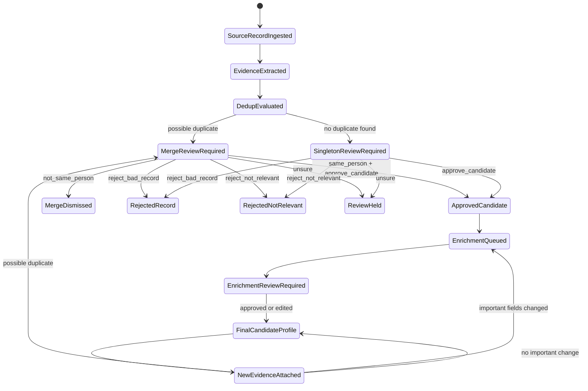

# WeKruit Candidate Sourcing Pipeline PRD

## Document Purpose

This document defines the product requirements for turning the existing WeKruit scraping pipelines and sourcing review prototype into a unified candidate sourcing pipeline.

The goal is to align product, engineering, and data decisions before implementation. This PRD focuses on what the system must do, why it matters, and which decisions have already been made. The companion documents cover implementation sequencing and architecture:

- [ARCHITECTURE.md](./ARCHITECTURE.md)
- [IMPLEMENTATION_PLAN.md](./IMPLEMENTATION_PLAN.md)

## Executive Summary

WeKruit needs a source-backed candidate intelligence pipeline that can ingest people-like records from GitHub, Devpost, and research sources, resolve duplicates across those sources, let humans approve candidate identity and relevance, enrich approved candidates with structured profile attributes, and store clean final candidate profiles for future candidate-to-opportunity matching.

The current system already has meaningful pieces:

- `wekruit-scraping` contains GitHub, Devpost, and researcher scraping pipelines.
- A Firebase-hosted sourcing review dashboard exists and supports source runs, review candidates, review notes, merge decisions, and approved entities.
- The sourcing dashboard and backend prototype are on `origin/codex/sourcing-e2e-firebase`, not on current `main`.
- Current dashboard data appears mostly researcher-oriented, especially OpenAlex/contact enrichment records. GitHub and Devpost need to be connected into the same review pipeline.

The v1 product should not rebuild the system from scratch. It should productize and extend the existing sourcing prototype, preserve the Python scrapers, use the existing Firebase/core-service stack as the v1 operational source of truth, and add the missing candidate review and enrichment workflows.

## Vision

The target experience is:

1. Source pipelines discover candidate observations from GitHub, Devpost, and research sources.
2. Each observation becomes a normalized source record with evidence links.
3. The system proposes possible duplicate groups across all sources.
4. Human reviewers approve whether records are the same person, separate people, invalid records, or real-but-not-relevant candidates.
5. Approved records create or update one global candidate entity per real-world person.
6. The system enriches approved candidates using only human-approved evidence.
7. Human reviewers approve or edit enrichment labels before the final profile is considered ready.
8. The final candidate profile is clean, structured, source-backed, and ready for future matching to jobs and companies.

## Current State Findings

### Existing Scraping Sources

`wekruit-scraping` already contains three important source families:

| Source family | Current role | Candidate value |
| --- | --- | --- |
| GitHub | Discovers repositories and contributors, enriches profiles, scores developer activity | Developer identity, public profile, repositories, languages, contribution signals, public email when available |
| Devpost | Scrapes hackathons, projects, team members, project links, tech tags, prizes | Builder/project evidence, team membership, GitHub/demo links, hackathon outcomes |
| Research | Discovers papers/authors from scholarly sources, enriches contacts and affiliations | Research identity, publications, ORCID/DBLP/OpenReview/OpenAlex evidence, affiliation and venue context |

These sources are the v1 scope.

### Existing Sourcing Prototype

The `origin/codex/sourcing-e2e-firebase` branch contains a prototype that already models a large part of the desired workflow:

- source runs
- source records
- evidence records
- dedup candidates
- review labels
- approved entities
- Firebase-hosted review dashboard
- Python upload bridge for researcher, GitHub, Devpost, and manual files

The product plan should use this as the starting point. The first implementation phase should reconcile and productize this branch, not rewrite the system.

### Existing Dashboard

The deployed review dashboard currently supports:

- source run inspection
- pending review queue
- matched evidence display
- review notes
- actions such as approve merge, keep separate, and hold
- approved entity inspection

The dashboard should be extended, not rebuilt.

Missing v1 dashboard capabilities:

- singleton candidate relevance review
- structured approval signal confirmation
- richer evidence links per source type
- enrichment review queue
- final candidate profile view
- filters for source, status, signal, confidence, and run

## Goals

### Product Goals

1. Create one global candidate entity per real-world person.
2. Prevent duplicate candidates across GitHub, Devpost, and research sources.
3. Require human review before any discovered record becomes an approved candidate.
4. Require inspectable evidence before approval.
5. Enrich only human-approved candidate evidence.
6. Require human review for first-time enrichment.
7. Re-run enrichment when new approved evidence materially changes matching-relevant fields.
8. Preserve full lineage from final candidate profile back to source records, evidence, review decisions, and enrichment versions.
9. Keep v1 implementation practical by reusing the existing Firebase/core-service and Python scraping architecture.

### Engineering Goals

1. Define a source adapter contract so future sources can be added without redesigning the pipeline.
2. Keep Python scrapers in `wekruit-scraping` for v1.
3. Use core-service/Firebase as the v1 operational source of truth.
4. Use Firebase Cloud Tasks for v1 background workflow execution.
5. Keep Neo4j as a future optional projection, not v1 primary storage.
6. Build the enrichment workflow as evidence-grounded, schema-validated, and reviewable.

### Future Matching Context

The final candidate profile should eventually support matching candidates to opportunities. An opportunity is expected to combine:

- company
- role/job
- domain
- required skills
- location/context
- career stage fit

The v1 project does not implement candidate-to-job/company matching. However, the enrichment schema must preserve matching-relevant fields such as tracks, specializations, skills, domains, career stage, contactability, and evidence-backed summaries.

## Non-Goals For V1

The following are intentionally out of scope for v1:

- Migrating Python scrapers to Cloud Run or another cloud execution platform.
- Adding new social, personal website, LinkedIn, or broad web crawling sources.
- Rebuilding the dashboard from scratch.
- Automatically approving candidates without human review.
- Using pending, rejected, or unsure records for final candidate enrichment.
- Making Neo4j the primary operational database.
- Implementing full candidate-to-job/company matching.
- Building outreach, email sequencing, or automated contact workflows.
- Treating LLM output as authoritative without evidence and human review.
- Creating a new top-level service boundary for deduplication separate from sourcing.

## Key Product Concepts

### Source Record

A source record is an observation produced by a source pipeline. It is not yet a trusted candidate.

Examples:

- a GitHub profile
- a Devpost team member
- a Devpost project
- an OpenAlex author
- an ORCID profile
- a research paper author record

Source records should preserve:

- source identity
- source URL or source-native ID
- display name when available
- lightweight summary fields
- raw payload pointer
- content hash
- observed timestamp

### Evidence

Evidence is a durable proof object extracted from source records. Evidence explains why the system believes a record is real, relevant, or possibly the same person as another record.

Evidence examples:

- GitHub profile URL
- Devpost member URL
- Devpost project URL
- public email
- ORCID
- DBLP profile
- OpenReview profile
- paper DOI
- institution
- homepage
- source-native ID

Every evidence record must include provenance:

- source record ID
- source URL when available
- raw value
- normalized value
- extraction path
- quality
- observed timestamp

### Relevance Signal

A relevance signal explains why a real source record may be worth keeping as a WeKruit candidate.

Signals are source-specific in how they are extracted, but shared in how they are stored and reviewed.

Starter signal vocabulary:

- `technical_project`
- `research_publication`
- `open_source_contribution`
- `professional_role`
- `education_affiliation`
- `award_or_recognition`
- `founder_or_builder_signal`
- `public_contact_or_profile`
- `insufficient_signal`

Examples:

- GitHub emits `open_source_contribution` from meaningful repositories or contribution history.
- Devpost emits `technical_project` from project/team/prize evidence.
- Research emits `research_publication` from author/paper evidence.

### Dedup Candidate

Dedup means deduplication: determining whether two or more source records refer to the same real-world person.

A dedup candidate is a system-generated review proposal. It is not a merge by itself.

Example:

```text
GitHub Alice Chen
Devpost Alice Chen
Both reference github.com/alicechen
=> create dedup candidate with reason github_exact
```

The reviewer decides whether the records are the same person.

### Singleton Candidate

A singleton candidate is a person-like source record for which no duplicate has been found among the records currently in the system.

Singletons still require human review. The reviewer must decide whether the record is:

- a real and relevant candidate
- a bad record or scrape artifact
- a real person but not relevant
- unclear from the available evidence

### Global Candidate Entity

The system must create one global candidate entity per real-world person.

Source domains are evidence categories, not separate identity spaces. If the same person appears in GitHub, Devpost, and research sources, the final result should be one candidate profile with evidence from all three.

### Enriched Candidate Profile

An enriched candidate profile is the clean, current, matching-ready view of an approved candidate.

It should include:

- canonical name
- source domains
- approved source record IDs
- evidence IDs
- primary track
- scored tracks
- specializations
- skills
- domains/interests
- career stage
- contactability
- matching summary
- lineage pointers
- enrichment version and review status

The final profile should not duplicate large raw payloads. Raw data stays in source storage; the profile references lineage.

## Review Workflows

### Merge Review

Merge review answers:

```text
Do these source records refer to the same real-world person?
```

Available decisions:

- `same_person`
- `not_same_person`
- `unsure`

The current dashboard already supports a version of this flow through approve merge, keep separate, hold, and review notes.

V1 should preserve this flow and improve evidence display.

Important product rule: merge review should separate identity from candidate relevance, even if the UI presents a simple action.

- `identityLabel`: `same_person`, `not_same_person`, or `unsure`
- `candidateDecision`: `approve_candidate`, `reject_bad_record`, `reject_not_relevant`, or `unsure`

A merged approved candidate should only materialize when the reviewer confirms both:

```text
identityLabel = same_person
candidateDecision = approve_candidate
```

The existing "Approve merge" action can map to both fields for the simplest v1 UI, but the stored review data should still preserve the distinction. If records are the same person but not useful for WeKruit, the reviewer should not create an approved candidate.

Merge review should therefore capture structured relevance signals in the same way singleton review does.

### Singleton Relevance Review

Singleton review answers:

```text
Is this source record a real, relevant candidate worth keeping?
```

Available decisions:

- `approve_candidate`
- `reject_bad_record`
- `reject_not_relevant`
- `unsure`

Reviewer requirements:

- The reviewer must have inspectable evidence.
- The system should suggest relevance signals.
- The reviewer can confirm, remove, or add structured relevance signals.
- The reviewer can write a freeform note.

### Structured Review Signals

Freeform notes are valuable for humans, but they are not enough for improving the system.

V1 should store both:

- system-suggested signals
- human-confirmed signals

Example:

```json
{
  "decision": "approve_candidate",
  "suggestedSignals": ["research_publication", "education_affiliation"],
  "confirmedSignals": ["research_publication", "education_affiliation"],
  "notes": "ORCID and OpenAlex profile match; appears to be a real AI researcher."
}
```

This creates feedback data for improving relevance extraction, queue prioritization, and enrichment quality.

### Enrichment Review

Enrichment review answers:

```text
Are the system-generated labels and profile fields accurate enough to become the final candidate profile?
```

Reviewer capabilities:

- approve all suggested enrichment
- change primary track
- add or remove tracks
- add or remove specializations
- add or remove controlled skills/domains
- approve or reject proposed open-ended tags
- write a note

Reviewer should not need to:

- manually tune confidence scores
- manually attach or detach evidence IDs
- edit raw extraction internals

The system should store system confidence separately from human confirmation.

## Candidate Lifecycle



## Enrichment Requirements

### Enrichment Input Rule

Only human-approved source records and evidence may feed final candidate enrichment.

Allowed enrichment inputs:

- approved singleton records
- source records merged through approved same-person review
- future approved post-approval merge records

Disallowed enrichment inputs:

- pending records
- rejected records
- unsure records
- unresolved possible duplicates

This prevents profile contamination from records that may belong to another person.

### Enrichment Workflow

Enrichment must be multi-step:

1. Build evidence pack from approved records.
2. Run deterministic feature extraction where possible.
3. Run LLM classification/inference against the controlled taxonomy.
4. Validate schema, taxonomy values, evidence IDs, and confidence structure.
5. Run skeptical LLM verification for higher-risk inferred labels when needed.
6. Create enrichment review item.
7. Human reviewer approves or edits fields.
8. Materialize final candidate profile.

### Evidence-Grounded Inference

The LLM may make second-order inferences, but only with evidence chains.

Allowed:

```json
{
  "label": "ml_engineer",
  "inferenceType": "second_order",
  "confidence": 0.78,
  "evidenceChain": [
    "GitHub repo uses PyTorch",
    "Devpost project describes model training",
    "Research paper topic is neural networks"
  ],
  "evidenceIds": ["ev_1", "ev_2", "ev_3"]
}
```

Not allowed:

```text
Candidate is an ML engineer because the model says so.
```

### First-Time Enrichment Review

Every first-time enriched profile must go through HITL review.

### Re-Enrichment Review

Approved candidates are living profiles. New evidence can arrive later.

When new approved evidence is attached:

- If important matching-relevant fields change, create enrichment review.
- If only minor evidence changes occur, update lineage/evidence without requiring HITL.

Important fields include:

- primary track
- tracks
- specializations
- skills above confidence threshold
- domains/interests
- career stage
- contactability
- current organization/school
- location
- matching summary

Minor fields include:

- duplicate evidence
- extra source link
- repeated affiliation
- source stats that do not change profile labels or matching fields

## Taxonomy Requirements

### Controlled Taxonomy First

The LLM must choose from the controlled taxonomy before proposing open-ended tags.

Rules:

1. Map evidence into existing controlled taxonomy whenever possible.
2. Only propose an open-ended tag when no controlled option fits.
3. Open-ended tags are not official until humans approve them.
4. Repeated approved open-ended tags can later be promoted into the controlled taxonomy.

### Track Model

Candidates can have multiple scored tracks, but one primary track is required for UI/filtering.

The primary track is a convenience, not the only truth about the candidate.

Example:

```json
{
  "primaryTrack": "ai_research",
  "tracks": [
    {
      "track": "ai_research",
      "confidence": 0.86,
      "evidenceIds": ["ev_1", "ev_2"]
    },
    {
      "track": "software_engineering",
      "confidence": 0.72,
      "evidenceIds": ["ev_3"]
    }
  ],
  "specializations": [
    {
      "value": "machine_learning",
      "confidence": 0.88,
      "evidenceIds": ["ev_1"]
    }
  ]
}
```

### Draft V1 Tracks

The following starter taxonomy should be treated as a v1 draft for team review:

| Track | Description |
| --- | --- |
| `software_engineering` | General software development, frontend, backend, full-stack, mobile, infrastructure |
| `ai_research` | AI/ML research, publications, research engineering, model development |
| `data_science` | Data analysis, ML applied analytics, statistics, experimentation |
| `product_design` | Product design, UX/UI, visual design, prototyping |
| `product_management` | Product strategy, roadmap, user research, execution |
| `marketing_growth` | Growth, marketing, content, community, acquisition |
| `business_founder` | Founder, operator, business development, startup leadership |
| `hardware_mechanical` | Mechanical, robotics hardware, manufacturing, electronics-adjacent work |
| `academic_research` | Non-AI research or broader academic/research profile |
| `unknown_other` | Insufficient or out-of-taxonomy evidence |

### Draft V1 Specializations

Specializations should be more granular and expandable:

- `frontend_engineering`
- `backend_engineering`
- `full_stack_engineering`
- `mobile_engineering`
- `devops_infrastructure`
- `open_source_development`
- `machine_learning`
- `deep_learning`
- `nlp_llms`
- `computer_vision`
- `robotics`
- `data_engineering`
- `analytics`
- `growth_marketing`
- `technical_founder`
- `research_engineering`
- `mechanical_design`
- `hardware_prototyping`
- `ux_design`
- `product_strategy`

### Career Stage

Starter career-stage values:

- `student`
- `new_grad`
- `early_career`
- `mid_career`
- `senior`
- `phd_student`
- `postdoc`
- `professor_researcher`
- `founder`
- `unknown`

### Contactability

Contactability is in scope as a profile attribute. Outreach is out of scope.

Starter fields:

- `publicEmailFound`
- `contactSources`
- `contactQuality`
- `hasPublicProfileOnly`
- `doNotContactReason`
- `contactEvidenceIds`

## Source-Specific Relevance Rules

V1 should use source-specific rules but store the output through shared relevance signals.

### GitHub

Possible approval signals:

- meaningful public repositories
- contribution activity
- stars/followers only as weak supporting signals
- public email
- personal website/blog
- language/tool usage
- project descriptions showing technical work

Likely relevance signals:

- `open_source_contribution`
- `technical_project`
- `public_contact_or_profile`

### Devpost

Possible approval signals:

- team member on a real project
- project description with substantive work
- tech stack
- GitHub/demo links
- prize/winner status
- multiple projects

Likely relevance signals:

- `technical_project`
- `founder_or_builder_signal`
- `award_or_recognition`
- `public_contact_or_profile`

### Research

Possible approval signals:

- authorship on paper
- ORCID
- OpenAlex author ID
- DBLP/OpenReview/Google Scholar profile
- institution/affiliation
- contact enrichment
- venue/topic relevance

Likely relevance signals:

- `research_publication`
- `education_affiliation`
- `public_contact_or_profile`

## Storage Requirements

### Source Of Truth

V1 should use the existing Firebase/core-service/Firestore architecture as the operational source of truth.

Reasoning:

- The sourcing prototype already uses Firebase/core-service.
- Current hard problems are identity, review, enrichment, and lineage, not graph traversal.
- Reusing the existing stack reduces scope and avoids a storage migration during product discovery.

### Neo4j Position

Neo4j should remain a future optional projection, not the v1 primary database.

Neo4j may become useful later for graph queries such as:

- candidate to skill to job/company
- candidate to project to technology to company domain
- researcher to paper to topic to company research area
- candidate to collaborator/team/project network

The PRD does not reject Neo4j. It defers it until there is a measured matching/query need.

### Lineage

Final profiles must preserve links to:

- source records
- evidence records
- identity review decisions
- enrichment runs
- enrichment review decisions
- prior profile versions when meaningful

## Queue Requirements

V1 should use Firebase Cloud Tasks for pipeline jobs.

Queue jobs should be used for background work that is slow, retryable, or should happen after another workflow step.

Likely task categories:

- extract evidence
- generate dedup candidates
- materialize approved identity
- run enrichment
- create enrichment review item
- finalize candidate profile

Pub/Sub can be considered later if the system needs event fan-out or multiple independent consumers.

## Success Metrics

### Identity And Review Metrics

| Metric | Why it matters |
| --- | --- |
| Merge approval rate | Measures precision of dedup proposals |
| Merge rejection rate | Shows false positive duplicate proposals |
| Singleton approval rate by source | Measures source quality |
| Bad record rejection rate by source | Identifies scraper/adapter quality problems |
| Not relevant rejection rate by source | Identifies weak sourcing criteria |
| Unsure rate | Indicates insufficient evidence or confusing UI |
| Duplicate rate after approval | Measures dedup recall gaps |
| Review time per candidate | Measures reviewer workflow efficiency |

### Enrichment Metrics

| Metric | Why it matters |
| --- | --- |
| Enrichment approval rate | Measures classifier usefulness |
| Primary track edit rate | Measures taxonomy/classifier accuracy |
| Skill/domain edit rate | Measures extraction precision |
| Open-ended tag proposal approval rate | Measures taxonomy gaps |
| Unsupported-label rejection count | Measures hallucination/control issues |
| Re-enrichment review rate | Measures profile churn after new evidence |

### Evidence Metrics

| Metric | Why it matters |
| --- | --- |
| Percent of review items with clickable evidence | Ensures reviewability |
| Evidence type coverage by source | Shows which sources are producing useful proof |
| Profiles with strong evidence | Measures final profile reliability |
| Profiles with only weak evidence | Identifies risk areas |

## Decision Log

| Decision | Rationale | Future note |
| --- | --- | --- |
| V1 sources are GitHub, Devpost, and research | These are already present in `wekruit-scraping` | Social/personal sources can be added later through the source adapter contract |
| Extend existing dashboard | It already has source runs, review queue, notes, and approved entities | Add singleton and enrichment review instead of rebuilding |
| Every candidate requires HITL before approval | Approval is about both real-person verification and relevance | Later automation can prioritize but should not bypass v1 review |
| Use structured review signals plus notes | Notes help humans; signals help model improvement and analytics | Use confirmed signals as feedback data |
| One global candidate entity | The product needs one person across all sources | Source domains remain evidence categories |
| Opaque candidate IDs | Approved identities grow over time as new evidence arrives | Deterministic IDs remain useful for source records/evidence/dedup proposals |
| Enrichment uses only approved evidence | Prevents wrong-person contamination | Pending/rejected evidence remains in lineage but not final profile input |
| Multi-step enrichment workflow | Safer than a single large LLM call | Add LLM verifier only for higher-risk inference |
| Controlled taxonomy first | Prevents label sprawl | Approved proposed tags can later become controlled labels |
| Firestore/core-service is v1 source of truth | Existing prototype and lower scope | Neo4j can become a projection later |
| Firebase Cloud Tasks is v1 queue | Existing Firebase-native pattern | Pub/Sub can be added for fan-out later |
| Python scrapers stay as-is for v1 | Avoids cloud migration complexity | Cloud Run Jobs can be considered after contracts stabilize |

## Open Questions For Team Review

These are not blockers for planning, but should be reviewed before or during implementation:

1. Final names and granularity of v1 tracks and specializations.
2. Exact threshold for a "meaningful" GitHub, Devpost, or research signal.
3. Whether post-approval candidate merge is required for v1 launch or Phase 2.
4. Reviewer identity/auth model for production dashboard usage.
5. How much raw source payload should be exposed in the dashboard when a public evidence URL is unavailable.
6. Whether contactability should include any compliance flags beyond public evidence state.
7. What downstream matching fields are mandatory for the first future matching iteration.

## Acceptance Criteria

The v1 initiative is successful when:

1. GitHub, Devpost, and research outputs can all enter the same source-record pipeline.
2. Every person-like record creates either a merge review item or singleton review item.
3. No candidate can become approved without inspectable evidence and human review.
4. Human reviewers can approve/reject singleton candidates with structured confirmed relevance signals.
5. Human reviewers can approve/hold/reject merge proposals with evidence.
6. Approved source records create one global candidate entity per real-world person.
7. Enrichment runs only on approved candidate evidence.
8. First-time enrichment always creates an enrichment review item.
9. Reviewers can edit primary track, tracks, specializations, skills/domains, and proposed open tags.
10. Final candidate profiles store clean matching-ready fields plus lineage pointers.
11. New approved evidence can trigger re-enrichment when important fields change.
12. The architecture remains source-extensible for future sources without redesigning the review pipeline.
