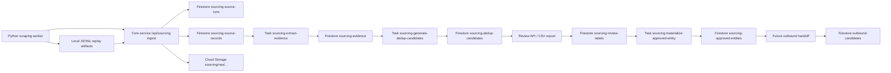

# v1.2 Scraping To Review To Store Flow

**Date:** 2026-04-15
**Milestone:** v1.2 Sourcing Service And Human Review Foundation

## Goal

Write the complete first product loop before implementation:

```text
scraping -> ingest -> source storage -> evidence -> dedup candidate -> human review -> approved store
```

The later outbound goal is:

```text
approved store -> outbound candidate handoff
```

Outbound is not allowed to consume unresolved source records, raw evidence, or dedup candidates.

## First Principles

1. Scraping produces observations, not trusted people.
2. Evidence explains why two observations may refer to the same entity.
3. Dedup candidates are review proposals, not merges.
4. Human review is the only approval boundary.
5. Approved entities are the first durable identity store usable by ranking, recruiter export, or outbound.
6. Firebase/core-service owns product writes; Python workers never write Firestore directly.

## Runtime Boundary



## Firebase Prefix Contract

Firestore collections owned by sourcing:

```ts
export const sourcingCollections = {
  sourceRuns: 'sourcing-source-runs',
  sourceRecords: 'sourcing-source-records',
  evidence: 'sourcing-evidence',
  dedupCandidates: 'sourcing-dedup-candidates',
  reviewLabels: 'sourcing-review-labels',
  approvedEntities: 'sourcing-approved-entities',
} as const;
```

Cloud Tasks queues owned by sourcing:

```ts
export const sourcingQueueNames = {
  extractEvidence: 'sourcing-extract-evidence',
  generateDedupCandidates: 'sourcing-generate-dedup-candidates',
  materializeApprovedEntity: 'sourcing-materialize-approved-entity',
} as const;
```

Cloud Storage raw payload prefix:

```text
sourcing/raw/{domain}/{source}/{runId}/{sourceRecordId}.json
```

HTTP route prefix:

```text
/api/sourcing/...
```

Existing outbound collections keep their existing prefix:

```ts
export const outboundCollections = {
  candidates: 'outbound-candidates',
  dispatchProfiles: 'outbound-dispatch-profiles',
  schedulingInvites: 'outbound-scheduling-invites',
  bookings: 'outbound-bookings',
  callArtifacts: 'outbound-call-artifacts'
} as const;
```

Sourcing must not write directly to `outbound-*` until approved-entity handoff is implemented.

## Step 1: Scraping

Python workers remain source-specific:

| Domain | Source | Output |
|---|---|---|
| `researcher` | OpenAlex | papers, authors, ORCID hints, institutions, DOI, venue |
| `researcher` | ORCID | public emails, researcher URLs, employment |
| `researcher` | DBLP | author page, homepage, publications |
| `researcher` | OpenReview | profile, homepage, DBLP, Google Scholar |
| `developer` | GitHub | developer profile, email if public, repos, homepage |
| `hackathon` | Devpost | project profile, team members, links |
| `manual` | CSV/JSONL upload | normalized source records from human-provided files |

Python writes local replay artifacts for debug, but product storage starts only after core-service
accepts the payload.

## Step 2: Ingest

Minimum API:

```text
POST /api/sourcing/source-runs
POST /api/sourcing/source-records:batchUpsert
POST /api/sourcing/source-runs/:runId/complete
```

Core-service validates every payload with zod before Firestore writes.

`sourceRun` stores run metadata:

```json
{
  "runId": "srn_researcher_openalex_20260415_sha",
  "domain": "researcher",
  "source": "openalex",
  "trigger": "local_worker",
  "status": "running",
  "startedAt": "2026-04-15T00:00:00.000Z",
  "completedAt": null,
  "counts": {
    "received": 0,
    "stored": 0,
    "skipped": 0,
    "failed": 0,
    "contentHashDuplicates": 0
  }
}
```

`sourceRecord` stores queryable summary plus raw pointer:

```json
{
  "sourceRecordId": "src_openalex_A123",
  "runId": "srn_researcher_openalex_20260415_sha",
  "domain": "researcher",
  "source": "openalex",
  "entityType": "person_profile",
  "sourceNativeId": "A123",
  "display": {
    "name": "Yann LeCun",
    "institution": "New York University"
  },
  "rawStoragePath": "sourcing/raw/researcher/openalex/srn_researcher_openalex_20260415_sha/src_openalex_A123.json",
  "contentHash": "sha256:...",
  "schemaVersion": "sourcing_source_record.v1",
  "createdAt": "2026-04-15T00:00:00.000Z",
  "updatedAt": "2026-04-15T00:00:00.000Z"
}
```

## Step 3: Source Storage

Firestore stores small, queryable records:

```text
sourcing-source-runs
sourcing-source-records
```

Cloud Storage stores large raw payloads:

```text
sourcing/raw/researcher/openalex/{runId}/{sourceRecordId}.json
sourcing/raw/researcher/orcid/{runId}/{sourceRecordId}.json
sourcing/raw/researcher/dblp/{runId}/{sourceRecordId}.json
sourcing/raw/researcher/openreview/{runId}/{sourceRecordId}.json
sourcing/raw/developer/github/{runId}/{sourceRecordId}.json
sourcing/raw/hackathon/devpost/{runId}/{sourceRecordId}.json
sourcing/raw/manual/csv/{runId}/{sourceRecordId}.json
```

This is the first storage layer. It is not the approved identity store.

## Step 4: Evidence Extraction

After a source run is completed, core-service enqueues:

```text
sourcing-extract-evidence
```

Evidence examples:

| Evidence type | Strong? | Example reason usage |
|---|---:|---|
| `email` | yes | `email_exact` |
| `orcid` | yes | `orcid_exact` |
| `github` | yes | `github_exact` |
| `dblp_pid` | yes | `dblp_exact` |
| `openreview_id` | yes | `openreview_exact` |
| `google_scholar_id` | yes | `google_scholar_exact` |
| `homepage` | medium | `homepage_exact` |
| `paper_doi` | medium | `paper_overlap` |
| `institution` | weak alone | `name_institution` |

Every evidence document must include raw value, normalized value, source path, quality, and source
record reference. Evidence without provenance is invalid.

## Step 5: Dedup Candidate Generation

After evidence exists, core-service enqueues:

```text
sourcing-generate-dedup-candidates
```

Dedup candidate generation uses deterministic grouping:

```text
domain + entityType + normalized evidence value + evidence type
```

Rules:

1. Exact stable IDs create strong candidates.
2. Homepage and paper overlap create medium candidates.
3. Name and institution create weak candidates only when no stronger candidate exists.
4. Existing `not_same_person` and `unsure` labels suppress repeated review spam.
5. Candidate strength never creates an approved entity.

## Step 6: Human Review

Review reads pending dedup candidates:

```text
GET /api/sourcing/dedup-candidates?status=pending_review
GET /api/sourcing/review-queue
```

The reviewer must see:

```text
dedupCandidateId
sourceRecordIds
display names
institutions
evidence records
reason codes
suggested strength
existing labels
```

Allowed labels:

```text
same_person
not_same_person
unsure
```

Labels are written to:

```text
sourcing-review-labels
```

## Step 7: Approved Store

Only `same_person` labels can trigger:

```text
sourcing-materialize-approved-entity
```

Approved entities are stored in:

```text
sourcing-approved-entities
```

Approved entity minimum contract:

```json
{
  "approvedEntityId": "ae_researcher_sha",
  "domain": "researcher",
  "entityType": "person_profile",
  "sourceRecordIds": ["src_openalex_A123", "src_orcid_0000_0002_3192_2550"],
  "evidenceIds": ["ev_sha_a", "ev_sha_b"],
  "reviewLabelIds": ["rl_sha"],
  "display": {
    "name": "Yann LeCun",
    "institution": "New York University",
    "emails": ["yann@example.edu"],
    "homepages": ["https://example.edu/~yann"]
  },
  "createdAt": "2026-04-15T00:00:00.000Z",
  "updatedAt": "2026-04-15T00:00:00.000Z"
}
```

This is the first record that downstream ranking, recruiter export, and outbound can treat as a real
entity.

## Future Outbound Handoff

Existing outbound currently has `outbound-candidates` with this shape:

```ts
interface OutboundCandidateRecord {
  id: string;
  fullName: string;
  email: string;
  phone: string;
  createdAt: string;
  updatedAt: string;
}
```

The future handoff rule is:

```text
sourcing-approved-entities -> /api/sourcing/approved-entities/:id/outbound-candidate -> outbound-candidates
```

Required gate before handoff:

1. The approved entity has approved contact evidence satisfying the current outbound-required fields.
2. The approved entity has a human `same_person` review label.
3. The handoff preserves lineage back to approved entity, review label, dedup candidate, evidence, and source records.
4. The handoff is owned by core-service, not Python scraping workers.

The current outbound record requires `fullName`, `email`, and `phone`. Researcher sourcing may have
email but no phone, so outbound handoff must remain disabled until the approved entity can satisfy
that contract or outbound explicitly changes its candidate schema.

Do not write unresolved dedup candidates to `outbound-candidates`.

## Minimal End-To-End POC

Use two records:

```text
OpenAlex author record with ORCID
ORCID public profile with same ORCID and homepage
```

Expected chain:

```text
2 source records
2 ORCID evidence records
1 orcid_exact dedup candidate
1 human same_person review label
1 approved researcher entity
0 outbound candidate records
```

Outbound remains zero in this POC because v1.2 proves sourcing review/store first.

## Non-Negotiable Checks

1. All sourcing collections start with `sourcing-`.
2. All raw payload paths start with `sourcing/raw/`.
3. All sourcing queue names start with `sourcing-`.
4. All sourcing routes start with `/api/sourcing/`.
5. Python workers never write Firestore directly.
6. Dedup candidates never become approved entities without human labels.
7. Outbound only consumes approved entities, never dedup candidates.
